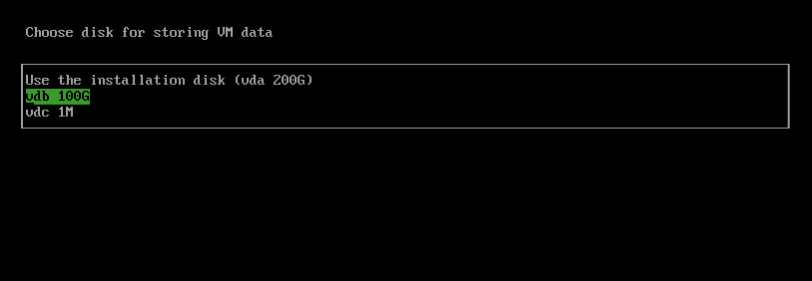
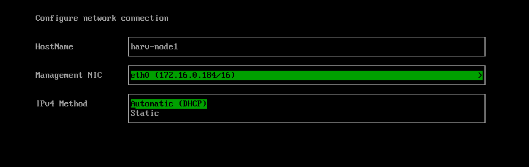

Harvester
========

Harvester is an open source [hyper-converged infrastructure](https://en.wikipedia.org/wiki/Hyper-converged_infrastructure) (HCI) software built on Kubernetes. It is an open alternative to using a proprietary HCI stack that incorporates the design and ethos of [Cloud Native Computing](https://en.wikipedia.org/wiki/Cloud_native_computing). 

## Overview
Harvester implements HCI on bare metal servers. Harvester is designed to use local, direct attached storage instead of complex external SANs. It ships as an integrated bootable appliance image that can be deployed directly to servers through an ISO or PXE boot artifact.  

Some notable features of Harvester include the following:
1. VM lifecycle management including SSH-Key injection, cloud-init, and graphic and serial port console
1. VM live migration support
1. Supported VM backup, snapshot and restore
1. Distributed block storage and storage tiering
1. Multiple network interface controllers (NICs) in the VM connecting to the management network or VLANs
1. Virtual Machine and cloud-init templates
1. [Rancher](https://github.com/rancher/rancher) integration with multi-cluster management and the Harvester node driver
1. [PXE/iPXE boot support](https://docs.harvesterhci.io/latest/install/pxe-boot-install)
1. Virtual IP and bond NIC support
1. Monitoring and logging integration

The following diagram outlines a high-level architecture of Harvester:

- [Longhorn](https://longhorn.io/) is a lightweight, reliable, and easy-to-use distributed block storage system for Kubernetes.
- [KubeVirt](https://kubevirt.io/) is a virtual machine management add-on for Kubernetes.
- [Elemental for SLE-Micro 5.2](https://github.com/rancher-sandbox/cOS-toolkit) (based on openSUSE Leap 15.3 before v1.0.3) is an immutable Linux distribution designed to remove as much OS maintenance as possible in a Kubernetes cluster.

## Hardware Requirements
To get the Harvester server up and running the following minimum hardware is required:

| Type | Requirements                                                                                                                                                                                               |
|:---|:-----------------------------------------------------------------------------------------------------------------------------------------------------------------------------------------------------------|
| CPU | x86_64 only. Hardware-assisted virtualization is required. 8-core processor minimum for testing; 16-core or above preferred for production                                                                 |
| Memory | 32 GB minimum; 64 GB or above preferred                                                                                                                                                                    |
| Disk Capacity | 200 GB minimum for testing; 500 GB or above preferred for production                                                                                                                                       |
| Disk Performance | 5,000+ random IOPS per disk (SSD/NVMe). Management nodes (first three nodes) must be [fast enough for etcd](https://www.ibm.com/cloud/blog/using-fio-to-tell-whether-your-storage-is-fast-enough-for-etcd) |
| Network Card | 1 Gbps Ethernet minimum for testing; 10Gbps Ethernet recommended for production                                                                                                                            |
| Network Switch | Trunking of ports required for VLAN support                                                                                                                                                                |

We recommend server-class hardware for best results. Laptops and nested virtualization are not officially supported.

## Quick start

You can use the ISO to install Harvester directly on the bare-metal server to form a Harvester cluster. Users can add one or many compute nodes to join the existing cluster.

To get the Harvester ISO, download it from the [Github releases.](https://github.com/harvester/harvester/releases)

During the installation, you can either choose to form a new cluster, or join the node to an existing cluster.

1. Mount the Harvester ISO disk and boot the server by selecting the `Harvester Installer`.

1. Choose the installation mode by either creating a new Harvester cluster, or by joining an existing one.
1. Choose the installation device on which the Harvester will be installed to.
1. Recommended choosing a separate disk for storing VM data.

1. Configure the hostname and select the network interface for the management network. By default, Harvester will create a bonded NIC named `mgmt-bo`, and the IP address can either be configured via DHCP or a static method.

1. (Optional) Configure the DNS servers. Use commas as a delimiter.
1. Configure the `Virtual IP` which you can use to access the cluster or join the other nodes to the cluster.
1. Configure the `cluster token`. This token will be used for adding other nodes to the cluster.
1. Configure the login password of the host. The default SSH user is `rancher`.
1. Recommended configuring the NTP server to make sure all nodes' times are synchronized. This defaults to `0.suse.pool.ntp.org`.
1. (Optional) If you need to use an HTTP proxy to access the outside world, enter the proxy URL address here. Otherwise, leave this blank.
1. (Optional) You can choose to import SSH keys from a remote URL server. Your GitHub public keys can be used with `https://github.com/<username>.keys`.
1. (Optional) If you need to customize the host with a cloud-init config, enter the HTTP URL here.
1. After confirming the installation options, Harvester will be installed to your host. The installation may take a few minutes to be complete.
1. Once the installation is complete, it will restart the host. After the restart, the Harvester console containing the management URL and status will be displayed. You can Use `F12` to switch between the Harvester console and the Shell.
1. The default URL of the web interface is `https://your-virtual-ip`.

1. You will be prompted to set the password for the default `admin` user when logging in for the first time.

## Documentation

Find more documentation [here](https://docs.harvesterhci.io/).

## Demo

Check out this [demo](https://youtu.be/Ngsk7m6NYf4) to get a quick overview of the Harvester UI.

## Source code
Harvester is 100% open-source software. The project source code is spread across a number of repos:

| Name                         | Repo Address                                               |
|:-----------------------------|:-----------------------------------------------------------|
| Harvester                    | https://github.com/harvester/harvester                     |
| Harvester Dashboard          | https://github.com/harvester/dashboard                     |
| Harvester Installer          | https://github.com/harvester/harvester-installer           |
| Harvester Terraform Provider | https://github.com/harvester/terraform-provider-harvester  |
| Harvester Cloud Provider     | https://github.com/harvester/cloud-provider-harvester      |
| Harvester Load Balancer      | https://github.com/harvester/load-balancer-harvester       |
| Harvester Network Controller | https://github.com/harvester/harvester-network-controller  |
| Harvester CSI Driver         | https://github.com/harvester/harvester-csi-driver          |

## Community
If you need any help with Harvester, please join us at either our [Slack](https://slack.rancher.io/) #harvester channel or [forums](https://forums.rancher.com/) where most of our team hangs out at.

If you have any feedback or questions, feel free to [file an issue](https://github.com/harvester/harvester/issues/new/choose).

## License
Copyright (c) 2022 [Rancher Labs, Inc.](http://rancher.com)

Licensed under the Apache License, Version 2.0 (the "License");
you may not use this file except in compliance with the License.
You may obtain a copy of the License at

[http://www.apache.org/licenses/LICENSE-2.0](http://www.apache.org/licenses/LICENSE-2.0)

Unless required by applicable law or agreed to in writing, software
distributed under the License is distributed on an "AS IS" BASIS,
WITHOUT WARRANTIES OR CONDITIONS OF ANY KIND, either express or implied.
See the License for the specific language governing permissions and
limitations under the License.
