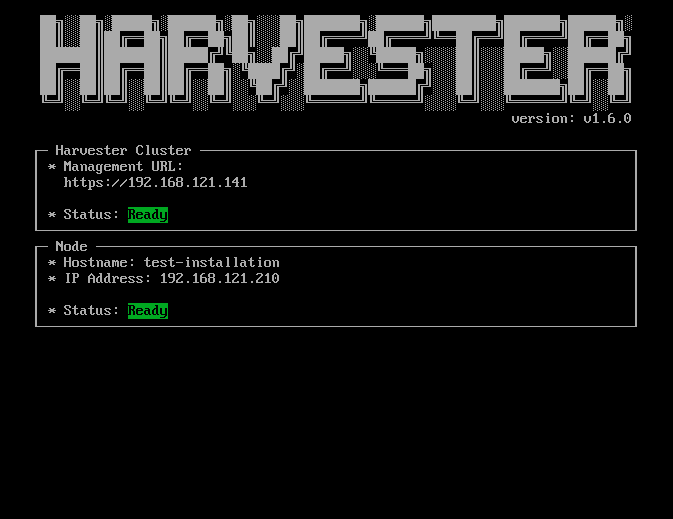

Harvester
========

Harvester is an open source [hyper-converged infrastructure](https://en.wikipedia.org/wiki/Hyper-converged_infrastructure) (HCI) software built on Kubernetes. It is an open source alternative to vSphere and Nutanix.

## Overview
Harvester implements HCI on bare metal servers. Here are some notable features of the Harvester:
1. VM lifecycle management including SSH-Key injection, Cloud-init and, graphic and serial port console
1. VM live migration support
1. Supporting VM backup and restore
1. Distributed block storage
1. Multiple NICs in the VM connecting to the management network or VLANs
1. Virtual Machine and cloud-init templates
1. Built-in [Rancher](https://github.com/rancher/rancher) integration and the Harvester node driver
1. [PXE/iPXE boot support](https://docs.harvesterhci.io/latest/install/pxe-boot-install)

The following diagram gives a high-level architecture of Harvester:

- [Longhorn](https://longhorn.io/) is a lightweight, reliable and easy-to-use distributed block storage system for Kubernetes.
- [KubeVirt](https://kubevirt.io/) is a virtual machine management add-on for Kubernetes.
- [K3OS](https://k3os.io/) is a Linux distribution designed to remove as much OS maintenance as possible in a Kubernetes cluster.

## Hardware Requirements
To get the Harvester server up and running the following minimum hardware is required:

| Type | Requirements |
|:---|:---|
| CPU | x86_64 only. Hardware assisted virtualization required. 4 cores minimum, 16 cores or above preferred |
| Memory | 8 GB minimum, 32 GB or above preferred |
| Disk Capacity |  120 GB minimum, 500 GB or above preferred |
| Disk Performance |  5,000+ random IOPS per disk(SSD/NVMe). Management nodes (first 3 nodes) must be [fast enough for Etcd](https://www.ibm.com/cloud/blog/using-fio-to-tell-whether-your-storage-is-fast-enough-for-etcd). |
| Network Card | 1 Gbps Ethernet minimum, 10Gbps Ethernet recommended |
| Network Switch | Trunking of ports required for VLAN support |

## Quick start

You can use the ISO to install Harvester directly on the bare-metal server to form a Harvester cluster. Users can add one or many compute nodes to join the existing cluster.

To get the Harvester ISO, download it from the [Github releases.](https://github.com/harvester/harvester/releases)

During the installation you can either choose to form a new cluster, or join the node to an existing cluster.

Note: This [video](https://youtu.be/97ADieBX6bE) shows a quick overview of the ISO installation.

1. Mount the Harvester ISO disk and boot the server by selecting the `Harvester Installer`.

1. Choose the installation mode by either creating a new Harvester cluster, or by joining an existing one.
1. Choose the installation device that the Harvester will be formatted to.
1. Configure the hostname and select the network interface for the management network, the IP address can either be configured via DHCP or static method.

1. Configure the `cluster token`. This token will be used for adding other nodes to the cluster.
1. Configure the login password of the host. The default ssh user is `rancher`.
1. (Optional) you can choose to import SSH keys from a remote URL server. Your GitHub public keys can be used with `https://github.com/<username>.keys`.
1. (Optional) If you need to use an HTTP proxy to access the outside world, enter the proxy URL address here, otherwise, leave this blank.
1. (Optional) If you need to customize the host with cloud-init config, enter the HTTP URL here.
1. Confirm the installation options and the Harvester will be installed to your host. The installation may take a few minutes to be complete.
1. Once the installation is complete it will restart the host and a console UI with management URL and status will be displayed. <small>(You can Use F12 to switch between Harvester console and the Shell)</small>
1. The default URL of the web interface is `https://your-host-ip:30443`.

1. User will be prompted to set the password for the default `admin` user on the first-time login.

## Documentation

Find more documentation [here](https://docs.harvesterhci.io/latest)

## Demo

Check out this [demo](https://youtu.be/wVBXkS1AgHg) to get a quick overview of the Harvester UI.

## Source code
Harvester is 100% open-source software. The project source code is spread across a number of repos:

| Name | Repo Address |
|:---|:---|
| Harvester | https://github.com/harvester/harvester |
| Harvester UI | https://github.com/harvester/harvester-ui |
| Harvester Installer | https://github.com/harvester/harvester-installer |
| Harvester Network Controller | https://github.com/harvester/harvester-network-controller|
| Harvester Node Driver | https://github.com/harvester/docker-machine-driver-harvester |

## Community
If you need any help with Harvester, please join us at either our [Slack](https://slack.rancher.io/) #harvester channel or [forums](https://forums.rancher.com/) where most of our team hangs out at.

If you have any feedback or questions, feel free to [file an issue](https://github.com/harvester/harvester/issues/new/choose).

## License
Copyright (c) 2021 [Rancher Labs, Inc.](http://rancher.com)

Licensed under the Apache License, Version 2.0 (the "License");
you may not use this file except in compliance with the License.
You may obtain a copy of the License at

[http://www.apache.org/licenses/LICENSE-2.0](http://www.apache.org/licenses/LICENSE-2.0)

Unless required by applicable law or agreed to in writing, software
distributed under the License is distributed on an "AS IS" BASIS,
WITHOUT WARRANTIES OR CONDITIONS OF ANY KIND, either express or implied.
See the License for the specific language governing permissions and
limitations under the License.
