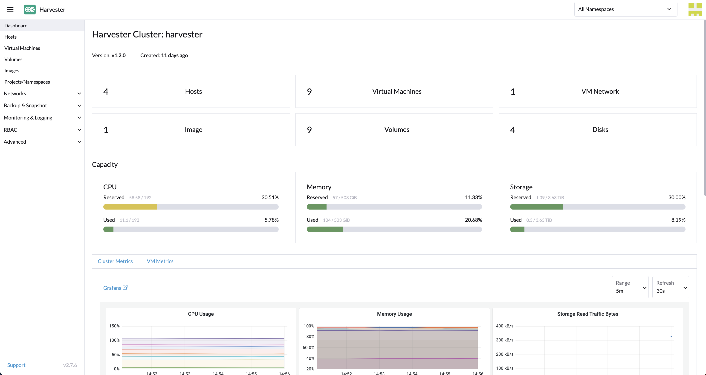

Harvester
========

[Harvester](https://harvesterhci.io/) is a modern, open, interoperable, [hyperconverged infrastructure (HCI)](https://en.wikipedia.org/wiki/Hyper-converged_infrastructure) solution built on Kubernetes. 
It is an open-source alternative designed for operators seeking a [cloud-native](https://about.gitlab.com/topics/cloud-native/) HCI solution. Harvester runs on bare metal servers and provides integrated virtualization and distributed storage capabilities. 
In addition to traditional virtual machines (VMs), Harvester supports containerized environments automatically through integration with [Rancher](https://ranchermanager.docs.rancher.com/integrations-in-rancher/harvester). It offers a solution that unifies legacy virtualized infrastructure while enabling the adoption of containers from core to edge locations.

## Overview
Harvester is an enterprise-ready, easy-to-use infrastructure platform that leverages local, direct attached storage instead of complex external SANs. It utilizes Kubernetes API as a unified automation language across container and VM workloads. Some key features of Harvester include:

1. **Easy to install:** Since Harvester ships as a bootable appliance image, you can install it directly on a bare metal server with the [ISO](https://github.com/harvester/harvester/releases) image or automatically install it using [iPXE scripts](https://docs.harvesterhci.io/latest/install/pxe-boot-install).
1. **VM lifecycle management:** Easily create, edit, clone, and delete VMs, including SSH-Key injection, cloud-init, and graphic and serial port console.
1. **VM live migration support:** Move a VM to a different host or node with zero downtime.
1. **VM backup, snapshot, and restore:** Back up your VMs from NFS, S3 servers, or NAS devices. Use your backup to restore a failed VM or create a new VM on a different cluster.
1. **Storage management:** Harvester supports distributed block storage and tiering. Volumes represent storage; you can easily create, edit, clone, or export a volume.
1. **Network management:** Supports using a virtual IP (VIP) and multiple Network Interface Cards (NICs). If your VMs need to connect to the external network, create a VLAN or untagged network. 
1. **Integration with [Rancher](https://ranchermanager.docs.rancher.com/integrations-in-rancher/harvester):** Access Harvester directly within Rancher through Rancher’s Virtualization Management page and manage your VM workloads alongside your Kubernetes clusters.

The following diagram outlines a high-level architecture of Harvester:

- [Longhorn](https://longhorn.io/) is a lightweight, reliable, and easy-to-use distributed block storage system for Kubernetes.
- [KubeVirt](https://kubevirt.io/) is a virtual machine management add-on for Kubernetes.
- [Elemental for SLE-Micro 5.3](https://github.com/rancher/elemental-toolkit) is an immutable Linux distribution designed to remove as much OS maintenance as possible in a Kubernetes cluster.

## Hardware Requirements
To get the Harvester server up and running the following minimum hardware is required:

| Type | Requirements                                                                                                                                                   |
|:---|:---------------------------------------------------------------------------------------------------------------------------------------------------------------|
| CPU | x86_64 only. Hardware-assisted virtualization is required. 8-core processor minimum for testing; 16-core or above required for production                      |
| Memory | 32 GB minimum; 64 GB or above required for production                                                                                                          |
| Disk Capacity | 250 GB minimum for testing (180 GB minimum when using multiple disks); 500 GB or above required for production                                                 |
| Disk Performance | 5,000+ random IOPS per disk (SSD/NVMe). Management nodes (first three nodes) must be [fast enough for etcd](https://www.suse.com/support/kb/doc/?id=000020100) |
| Network Card | 1 Gbps Ethernet minimum for testing; 10Gbps Ethernet required for production                                                                                   |
| Network Switch | Trunking of ports required for VLAN support                                                                                                                    |

We recommend server-class hardware for best results. Laptops and nested virtualization are not officially supported.

## Quick start

You can use the ISO to install Harvester directly on the bare-metal server to form a Harvester cluster. Users can add one or many compute nodes to join the existing cluster.

To get the Harvester ISO, download it from the [Github releases.](https://github.com/harvester/harvester/releases)

During the installation, you can either choose to **create a new Harvester cluster** or **join the node to an existing Harvester cluster**.

1. Mount the Harvester ISO file and boot the server by selecting the `Harvester Installer` option.

1. Use the arrow keys to choose an installation mode. By default, the first node will be the management node of the cluster.
   
   - `Create a new Harvester cluster`: Select this option to create an entirely new Harvester cluster.
   - `Join an existing Harvester cluster`: Select this option to join an existing Harvester cluster. You need the VIP and cluster token of the cluster you want to join.
   - `Install Harvester binaries only`: If you choose this option, additional setup is required after the first bootup.
1. Choose the installation disk you want to install the Harvester cluster on and the data disk you want to store VM data on. By default, Harvester uses [GUID Partition Table (GPT)](https://en.wikipedia.org/wiki/GUID_Partition_Table) partitioning schema for both UEFI and BIOS. If you use the BIOS boot, then you will have the option to select [Master boot record (MBR)](https://en.wikipedia.org/wiki/Master_boot_record).
   
   - `Installation disk`: The disk to install the Harvester cluster on.
   - `Data disk`: The disk to store VM data on. Choosing a separate disk to store VM data is recommended.
   - `Persistent size`: If you only have one disk or use the same disk for both OS and VM data, you need to configure persistent partition size to store system packages and container images. The default and minimum persistent partition size is 150 GiB. You can specify a size like 200Gi or 153600Mi. 
1. Configure network interface(s) for the management network. By default, Harvester will create a bonded NIC named `mgmt-bo`, and the IP address can either be configured via DHCP or statically assigned.

1. (Optional) Configure cluster network. Leave blank to use the defaults.
1. Configure the `HostName` of the node.
1. (Optional) Configure the `DNS Servers`. Use commas as a delimiter to add more DNS servers. Leave blank to use the default DNS server.
1. Configure the virtual IP (VIP) by selecting a `VIP Mode`. This VIP is used to access the cluster or for other nodes to join the cluster.

1. Configure the `cluster token`. This token will be used for adding other nodes to the cluster.
1. Configure and confirm a `Password` to access the node. The default SSH user is `rancher`.
1. Configure `NTP servers` to make sure all nodes' times are synchronized. This defaults to `0.suse.pool.ntp.org`. Use commas as a delimiter to add more NTP servers.
1. (Optional) If you need to use an HTTP proxy to access the outside world, enter the proxy URL address here. Otherwise, leave this blank.
1. (Optional) You can choose to import SSH keys by providing `HTTP URL`. For example, your GitHub public keys `https://github.com/<username>.keys` can be used.
1. (Optional) If you need to customize the host with a [Harvester configuration](./harvester-configuration.md) file, enter the `HTTP URL` here.
1. Review and confirm your installation options. After confirming the installation options, Harvester will be installed on your host. The installation may take a few minutes to complete.
1. Once the installation is complete, your node restarts. After the restart, the Harvester console displays the management URL and status. The default URL of the web interface is `https://your-virtual-ip`. You can use `F12` to switch from the Harvester console to the Shell and type `exit` to go back to the Harvester console.

1. You will be prompted to set the password for the default `admin` user when logging in for the first time.

## Releases

> **NOTE**:
> - __\<version\>*__ means the release branch is under active support and will have periodic follow-up patch releases.
> - __Latest__ release means the version is the latest release of the newest release branch.
> - __Stable__ release means the version is stable and has been widely adopted by users.
> - __EOL__ means that the software has reached the end of its useful life and no further code-level maintenance will be provided. You may continue to use the software within the terms of the licensing agreement.

https://github.com/harvester/harvester/releases

| Release   | Version | Type           | Release Note (Changelog)                                         | Upgrade Note                                                |
|-----------|---------|----------------|------------------------------------------------------------------|-------------------------------------------------------------|
| **1.5***  | 1.5.0   | Latest         | [🔗](https://github.com/harvester/harvester/releases/tag/v1.5.0) | [🔗](https://docs.harvesterhci.io/v1.5/upgrade/v1-4-2-to-v1-5-0) |
| **1.4***  | 1.4.3   | Stable         | [🔗](https://github.com/harvester/harvester/releases/tag/v1.4.3) | [🔗](https://docs.harvesterhci.io/v1.4/upgrade/v1-4-1-to-v1-4-3) |
| **1.3***  | 1.3.2   | Stable         | [🔗](https://github.com/harvester/harvester/releases/tag/v1.3.2) | [🔗](https://docs.harvesterhci.io/v1.3/upgrade/v1-3-1-to-v1-3-2) |
| **1.2***  | 1.2.2   | EOL            | [🔗](https://github.com/harvester/harvester/releases/tag/v1.2.2) | [🔗](https://docs.harvesterhci.io/v1.2/upgrade/v1-2-1-to-v1-2-2) |
| **1.1***  | 1.1.3   | EOL | [🔗](https://github.com/harvester/harvester/releases/tag/v1.1.3) | [🔗](https://docs.harvesterhci.io/v1.2/upgrade/v1-1-to-v1-1-2) |

## Documentation

Find more documentation [here](https://docs.harvesterhci.io/).

## Demo

Check out this [demo](https://youtu.be/Ngsk7m6NYf4) to get a quick overview of the Harvester UI.

## Source code
Harvester is 100% open-source software. The project source code is spread across a number of repos:

| Name                         | Repo Address                                               |
|:-----------------------------|:-----------------------------------------------------------|
| Harvester                    | https://github.com/harvester/harvester                     |
| Harvester Dashboard          | https://github.com/harvester/dashboard                     |
| Harvester Installer          | https://github.com/harvester/harvester-installer           |
| Harvester Network Controller | https://github.com/harvester/harvester-network-controller  |
| Harvester Cloud Provider     | https://github.com/harvester/cloud-provider-harvester      |
| Harvester Load Balancer      | https://github.com/harvester/load-balancer-harvester       |
| Harvester CSI Driver         | https://github.com/harvester/harvester-csi-driver          |
| Harvester Terraform Provider | https://github.com/harvester/terraform-provider-harvester  |

## Community
If you need any help with Harvester, please join us at either our [Slack](https://slack.rancher.io/) #harvester channel or [forums](https://forums.rancher.com/) where most of our team hangs out at.

If you have any feedback or questions, feel free to [file an issue](https://github.com/harvester/harvester/issues/new/choose).

You can also [ask Harvester Guru](https://gurubase.io/g/harvester) your questions.

## License
Copyright (c) 2025 [SUSE, LLC.](https://www.suse.com/)

Licensed under the Apache License, Version 2.0 (the "License");
you may not use this file except in compliance with the License.
You may obtain a copy of the License at

[http://www.apache.org/licenses/LICENSE-2.0](http://www.apache.org/licenses/LICENSE-2.0)

Unless required by applicable law or agreed to in writing, software
distributed under the License is distributed on an "AS IS" BASIS,
WITHOUT WARRANTIES OR CONDITIONS OF ANY KIND, either express or implied.
See the License for the specific language governing permissions and
limitations under the License.
