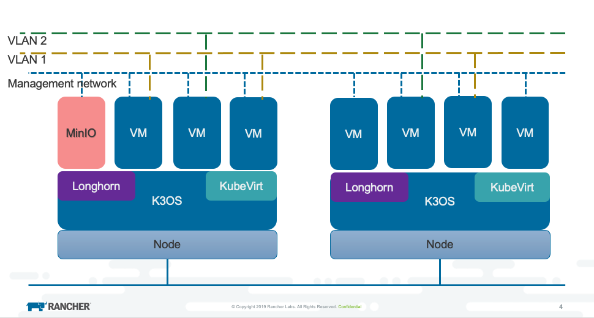

## Overview
Harvester is built on several Kubernetes-related projects and leverages its architecture on the [custom resource.](https://kubernetes.io/docs/concepts/extend-kubernetes/api-extension/custom-resources/)

The following diagram gives a high-level architecture of the harvester project:

- [MinIO](https://min.io/) is a cloud storage server compatible with Amazon S3.
- [Longhorn](https://longhorn.io/) is a lightweight, reliable and easy-to-use distributed block storage system for Kubernetes.
- [KubeVirt](https://kubevirt.io/) is a virtual machine management add-on for Kubernetes.
- [K3OS](https://k3os.io/) is a Linux distribution designed to remove as much OS maintenance as possible in a Kubernetes cluster. The OS is designed to be managed by kubectl.

If you have any questions that can't be found on the following docs, feel free to [file an issue](https://github.com/rancher/harvester/issues/new/choose)
or hang out with our developers on either our [Slack](https://slack.rancher.io/) or [Rancher forums](https://forums.rancher.com/).

## Table of Contents

- Installation
  * [ISO Mode](./iso-installation.md)
  * [App Mode - for development](./app-mode-installation.md)
- Demo: Check out this [demo](https://youtu.be/wVBXkS1AgHg) to get a quick overview of the Harvester UI.
- [Authentication](./authentication.md)
- [Upload Images](./upload-image.md)
- VM Management
  * [Create a VM](./create-vm.md)
  * [Access to the VM](./access-to-the-vm.md)
