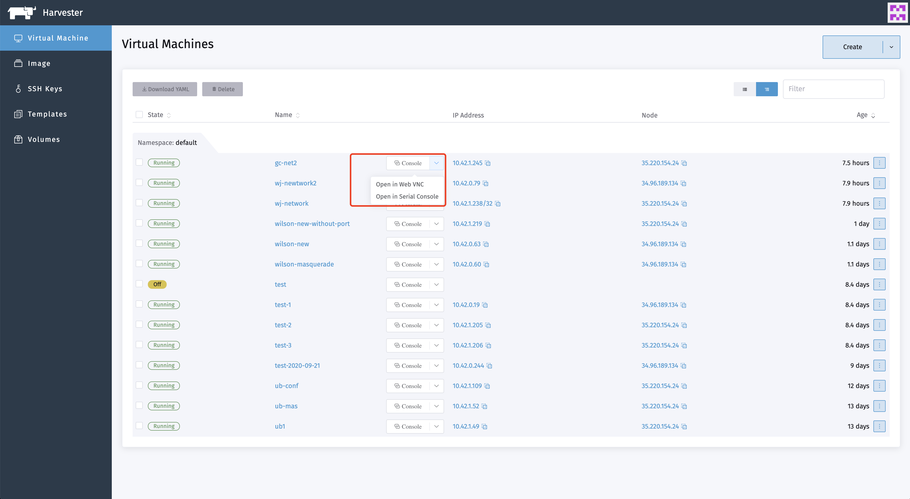

# Access to the VM

Once the VM is up and running, it can be accessed using either VNC or the serial console from the Harvester UI.

Optionally, connect directly from your computer's SSH client.

#### Access with the UI

VMs can be accessed from the UI directly using either VNC or the serial console.

If the VGA display is not enabled on the VM (e.g., when using the Ubuntu minimal cloud image), the VM can be accessed with the serial console.

#### Access using SSH

Use the address in a terminal emulation client (such as Putty) or use the following command line to access the VM directly from your computer's SSH client:

```bash
 ssh -i ~/.ssh/your-ssh-key user@<ip-address-or-hostname>
```


