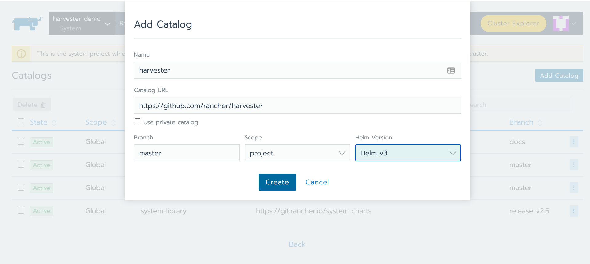
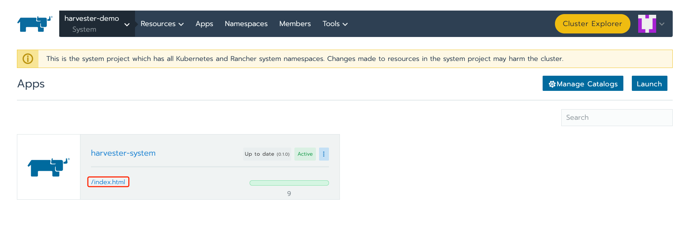
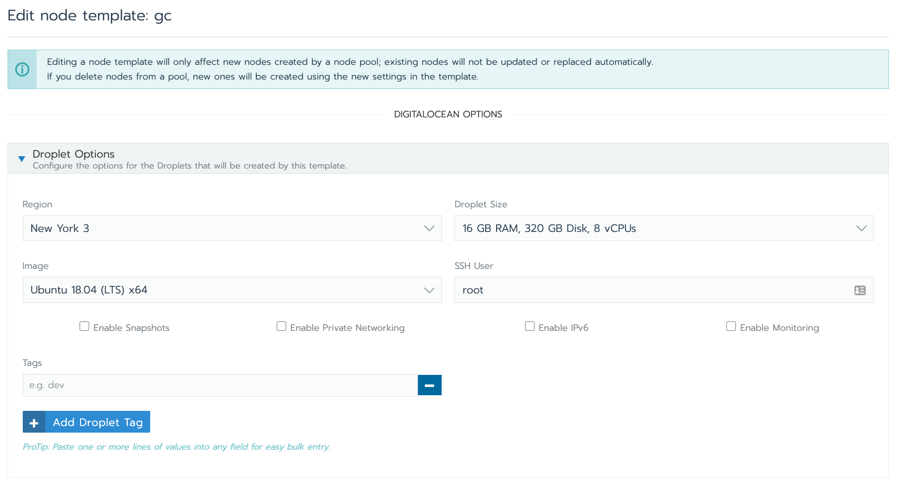

# App Mode Installation

App mode is intended to be used for testing and development purposes.

Note: This [video](https://youtu.be/TG0GaAD_6J4) shows the App mode installation.

## Requirements

- For App mode, it is assumed that multus is installed across your cluster and a corresponding NetworkAttachmentDefinition CRD was created.
- For App mode, if you are using an [RKE](https://rancher.com/docs/rke/latest/en/) cluster, please ensure the `ipv4.ip_forward` is enabled for the CNI plugin so that the pod network works as expected. [#94](https://github.com/rancher/harvester/issues/94). 

## Install as an App
Harvester can be installed on a Kubernetes cluster in the following ways:

- Install with the [Helm](https://helm.sh/) CLI
- Install as a Rancher catalog app, in which case the [rancher/harvester](https://github.com/rancher/harvester) repo is added to the Rancher Catalog as a Helm `v3` app
    
Please refer to the Harvester [Helm chart](../deploy/charts/harvester) for more details on installing and configuring the Helm chart.
    
### Requirements
The Kubernetes node must have hardware virtualization support.

To validate the support, use this command:

```
cat /proc/cpuinfo | grep vmx
```

### Option 1: Install with Helm

1. Clone the GitHub repository:
    ```
    $ git clone https://github.com/rancher/harvester.git --depth=1
    ```

1. Go to the Helm chart:
    ```
    $ cd deploy/charts
   ```

1. Install the Harvester chart with the following commands:

```bash
### To install the chart with the release name `harvester`:

## Create the target namespace
$ kubectl create ns harvester-system

## Install the chart to the target namespace
$ helm install harvester harvester \
  --namespace harvester-system \
  --set longhorn.enabled=true,minio.persistence.storageClass=longhorn
```
    
### Option 2: Install as a Rancher Catalog App

Tip: You can create a testing Kubernetes environment in Rancher using the Digital Ocean cloud provider. For details, see [this section.](#digital-ocean-test-environment)

1. Add the Harvester repo `https://github.com/rancher/harvester` to your Rancher catalogs by clicking **Global > Tools > Catalogs.**
1. Specify the URL and name. The default branch is master. Set the `Helm version` to be `Helm v3`.

1. Click **Create.**
1. Navigate to your project-level `Apps.`
1. Click `Launch` and choose the Harvester app.
1. (Optional) You can modify the configurations if needed. Otherwise, use the default options.
1. Click **Launch** and wait for the app's components to be ready.
1. Click the `/index.html` link to navigate to the Harvester UI:


### Digital Ocean Test Environment

You can create a testing Kubernetes environment in Rancher using the Digital Ocean cloud provider.

We recommend using the `8 core, 16 GB RAM` node, which will have nested virtualization enabled by default.

This screenshot shows how to create a Rancher node template that would allow Rancher to provision such a node in Digital Ocean:



For more information on how to launch Digital Ocean nodes with Rancher, refer to the [Rancher documentation.](https://rancher.com/docs/rancher/v2.x/en/cluster-provisioning/rke-clusters/node-pools/digital-ocean/)
