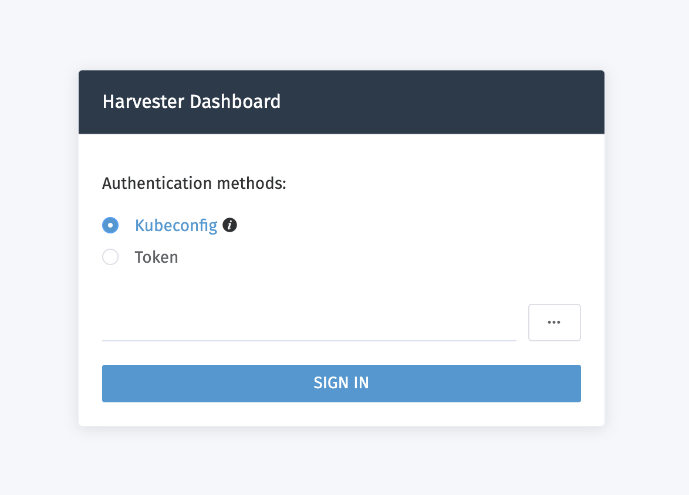

# Authentication

>  Available as of v0.2.0

With ISO installation mode, user will be prompted to set the password for the default `admin` user on the first-time login.

The Harvester login page is shown below:

## Developer Mode
In `developer mode`, which is intended only for development and testing purposes, more authentication modes are configurable using the environment variable `HARVESTER_AUTHENTICATION_MODE`.

By default, the Harvester Dashboard uses the `local auth` mode for authentication. The default username and password is `admin/password`.

The currently supported options are `localUser` (the same as `local auth` mode) and `kubernetesCredentials`.

If the `kubernetesCredentials` authentication option is used, either a `kubeconfig` file or bearer token can provide access to Harvester.
