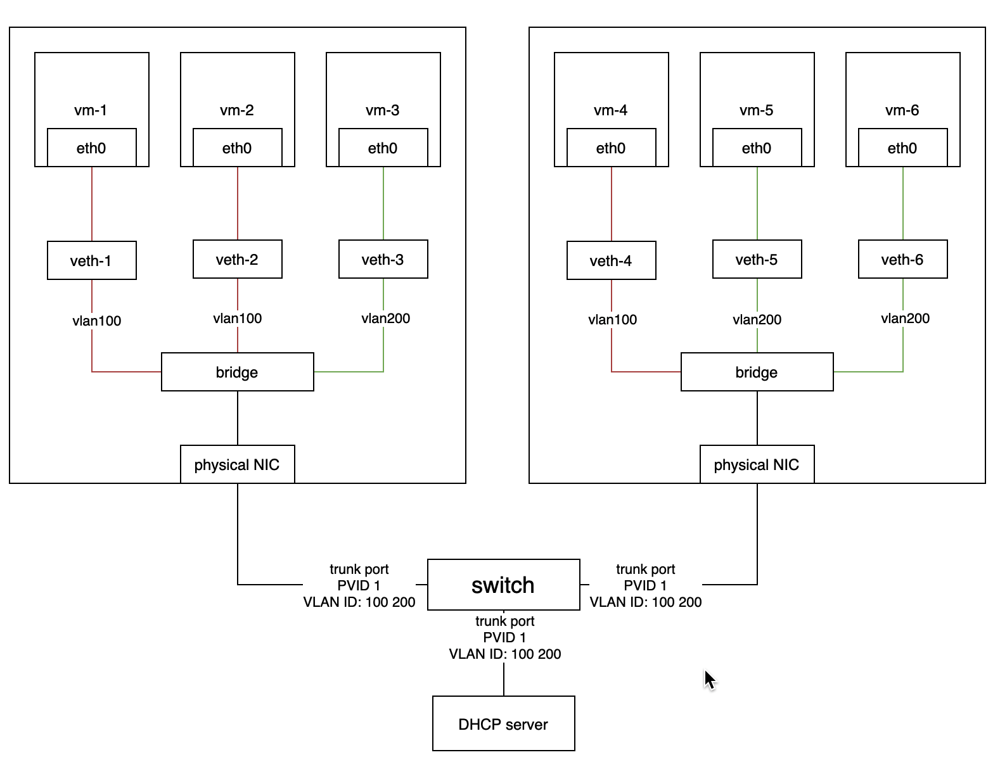
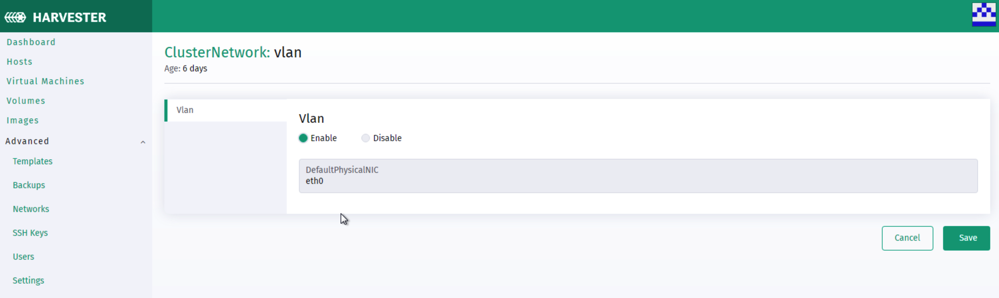
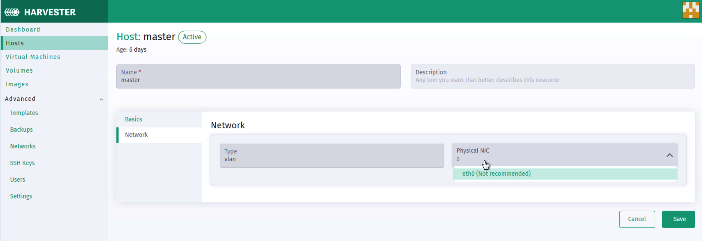
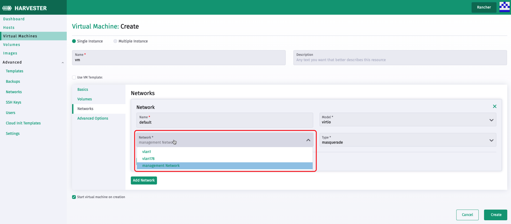

## Introduction of The Harvester network

### Table of Contents
  * [Summary](#summary)
  * [Implementation](#implementation)
    * [Management Network](#management-network)
    * [VLAN](#vlan)
  * [UI Interaction](#ui-interaction)


### Summary
[Harvester](https://github.com/harvester/harvester) is built on Kubernetes, which uses [CNI](https://github.com/containernetworking/cni) as an interface between network providers and Kubernetes pod networking. Naturally, we implement the Harvester network based on CNI. Moreover, [Harvester UI](https://github.com/harvester/harvester-ui) integrates the Harvester network to provide a user-friendly way to configure networks for VMs.

By version 0.2, Harvester supports two kinds of networks: 
- management network
- [VLAN](https://en.wikipedia.org/wiki/Virtual_LAN)

### Implementation

#### Management Network

Harvester adopts [flannel](https://github.com/flannel-io/flannel) as the default CNI to implement the management network. It's an internal network, which means the user can only access the VM's management network within its cluster nodes or pods.

#### VLAN

[Harvester network-controller](https://github.com/harvester/harvester-network-controller) leverages the [multus](https://github.com/k8snetworkplumbingwg/multus-cni) and [bridge](https://www.cni.dev/plugins/current/main/bridge/) CNI plugins to implement the VLAN.  

Below is a use case of the VLAN in Harvester.

  

- Harvester network-controller uses a bridge for a node and a pair of veth for a VM to implement the VLAN. The bridge acts as a switch to forward the network traffic from or to VMs and the veth pair is like the connected ports between vms and switch.
- VMs within the same VLAN is able to communicate with each other, while the VMs within different VLANs can't.
- The external switch ports connected with the hosts or other devices(such as DHCP server) should be set as trunk or hybrid type and permit the specified VLANs.
- Users can use VLAN with `PVID`(default 1) to communicate with any normal untagged traffic.

### UI Interaction

- Enable VLAN via going to **Setting > vlan** to enable VLAN and input a valid default physical NIC name for the VLAN. The first physical NIC name of each Harvester node always defaults to eth0. It is recommended to choose a separate NIC for the VLAN other than the one used for the management network(the one selected during the Harvester installation) for better network performance and isolation. (Note: modify the default VLAN network setting will not change the existing configured host networks).

  

- (optional) Users can always customize each node's VLAN network configuration via going to the **HOST > Network** tab.

  
  
- Creating a new VLAN network via going to the **Advanced>Networks** page and clicking the **Create** button.

  

- Creating a VM and add the network configurations.

  - Only the first network interface card will be enabled by default. Users can either choose to use a management network or VLAN network. (Note: will need to select `Install guest agent` option in the `Advanced Options` tab to get the VLAN network IP address from the Harvester UI)

    

  - Users can choose to add one or multiple network interface cards. Additional network interface card configurations can be set via cloud-init network data. e.g.

    ```
    version: 1
    config:
      - type: physical
        name: enp1s0 # name is varies upon OS image
        subnets:
          - type: dhcp
      - type: physical
        name: enp2s0 
        subnets:
          - type: DHCP
    ```