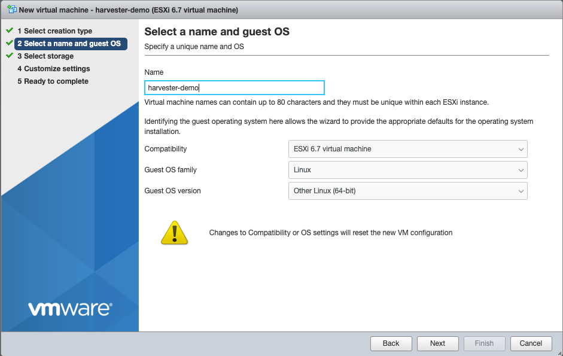
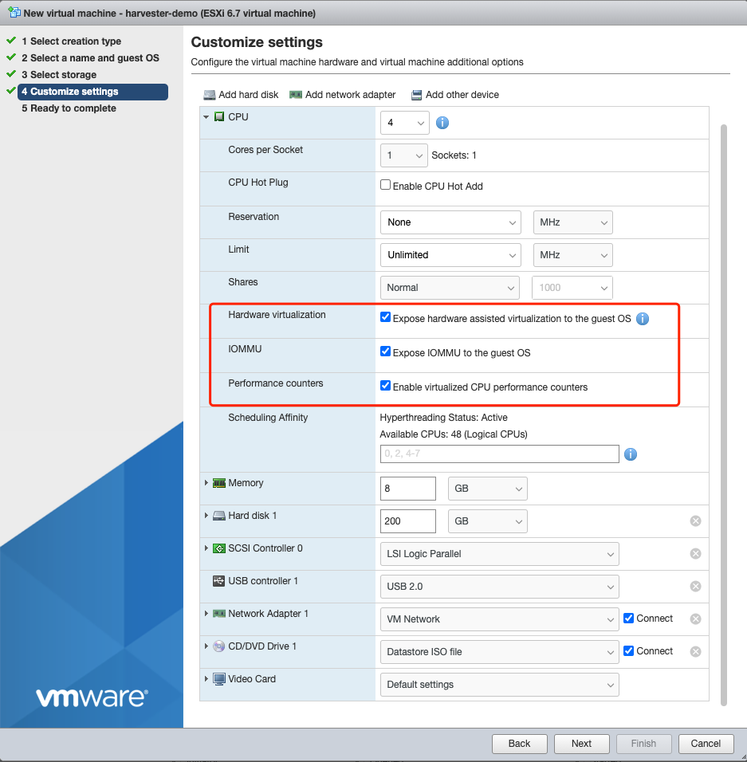

# ISO Installation

Users can download the Harvester [ISO](https://github.com/rancher/harvester/releases) from the Github releases, during installation you can either choose to form a new cluster or join the existing cluster.

1. Mount the Harvester ISO disk and boot the server by selecting the `Harvester Installer`.
1. Choose the installation mode by either creating a new harvester cluster or join an existing one.
1. Choose the installation device that the Harvester will be formatted to.
1. Configure the `cluster token`, the token will be used for adding other nodes to the cluster.
1. Configure the login password of the host, the default ssh user is `rancher`.
1. (Optional) you can choose to import SSH keys from a remote URL server, e.g, using your Github public keys with `https://github.com/<username>.keys`.
1. Select the network interface for the management network.
1. (Optional) If you need to use an HTTP proxy to access the outside world, enter the proxy URL address here, otherwise, leave this blank.
1. (Optional) If you need to customize the host with cloud-init config, enter the HTTP URL here.
1. Confirm the installation options and the Harvester will be installed to your host, the installation may take a few minutes to be complete.
1. Once the installation is complete it will restart the host and a console UI with management URL and status will be displayed.

<small>Harvester Installer</small>

<small>Harvester Console UI (You can Use F12 to switch between Harvester console and the Shell)</small>

### Using VMware ESXi
For testing purposes, users can create a Harvester cluster using VMware ESXi with the nested virtualization feature enabled, the example below uses ESXi v6.7.0: 
1. Click `Create/Register VM` and choose to create a new virtual machine
1. Choose the guest OS family to `Linux` and guest OS version to `Other Linux(64-bit)
1. Set the minimal CPU, Memory, and storage size to 4C, 8G, and 120G respectively, and ensure you have selected the hardware virtualization, IOMMU, and Performance counters options within the CPU section.
1. Click Finish and launch to start installing the Harvester to this virtual machine.

<small>Select a name and guest OS</small>

<small>Customize VM settings</small>
