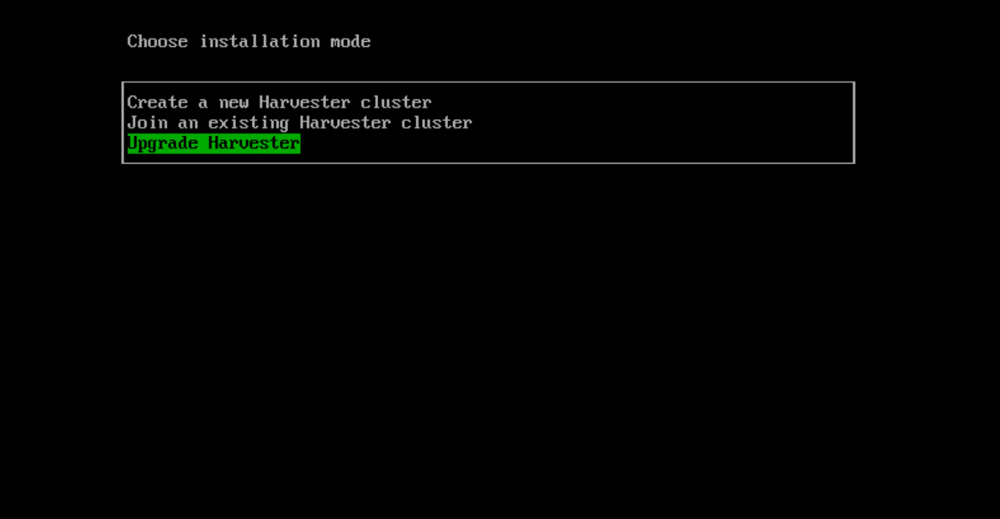
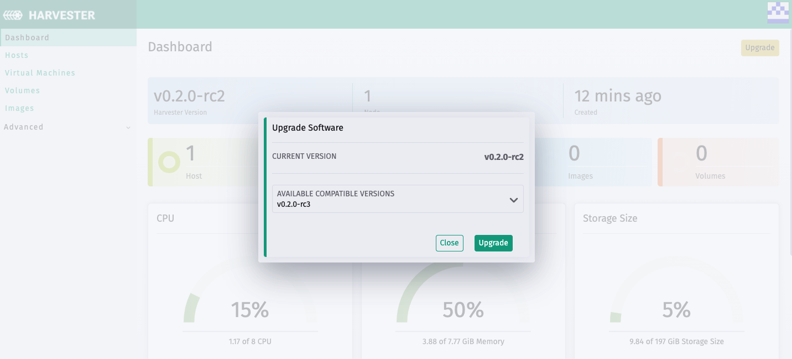

# Upgrading Harvester

> Available as of v0.2.0

Harvester provides two ways to upgrade.

>:warning: Notes:
>- Upgrading from v0.1.0 is not supported.
>- Upgrading from/to any RC releases is not supported.
>- Due to pending OS changes in the roadmap, the upgradability to the GA release cannot be guaranteed at this moment.
>- Zero downtime upgrade is supported when the Harvester cluster includes 3 or more nodes. If the cluster has less than 3 nodes, you can still perform upgrades but there'll be downtime during the upgrade.
>- Upgrade nodes one by one.

## Upgrade using the ISO image

To get the Harvester ISO of a newer version, download it from the Github releases.

1. Go to the **Hosts** page in Harvester UI.
1. Find the node you are about to upgrade. Click on the action dropdown. Click on the `Enable Maintenance Mode` action.
1. Wait until all the VMs on the node are migrated to other nodes and the node is in `Maintenance Mode` status.
1. Shut down the server, and boot the server from the ISO disk of the newer Harvester version.
1. Select the `Harvester Installer` in the grub menu.
1. Select `Upgrade Harvester` and confirm in the prompt.
   
1. Wait until the upgrade completes. The node will be rebooted and show `Ready` again in the terminal console.
1. Go to the **Hosts** page in Harvester UI.
1. Find the node that just completed the upgrade. Click on the action dropdown. Click on the `Disable Maintenance Mode` action.
1. For the rest nodes of the cluster, repeat steps 2 to 9 to upgrade them one by one.

## Upgrade in the UI

>Prerequisites:
>Internet access is required to perform a live upgrade in the UI.

1. Go to the **Dashboard** page in Harvester UI.
1. When newer versions are available, an upgrade button will be shown in the top-right corner. Click upgrade.
   
1. Select a version to upgrade. Click upgrade.
1. Wait until the upgrade to complete. You can view the upgrade progress by clicking the circle icon in the top navigation bar.
