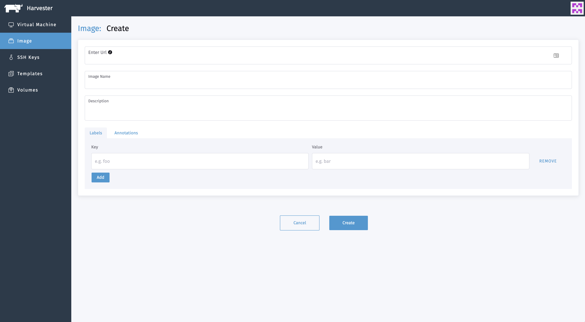

# Upload Images

To upload virtual machine images in the **Images** page, enter a URL that can be accessed from the cluster. Note: The image name will be auto-filled using the URL address's filename. You can always customize it when required.

Currently, we support qcow2, raw, and ISO images.

> Note: uploading images from the local desktop to the Harvester cluster is not supported yet, will be tracked on [#570](https://github.com/harvester/harvester/issues/570).

Description and labels are optional to add.

