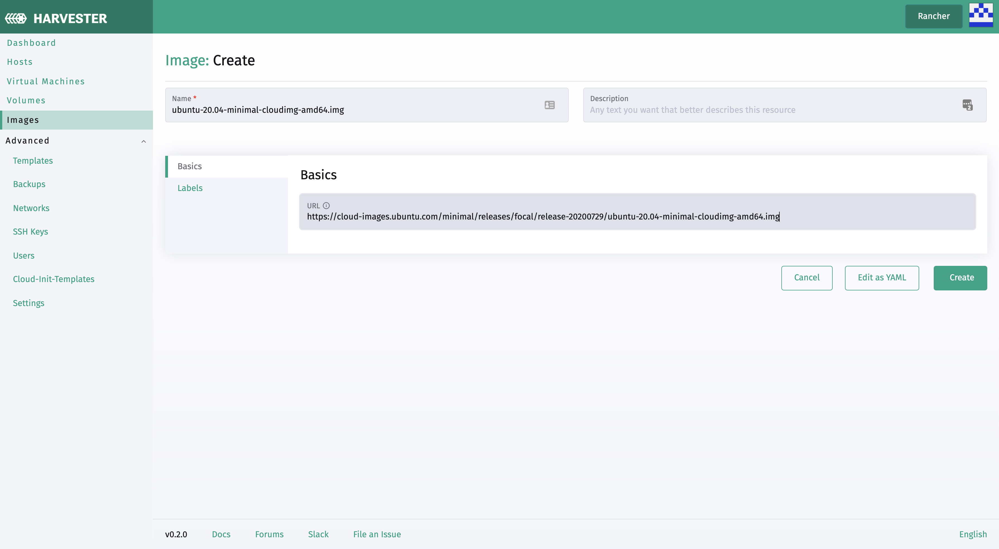

# Upload Image

Users can upload the virtual machine image in the `Image` page

1. Enter an URL that can be accessed from the cluster, currently, we do support qcow2, raw, and ISO images.
1. The image name will be auto-filled using the URL address's filename, you can always customize it when required.
1. Description, labels, and annotations are optional to add.

