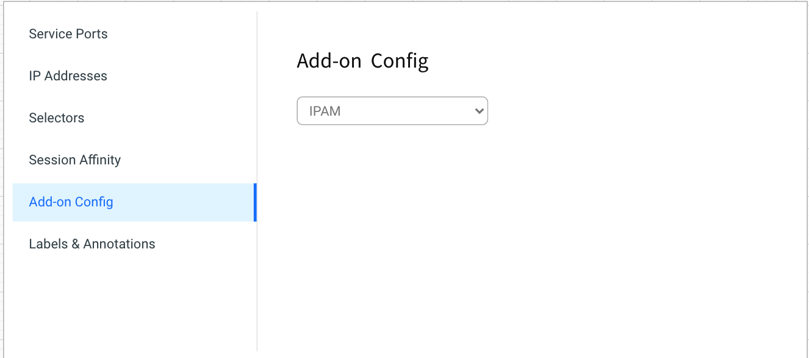
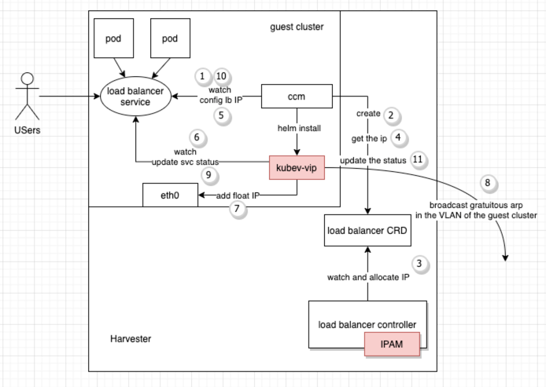
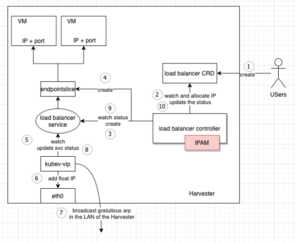

# Harvester Cloud Provider Enhancement

## Summary

Currently, the load balancer (LB) provided by the Harvester cloud provider is exposed in the local network of the Harvester hosts. If users in the VLAN want to connect the load balancer IP (VIP), they must prove the network route connectivity themselves.

Another limitation of IPAM is only being able to configure a single CIDR range per Harvester namespace.

To meet the requirement and provide a better user experience, we will deploy the `kube-vip` alone with the Harvester CCM and add the IPAM module in the Harvester load balancer controller to replace the `kube-vip` cloud provider.

### Related Issues

https://github.com/harvester/harvester/issues/1762

https://github.com/harvester/harvester/issues/1580

## Motivation

### Goals

- Expose the load balancer IP in the VLAN of the guest cluster.
- Support for configuring an IP range per VLAN and an IP range per tenant.
- Provide LB for traditional VM workloads deployed in the Harvester VMs.

## Proposal

### User Stories

#### Story 1

Before this enhancement, the VIP for the load balancer service of the guest cluster is only exposed in the Harvester LAN. However, in the production environments, users want to access the VIP in the VLAN where the guest clusters run. They have to prove the route connectivity themselves, which is difficult for those unfamiliar with a layer 3 network.

After this enhancement, the VIP will be exposed to the VLAN, and users can access the VIP directly without any additional network configurations.

#### Story 2

Before this enhancement, an IP range could only be configured per the Harvester namespace. After this enhancement, users can specify the IP range for VLAN, projects, namespaces, or guest clusters.

#### Story 3

Users who want to distribute application traffic across workloads deployed in the VMs rather than the guest cluster can create an LB of VM workload type and group the backend VMs by labels.

### User Experience In Detail

- Place the IP pool and load balancer UI in the subtab of the network tab.
- Provide the `Add-on Config` for the load balancer service in the guest cluster. Users can select the IPAM mode as `pool` or `DHCP`.
  

### API changes

Add a new CRD `IPPool`. We show some typical cases as follows.

```yaml
apiVersion: loadbalancer.harvesterhci.io/v1beta1
kind: IPPool
metadata:
  name: vlan-awareness-pool
spec:
  selector:
    network: default/vlan1
    scope:
    - project: ""
      namespace: default
      guestCluster: '*'
    - project: ""
      namespace: cattle-fleet-system
      guestCluster: '*'
  ranges:
  - rangeEnd: 172.16.231.13
    rangeStart: 172.16.231.10
    subnet: 172.16.231.0/24
  - subnet: 172.16.232.0/24
status:
  allocatedHistory:
    172.16.231.11: default/lb-3
  allocated:
    172.16.231.10: default/lb1
  available: 256
  conditions:
  - lastUpdateTime: "2022-05-18T12:04:33Z"
    status: "True"
    type: Ready
  lastAllocated: 172.16.231.10
  total: 257
```

```yaml
apiVersion: loadbalancer.harvesterhci.io/v1beta1
kind: IPPool
metadata:
  labels:
    loadbalancer.harvesterhci.io/vid: "100"
  name: vlan100-pool
spec:
  selector:
    priority: 100
    scope:
    - project: ""
      namespace: default
      guestCluster: '*'
    - project: ""
      namespace: cattle-fleet-system
      guestCluster: '*'
  ranges:
  - subnet: 192.168.41.0/24
status:
  allocated:
    192.168.41.4: default/kubernetes-default-nginx-lb-3-3be238b0
    192.168.41.5: default/kubernetes-default-lb20-e99740b0
  allocatedHistory:
    192.168.41.2: default/kubernetes-default-nginx-lb-cwa-af13e48f
    192.168.41.3: default/kubernetes-default-nginx-lb-3-9d7d8a7a
  available: 251
  conditions:
  - lastUpdateTime: "2022-05-20T07:41:36Z"
    status: "True"
    type: Ready
  lastAllocated: 192.168.41.4
  total: 253
```

Modify LoadBalancer CRD

```yaml
apiVersion: loadbalancer.harvesterhci.io/v1beta1
kind: LoadBalancer
metadata:
  name: lb1
  namespace: default
spec:
  backendServerSelector:
    demo: demo
  healthCheck: {}
  ipPool: vlan-awareness-pool
  ipam: pool
  listeners:
  - backendPort: 80
    name: ""
    port: 80
    protocol: TCP
  workloadType: vm
status:
  backendServers:
    192.168.100.100
  address: 172.16.231.10
  allocatedAddress:
    gateway: 172.16.231.1
    ip: 172.16.231.10
    ipPool: vlan-awareness-pool
    mask: 255.255.255.0
  conditions:
  - lastUpdateTime: "2022-05-20T07:55:20Z"
    status: "True"
    type: Ready
```

```yaml
apiVersion: loadbalancer.harvesterhci.io/v1beta1
kind: LoadBalancer
metadata:
  annotations:
    loadbalancer.harvesterhci.io/cluster: kubernetes
    loadbalancer.harvesterhci.io/namespace: default
    loadbalancer.harvesterhci.io/network: default/vlan100
    loadbalancer.harvesterhci.io/project: local:p-hl965
  labels:
    cloudprovider.harvesterhci.io/cluster: kubernetes
    cloudprovider.harvesterhci.io/serviceName: nginx-lb-3
    cloudprovider.harvesterhci.io/serviceNamespace: default
  name: kubernetes-default-nginx-lb-3-3be238b0
  namespace: default
spec:
  ipam: pool
  workloadType: cluster
status:
  address: 192.168.41.4
  allocatedAddress:
    gateway: 192.168.41.1
    ip: 192.168.41.4
    ipPool: vlan100-pool
    mask: 255.255.255.0
  conditions:
  - lastUpdateTime: "2022-05-21T14:21:53Z"
    status: "True"
    type: Ready
```

## Design

### Implementation Overview

#### load balancer types

There are two types of load balancers offered by Harvester cloud providers based on their usage.

- LB for an application deployed in the guest cluster (cluster LB): The cloud provider creates the LB when watching a service in the guest cluster. The load balancer IP is exposed in the VLAN of the guest cluster where we deploy the `kube-vip`.
- LB for VM workloads (VM LB): It is for traditional VM workloads deployed on Harvester VMs. The load balancer IP is exposed in the LAN of the Harvester cluster, and the Harvester cluster will forward the traffic to a Kubernetes service whose endpoints are the node port address of the load balancer service in the guest cluster.

#### LB for application in the guest cluster



This diagram shows the creation progress.

- Once the CCM watches a new load balancer service in the guest cluster, it creates LB CR of type `inner`.
- As the load balance controller (LBC) watches a new LB CR of type `inner`, the IPAM module will assign an IP for the LB CR as it does for the external LB. However, unlike the external LB, the LBC won't create a service and the related `EndPointSlice` in the Harvester.
- The CCM will get the IP from the LB CR and then configure it into the filed `spec.loadBalancerIP` of the service in the guest cluster.
- Once the `kube-vip` inside the guest cluster watches the service with the non-empty field `spec.loadBalancerIP`, it will get the IP through the protocol if needed, then add the floating IP and broadcast the gratuitous ARP. The `kube-vip` updates the service status while the CCM does this for the external LB.
- The CCM will synchronize the status from the service to the LB CR while the LBC does this for the external LB.

#### LB for VM workloads



This diagram shows the creation progress.

- The Harvester load balancer controller (LBC) watches a new load balancer CR (LB CR). The IPAM module of the LBC will assign an IP for the LB CR. If its IPAM mode is `DHCP`, the IP will be `0.0.0.0`, while if its IPAM mode is `pool`, the IPAM module will allocate an IP from the configured IP Pool. In the meantime, the LBC will create a new service with load balancer type and the related `EndPointSlice`, whose destinations are the `VM IP:port`.
- The `kube-vip` will watch the new load balancer service in the Harvester cluster. If the field `spec.loadBalancerIP` value is `0.0.0.0`, the `kube-vip` will request an IP through the DHCP protocol. Then, the `kube-vip` will add the IP from the DHCP server or IPAM pool to the network interface of the default route and send the gratuitous ARP periodically. Finally, the `kube-vip` will update the status of the service.
- The LBC watches the status change of the service and synchronizes it in the LB CR.

#### IP pool

- **IP pool selection**
  - The LB expresses the requirements by the annotations outlined below. All the annotations are optional.
    - `loadbalancer.harvesterhci.io/network` specifies the location of the network for the guest cluster.
    - `loadbalancer.harvesterhci.io/project`, `loadbalancer.harvesterhci.io/namespace` specify the project and namespace of the VMs that comprise the guest cluster.
    - `loadbalancer.harvesterhci.io/cluster` specifies the name of the guest cluster.
  - The IP pool has a selector, including network and scope, to match the requirements of the LB.
    - Network is a hard condition. The optional IP pool must match the value of the LB annotation `loadbalancer.harvesterhci.io/network`.
    - Every IP pool, except the global IP pool, has a unique scope different from others if its priority is `0`. The project/namespace/cluster name of LBs should be in the scope of the IP pool if they want to get an IP from this pool.
  - The field `spec.selector.priority` specifies the priority of the IP Pool. The larger the number, the higher priority. If the priority is not 0, its value should be different from others. It's convenient for users to migrate the old IP pool to the new one with the help of the priority feature.
  - If the IP Pool has a scope that matches all projects, namespaces, and guest clusters, it's called a global IP pool. It's allowed to have only one global IP pool. If there is no IP pool matching the requirements of the LB, the IPAM module will allocate an IP from the global IP pool if existing.
- **Allocation policy**
  - The IPAM module prefers to allocate the previously assigned IP according to the given history.
  - IP allocation follows the round-robin policy.

#### How to deploy kube-vip

Take `kube-vip` as a subchart of the `harvester-cloud-provider` helm chart.

### Upgrade strategy
1. After upgrading to the new Harvester load balancer, it'll convert the old IP pool configured in the `ConfigMap` `kube-system/kubevip` to the new IP pool CR.
2. We implement CRD conversion webhook to be compatible with the old load balancer version.

For RKE1/RKE2, upgrading to a new version means upgrading the Harvester cloud provider.

For other distributions, users have to upgrade it manually.
