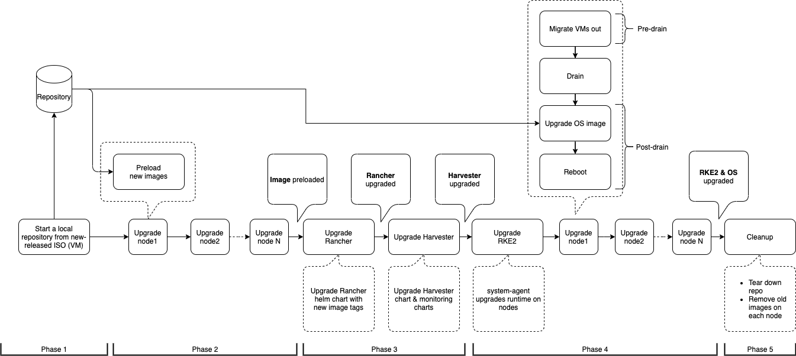

# Zero Downtime Upgrade

## Summary

Users might run mission-critical workloads in Harvester clusters. The zero-downtime upgrade support can allow users to upgrade their Harvestr clusters without interrupting services.

### Related Issues

- https://github.com/harvester/harvester/issues/1022

## Motivation

### Goals

The user can upgrade a Harvester cluster to a newer version from GUI or API. During the upgrade, there will be no downtime for the VMs in the Harvester.

### Non-goals

- Upgrade OSes and software stacks inside VMs.

## Proposal

We'll implement an upgrade controller to manage `upgrade` CRs and handle upgrades.

### User Stories

#### 1. Multiple-nodes Harvester deployments (node count >= 3)

The user can select a new Harvester version from GUI to perform cluster upgrades. During an upgrade, VMs are live-migrated between nodes to avoid guest service downtime. Harvester API endpoints, components, and VIP are also available during the upgrade.

#### 2. 2-nodes Harvester deployments

The user can select a new Harvester version from GUI to perform cluster upgrades. During an upgrade, VMs are live-migrated between nodes to avoid guest service downtime. Because there is only one management node, upgrading the management node brings downtime to Harvester API endpoints, components, VIP, and VMs' connectivity (depends on the network configuration).

#### 3. Single node Harvester deployments

The user can select a new Harvester version from GUI to perform cluster upgrades. VMs are shut down before an upgrade in this case.

### User Experience In Detail

GUI:
- With Internet
  - When there is a new upgradable version, the Harvester GUI will display an "upgrade" button to indicate there are new versions.
  - The user can click the "upgrade" button to select a new version from a drop-list to start the upgrade.
  - During an upgrade, a dialog displays the upgrade progress.
- Air-gapped situation
  - The GUI provides a dedicated page that allows users to upload a Harvester ISO and start an upgrade.

API:
- A new `Version` CR is automatically created when there is a new upgradable version.
- The user can create an `Upgrade` CR to start an upgrade.

### API changes

No. The first implementation is included in the GA release 1.0.0.

## Design

### Implementation Overview

#### Version management

- When a new Harvester version is released, developers need to edit the response file in the [upgrade responder](https://github.com/harvester/upgrade-responder) to include the new [Version](https://github.com/harvester/upgrade-responder/blob/032365e51c204dfc4aa8793410f5e6a0114c276e/upgraderesponder/service.go#L60). Developers also need to specify the [`MinUpgradableVersion`](https://github.com/harvester/upgrade-responder/blob/032365e51c204dfc4aa8793410f5e6a0114c276e/upgraderesponder/service.go#L63) of the new version.
- Harvester backend queries new versions from the upgrade responder hourly.
- If there is an upgradable version, the backend will query `https://releases.rancher.com/harvester/<version>/version.yaml` to import the `Version` CR. The `Version` CR contains the Harvester ISO file's URL and checksum.

#### Upgrade CR

The user can create an `Upgrade` CR either from Harvester GUI or using a manifest file:

```
apiVersion: harvesterhci.io/v1beta1
kind: Upgrade
metadata:
  generateName: hvst-upgrade-
  namespace: harvester-system
spec:
  version: "1.0.1"
```

The upgrade controller will check if a corresponding `Version` CR exists. If the CR exists, the controller starts the upgrade by using the `Version` CR. In the previous example, the correspinding `Version` CR is:

```
apiVersion: harvesterhci.io/v1beta1
kind: Version
metadata:
  name: v1.0.1
  namespace: harvester-system
spec:
  isoChecksum: 'd5dc42a7422d677a07059be1fc0cf7caec70c172cfb4e7829f753b26ead91ee8616ba0fcf994c8b3ccc8aa4b2a791c3f505cba1a78780d8a21e38c307cdf1340'
  isoURL: https://releases.rancher.com/harvester/v1.0.1/harvester-v1.0.1-amd64.iso
  releaseDate: '20220408'
```

The `Version` CR contains the Harvester ISO file URL and file's checksum (in SHA-512).

#### Upgrade phases

The following figure shows the phases of an upgrade.



The upgrade controller manages an upgrade in several phases:

**Phase1**: Provision upgrade repository VM

The upgrade repository is a VM that boots from a Harvester ISO.
- The upgrade controller sees a new Upgrade CR and gets the `ISOURL` and `isoChecksum` values from the corresponding `Version` CR.
- Harvester backend creates a VirtualMachineImage resource (by setting `sourceType: download` and `ISOURL` and `isoChecksum` values from `Version` CR to `URL` and `checksum` fields). We use SHA-512 sum here because that's the only hash supported by Longhorn backing image service at this moment.
- Wait for the VirtualMachineImage resource to be created successfully.
- Run a VM with the VirtualMachineImage. We use [userdata to create a file in the filesystem](https://github.com/harvester/os2/blob/ae38642196eedbd919a984f3aa89c72800f14599/files/system/oem/92_iso_repo.yaml#L7-L20). When Harvester ISO boots, it will start an Nginx server to serve ISO contents.

**Phase 2**: Preload container images

- The upgrade controller creates a [System Upgrade Controller](https://github.com/rancher/system-upgrade-controller) plan to preload images on each Harvester node.
  - The plan starts jobs with `harvester-upgrade:<current_version>` image.
  - The job downloads image tarballs from the upgrade repository VM and imports images with the `ctr` utility.
  - RKE2 tarballs are saved to `/var/lib/rancher/rke2/agent/images`.

**Phase 3**: Upgrade system services

*Note*: Starts from this phase, the upgrade controller uses `harvester-upgrade:<new_version>` image since it's already preloaded in the previous step. This also allows us to fix things in the newer version.

The upgrade controller runs a job with `harvester-upgrade:<new_version>` image to upgrade system services, including:
- Embedded Rancher and its dependencies.
- Harvester cluster-repo.
- Harvester chart.
- Monitoring chart.
- Any other fixes or migrations from previous versions.

**Phase 4**: Upgrade nodes

The upgrade controller informs the Embedded Rancher to upgrade the RKE2 runtimes on each node. We use the [pre-drain and post-drain hooks feature](https://github.com/rancher/rancher/issues/35464) to perform additional works. The following is what happens when upgrading a node.
- The Embedded Rancher starts to upgrade a node and notifies Harvester to run the pre-drain job.
- The Harvester upgrade controller creates a pre-drain job with `harvester-upgrade:<new_version>` image to:
  - Live-migrates VMs out of the node.
  - Shutdown non-migratable VMs.
- The Harvester controller notifies the Embedded Rancher that the pre-drain job is done.
- The Embedded Rancher starts to upgrade RKE2 server or agent on the node.
- The Embeded Rancher notifies Harvester to run the post-drain job.
- The Harvester controller creates a post-drain job with `harvester-upgrade:<new_version>` image to:
  - Wait for RKE2 runtime to upgrade.
  - Upgrade the node's OS with `cos` script.
  - Clean up unused images.
  - Reboot the node.
- When the node is back, the Harvester controller notifies the Embedded Rancher that the post-hook is done. The Embedded Rancher starts to upgrade the next node.

**Phase 5**: Clean-up

The Harvester controller deletes the upgrade repository VM and its image.

### Test plan

- Spawn Harvester clusters with a previous release. Ideally, the test should cover:
  - Single node Harvester deployment.
  - 2-nodes Harvester cluster.
  - 3-nodes (or more) Harvester cluster.

- Save the Harvester ISO to a local http server and calculate its SHA-512 checksum.
- Create a `Version` CR:

    ```
    apiVersion: harvesterhci.io/v1beta1
    kind: Version
    metadata:
      name: v1.0.2      # <-- need to be newer than current version
      namespace: harvester-system
    spec:
      isoChecksum: <replace me>
      isoURL: <replace me>
      releaseDate: '20220408'
      tags:
      - dev
    ```
- Click the "upgrade" button in the GUI to start the upgrade.
- Harvester ISO contains components' versions, verify them after the upgrade:

    ```
    $ cat <iso_mnt_path>/harvester-release.yaml
    harvester: v1.0.1
    harvesterChart: 1.0.1
    os: Harvester v1.0.1
    kubernetes: v1.21.11+rke2r1
    rancher: v2.6.4-harvester3
    monitoringChart: 100.1.0+up19.0.3
    kubevirt: 0.49.0-2
    rancherDependencies:
      fleet:
        chart: 100.0.3+up0.3.9
        app: 0.3.9
      fleet-crd:
        chart: 100.0.3+up0.3.9
        app: 0.3.9
      rancher-webhook:
        chart: 1.0.4+up0.2.5
        app: 0.2.5
    ```

### Upgrade strategy

No.

## Note

### Limitations

- With this proposed approach, the last-upgraded node contains no VMs (VMs are live-migrated out of the node).
