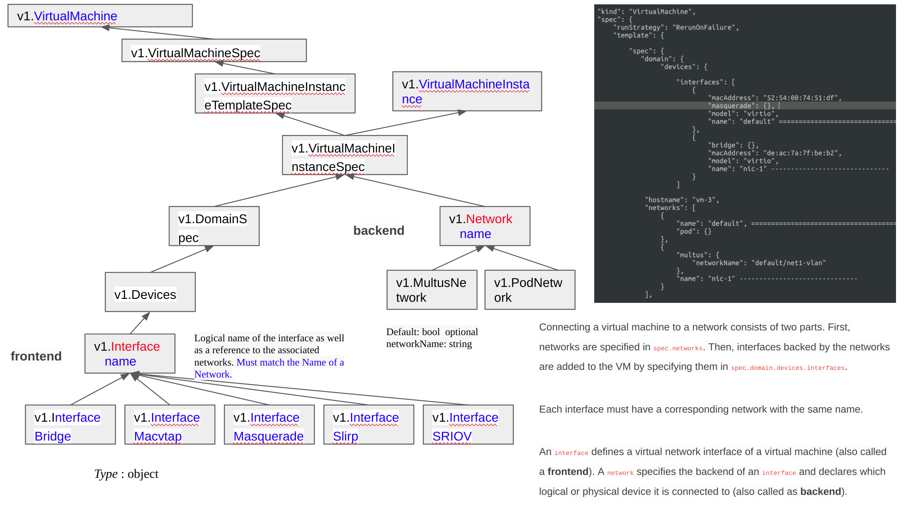
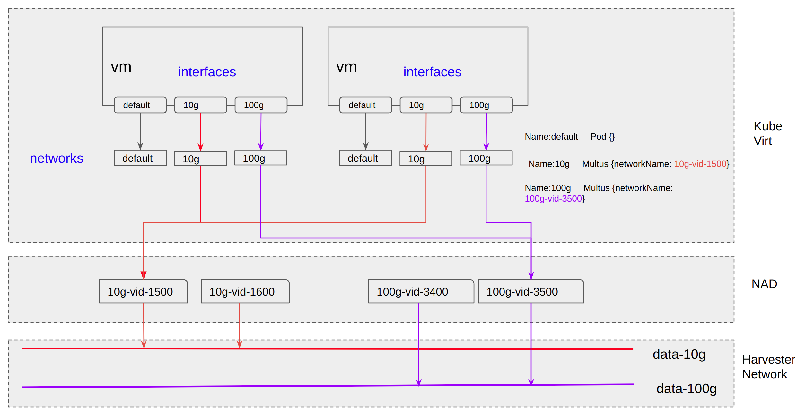
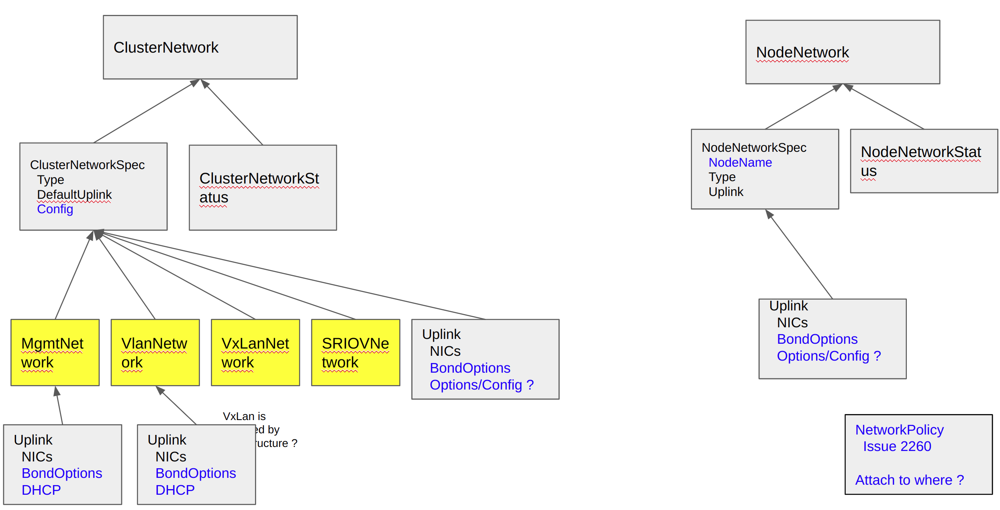
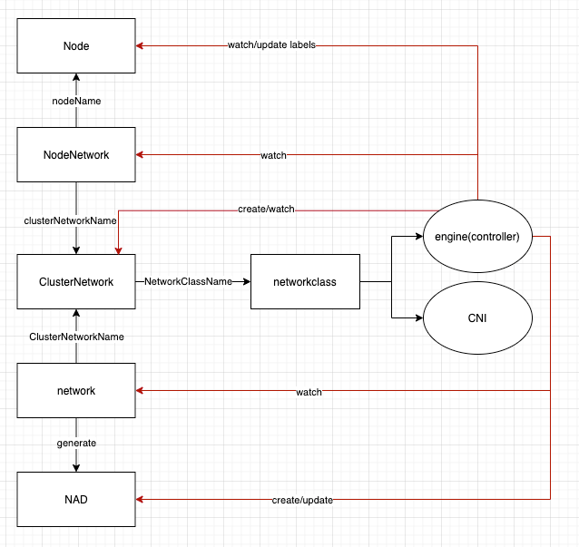

# VLAN Enhancement

## Summary

IT usually configures the switch with VLAN trunk mode rather than VLAN access mode or hybrid mode in a production environment. Therefore, we should add VLAN support for `harvester-mgmt` and allow multiple Linux bridges in Harvester node configuration.

### Related Issues

- https://github.com/harvester/harvester/issues/1390

## Terminology

| Term | Short Term | Description |
| --- | --- | --- |
| management interface | mgmt intf | mgmt intf is the owner of node IP. In previous version, mgmt intf is `harvester-mgmt`.|
| VLAN Trunk mode | - | The configuration that only allow VLAN tagged packet for ingress and egress. |
| VLAN Hybrid mode | - | The configuration that allow VLAN tagged and untagged packet for ingress and egress. Need configured Native VLAN. |
| VLAN Access mode | - | The configuration that only allow untagged packet for ingress and egress. In VLAN-aware switch, it will need a VLAN ID to be configured also. |
| native vlan | - | The configuration for popping vlan tag when egress, pushing vlan tag when ingress |
| PVID | - | Same as natvie vlan in Linux bridge. |
| VLAN interface | vlan intf | SVI in vlan-aware switch. eth0.100 in Linux. |
| uplink | - | The network interface is for Linux bridge to send traffic to outside the node. |
| network attached definition | NAD, nad, net-attach-def | Network configuration CRD for Multus CNI |

## Motivation

### Goals

- Migrate node IP from `harvester-mgmt` to the new management interface to allow VLAN tagged packet for management traffic.
- Allow multiple Linux bridges to be configured by Harvester
- Allow the same name Linux bridge with different uplinks

### Non-goals [optional]

What is out of scope for this enhancement? Listing non-goals helps to focus discussion and make progress.

TODO

## Proposal

### User Stories

In Harvester, we have following assumptions:

```
  * User provides physical network connectivity, all the physical NICs of each NODE will be attached to networks now or then
  * Multi networks may exist
  * Management network is always existing, each NODE has at least one NIC attached to it
```

A detailed explanation of Harvester networking is in [harvester network samples](#harvester-network-samples) .

One user plans to install Harvester cluster, and assume:

```
  User prepares 3 networks: mgmt (type VLAN), VLAN ID 100;  data-10g (type VLAN), VLAN ID 1000~2000; data-100g (type VLAN), VLAN ID 3000~4000
  User has 20 NODEs, each NODE has 6 NICs, eth1, eth2 are in mgmt;  eth3, eth4 are in data-10g;  eth5, eth6 are in data-100g
```

Following stories are about the installation and usage of Harvester Network.

```
  Story 1  Install cluster via PXE, all ClusterNetworks are ready
  Story 2  Install cluster via PXE,, only management ClusterNetwork is ready
  Story 3  Install cluster via ISO UI manually, only management ClusterNetwork is ready
  Story 4  Add unified NODE to cluster
  Story 5  Add none-unified NODE to cluster
  Story 6  Delete NODE from cluster

  Story 7  Add management VLAN ID to an existing cluster
  Story 8  Change management VLAN ID
  Story 9  Delete management VLAN ID

  Story 10 Set the VLAN ID range for ClusterNetwork
  Story 11 Set MTU or other ethernet parameter at ClusterNetwork level

  Story 12 Add new ClusterNetwork
  Story 13 Delete none-management ClusterNetwork
  Story 14 Allow a new ClusterNetwork uses management interface

  Story 15 Create NAD with VLAN ID check
  Story 16 Create NAD with ClusterNetwork ready check
```

#### Story 1
Install cluster via PXE, all ClusterNetworks are ready

```
Installation:
 "create-cluster" NODE:
	  claim 3 cluster networks, say mgmt, data-10g, data-100g, all are VLAN based
	  claim 6 nics are attached to 3 networks
	  claim mgmt VLAN ID, static/dhcp
	  claim VIP static/dhcp

 "join-cluster" NODEs:
	  claim 6 nics are attached to 3 networks
	  claim mgmt VLAN ID, static/dhcp
```

After cluster installation is finished:

```
  VIP, NODE managment IP are reachable
  3 cluster networks are ready, each NODE has it's node-agent, say br-mgmt, br-data-10g, br-data-100g
```

#### Story 2

Install cluster via PXE,, only management ClusterNetwork is ready

```
  "create-cluster" NODE:
	  claim 2 nics are attached to mgmt network
  	claim mgmt VLAN ID, static/dhcp
	  claim VIP static/dhcp

  "join-cluster" NODEs:
	  claim 2 nics are attached to mgmt networks
	  claim mgmt VLAN ID, static/dhcp
```

After cluster installation is finished:

```
  VIP, NODE managment IP are reachable
  a default mgmt cluster network is ready, each NODE has it's node-agent, say br-mgmt
```


From Harvester WebUI/CLI, user continues to add more cluster networks:


```
  Create another 2 cluster network: data-10g, data-100g
    set eth3,eth4 as data-10g's uplink;  eth5,eth6 as data-100g's uplink
```

(current: Enabling Default VLAN Network   Settings > vlan, but only 1 instance )

#### Story 3

Install cluster via ISO UI manually, only management ClusterNetwork is ready

```
  "create-cluster" NODE:
	  set 2 nics are attached to mgmt network
  	set mgmt VLAN ID, static/dhcp
	  set VIP static/dhcp

  "join-cluster" NODEs:
	  set 2 nics are attached to mgmt networks
	  set mgmt VLAN ID, static/dhcp
```

After cluster installation is finished:

```
  VIP, NODE managment IP are reachable
  a default mgmt cluster network is ready, each NODE has it's node-agent, say br-mgmt
```


#### Story 4

Add unified NODE to cluster

```
  User plans to add a new NODE, which has similar hardware with existing NODEs
	The readiness of network is similar to previous stories
```


#### Story 5
Add none-unified NODE to cluster

```
  User plans to add a new NODE, which has only 2 NICs, eth1 to management network, eth2 to data-10g, no NIC to data-100g

	The readiness of network is similar to previous stories; user needs to change PXE config file, or add cluster-network manually.
```

NOTE: There are challenges of this story, especially to the VM scheduling, ClusterNetwork conditions will be involved.

#### Story 6

Delete NODE from cluster

```
  User plans to delete a NODE from cluster

	Follow the current deleting NODE process.
```


#### Story 7

Add management VLAN ID to an existing cluster

```
  When cluster is installed/upgraded, it has no management VLAN ID, then, the user wishes to add the management VLAN ID.
  Due to the fact that NODE IP CAN NOT be changed, this scenario may not be supported.
  But customer may have such requirement...

  Management IP (node IP) is either staticly assigned, or from DHCP, when VLAN ID is added to management network, 
communication between NODEs may have break.
```


#### Story 8

Change management VLAN ID

```
  When cluster is running, user wishes to change the management VLAN ID
  Due to the fact that NODE IP CAN NOT be changed, this scenario may not be supported.
  But customer may have such requirement...
```

#### Story 9

Delete management VLAN ID

```
  When cluster is running, user wishes to delete the VLAN ID of the management network.
  Due to the fact that NODE IP CAN NOT be changed, this scenario may not be supported.
  But customer may have such requirement...
```

#### Story 10

Set the VLAN ID range for ClusterNetwork

```
  (Physical) Network administrator configures a range of VLAN ID for a specific Harvester cluster, to avoid mismatching, 
Harvester administrator also wishes to config the related VLAN ID range into ClusterNetwok,
thus, the later NAD configure will not be wrong.
```

#### Story 11

Set MTU or other ethernet parameter at ClusterNetwork level

```
  Each type of cluster network have related parameters. For instance, for L2 VLAN network, user plan to config the MTU.
Set it in each NODE is OK, but if it could be set from ClusterNetwork, it is user friendly.
```


#### Story 12

Add new ClusterNetwork

```
  When cluster is running, user adds a new ClusterNetwork.
  For example, nic3, nic4 are attached to ClusterNetwork data-10g now. User does following operations:
  
  Option A:
  (1) Detach nic4 from data-10g in each node
  (2) Physical Network administrator configure another physical network for nic4
(e.g add a new range of VIDs for the nic4 connected switch ports)
  (3) Create new ClusterNetwork data-10g-2, set default uplink as nic4
  (4) Nic4 in each node is attached to data-10g-2 automatically

  or
  Option B:
  (1) Create new ClusterNetwork data-10g-2, set default uplink as empty
  (2) Detach nic4 from data-10g in each node
  (3) Physical Network administrator configure another physical network for nic4
(e.g add a new range of VIDs for the nic4 connected switch ports)
  (4) Attach nic4 to data-10g-2 in each node manually
```

Note, a ClusterNetwork may has no default uplink, it's ready status should be defined.


#### Story 13

Delete none-management ClusterNetwork

```
  When cluster is running, user deletes a new ClusterNetwork.
  For example, nic3, nic4 are attached to ClusterNetwork data-10g now. nic5, nic6 are attached to ClusterNetwork data-100g.
User does following operations:

  (1) Delete ClusterNetwork data-100g

  When there are NADs connecting to data-100g, the user is required to delete those NADs first.
  When there are NO NADs connecting to data-100g, the ClusterNetwork is allowed to be deleted, after that, 
nic5, nic6 are ready to use for another ClusterNetwork.

```

#### Story 14

Allow a new ClusterNetwork uses management interface

```
  User creates a new ClusterNetwork, but in some nodes, it has no dedicated uplink,
then user sets the uplink of this ClusterNetwork to be the management interface
```

note: it's argued if such story is practical, as it cannot isolate and may affect management network


#### Story 15

Create NAD with VLAN ID check

```
  NAD is a cluster level concept.
  NAD is configured to attach to ClusterNetwork with related parameters, e.g. when ClusterNetwork is VLAN network, then VLAN ID needs to be set

  The VLAN ID should be in range for ClusterNetwork's allowed VLAN ID (by default, 1~4094)
```

  (current: A new VLAN network can be created via the Advanced > Networks page and clicking the Create button.)


#### Story 16

Create NAD with ClusterNetwork ready check

```
  Per sotry 12 'Add new ClusterNetwork', when a new ClusterNetwork is under construction, it is not spread all over the Cluster,
NAD to this ClusterNetwork should be blocked.

	It is also affected by story Story 5 'Add none-unified NODE to cluster'
```

#### Switch configuration needs VLAN hybrid mode always for data center

Before this enhancement, users have to configure the VLAN-aware switch with VLAN hybrid mode for the ports because the management interface will only work in untagged mode.

After this enhancement, users can setup VLAN ID for the management interface.

### User Experience In Detail

#### Harvester Network Samples

Ideally, each NODE in Harvester has similar networking connections like following.


But in reality, NODE may have different nics connecting to different networks, for instance, mixed developing & deployment NODEs, some NODEs have GPU/SRIOV/..., none-unified networking is a challenge.


[back to user stories](#user-stories)


#### KubeVirt network and interface

KubeVirt has a concept of interface (frontend) and network (backend), network is related to NAD, interface is the NIC for VM, which takes care of different interfaces related to libvirt.



#### End to end network

Undoubtly, KubeVirt's interface and network, plus NAD, is NODE-independent. In an unified cluster, VM is freely to be scheduled to any NODE as long as resources are enough.




#### Harvester network extension proposal

A proposal, for discussion.




#### Installer UI

We will have another option for adding VLAN ID to the management interface.

#### Harvester config

In Harvester config, we will create more network devices to implement this enhancement, so users need to add those interfaces on their own.

> **NOTE**: Maybe we could change the network section of Harvester config to have an abstract layer above `wicked`.

#### Web UI

In Web UI, we will need an advanced network configuration page to configure additional custom Linux bridges to serve VM VLAN networks.


### API changes

## Design

### Implementation Overview

- In the installer, we will create a Linux bridge named `br-mgmt` by default and attach `bond-mgmt` to it by default. The management interface is `br-mgmt` here.
- In the installer, if users configure VLAN ID for the management interface, we will create another VLAN interface named `br-mgmt.<VLAN ID>` and configure node IP on it.
- `br-mgmt` is always available and fixed.
- Network attached definition can't attach to `br-mgmt`.
- Harvester Network Controller will create a veth pair to connect `br-mgmt` and user defined `br<X>` for uplink if users want to use same interface of `bond-mgmt` or management interface to provide VM VLAN networks.
- `br-mgmt` and vlan interface need to inherit first MAC address from physical network interfaces of `bond-mgmt`.
    - `wicked` need to set a fixed MAC address for `br-mgmt` and vlan interface.
- The uplink of `br0` and `br<X>` is always a `bond`.
- VLAN filtering in `br0` and `br<X>` is always enable.
    - PVID is always 1.
    - Always use VLAN 1 as untagged network.
- Harvester Network controller don't need to copy IP address and route from `harvester-mgmt` to bridge anymore
    - In installation statge, we will generate DHCP or Static IP configuration on `br-mgmt` or vlan interface.

> **NOTE**: We could consider to migrate all Linux bridges' name to `br<X>` where `<X>` is a decimal number. In original design, The name `harvester-br0` is too long to have a VLAN interface with same naming rule of `eth0.100`.

#### Architecture figures


#### CRD roles

- ClusterNetwork (or different name)
    - global
    - store bridge name
    - store default uplink interfaces
    - once ClusterNetwork create a Linux bridge, all nodes need to setup NodeNetwork to have uplink info.
        - by default, once ClusterNetwork is created, we could create NodeNetwork for every nodes with management interface directly until users change NodeNetwork configuration
- NodeNetwork (or different name)
    - local
    - store uplink interface name and be associated to a bridge name
    - store bond-brX options
- network attached definition
    - be associated to a bridge name

> **NOTE**: Need to consider about one ClusterNetwork for all Linux bridges or one resource with one bridge only

#### CRD design

```
Kind: Bridge
metadata:
  name: br<X>
spec:
  default_uplink: <template_name>
```

```
Kind: NodeBridge
metadata:
  name: <node-name>-br<X>
status:
  attach bridge success or failed msg // BridgeUplink Controller provide status
```

```
Kind: BridgeUplink
metadata:
  name: <node-name>-br<X>
spec:
  use_mgmt_port: true or false
  uplinks:
    - eth0
    - eth1
  bond_options:
    mode: balance_tlb
    miimon: 100
    updelay: 0
    downdelay: 0
    xmit_hash_policy: layer3+4
    ...
```

```
Kind: BridgeUplinkTemplate
metadata:
  name: <template-name>
spec:
  use_mgmt_port: true or false
  uplinks:
    - eth0
    - eth1
  bond_options:
    mode: balance_tlb
    miimon: 100
    updelay: 0
    downdelay: 0
    xmit_hash_policy: layer3+4
    ...
```

##### Controller

- Bridge Controller:

1. needs to add/remove bridge to all nodes.
2. needs to add/remove BridgeStatus to all nodes.

- BridgeUplink Controller:

1. create/remove bond-brX and attach/detach physical interface to this bond
2. set/unset bond-brX's master as brX
3. copy default uplink settings to node level BridgeUplink CR
4. update status to BridgeUplink and BridgeStatus

##### User Experience

1. Create Bridge on their own before BridgeUplink
2. Create BridgeUplink for each nodes on their own
3. Create BridgeUplink for new nodes on their own

### CRD Design 2

#### Implementation Overview

- The NetworkClass CRD contains the engine and CNI. Developers add a new NnetworkClass CR if they add a new network implementation including a set of controllers and a CNI plugin.
- Every ClusterNetwork CR specifies a NetworkClass CR. 
- Every NodeNetwork corresponds to a Node and a ClusterNetwork CR. The network engine will create the NodeNetwork CR and setup/tear down the network for every node. It is worth mentioning that the engine will update the node labels to indicate whether the node satisfy the network requirement. 
- Every Network CR specifies a ClusterNetwork CR. The network engine will generate the NAD according to the Network CR.

1. NetworkClass

``` go 
// +genclient
// +genclient:nonNamespaced
// +k8s:deepcopy-gen:interfaces=k8s.io/apimachinery/pkg/runtime.Object
// +kubebuilder:resource:shortName=nc;nc,scope=Cluster

type NetworkClass struct {
	metav1.TypeMeta   `json:",inline"`
	metav1.ObjectMeta `json:"metadata,omitempty"`

	Spec NetworkClassSpec `json:"spec"`
}

type NetworkClassSpec struct {
	Engine  string `json:"engine"`
	CNIName string `json:"cniName"`
}
```

2. ClusterNetwork

``` go 
// +genclient
// +genclient:nonNamespaced
// +k8s:deepcopy-gen:interfaces=k8s.io/apimachinery/pkg/runtime.Object
// +kubebuilder:resource:shortName=cn;cns,scope=Cluster

type ClusterNetwork struct {
	metav1.TypeMeta   `json:",inline"`
	metav1.ObjectMeta `json:"metadata,omitempty"`

	Spec   ClusterNetworkSpec   `json:"spec,omitempty"`
	Status ClusterNetworkStatus `json:"status,omitempty"`
}

type ClusterNetworkSpec struct {
	// +optional
	Description string `json:"description,omitempty"`

	NetworkClassName string `json:"NetworkClassName"`

	DefaultOptions Options `json:"DefaultOptions"`
}

type Options struct {
	VLANOptions  *VLANOptions  `json:"vlanOptions,omitempty"`
	VxLanOptions *VxLanOptions `json:"vxLanOptions,omitempty"`
}
```

3. NodeNetwork

``` go
type NodeNetwork struct {
	metav1.TypeMeta `json:",inline"`
	// add the relevant clusterNetwork as owner reference
	metav1.ObjectMeta `json:"metadata,omitempty"`

	Spec   NodeNetworkSpec   `json:"spec,omitempty"`
	Status NodeNetworkStatus `json:"status,omitempty"`
}

type NodeNetworkSpec struct {
	// +optional
	Description string `json:"description,omitempty"`

	NodeName string `json:"nodeName"`
	
	ClusterNetworkName string `json:"clusterNetworkName"`

	Options Options `json:"options"`
}
```

4. Network

``` go 
type Network struct {
	metav1.TypeMeta   `json:",inline"`
	metav1.ObjectMeta `json:"metadata,omitempty"`

	Spec NetworkSpec `json:"spec"`
}

type NetworkSpec struct {
	ClusterNetworkName string      `json:"clusterNetworkName"`
	Conf               NetworkConf `json:"conf"`
}

type NetworkConf struct {
	VLANConf  *VLANConf  `json:"vlanConf"`
	VxLanConf *VxLanConf `json:"vxLanConf"`
}

type VLANConf struct {
	VID uint `json:"vid"`
}

type VxLanConf struct {
	VNI uint `json:"VNI"`
}
```

#### Proof of Concept

The following commands are executed by root account or `sudo`.

##### Pre-test script

00_cleanup.sh
```bash
#!/bin/bash

ip link del br-mgmt
ip link del bond-mgmt
ip link del br1
ip link del veth-in
ip link del veth-out
ip link del veth-x
ip link del veth-y
```

01_basic.sh
```bash
#!/bin/bash

# avoid DHCP client conflict
systemctl stop wicked
systemctl disable wicked

# need to set fixed mac address otherwise bridge will generate MAC address randomly.
ip link add br-mgmt address 00:11:22:33:44:55 type bridge vlan_filtering 1
ip link add bond-mgmt type bond mode balance-tlb
ip link set bond-mgmt master br-mgmt

ip link set eth0 down
ip link set eth0 master bond-mgmt

ip link set eth0 up
ip link set bond-mgmt up
ip link set br-mgmt up

# inherit from br-mgmt directly.
ip link add link br-mgmt name br-mgmt.101 type vlan id 101
ip link set br-mgmt.101 up

bridge vlan add vid 2-4094 dev br-mgmt self
bridge vlan add vid 2-4094 dev bond-mgmt
bridge -c vlan show

# check everything is correct
# check MAC address
ip link show dev eth0
ip link show dev bond-mgmt
ip link show dev br-mgmt
ip link show dev br-mgmt.101
```

##### Test script

1. Static IP

10_static_ip.sh
```bash
#!/bin/bash

./00_cleanup.sh
./01_basic.sh

# no connection
ping 172.30.0.1 -c 4

ip addr add 172.30.0.123/24 dev br-mgmt.101
ip route add default via 172.30.0.1

ping 172.30.0.1 -c 4
```

2. DHCP

11_dhcp_ip.sh
```bash
#!/bin/bash

./00_cleanup.sh
./01_basic.sh

# no connection
ping 172.30.0.1 -c 4

dhclient -v br-mgmt.101

ping 172.30.0.1 -c 4

# clean up
dhclient -r br-mgmt.101
```

3. DHCP for VIP

12_dhcp_vip.sh
```bash
#!/bin/bash

./00_cleanup.sh
./01_basic.sh

# no connection
ping 172.30.0.1 -c 4

ip link add link br-mgmt.101 name vip address 00:22:22:22:22:22 type macvlan mode bridge
ip link set vip up
dhclient -v vip

ping 172.30.0.1 -c 4

# clean up
dhclient -r vip
```

4. Use `harvester-mgmt` as VLAN network uplink

20_use_mgmt_br1.sh
```bash
#!/bin/bash

./00_cleanup.sh
./01_basic.sh

# no connection
ping 172.30.0.1 -c 4

ip link add br1 type bridge vlan_filtering 1
ip link add veth-x type veth peer name veth-y
ip link set veth-x master br-mgmt
ip link set veth-y master br1

bridge vlan add vid 2-4094 dev veth-x
bridge vlan add vid 2-4094 dev veth-y
bridge -c vlan show

ip link set br1 up
ip link set veth-x up
ip link set veth-y up

# VM veth
ip link add veth-in type veth peer name veth-out
ip link set veth-out master br1
bridge vlan add vid 101 dev veth-out pvid untagged master

ip link set veth-in up
ip link set veth-out up

dhclient -v veth-in

ping 172.30.0.1 -c 4

# clean up
dhclient -r veth-in
```

5. Use other physical interface for VLAN network uplink

```bash
# need same setup in Basic section

ip link add br2 type bridge vlan_filtering 1
ip link add bond-br2 type bond mode balance-tlb
ip link set eth2 master bond-br2
ip link set bond-br2 master br2

bridge vlan add vid 2-4094 dev bond-br2
bridge -c vlan show

ip link set eth2 up
ip link set bond-br2 up
ip link set br2 up

# create VM veth
ip link add veth-in type veth peer name veth-out
ip link set veth-out master br2
bridge vlan add vid 101 dev veth-out pvid untagged master
```

##### Wicked ifcfg (without VLAN)

/etc/wicked/script/setup_bridge.sh
```
#!/bin/sh

ACTION=$1
INTERFACE=$2

case $ACTION in
    pre-up)
        ip link set $INTERFACE type bridge vlan_filtering 1
        bridge vlan add vid 2-4094 dev $INTERFACE self
        bridge vlan add vid 2-4094 dev bond-mgmt
        ;;
esac
```

/etc/sysconfig/network/ifcfg-br-mgmt
```
STARTMODE='onboot'
BOOTPROTO='dhcp'
BRIDGE='yes'
BRIDGE_STP='off'
BRIDGE_FORWARDDELAY='0'
BRIDGE_PORTS='bond-mgmt'
PRE_UP_SCRIPT="wicked:setup_bridge.sh"
LLADDR=<FIRST ETHERNET MAC>
```

/etc/sysconfig/network/ifcfg-bond-mgmt
```
STARTMODE='onboot'
BOOTPROTO='none'
BONDING_MASTER='yes'
BONDING_SLAVE_0='eth0'
BONDING_MODULE_OPTS='mode=balance-tlb miimon=100'
LLADDR=<FIRST ETHERNET MAC>
```

##### Wicked ifcfg (with VLAN)

/etc/wicked/script/setup_bridge.sh
```
#!/bin/sh

ACTION=$1
INTERFACE=$2

case $ACTION in
    pre-up)
        ip link set $INTERFACE type bridge vlan_filtering 1
        bridge vlan add vid 2-4094 dev $INTERFACE self
        bridge vlan add vid 2-4094 dev bond-mgmt
        ;;
esac
```

/etc/sysconfig/network/ifcfg-br-mgmt
```
STARTMODE='onboot'
BOOTPROTO='none'
BRIDGE='yes'
BRIDGE_STP='off'
BRIDGE_FORWARDDELAY='0'
BRIDGE_PORTS='bond-mgmt'
PRE_UP_SCRIPT="wicked:setup_bridge.sh"
LLADDR=<FIRST ETHERNET MAC>
```

/etc/sysconfig/network/ifcfg-bond-mgmt
```
STARTMODE='onboot'
BOOTPROTO='none'
BONDING_MASTER='yes'
BONDING_SLAVE_0='eth0'
BONDING_MODULE_OPTS='mode=balance-tlb miimon=100'
LLADDR=<FIRST ETHERNET MAC>
```

/etc/sysconfig/network/ifcfg-br-mgmt.<VLAN_ID>
```
STARTMODE='onboot'
ETHERDEVICE='br-mgmt'
VLAN_PROTOCOL='ieee802-1Q'
VLAN_ID=<VLAN_ID>

BOOTPROTO='dhcp'
```


#### Upgrade

> **TODO**: Huge migratation script need.

### Test plan

Integration test plan.

### Upgrade strategy

Anything that requires if user want to upgrade to this enhancement

## Note [optional]

Additional nodes.
