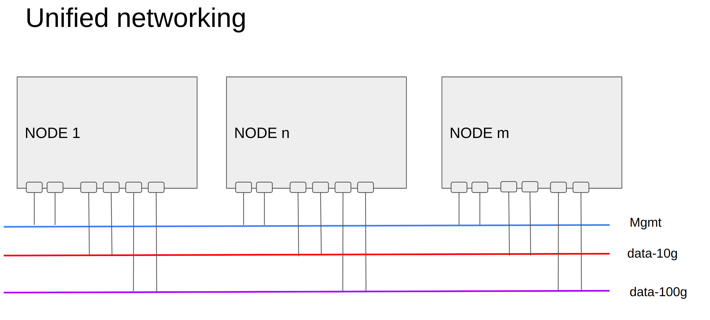
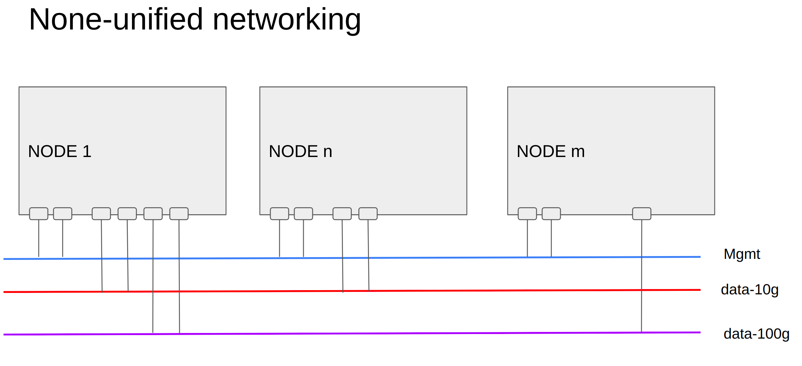
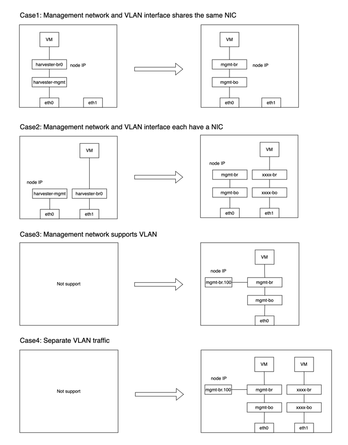
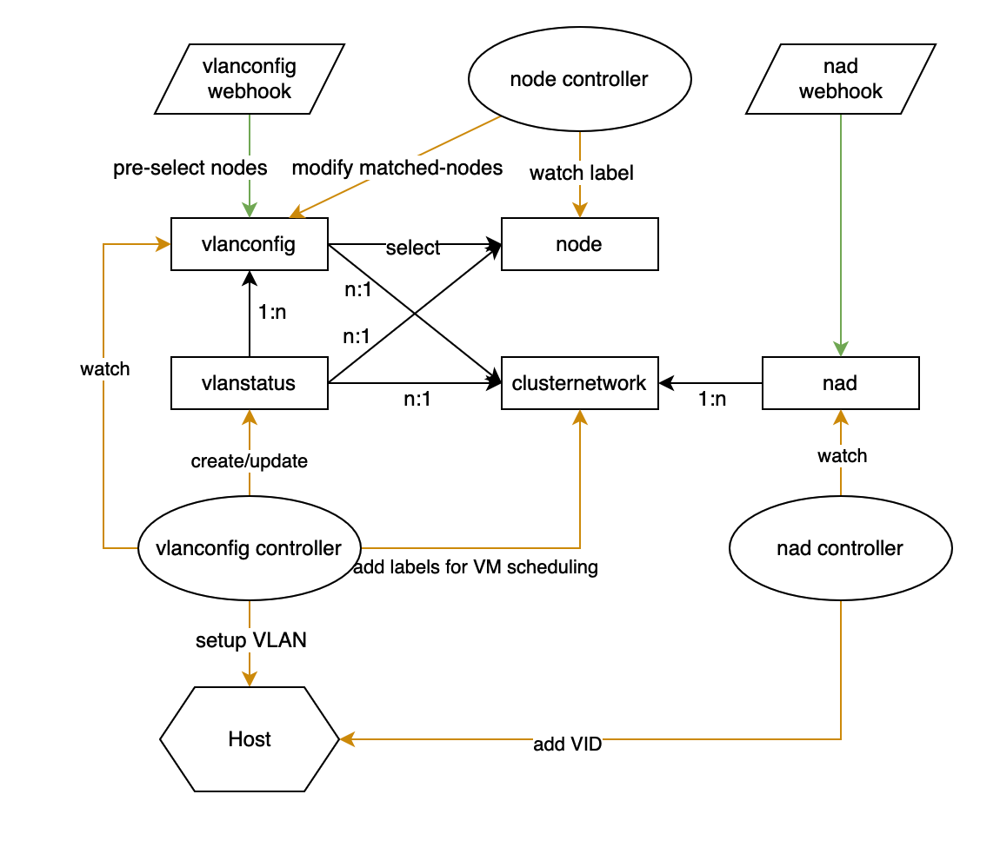
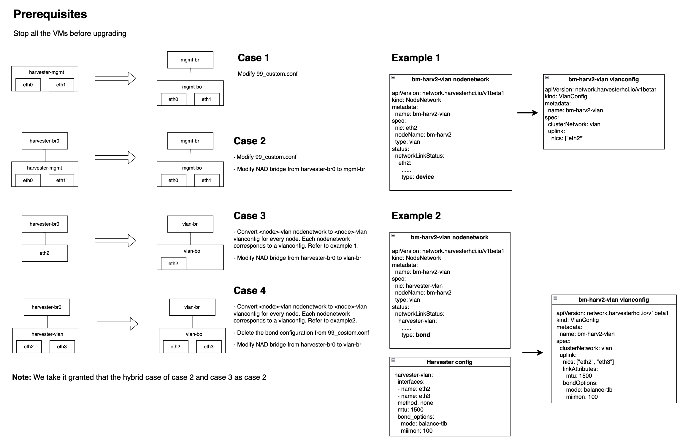

# VLAN Enhancement

## Summary

In real product environment, traffic isolation is usually a MUST requirement for fault tolerance and high availability. As of Harvester v1.0.3, Harvester does't support to seperate the VLAN traffic. Moreover, the Harvester management network also doesn't support passing VLAN tagged packets. We will enhance the Harvester network by adding more bridges to support the VLAN traffic isolation and allows VLAN tagged packets to flow in the management network.

### Related Issues

- https://github.com/harvester/harvester/issues/1390

## Terminology

| Term                        | Short Term               | Description                                                  |
| --------------------------- | ------------------------ | ------------------------------------------------------------ |
| management interface        | mgmt iface               | mgmt intf is the owner of node IP. In the previous version, mgmt iface is `harvester-mgmt`. |
| VLAN Trunk mode             | -                        | The configuration only allows VLAN tagged packets for ingress and egress. |
| VLAN Hybrid mode            | -                        | The configuration that allows VLAN tagged and untagged packets for ingress and egress. Need configuring Native VLAN. |
| VLAN Access mode            | -                        | The configuration only allows untagged packets for ingress and egress. The VLAN-aware switch will need a VLAN ID to be configured also. |
| native VLAN                 | -                        | The configuration for popping the VLAN tag when egress, pushing the VLAN tag when ingress |
| PVID                        | -                        | Same as natvie vlan in Linux bridge.                         |
| VLAN interface              | VLAN iface               | SVI in the VLAN-aware switch. eth0.100 in Linux.             |
| uplink                      | -                        | The network interface is for a Linux bridge to send traffic outside the node. |
| network attached definition | NAD, nad, net-attach-def | Network configuration CRD for Multus CNI                     |

## Motivation

### Goals

- Migrate node IP from `harvester-mgmt` to the new management interface to allow VLAN tagged packets for management traffic.
- Support VLAN traffic isolation. To be exact:
  - Allow multiple Linux bridges to be configured by Harvester.
  - Allow the same name Linux bridge with different uplinks.


### Non-goals [optional]

None

## Proposal

### User Stories

In Harvester, we have the following assumptions:

  * The user provides physical network connectivity and all the physical NICs of each NODE will be attached to networks now or then.
  * Multi networks may exist.
  * The management network is always existing. Each NODE has at least one NIC attached to it.

A detailed explanation of Harvester networking is in [harvester network samples](#harvester-network-samples).

One user plans to install a Harvester cluster, and assumes:

- User prepares 3 networks: mgmt (type VLAN), VLAN ID 100;  data-10g (type VLAN), VLAN ID 1000~2000; data-100g (type VLAN), VLAN ID 3000~4000.
- User has 20 NODEs, each NODE has 6 NICs, eth1, eth2 are in mgmt;  eth3, eth4 are in data-10g;  eth5, eth6 are in data-100g.


The following stories are about the installation and usage of the Harvester Network.


  1. Install cluster via PXE, all ClusterNetworks are ready
  2. Install cluster via PXE, only management ClusterNetwork is ready
  3. Install cluster via ISO UI manually, only management ClusterNetwork is ready
  4. Add unified NODE to cluster
  5. Add none-unified NODE to the cluster
  6. Delete NODE from cluster
  7. Add management VLAN ID to an existing cluster
  8. Change the management network VLAN ID
  9. Delete management VLAN ID
  10. Set the VLAN ID range for ClusterNetwork
  11. Set MTU or other ethernet parameters at the ClusterNetwork level
  12. Add new ClusterNetwork
  13. Delete none-management ClusterNetwork
  14. Allow a new ClusterNetwork uses a management interface
  15. Create NAD with VLAN ID check
  16. Create NAD with ClusterNetwork ready check


#### Story 1
Install cluster via PXE, all ClusterNetworks are ready

```
Installation:
 "create-cluster" NODE:
	  claim 3 cluster networks, say mgmt, data-10g, data-100g, all are VLAN based
	  claim 6 nics are attached to 3 networks
	  claim mgmt VLAN ID, static/dhcp
	  claim VIP static/dhcp
 "join-cluster" NODEs:
	  claim 6 nics are attached to 3 networks
	  claim mgmt VLAN ID, static/dhcp
```

After cluster installation is finished:

```
  VIP, NODE managment IP are reachable
  3 cluster networks are ready, each NODE has it's node-agent, say mgmt-br, br-data-10g, br-data-100g
```

#### Story 2

Install cluster via PXE, only management ClusterNetwork is ready

```
  "create-cluster" NODE:
	  claim 2 nics are attached to mgmt network
  	claim mgmt VLAN ID, static/dhcp
	  claim VIP static/dhcp
  "join-cluster" NODEs:
	  claim 2 nics are attached to mgmt networks
	  claim mgmt VLAN ID, static/dhcp
```

After cluster installation is finished:

```
  VIP, NODE managment IP are reachable
  a default mgmt cluster network is ready, each NODE has it's node-agent, say mgmt-br
```


From Harvester WebUI/CLI, user continues to add more cluster networks:


```
  Create another 2 cluster network: data-10g, data-100g
    set eth3,eth4 as data-10g's uplink;  eth5,eth6 as data-100g's uplink
```

(current: Enabling Default VLAN Network   Settings > vlan, but only 1 instance )

#### Story 3

Install cluster via ISO UI manually, only management ClusterNetwork is ready

```
  "create-cluster" NODE:
	  set 2 nics are attached to mgmt network
  	set mgmt VLAN ID, static/dhcp
	  set VIP static/dhcp
  "join-cluster" NODEs:
	  set 2 nics are attached to mgmt networks
	  set mgmt VLAN ID, static/dhcp
```

After cluster installation is finished:

```
  VIP, NODE managment IP are reachable
  a default mgmt cluster network is ready, each NODE has it's node-agent, say mgmt-br
```


#### Story 4

Add unified NODE to cluster

```
  User plans to add a new NODE, which has similar hardware with existing NODEs
	The readiness of network is similar to previous stories
```


#### Story 5
Add none-unified NODE to the cluster

```
  User plans to add a new NODE, which has only 2 NICs, eth1 to management network, eth2 to data-10g, no NIC to data-100g
	The readiness of network is similar to previous stories; user needs to change PXE config file, or add cluster-network manually.
```

NOTE: There are challenges in this story, especially to the VM scheduling, ClusterNetwork conditions will be involved.

#### Story 6

Delete NODE from cluster

```
  User plans to delete a NODE from cluster
	Follow the current deleting NODE process.
```


#### Story 7

Add management VLAN ID to an existing cluster

```
  When cluster is installed/upgraded, it has no management VLAN ID, then, the user wishes to add the management VLAN ID.
  Due to the fact that NODE IP CAN NOT be changed, this scenario may not be supported.
  But customer may have such requirement...
  Management IP (node IP) is either staticly assigned, or from DHCP, when VLAN ID is added to management network, 
communication between NODEs may have break.
```


#### Story 8

Change the management network VLAN ID

```
  When cluster is running, user wishes to change the management VLAN ID
  Due to the fact that NODE IP CAN NOT be changed, this scenario may not be supported.
  But customer may have such requirement...
```

#### Story 9

Delete management VLAN ID

```
  When cluster is running, user wishes to delete the VLAN ID of the management network.
  Due to the fact that NODE IP CAN NOT be changed, this scenario may not be supported.
  But customer may have such requirement...
```

#### Story 10

Set the VLAN ID range for ClusterNetwork

```
  (Physical) Network administrator configures a range of VLAN ID for a specific Harvester cluster, to avoid mismatching, 
Harvester administrator also wishes to config the related VLAN ID range into ClusterNetwok,
thus, the later NAD configure will not be wrong.
```

#### Story 11

Set MTU or other ethernet parameters at ClusterNetwork level

```
  Each type of cluster network have related parameters. For instance, for L2 VLAN network, user plan to config the MTU.
Set it in each NODE is OK, but if it could be set from ClusterNetwork, it is user friendly.
```


#### Story 12

Add new ClusterNetwork

```
  When cluster is running, user adds a new ClusterNetwork.
  For example, nic3, nic4 are attached to ClusterNetwork data-10g now. User does following operations:
  
  Option A:
  (1) Detach nic4 from data-10g in each node
  (2) Physical Network administrator configure another physical network for nic4
(e.g add a new range of VIDs for the nic4 connected switch ports)
  (3) Create new ClusterNetwork data-10g-2, set default uplink as nic4
  (4) Nic4 in each node is attached to data-10g-2 automatically
  or
  Option B:
  (1) Create new ClusterNetwork data-10g-2, set default uplink as empty
  (2) Detach nic4 from data-10g in each node
  (3) Physical Network administrator configure another physical network for nic4
(e.g add a new range of VIDs for the nic4 connected switch ports)
  (4) Attach nic4 to data-10g-2 in each node manually
```

Note, a ClusterNetwork may have no default uplink, it's ready status should be defined.


#### Story 13

Delete none-management ClusterNetwork

```
  When cluster is running, user deletes a new ClusterNetwork.
  For example, nic3, nic4 are attached to ClusterNetwork data-10g now. nic5, nic6 are attached to ClusterNetwork data-100g.
User does following operations:
  (1) Delete ClusterNetwork data-100g
  When there are NADs connecting to data-100g, the user is required to delete those NADs first.
  When there are NO NADs connecting to data-100g, the ClusterNetwork is allowed to be deleted, after that, 
nic5, nic6 are ready to use for another ClusterNetwork.
```

#### Story 14

Allow a new ClusterNetwork uses a management interface

```
  User creates a new ClusterNetwork, but in some nodes, it has no dedicated uplink,
then user sets the uplink of this ClusterNetwork to be the management interface
```

note: it's argued if the such story is practical, as it cannot isolate and may affect management network


#### Story 15

Create NAD with VLAN ID check

```
  NAD is a cluster level concept.
  NAD is configured to attach to ClusterNetwork with related parameters, e.g. when ClusterNetwork is VLAN network, then VLAN ID needs to be set
  The VLAN ID should be in range for ClusterNetwork's allowed VLAN ID (by default, 1~4094)
```

  (current: A new VLAN network can be created via the Advanced > Networks page and by clicking the Create button.)


#### Story 16

Create NAD with ClusterNetwork ready check

```
  Per sotry 12 'Add new ClusterNetwork', when a new ClusterNetwork is under construction, it is not spread all over the Cluster,
NAD to this ClusterNetwork should be blocked.
	It is also affected by story Story 5 'Add none-unified NODE to cluster'
```

#### Harvester Network Samples

Ideally, each NODE in Harvester has similar networking connections like the following.



But in reality, NODE may have different NICs connecting to different networks, for instance, mixed developing & deployment NODEs, some NODEs have GPU/SRIOV/..., none-unified networking is a challenge.



[back to user stories](#user-stories)

## Design

### Implementation Overview


- Naming rules
    - bridge device: <xxxx>-br
    - bond device: <xxxx>-bo

- In the installer, we will create a Linux bridge named `mgmt-br` by default and attach `mgmt-bo` to it by default. The management interface is `mgmt-br` here.
- In the installer, if users configure VLAN ID for the management interface, we will create another VLAN interface named `mgmt-br.<VLAN ID>` and configure node IP on it.
- The `mgmr-br` is always available and fixed.
- The `mgmt-br` and vlan interface need to inherit first MAC address from physical network interfaces of `mgmt-bo`.
    - The `wicked` need to set a fixed MAC address for the `mgmt-br` and vlan interface.
- Support multiple bridges including `mgmt-br`. One bridge, one uplink. The uplink is always a `bond`.
- Always enable bridge VLAN filtering.
- As a bridge port,the PVID of the uplink is always 1.
- Harvester Network controller don't need to copy IP address and route from the `harvester-mgmt` to bridge anymore
    - In installation statge, we will generate DHCP or Static IP configuration on the  `mgmt-br` or vlan interface.

> **NOTE**: We could consider to migrate all Linux bridges' name to `<xxx>-br`  In original design, The name `harvester-br0` is too long to have a VLAN interface with same naming rule of `eth0.100`.
#### CRDs and Controllers Design

```yaml
# built-in cluster network mgmt
apiVersion: network.harvesterhci.io/v1beta1
kind: ClusterNetwork
metadata:
  name: mgmt
status:
  conditions:
  - lastUpdateTime: "2022-10-25T02:44:54Z"
    status: "True"
    type: ready
---
# custom cluster network demo
apiVersion: network.harvesterhci.io/v1beta1
kind: ClusterNetwork
metadata:
  name: demo
status:
  conditions:
  - lastUpdateTime: "2022-10-26T14:13:04Z"
    status: "True"
    type: ready
```

```yaml
apiVersion: network.harvesterhci.io/v1beta1
kind: VlanConfig
metadata:
  labels:
    network.harvesterhci.io/clusternetwork: demo
  name: demo-vlanconfig
spec:
  clusterNetwork: demo
  uplink:
    bondOptions:
      mode: active-backup
    linkAttributes:
      mtu: 1500
    nics:
    - enp7s2
```

```yaml
apiVersion: network.harvesterhci.io/v1beta1
kind: VlanStatus
metadata:
  labels:
    network.harvesterhci.io/clusternetwork: demo
    network.harvesterhci.io/node: harvester-0
    network.harvesterhci.io/vlanconfig: demo-vlanconfig
  name: demo-harvester-0-8104bb2b
  ownerReferences:
  - apiVersion: network.harvesterhci.io/v1beta1
    kind: VlanConfig
    name: demo
    uid: a162a4f7-90a3-4766-a06d-ad64240fdebd
status:
  clusterNetwork: demo
  conditions:
  - lastUpdateTime: "2022-10-26T14:13:05Z"
    status: "True"
    type: ready
  linkMonitor: demo
  localAreas:
  - vlanID: 100
  - vlanID: 200
  node: harvester-0
  vlanConfig: demo
```



##### User Experience

- Mgmt is a built-in cluster network and does not support any additional vlanconfigs.
- Users are allowed to add a custom cluster network and add vlanconfigs under it.
- Users should select cluster network when creating a network.

#### Proof of Concept

The following commands are executed by root account or `sudo`.

##### Pre-test script

00_cleanup.sh
```bash
#!/bin/bash
ip link del mgmt-br
ip link del mgmt-bo
ip link del br1
ip link del veth-in
ip link del veth-out
ip link del veth-x
ip link del veth-y
```

01_basic.sh
```bash
#!/bin/bash
# avoid DHCP client conflict
systemctl stop wicked
systemctl disable wicked
# need to set fixed mac address otherwise bridge will generate MAC address randomly.
ip link add mgmt-br address 00:11:22:33:44:55 type bridge vlan_filtering 1
ip link add mgmt-bo type bond mode balance-tlb
ip link set mgmt-bo master mgmt-br
ip link set eth0 down
ip link set eth0 master mgmt-bo
ip link set eth0 up
ip link set mgmt-bo up
ip link set mgmt-br up
# inherit from mgmt-br directly.
ip link add link mgmt-br name mgmt-br.101 type vlan id 101
ip link set mgmt-br.101 up
bridge vlan add vid 2-4094 dev mgmt-br self
bridge vlan add vid 2-4094 dev mgmt-bo
bridge -c vlan show
# check everything is correct
# check MAC address
ip link show dev eth0
ip link show dev mgmt-bo
ip link show dev mgmt-br
ip link show dev mgmt-br.101
```

##### Test script

1. Static IP

10_static_ip.sh
```bash
#!/bin/bash
./00_cleanup.sh
./01_basic.sh
# no connection
ping 172.30.0.1 -c 4
ip addr add 172.30.0.123/24 dev mgmt-br.101
ip route add default via 172.30.0.1
ping 172.30.0.1 -c 4
```

2. DHCP

11_dhcp_ip.sh
```bash
#!/bin/bash
./00_cleanup.sh
./01_basic.sh
# no connection
ping 172.30.0.1 -c 4
dhclient -v mgmt-br.101
ping 172.30.0.1 -c 4
# clean up
dhclient -r mgmt-br.101
```

3. DHCP for VIP

12_dhcp_vip.sh
```bash
#!/bin/bash
./00_cleanup.sh
./01_basic.sh
# no connection
ping 172.30.0.1 -c 4
ip link add link mgmt-br.101 name vip address 00:22:22:22:22:22 type macvlan mode bridge
ip link set vip up
dhclient -v vip
ping 172.30.0.1 -c 4
# clean up
dhclient -r vip
```

4. Use `harvester-mgmt` as VLAN network uplink

20_use_mgmt_br1.sh
```bash
#!/bin/bash
./00_cleanup.sh
./01_basic.sh
# no connection
ping 172.30.0.1 -c 4
ip link add br1 type bridge vlan_filtering 1
ip link add veth-x type veth peer name veth-y
ip link set veth-x master mgmt-br
ip link set veth-y master br1
bridge vlan add vid 2-4094 dev veth-x
bridge vlan add vid 2-4094 dev veth-y
bridge -c vlan show
ip link set br1 up
ip link set veth-x up
ip link set veth-y up
# VM veth
ip link add veth-in type veth peer name veth-out
ip link set veth-out master br1
bridge vlan add vid 101 dev veth-out pvid untagged master
ip link set veth-in up
ip link set veth-out up
dhclient -v veth-in
ping 172.30.0.1 -c 4
# clean up
dhclient -r veth-in
```

5. Use other physical interface for VLAN network uplink

```bash
# need same setup in Basic section
ip link add br2 type bridge vlan_filtering 1
ip link add bond-br2 type bond mode balance-tlb
ip link set eth2 master bond-br2
ip link set bond-br2 master br2
bridge vlan add vid 2-4094 dev bond-br2
bridge -c vlan show
ip link set eth2 up
ip link set bond-br2 up
ip link set br2 up
# create VM veth
ip link add veth-in type veth peer name veth-out
ip link set veth-out master br2
bridge vlan add vid 101 dev veth-out pvid untagged master
```

##### Wicked ifcfg (without VLAN)

/etc/wicked/script/setup_bridge.sh
```
#!/bin/sh
ACTION=$1
INTERFACE=$2
case $ACTION in
    pre-up)
        ip link set $INTERFACE type bridge vlan_filtering 1
        bridge vlan add vid 2-4094 dev $INTERFACE self
        bridge vlan add vid 2-4094 dev mgmt-bo
        ;;
esac
```

/etc/sysconfig/network/ifcfg-mgmt-br
```
STARTMODE='onboot'
BOOTPROTO='dhcp'
BRIDGE='yes'
BRIDGE_STP='off'
BRIDGE_FORWARDDELAY='0'
BRIDGE_PORTS='mgmt-bo'
PRE_UP_SCRIPT="wicked:setup_bridge.sh"
LLADDR=<FIRST ETHERNET MAC>
```

/etc/sysconfig/network/ifcfg-mgmt-bo
```
STARTMODE='onboot'
BOOTPROTO='none'
BONDING_MASTER='yes'
BONDING_SLAVE_0='eth0'
BONDING_MODULE_OPTS='mode=balance-tlb miimon=100'
LLADDR=<FIRST ETHERNET MAC>
```

##### Wicked ifcfg (with VLAN)

/etc/wicked/script/setup_bridge.sh
```
#!/bin/sh
ACTION=$1
INTERFACE=$2
case $ACTION in
    pre-up)
        ip link set $INTERFACE type bridge vlan_filtering 1
        bridge vlan add vid 2-4094 dev $INTERFACE self
        bridge vlan add vid 2-4094 dev mgmt-bo
        ;;
esac
```

/etc/sysconfig/network/ifcfg-mgmt-br
```
STARTMODE='onboot'
BOOTPROTO='none'
BRIDGE='yes'
BRIDGE_STP='off'
BRIDGE_FORWARDDELAY='0'
BRIDGE_PORTS='mgmt-bo'
PRE_UP_SCRIPT="wicked:setup_bridge.sh"
LLADDR=<FIRST ETHERNET MAC>
```

/etc/sysconfig/network/ifcfg-mgmt-bo
```
STARTMODE='onboot'
BOOTPROTO='none'
BONDING_MASTER='yes'
BONDING_SLAVE_0='eth0'
BONDING_MODULE_OPTS='mode=balance-tlb miimon=100'
LLADDR=<FIRST ETHERNET MAC>
```

/etc/sysconfig/network/ifcfg-mgmt-br.<VLAN_ID>
```
STARTMODE='onboot'
ETHERDEVICE='mgmt-br'
VLAN_PROTOCOL='ieee802-1Q'
VLAN_ID=<VLAN_ID>
BOOTPROTO='dhcp'
```

#### Upgrade

- Require to stop all the VMs before upgrading.

- Classify 4 upgrading scenarios. The following diagram shows the details.


