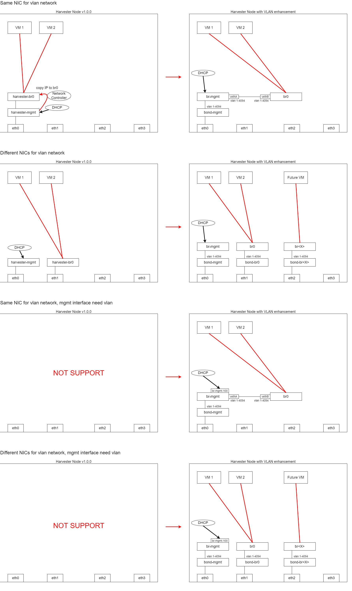

# VLAN Enhancement

## Summary

IT usually configures the switch with VLAN trunk mode rather than VLAN access mode or hybrid mode in a production environment. Therefore, we should add VLAN support for `harvester-mgmt` and allow multiple Linux bridges in Harvester node configuration.

### Related Issues

- https://github.com/harvester/harvester/issues/1390

## Terminology

| Term | Short Term | Description |
| --- | --- | --- |
| management interface | mgmt intf | mgmt intf is the owner of node IP. In previous version, mgmt intf is `harvester-mgmt`.|
| VLAN Trunk mode | - | The configuration that only allow VLAN tagged packet for ingress and egress. |
| VLAN Hybrid mode | - | The configuration that allow VLAN tagged and untagged packet for ingress and egress. Need configured Native VLAN. |
| VLAN Access mode | - | The configuration that only allow untagged packet for ingress and egress. In VLAN-aware switch, it will need a VLAN ID to be configured also. |
| native vlan | - | The configuration for popping vlan tag when egress, pushing vlan tag when ingress |
| PVID | - | Same as natvie vlan in Linux bridge. |
| VLAN interface | vlan intf | SVI in vlan-aware switch. eth0.100 in Linux. |
| uplink | - | The network interface is for Linux bridge to send traffic to outside the node. |
| network attached definition | NAD, nad, net-attach-def | Network configuration CRD for Multus CNI |

## Motivation

### Goals

- Migrate node IP from `harvester-mgmt` to the new management interface to allow VLAN tagged packet for management traffic.
- Allow multiple Linux bridges to be configured by Harvester
- Allow the same name Linux bridge with different uplinks

### Non-goals [optional]

What is out of scope for this enhancement? Listing non-goals helps to focus discussion and make progress.

TODO

## Proposal

### User Stories

#### Switch configuration needs VLAN hybrid mode always for data center

Before this enhancement, users have to configure the VLAN-aware switch with VLAN hybrid mode for the ports because the management interface will only work in untagged mode.

After this enhancement, users can setup VLAN ID for the management interface.

### User Experience In Detail

#### Installer UI

We will have another option for adding VLAN ID to the management interface.

#### Harvester config

In Harvester config, we will create more network devices to implement this enhancement, so users need to add those interfaces on their own.

> **NOTE**: Maybe we could change the network section of Harvester config to have an abstract layer above `wicked`.

#### Web UI

In Web UI, we will need an advanced network configuration page to configure additional custom Linux bridges to serve VM VLAN networks.


### API changes

## Design

### Implementation Overview

- In the installer, we will create a Linux bridge named `br-mgmt` by default and attach `bond-br-mgmt` to it by default. The management interface is `br-mgmt` here.
- In the installer, if users configure VLAN ID for the management interface, we will create another VLAN interface named `br-mgmt.<VLAN ID>` and configure node IP on it.
- `br-mgmt` is always available and fixed.
- Network attached definition can't attach to `br-mgmt`.
- Harvester Network Controller will create a veth pair to connect `br-mgmt` and user defined `br<X>` for uplink if users want to use same interface of `bond-br-mgmt` or management interface to provide VM VLAN networks.
- `br-mgmt` and vlan interface need to inherit first MAC address from physical network interfaces of `bond-br-mgmt`.
    - `wicked` need to set a fixed MAC address for `br-mgmt` and vlan interface.
- The uplink of `br0` and `br<X>` is always a `bond`.
- VLAN filtering in `br0` and `br<X>` is always enable.
    - PVID is always 1.
    - Always use VLAN 1 as untagged network.
- Harvester Network controller don't need to copy IP address and route from `harvester-mgmt` to bridge anymore
    - In installation statge, we will generate DHCP or Static IP configuration on `br-mgmt` or vlan interface.

> **NOTE**: We could consider to migrate all Linux bridges' name to `br<X>` where `<X>` is a decimal number. In original design, The name `harvester-br0` is too long to have a VLAN interface with same naming rule of `eth0.100`.

#### Architecture figures



#### CRD roles

- ClusterNetwork (or different name)
    - global
    - store bridge name
    - store default uplink interfaces
    - once ClusterNetwork create a Linux bridge, all nodes need to setup NodeNetwork to have uplink info.
        - by default, once ClusterNetwork is created, we could create NodeNetwork for every nodes with management interface directly until users change NodeNetwork configuration
- NodeNetwork (or different name)
    - local
    - store uplink interface name and be associated to a bridge name
    - store bond-brX options
- network attached definition
    - be associated to a bridge name

> **NOTE**: Need to consider about one ClusterNetwork for all Linux bridges or one resource with one bridge only

#### CRD design

```
Kind: Bridge
metadata:
  name: br<X>
spec:
  default_uplink: <template_name>
```

```
Kind: NodeBridge
metadata:
  name: <node-name>-br<X>
status:
  attach bridge success or failed msg // BridgeUplink Controller provide status
```

```
Kind: BridgeUplink
metadata:
  name: <node-name>-br<X>
spec:
  use_mgmt_port: true or false
  uplinks:
    - eth0
    - eth1
  bond_options:
    mode: balance_tlb
    miimon: 100
    updelay: 0
    downdelay: 0
    xmit_hash_policy: layer3+4
    ...
```

```
Kind: BridgeUplinkTemplate
metadata:
  name: <template-name>
spec:
  use_mgmt_port: true or false
  uplinks:
    - eth0
    - eth1
  bond_options:
    mode: balance_tlb
    miimon: 100
    updelay: 0
    downdelay: 0
    xmit_hash_policy: layer3+4
    ...
```

##### Controller

- Bridge Controller:

1. needs to add/remove bridge to all nodes.
2. needs to add/remove BridgeStatus to all nodes.

- BridgeUplink Controller:

1. create/remove bond-brX and attach/detach physical interface to this bond
2. set/unset bond-brX's master as brX
3. copy default uplink settings to node level BridgeUplink CR
4. update status to BridgeUplink and BridgeStatus

##### User Experience

1. Create Bridge on their own before BridgeUplink
2. Create BridgeUplink for each nodes on their own
3. Create BridgeUplink for new nodes on their own

#### Proof of Concept

The following commands are executed by root account or `sudo`.

##### Pre-test script

00_cleanup.sh
```bash
#!/bin/bash

ip link del br-mgmt
ip link del bond-br-mgmt
ip link del br1
ip link del veth-in
ip link del veth-out
ip link del veth-x
ip link del veth-y
```

01_basic.sh
```bash
#!/bin/bash

# avoid DHCP client conflict
systemctl stop wicked
systemctl disable wicked

# need to set fixed mac address otherwise bridge will generate MAC address randomly.
ip link add br-mgmt address 00:11:22:33:44:55 type bridge vlan_filtering 1
ip link add bond-br-mgmt type bond mode balance-tlb
ip link set bond-br-mgmt master br-mgmt

ip link set eth0 down
ip link set eth0 master bond-br-mgmt

ip link set eth0 up
ip link set bond-br-mgmt up
ip link set br-mgmt up

# inherit from br-mgmt directly.
ip link add link br-mgmt name br-mgmt.101 type vlan id 101
ip link set br-mgmt.101 up

bridge vlan add vid 2-4094 dev br-mgmt self
bridge vlan add vid 2-4094 dev bond-br-mgmt
bridge -c vlan show

# check everything is correct
# check MAC address
ip link show dev eth0
ip link show dev bond-br-mgmt
ip link show dev br-mgmt
ip link show dev br-mgmt.101
```

##### Test script

1. Static IP

10_static_ip.sh
```bash
#!/bin/bash

./00_cleanup.sh
./01_basic.sh

# no connection
ping 172.30.0.1 -c 4

ip addr add 172.30.0.123/24 dev br-mgmt.101
ip route add default via 172.30.0.1

ping 172.30.0.1 -c 4
```

2. DHCP

11_dhcp_ip.sh
```bash
#!/bin/bash

./00_cleanup.sh
./01_basic.sh

# no connection
ping 172.30.0.1 -c 4

dhclient -v br-mgmt.101

ping 172.30.0.1 -c 4

# clean up
dhclient -r br-mgmt.101
```

3. DHCP for VIP

12_dhcp_vip.sh
```bash
#!/bin/bash

./00_cleanup.sh
./01_basic.sh

# no connection
ping 172.30.0.1 -c 4

ip link add link br-mgmt.101 name vip address 00:22:22:22:22:22 type macvlan mode bridge
ip link set vip up
dhclient -v vip

ping 172.30.0.1 -c 4

# clean up
dhclient -r vip
```

4. Use `harvester-mgmt` as VLAN network uplink

20_use_mgmt_br1.sh
```bash
#!/bin/bash

./00_cleanup.sh
./01_basic.sh

# no connection
ping 172.30.0.1 -c 4

ip link add br1 type bridge vlan_filtering 1
ip link add veth-x type veth peer name veth-y
ip link set veth-x master br-mgmt
ip link set veth-y master br1

bridge vlan add vid 2-4094 dev veth-x
bridge vlan add vid 2-4094 dev veth-y
bridge -c vlan show

ip link set br1 up
ip link set veth-x up
ip link set veth-y up

# VM veth
ip link add veth-in type veth peer name veth-out
ip link set veth-out master br1
bridge vlan add vid 101 dev veth-out pvid untagged master

ip link set veth-in up
ip link set veth-out up

dhclient -v veth-in

ping 172.30.0.1 -c 4

# clean up
dhclient -r veth-in
```

5. Use other physical interface for VLAN network uplink

```bash
# need same setup in Basic section

ip link add br2 type bridge vlan_filtering 1
ip link add bond-br2 type bond mode balance-tlb
ip link set eth2 master bond-br2
ip link set bond-br2 master br2

bridge vlan add vid 2-4094 dev bond-br2
bridge -c vlan show

ip link set eth2 up
ip link set bond-br2 up
ip link set br2 up

# create VM veth
ip link add veth-in type veth peer name veth-out
ip link set veth-out master br2
bridge vlan add vid 101 dev veth-out pvid untagged master
```

##### Wicked ifcfg (without VLAN)

/etc/wicked/script/setup_bridge.sh
```
#!/bin/sh

ACTION=$1
INTERFACE=$2

case $ACTION in
    pre-up)
        ip link set $INTERFACE type bridge vlan_filtering 1
        bridge vlan add vid 2-4094 dev $INTERFACE self
        bridge vlan add vid 2-4094 dev bond-br-mgmt
        ;;
esac
```

/etc/sysconfig/network/ifcfg-br-mgmt
```
STARTMODE='onboot'
BOOTPROTO='dhcp'
BRIDGE='yes'
BRIDGE_STP='off'
BRIDGE_FORWARDDELAY='0'
BRIDGE_PORTS='bond-br-mgmt'
PRE_UP_SCRIPT="wicked:setup_bridge.sh"
LLADDR=<FIRST ETHERNET MAC>
```

/etc/sysconfig/network/ifcfg-bond-br-mgmt
```
STARTMODE='onboot'
BOOTPROTO='none'
BONDING_MASTER='yes'
BONDING_SLAVE_0='eth0'
BONDING_MODULE_OPTS='mode=balance-tlb miimon=100'
LLADDR=<FIRST ETHERNET MAC>
```

##### Wicked ifcfg (with VLAN)

/etc/wicked/script/setup_bridge.sh
```
#!/bin/sh

ACTION=$1
INTERFACE=$2

case $ACTION in
    pre-up)
        ip link set $INTERFACE type bridge vlan_filtering 1
        bridge vlan add vid 2-4094 dev $INTERFACE self
        bridge vlan add vid 2-4094 dev bond-br-mgmt
        ;;
esac
```

/etc/sysconfig/network/ifcfg-br-mgmt
```
STARTMODE='onboot'
BOOTPROTO='none'
BRIDGE='yes'
BRIDGE_STP='off'
BRIDGE_FORWARDDELAY='0'
BRIDGE_PORTS='bond-br-mgmt'
PRE_UP_SCRIPT="wicked:setup_bridge.sh"
LLADDR=<FIRST ETHERNET MAC>
```

/etc/sysconfig/network/ifcfg-bond-br-mgmt
```
STARTMODE='onboot'
BOOTPROTO='none'
BONDING_MASTER='yes'
BONDING_SLAVE_0='eth0'
BONDING_MODULE_OPTS='mode=balance-tlb miimon=100'
LLADDR=<FIRST ETHERNET MAC>
```

/etc/sysconfig/network/ifcfg-br-mgmt.<VLAN_ID>
```
STARTMODE='onboot'
ETHERDEVICE='br-mgmt'
VLAN_PROTOCOL='ieee802-1Q'
VLAN_ID=<VLAN_ID>

BOOTPROTO='dhcp'
```

#### Upgrade

> **TODO**: Huge migratation script need.

### Test plan

Integration test plan.

### Upgrade strategy

Anything that requires if user want to upgrade to this enhancement

## Note [optional]

Additional nodes.
