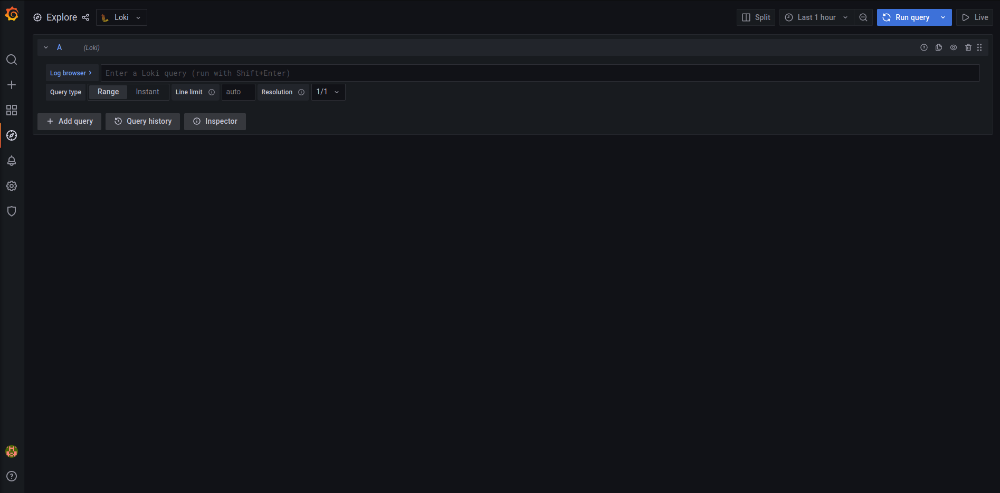
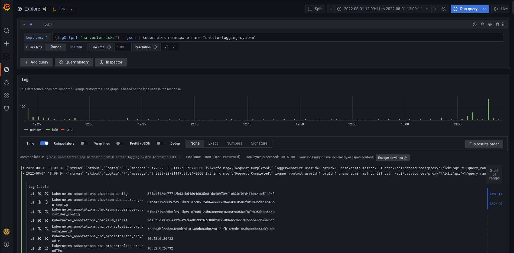
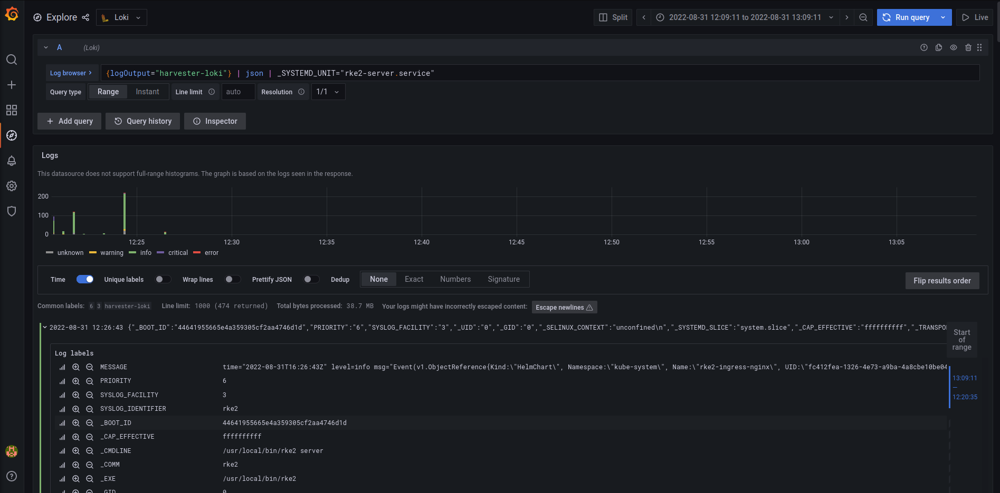

# System Logging

## Summary

We need to be able to support exporting harvester system logs outside the cluster, to allow for collecting and analyzing those logs to aid in debugging and harvester management.

### Related Issues

- https://github.com/harvester/harvester/issues/577
- https://github.com/harvester/harvester/issues/2644
- https://github.com/harvester/harvester/issues/2645
- https://github.com/harvester/harvester/issues/2646
- https://github.com/harvester/harvester/issues/2647

## Motivation

### Goals

List the specific goals of the enhancement. How will we know that this has succeeded?

- [X] The user can aggregate harvester logs in a centralized location
  - [X] k8s cluster logs
  - [X] host system logs (ie `/var/log`)
- [X] The user can export the aggregated harvester logs outside the cluster (ex rancher)

### Non-goals

- this enhancement does not cover integration into the harvester / rancher UI (but ideally this will eventually be implemented as well)

## Proposal

We will deploy a new `ManagedChart` in the [Harvester Installer](https://github.com/harvester/harvester-installer) to
install. The `ManagedChart` will deploy a `ClusterFlow` to select and aggregate interesting logs, which can be managed
by a new `ClusterOutput` crd.

To collect the host system logs, a new harvester sub-chart [harvester-journal](https://github.com/joshmeranda/harvester-charts/tree/logging/charts/harvester-journal).

### User Stories

#### Easily View Harvester Logs

Currently, users need to manually check harvester for failing pods or services and manually check logs using `kubectl`.

This enhancement will allow users to send their logs using any of the [output plugins](https://banzaicloud.com/docs/one-eye/logging-operator/configuration/plugins/outputs/),
and be able to look at and filter the logs of the entire cluster without being limited to 1 pod container at a time.

#### Configure New Logging Outputs

Users will be able to write and apply their own custom `ClusterOutput`s and `ClusterFlow`s to send logs to the desired 
location. For example, to [send logs to graylog](https://banzaicloud.com/docs/one-eye/logging-operator/configuration/plugins/outputs/), 
you can use the following yamls:

```yaml
# graylog-cluster-flow.yaml
apiVersion: logging.banzaicloud.io/v1beta1
kind: ClusterFlow
metadata:
  name: "all-logs-gelf-hs"
  namespace: "cattle-logging-system"
spec:
  globalOutputRefs:
    - "example-gelf-hs"
```

```yaml
# graylog-cluster-output.yaml
apiVersion: logging.banzaicloud.io/v1beta1
kind: ClusterOutput
metadata:
  name: "example-gelf-hs"
  namespace: "cattle-logging-system"
spec:
  gelf:
    host: "192.168.122.159"
    port: 12202
    protocol: "udp"
```

You can verify that they are installed successfully, you can check them with `kubectl`:

```bash
>>> kubectl get clusteroutputs -n cattle-logging-systems example-gelf-hs
NAME              ACTIVE  PROBLEMS
example-gelf-hs   true
>>> kubectl get clusterflows -n cattle-logging-systems example-gelf-hs
NAME                ACTIVE  PROBLEMS
all-logs-gelf-hs    true
```

#### Viewing Logs Via Grafana Loki

##### Accessing
By default, harvester routes logs to its internal Grafana Loki deployment. To view the Loki UI, you can go to port
forward to the `loki-stack-grafana` service. For example map `localhost:3000` to `loki-stack-grafana`s port 80:

```bash
kubectl port-forward --namespace cattle-logging-system service/loki-stack-grafana 3000:80
```

##### Authentication

The default username is admin. To get the password for the admin user run the following command:

```bash
kubectl get secret --namespace cattle-logging-system loki-stack-grafana --output jsonpath="{.data.admin-password}" | base64 --decode
```

##### Log Querying

Once the UI is open on the left tab you can select the "Explore" tab to take you to a page where you manually send
queries to loki:



In the search bar you can enter queries to select the logs you are interested in. The query language is described in the
[grafana loki docs](https://grafana.com/docs/loki/latest/logql/log_queries/). For example, to select all logs in the
`cattle-logging-system`:



Or to select harvester host machine logs from the `rke2-server.service` service:



### User Experience In Detail

### API changes

None.

## Design

### Implementation Overview

- Install a `harvester-logging` managed chart defining a `ClusterFlow` and `ClusterOutput`
  - By default we send logs to loki
- Add a new sub chart to the harvester

### Test plan

1. Install harvester with the implemented charts and CRDs
2. Verify logs are being routed to the configured ClusterOutput
3. Change log output settings
4. Verify logs are routed to the newly configured ClusterOutput

### Upgrade strategy

No user intervention is required during the upgrade.
