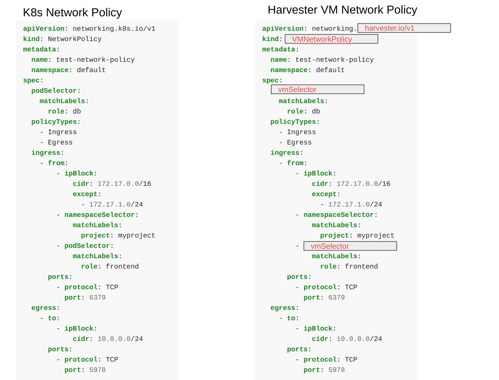

# Title

Network Policy HEP

## Summary

The enhanced Harvester network policy.

### Related Issues

https://github.com/harvester/harvester/issues/2260

## Terminology

For clarity, this HEP defines and lists the following terms:

`Host Harvester Cluster`: A Harvester cluster which provisions VM, connects to the provider network.

`Guest Kubernetes Cluster`: A Kubernetes cluster that is deployed in VMs provisioned by Host Harvester Cluster.

`VM Group`: A group of VM provisioned by Host Harvester Cluster, those VMs can communicate with each other by default. Different VM Groups are isolated by default. Guest Kubernetes Cluster is also kind of VM Group.

`Tenant/Project`: A Tenant/Project is using a VM Group, some advanced features like L3 VxLAN Gateway, NAT may also be included.

`Management Network` / `Default Network`: The default network used by kubernetes management. Both `Host Harvester Cluster` and `Guest Kubernetes Cluster` have such a network.

`Second Network` / `Additional Network`: A dedicated network in `Host Harvester Cluster`, it is provisioned to `Guest Kubernetes Cluster` / `VM Group`. There may be multi `Second Network` in  `Host Harvester Cluster`.

`Service`: A Kubernetes Service that identifies a set of Pods using label selectors. Unless mentioned otherwise, Services are assumed to have virtual IPs only routable within the cluster network.

## Motivation

.

### Goals

  Support network policies for micro-segmentation of workloads [FEATURE] Support network policies for micro-segmentation of workloads https://github.com/harvester/harvester/issues/2260

```
This requirement is related to Harvester provisioned VM
Example:
Given two VMs attached to same VLAN
  User can restrict communication between VM1 and VM2
  User can restrict communication between VM1 and external hosts
  based on native Kubernetes Network Policy framework

It is from customers.
  They are migrating from Openstack where they can define security policies for VM workloads.
  They are deploying applications in those VMs and want to manage network access policies for the VMs/apps
```


### Non-goals [optional]

.

## Proposal
.

### User Stories


#### Story 1

Network policy/Security group/... (a proper name is needed)

##### Network policy in `Guest Kubernetes Cluster`

Per kubernetes document, it is done by `Guest Kubernetes Cluster`, out of scope of this HEP.

https://kubernetes.io/docs/concepts/services-networking/network-policies/

note, cite from previous link:
```
(Kubernetes) NetworkPolicies are an application-centric construct which allow you to specify how a pod is allowed to communicate with various network "entities"
 (we use the word "entity" here to avoid overloading the more common terms such as "endpoints" and "services",
 which have specific Kubernetes connotations) over the network.
 NetworkPolicies apply to a connection with a pod on one or both ends, and are not relevant to other connections.


The entities that a Pod can communicate with are identified through a combination of the following 3 identifiers:

  Other pods that are allowed (exception: a pod cannot block access to itself)
  Namespaces that are allowed
  IP blocks (exception: traffic to and from the node where a Pod is running is always allowed, regardless of the IP address of the Pod or the node)

When defining a pod- or namespace- based NetworkPolicy, you use a selector to specify what traffic is allowed to and from the Pod(s) that match the selector.

Meanwhile, when IP based NetworkPolicies are created, we define policies based on IP blocks (CIDR ranges).

```

###### The two sorts of Pod isolation

```
There are two sorts of isolation for a pod: isolation for egress, and isolation for ingress. They concern what connections may be established.
"Isolation" here is not absolute, rather it means "some restrictions apply".
The alternative, "non-isolated for $direction", means that no restrictions apply in the stated direction.
The two sorts of isolation (or not) are declared independently, and are both relevant for a connection from one pod to another.

By default, a pod is non-isolated for egress.

By default, a pod is non-isolated for ingress.

Network policies do not conflict; they are additive.
```

###### A sample of network policy


##### Network policy in `Host Kubernetes Cluster`

General speaking, the main task of `Host Kubernetes Cluster` is to provision VM for `Guest Kubernetes Cluster`/`VM Group`. We will try to define kind of concept to control `VM Group` with `VM Group`.


###### Harvester VM Network Policy based on Kubernetes Network Policy framework

Map previous sample into `Harvester VM Network Policy`.




Definition


#### Story 2

##### 

### User Experience In Detail

.


### API changes

## Design

### Implementation Overview

.


### Test plan

Integration test plan.

### Upgrade strategy

Anything that requires if user want to upgrade to this enhancement

## Note [optional]


## reference

.


