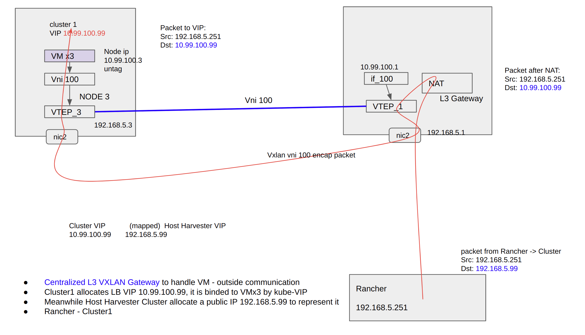

# Title

VXLAN HEP

## Summary

The enhanced Harvester network will support VxLAN.

### Related Issues

https://github.com/harvester/harvester/issues/2322

https://github.com/harvester/harvester/issues/2260

https://github.com/harvester/harvester/issues/2343

## Terminology

For clarity, this HEP defines and lists the following terms:

`Host Harvester Cluster`: A Harvester cluster which provisions VM, connects to the provider network.

`Guest Kubernetes Cluster`: A Kubernetes cluster that is deployed in VMs provisioned by Host Harvester Cluster.

`VM Group`: A group of VM provisioned by Host Harvester Cluster, those VMs can communicate with each other by default. Different VM Groups are isolated by default. Guest Kubernetes Cluster is also kind of VM Group.

`Tenant/Project`: A Tenanat/Project is using a VM Group, some advanced features like L3 VXLAN Gateway, NAT may also be included.

`Service`: A Kubernetes Service that identifies a set of Pods using label selectors. Unless mentioned otherwise, Services are assumed to have virtual IPs only routable within the cluster network.

`VXLAN`:    Virtual eXtensible Local Area Network

`VTEP`:    VXLAN Tunnel End Point.  An entity that originates and/or terminates VXLAN tunnels source interface

`VN`:   Virtual Network

`VNI`:  VXLAN Network Identifier, an VNI represents an `VN`

`L2 VNI (L2 overlay)`: emulate a LAN segment, single subnet mobility

`L3 VNI (L3 overlay)`: abstract IP based connectivity, full mobility regardless of subnets

`BUM`: broadcast, unknown unicast, multicast

`VXLAN Gateway`: an entity that forwards traffic between VXLANs

`Layer 2 VXLAN gateway`: connects terminals to a VxLan network and enables intra-subnet communication on the same VXLAN network.

`Layer 3 VXLAN gateway`: enables inter-subnet communication on a VXLAN network and external network access.

`NVE`: Network Virtualization Edge, Host Harvester Cluster may have multi VXLAN network, each VXLAN has related NVE in each node.

`FDB`: Forwarding Database

## Motivation

With the enhancement of Harvester VLAN network, user can deploy up to 4K isolated `VM group` in one `Host Harvester Cluster`.


 Meanwhile, it means that the physical network needs to prepare up to 4K VLAN for `Host Harvester Cluster`. This is a challenge for massive deployment of `Guest Kubernetes Cluster` .

 When user plans to deploy more than 4K isolated guest clusters, it is not possible now.

 Harvester will try to eliminate those restrictions in this enhancement.


### Goals

Add VXLAN network with adding the following advanced features:

  (3) Support up to 16M isolated `VM Group` in one `Host Harvester Cluster`, VM in different group can not communicate with each other direclty.

  (3) Support VM live migration and persistent IP address, VM can freely migrate/move in the cluster without change of IP address. 

  (3) Eliminate the requirements of VLAN in physical network, as few as one VLAN id . 

  (3) Support automatically establishing of VXLAN tunnel, all NODEs in a dedicated VLAN physical network, should be able to build full mesh VXLAN tunnel connection.

  (1) Support pure L3 IP network in physical network ? (is not supported yet, in future, it is possible)

  (3) Support VM communicate with VM in same host NODE, in different host NODE

  (3) Support VM communicate with outside (e.g. internet)

  TBD: Support network policies for micro-segmentation of workloads [FEATURE] Support network policies for micro-segmentation of workloads #2260 .

  (2) Support multiple VXLANs with separated physical NICs.

  (3) Integrate with kube-vip to provide load balancer service for VMs based on vxlan network.


NOTE: (3) is priority, bigger one is more important.

[quck view of VXLAN user operation](#an-example-of-vxlan-user-operation)

### Non-goals [optional]

.

## Proposal
.

### User Stories

.

#### Story 1

VXLAN tunnel establishment


For VXLAN network, it is trivial to add/remove peers in each node manually, even with kind of centralized registry, the HA will still be a challenge.

But at the view of Harvester, those drawbacks are not here, each NODE has all the required information to establish VXLAN tunnels.

#### Story 2

Adding Virtual Network 


User defines (cluster level) VN and the related CIDR, then the VNI, VXLAN tunnel are created automatically.

#### Story 3

Adding VM Group into a Virtual Network


Again, Harvester Host Cluster has knowledge of all the existing VMs, it can convert them into related FDB, the VTEP can skip the dynamic MAC learning.

#### Story 4

VM-VM communication inside a VM Group

Follow previous story, when all VM's info are added to MAC table in each node, the communication is ready.

MAC learning
 VTEP MAC dynamic learning ( of VM )
 VTEP MAC static set ( default value)

BUM packet processing

 ingress replication ( default value)
 multicast replication (some physical network may not support multicast)
 centralized replication

#### Story 5

VM migration


When an VM is migrated/moved to another NODE, `Host Harvester Cluster` updates its info in VXLAN FDB and/or related Gateway/NAT/...

VM does not need send gratuitous ARP of its (NODE) IP/MAC. VIP is discussed in [VIP](#vip-floating-in-vxlan)

#### Story 6

VM-VM communication in different Guest Kubernetes Cluster/ VM Group (different VNI)

General speaking, different Guest Kubernetes Cluster / VM Group does not communicate with each directly. But that's still possible. In such case, a L3 VXLAN Gateway is needed.

##### Centralized Gateway


Centralized VXLAN gateway deployment has the following advantages and disadvantages:

Advantage:
  
  Inter-subnet traffic can be centrally managed.
  
  Gateway deployment and management are simple.

Disadvantages:

  Forwarding paths are not optimal. Inter-subnet Layer 3 traffic of the same Layer 2 gateway must be transmitted to the centralized Layer 3 gateway for forwarding.

  The ARP entry may be too big, in worst cases, all VM's MAC are in there. (VIP can reduce the number)

##### Distributed Gateway

  A big topic, BGP EVPN and more are included.

  TBD

#### Story 7

VM-internet communication

For VM Group or Guest Kubernetes Cluster, they need to communicate with internet and vice versa.

It is described together in story 9.

#### Story 8

Guest Kubernetes Cluster - Rancher Integration

##### Guest Kubernetes Cluster creation

https://docs.harvesterhci.io/v1.0/rancher/rke2-cluster/

When creating an RKE2 Kubernetes Cluster via Harvester Node Driver, user select the reateld vxlan_id/vni_id . (vni may be created in advance or automatically)


##### VM Management

According to following document, the VM management is done in Harvester UI. Rancher document does not mention this part.

https://docs.harvesterhci.io/v1.0/rancher/virtualization-management/

Open Points:

1. When a new VM is created for a specific Guest Kubernetes Cluster in Harvester, will it be added to this Cluster automatically ?

2. When VM has no eth0 (management network) attached, can Harvester UI use WebRNC to connect it?

##### Guest Kubernetes Cluster management

Per Rancher document, Rancher will contact with Guest Kubernetes Cluster via CLI or RancherUI, it means, Rancher needs to be network reachable with Guest Kubernetes Cluster, at least it's VIP.

https://rancher.com/docs/rancher/v2.6/en/cluster-admin/cluster-access/

https://rancher.com/docs/rancher/v2.6/en/cluster-admin/cluster-access/kubectl/


#### Story 9

Guest Kubernetes Cluster VIP/LB and communication with outside


##### How VLAN network handle

It is well described here.

https://github.com/yaocw2020/harvester/blob/ccm-HEP/enhancements/20220214-harvester-cloud-provider-enhancement.md


The Guest Kubernetes Cluster VIP is from provider network, it is reachable to other systems (like Rancher) in provider network.

note:
```
The step 8, gratuitous ARP, which is a key step for kube-vip to float the VIP.
```

##### Centralized NAT

VXLAN provides overlay network, namely, the Guest Kubernetes Cluster IPs in not reachable from provider network by default.

One way is to have NAT in L3 VXLAN Gateway.

###### NAT 1:1 IP mapping

To hide the details of overlay network, the VIP/LB of Guest Kubernetes Cluster, have a 1:1 mapping public IP/Host Cluster IP.

Continue with previous story, the communication between Rancher and Guest Kubernetes Cluster are illustrated.

Traffic from Rancher to cluster1.




Traffic from cluster1 to Rancher.


note: When downloading kube config from guest cluster, the related IP and/op port needs to be updated.

###### NAT IP + port mapping

To reduce the public IP and also well manage the open tcp/udp ports of Guest Kubernetes Cluster. For each guest cluster, only a specific amount of ports are NATed.

```
Guest Cluster VIP   port    type     Mapped public IP    port    type
10.99.100.99        6443    tcp        192.168.5.99      30440   tcp
10.99.100.99        8080    tcp        192.168.5.99      30850   tcp

10.99.100.100       6443    tcp        192.168.5.99      30445   tcp
10.99.100.100       8080    tcp        192.168.5.99      30855   tcp

...
```

##### VIP floating in VXLAN

At the view of kube-vip, VLAN / VXLAN network are same. When kube-vip is in ARP mode, it will send gratuitous ARP to float the IP.

With following static added entries, the gratuitous ARP (Broadcast) is head-end replicated to all VTEPs. Normally all BUM frame will be duplicated to all these destinations.

It is not so efficiency, but kube-vip also does not floate the IP so frequently in most time.

```
in NODE2:
bridge fdb append 00:00:00:00:00:00 dev vxlan100 dst 192.168.5.3
bridge fdb append 00:00:00:00:00:00 dev vxlan100 dst 192.168.5.4

in NODE3:
bridge fdb append 00:00:00:00:00:00 dev vxlan100 dst 192.168.5.2
bridge fdb append 00:00:00:00:00:00 dev vxlan100 dst 192.168.5.4

in NODE4:
bridge fdb append 00:00:00:00:00:00 dev vxlan100 dst 192.168.5.2
bridge fdb append 00:00:00:00:00:00 dev vxlan100 dst 192.168.5.3
```

#### Story 10

Multi-instances of VXLAN

As Host Harvester Cluster can have multi isolated VLAN network, it is possible to have multi-instances of VXLAN on top of those isolated VLAN Network.

Challenges:

1. Overlay IP allocation, can they overlap ?

2. Is it allowed of cross VXLAN instance communication ?


### User Experience In Detail

#### An example of VXLAN user operation

To now, the user will be able to use Harvester VXLAN network to create isolated Guest Kubernetes Cluster with following steps.

```
(1) Install Host Harvester Cluster, wait for it's ready
(2) Create VLAN network on second NIC, say VLAN 5, IP DHCP from provider network, CIDR e.g. 192.168.5.0/24
(3) Create VXLAN network on top of VLAN, say VXLAN 1, based on VLAN 5,  set CIDR, e.g. 10.0.0.0/8
     VXLAN Local IP and remote peers in each NODE are fetched from APIServer.
     Related VXLAN L3 Gateway and NAT are also deployed.

(4) Create a VNI, say 100, set CIDR, e.g. 10.99.100.0/24
     VXLAN 1, VNI 100, the VXLAN tunnel in each NODE are established, each node has a VTEP instance, say vxlan_1_100
(5) Create a group of VMs, say vmg_1, the CNI is binded to VNI 100
     each vxlan_1_100 will have related forwarding db (MAC address of VM, local port/remote VTEP IP)
     selecting head end replication
     add MAC 00.00.00.00.00.00 for each remote peer, for BUM packet processing
     VM--VM communication is ready
(6) Provision a guest k8s cluster, cluster_1 in vmg_1
(7) Add a LB/VIP for cluster_1 (10.99.100.99), a corresponding VIP is allocated in provider network, 192.168.5.99
     cluster_1 is able to communicate with provider network


repeat (4)~(7) to create more Guest Kubernetes Clusters.

```

[back to user stories](#user-stories)

#### Harvester network extension proposal

A proposal, for discussion.

.

### API changes

## Design

### Implementation Overview

Overview on how the enhancement will be implemented.

An analysis of Linux VXLAN implementation.

Noteablely, at the view of VXLAN, the linux bridge instance is a part of it's functionality, it should be automatically created/deleted with VXLAN.

Each VNI has 2 levels of fdb:

A bridge fdb for inside VTEP local forwarding.

A VXLAN fdb for cross VTEP forwarding.


traditional bridge fdb adding:

```
# bridge fdb add <mac address> dev <port> master temp
```

vxlan fdb adding

note the `dst` field, it is a must of vxlan fdb, represents VTEP peer IP.

```
# bridge fdb append 50:54:33:00:00:09 dev vxlan100 dst 2001:db8:2::1
```

### Test plan

Integration test plan.

### Upgrade strategy

Anything that requires if user want to upgrade to this enhancement

## Note [optional]


## reference


### Linux related

ip2 command

```
       VXLAN Type Support
              For a link of type VXLAN the following additional
              arguments are supported:

              ip link add DEVICE type vxlan id VNI [ dev PHYS_DEV  ] [ {
              group | remote } IPADDR ] [ local { IPADDR | any } ] [ ttl
              TTL ] [ tos TOS ] [ df DF ] [ flowlabel FLOWLABEL ] [
              dstport PORT ] [ srcport MIN MAX ] [ [no]learning ] [
              [no]proxy ] [ [no]rsc ] [ [no]l2miss ] [ [no]l3miss ] [
              [no]udpcsum ] [ [no]udp6zerocsumtx ] [ [no]udp6zerocsumrx
              ] [ ageing SECONDS ] [ maxaddress NUMBER ] [ [no]external
              ] [ gbp ] [ gpe ]
```

fdb command

```
       bridge fdb { add | append | del | replace } LLADDR dev DEV {
               local | static | dynamic } [ self ] [ master ] [ router ]
               [ use ] [ extern_learn ] [ sticky ] [ src_vni VNI ] { [
               dst IPADDR ] [ vni VNI ] [ port PORT ] [ via DEVICE ] |
               nhid NHID }
```

add bridge & fdb

```
# ip link add <bridge> type bridge ... create new bridge
# ip link set <port> master <bridge> ... attach port

# bridge vlan add vid <vid> dev <port>

# bridge fdb add <mac address> dev <port> master temp
# bridge fdb del <mac address> dev <port> master
```

vxlan fdb is a bit different

```
bridge fdb append 50:54:33:00:00:09 dev vxlan100 dst 2001:db8:2::1
```

https://www.kernel.org/doc/Documentation/networking/vxlan.txt

```
The management of vxlan is done in a manner similar to its two closest
neighbors GRE and VLAN. Configuring VXLAN requires the version of
iproute2 that matches the kernel release where VXLAN was first merged
upstream.

1. Create vxlan device
 # ip link add vxlan0 type vxlan id 42 group 239.1.1.1 dev eth1 dstport 4789

This creates a new device named vxlan0.  The device uses the multicast
group 239.1.1.1 over eth1 to handle traffic for which there is no
entry in the forwarding table.  The destination port number is set to
the IANA-assigned value of 4789.  The Linux implementation of VXLAN
pre-dates the IANA's selection of a standard destination port number
and uses the Linux-selected value by default to maintain backwards
compatibility.

2. Delete vxlan device
  # ip link delete vxlan0

3. Show vxlan info
  # ip -d link show vxlan0

It is possible to create, destroy and display the vxlan
forwarding table using the new bridge command.

1. Create forwarding table entry
  # bridge fdb add to 00:17:42:8a:b4:05 dst 192.19.0.2 dev vxlan0

2. Delete forwarding table entry
  # bridge fdb delete 00:17:42:8a:b4:05 dev vxlan0

3. Show forwarding table
  # bridge fdb show dev vxlan0
```

### flannel

(NOTE: it may not be fully accurate, just FYI)

..
The realization of flannel VXLAN mode has gone through three iterations

The first version of flannel, L3Miss learning, was done by looking up the ARP table Mac. L2Miss learning, achieved by obtaining the external IP address on the VTEP

The second version of flannel removes L3Miss learning. When the host is online, just add the corresponding ARP entry directly, without searching and learning.

The latest version of flannel removes L2Miss learning and L3Miss learning, and its working mode is as follows:

1) Create a VXLAN device and no longer listen to L2Miss and L3Miss events. 

2) Create a static ARP entry for the remote host.

3) Create an FDB forwarding table entry, including the external IP of VTEP Mac and remote flannel.

The latest version of flannel completely removed the L2Miss and L3Miss methods, and changed it to a method of actively adding remote host routes to the subnet. At the same time, the VTEP and the bridge each assign a Layer 3 IP address. When the data packet reaches the destination host, it performs three-layer addressing internally, and the number of routes is linearly related to the number of hosts (not the number of containers). It is officially claimed that each host under the same VXLAN subnet corresponds to one routing table entry, one ARP table entry and one FDB table entry.


