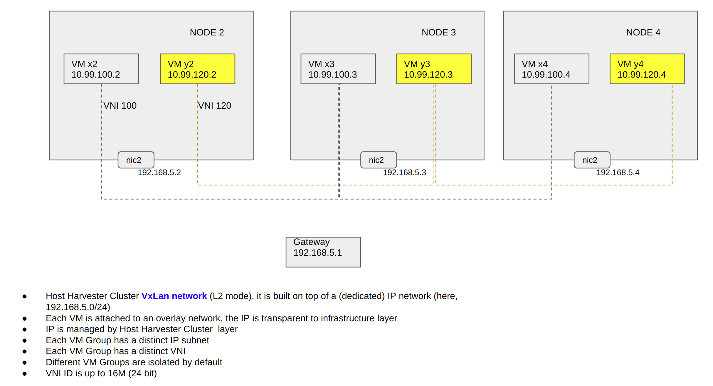

# Title

VxLAN HEP

## Summary

The enhanced Harvester network will support VxLAN.

### Related Issues

https://github.com/harvester/harvester/issues/2322

https://github.com/harvester/harvester/issues/2260

https://github.com/harvester/harvester/issues/2343

## Terminology

For clarity, this HEP defines and lists the following terms:

`Host Harvester Cluster`: A Harvester cluster which provisions VM, connects to the provider network.

`Guest Kubernetes Cluster`: A Kubernetes cluster that is deployed in VMs provisioned by Host Harvester Cluster.

`VM Group`: A group of VM provisioned by Host Harvester Cluster, those VMs can communicate with each other by default. Different VM Groups are isolated by default. Guest Kubernetes Cluster is also kind of VM Group.

`Tenant/Project`: A Tenant/Project is using a VM Group, some advanced features like L3 VxLAN Gateway, NAT may also be included.

`Management Network` / `Default Network`: The default network used by kubernetes management. Both `Host Harvester Cluster` and `Guest Kubernetes Cluster` have such a network.

`Second Network` / `Additional Network`: A dedicated network in `Host Harvester Cluster`, it is provisioned to `Guest Kubernetes Cluster` / `VM Group`. There may be multi `Second Network` in  `Host Harvester Cluster`.

`Service`: A Kubernetes Service that identifies a set of Pods using label selectors. Unless mentioned otherwise, Services are assumed to have virtual IPs only routable within the cluster network.


`VxLAN`: Virtual eXtensible Local Area Network.

`VTEP`: VxLAN Tunnel End Point.  An entity that originates and/or terminates VxLAN tunnels source interface

`VN`: Virtual Network

`VNI`: VxLAN Network Identifier, an VNI represents an `VN`

`L2 VNI (L2 overlay)`: Emulate a LAN segment, single subnet mobility.

`L3 VNI (L3 overlay)`: Abstract IP based connectivity, full mobility regardless of subnets.

`BUM`: broadcast, unknown unicast, multicast.

`VxLAN Gateway`: An entity that forwards traffic between VxLANs.

`Layer 2 VxLAN gateway`: Connects terminals to a VxLan network and enables intra-subnet communication on the same VxLAN network.

`Layer 3 VxLAN gateway`: Enables inter-subnet communication on a VxLAN network and external network access.

`NVE`: Network Virtualization Edge, Host Harvester Cluster may have multi VxLAN network, each VxLAN has related NVE in each node.

`FDB`: Forwarding Database.

`VIP`/`EIP`: Virtual IP/Elastic IP.

`Broadcast Domain` / `BD`: In a bridged network, the broadcast domain corresponds to a Virtual LAN (VLAN), where a VLAN is typically represented by a single VLAN ID (VID) but can be represented by several VIDs where Shared VLAN Learning (SVL) is used per [802.1Q]. (from https://datatracker.ietf.org/doc/html/rfc7432)

`IRB`: Integrated Routing and Bridging

`BT`: Bridge Table.  The instantiation of a BD in a MAC-VRF, as per [RFC7432].

`TS`: Tenant System

## Motivation

With the enhancement of Harvester VLAN network, user can deploy up to 4K isolated `VM group` in one `Host Harvester Cluster`.


 Meanwhile, it means that the physical network needs to prepare up to 4K VLAN for `Host Harvester Cluster`. This is a challenge for massive deployment of `Guest Kubernetes Cluster` .

 When user plans to deploy more than 4K isolated guest clusters, it is not possible now.

 Harvester will try to eliminate those restrictions in this enhancement.



### Goals

Add VxLAN network with adding the following advanced features:

  Support VxLAN overlay network on top of a dedicated `Second Network` (3)

  Support pure IP network in `Second Network` (1)

  Support automatically establishing of VxLAN tunnel, all host NODEs in the specific `Second Network` are member of VxLAN network and should be able to build full mesh VxLAN tunnel connection (3)

  Support up to 16M isolated `Virtual Network` in one `Host Harvester Cluster`, different `Virtual Network` can not communicate with each other direclty by default (3)

  Support each `Virtual Network` has a dedicated subnet (3)

  Support `Virtual Network` has overlapped subnet (1)

  Support each `Virtual Network` is used for one `VM Group` (3)

  Support VM live migration and persistent IP address, VM can freely migrate/move in the `Host Harvester Cluster` without change of IP address (3)

  Support `VM Group` use `VIP` to communicate with outside (e.g. internet) (3)

  Support `VM Group` use `VIP` to communicate with another `VM Group`'s `VIP`, it must be configured explicitly (3)

  Support kube-vip in `Guest Kubernetes Cluster`, when it is deployed in Host Harvester Cluster VxLAN overlay network (Integrate with kube-vip to provide load balancer service for VMs based on vxlan network) (3)


  TBD: Support network policies for micro-segmentation of workloads [FEATURE] Support network policies for micro-segmentation of workloads https://github.com/harvester/harvester/issues/2260

```
This requirement is related to Harvester provisioned VM
Example:
Given two VMs attached to same VLAN
  User can restrict communication between VM1 and VM2
  User can restrict communication between VM1 and external hosts
  based on native Kubernetes Network Policy framework

It is from customers.
  They are migrating from Openstack where they can define security policies for VM workloads.
  They are deploying applications in those VMs and want to manage network access policies for the VMs/apps
```


  Support multiple VxLANs in multi isolated `Second Network` (2)

note: (3)(2)(1) is priority, bigger one is more important

[quck view of VxLAN user operation](#an-example-of-vxlan-user-operation)

### Non-goals [optional]

.

## Proposal
.

### User Stories

note:

Following user stories describe the Harvester VxLAN network which is built on top of a dedicated second network in Host Harvester Cluster. The second network can be pure IP based (IP addresses may be in different subnet) or VLAN based (IP addresses are in same subnet). What VxLAN depends on is that those IPs are reachable to each other in the provider network.

In Harvester v1.0.1, the second network supports VLAN network, pure IP network will come in future.

#### Story 1

VxLAN tunnel establishment


For VxLAN network, it is trivial to add/remove peers in each node manually, even with kind of centralized registry, the HA will still be a challenge.

But at the view of Harvester, those drawbacks are not here, each NODE has all the required information to establish VxLAN tunnels.

#### Story 2

Adding Virtual Network 


User defines (cluster level) VN and the related CIDR, then the VNI, VxLAN tunnel are created automatically.

#### Story 3

Adding VM Group into a Virtual Network


Again, Harvester Host Cluster has knowledge of all the existing VMs, it can convert them into related FDB, the VTEP can skip the dynamic MAC learning.

#### Story 4

VM-VM communication inside a VM Group. 

The VM-VM communication inside a VM Group means the packages between the VMs have the same VNI and are forwarded inside a VxLan broadcast domain. 

Follow previous story, when all VM's info are added to MAC table in each node, the communication is ready.

MAC learning
 VTEP MAC dynamic learning ( of VM )
 VTEP MAC static set ( default value)

BUM packet processing

 ingress replication ( default value)
 multicast replication (some physical network may not support multicast)
 centralized replication

#### Story 5

VM migration


When an VM is migrated/moved to another NODE, `Host Harvester Cluster` updates its info in VxLAN FDB and/or related Gateway/NAT/...

VM does not need send gratuitous ARP of its (NODE) IP/MAC. VIP is discussed in [VIP](#vip-floating-in-vxlan)

#### Story 6

VM-VM communication in different Guest Kubernetes Cluster/ VM Group (different VNI)

The VM-VM communication in different VM Group requires the ability to forward the packages with different VNI across VxLan broadcast domain.

General speaking, different Guest Kubernetes Cluster / VM Group does not communicate with each directly. But that's still possible. In such case, a L3 VxLAN Gateway is needed.

##### Centralized Gateway


Centralized VxLAN gateway deployment has the following advantages and disadvantages:

Advantages:
  
  Inter-subnet traffic can be centrally managed.
  
  Gateway deployment and management are simple.

Disadvantages:

  Forwarding paths are not optimal. Inter-subnet Layer 3 traffic of the same Layer 2 gateway must be transmitted to the centralized Layer 3 gateway for forwarding.

  The ARP entry may be too big, in worst cases, all VM's MAC are in there. (VIP can reduce the number)

##### Distributed Gateway

  A big topic, BGP EVPN and more are included.

  TBD

#### Story 7

VM-internet communication

For VM Group or Guest Kubernetes Cluster, they need to communicate with internet and vice versa.

A mainstream implementation is to provide a VIP for the VM and leverage a NAT service. It is described together in story 9.

#### Story 8

Guest Kubernetes Cluster - Rancher Integration

##### Guest Kubernetes Cluster creation

https://docs.harvesterhci.io/v1.0/rancher/rke2-cluster/

When creating an RKE2 Kubernetes Cluster via Harvester Node Driver, user select the reateld vxlan_id/vni_id . (vni may be created in advance or automatically)


##### VM Management

According to following document, the VM management is done in Harvester UI. Rancher document does not mention this part.

https://docs.harvesterhci.io/v1.0/rancher/virtualization-management/

Open Points:

1. When a new VM is created for a specific Guest Kubernetes Cluster in Harvester, will it be added to this Cluster automatically ?

2. When VM has no eth0 (management network) attached, can Harvester UI use WebRNC to connect it?

##### Guest Kubernetes Cluster management

Per Rancher document, Rancher will contact with Guest Kubernetes Cluster via CLI or RancherUI, it means, Rancher needs to be network reachable with Guest Kubernetes Cluster, at least it's VIP.

https://rancher.com/docs/rancher/v2.6/en/cluster-admin/cluster-access/

https://rancher.com/docs/rancher/v2.6/en/cluster-admin/cluster-access/kubectl/


#### Story 9

Guest Kubernetes Cluster VIP/LB and communication with outside world


##### How VLAN network handle VIP

It is well described here.

https://github.com/yaocw2020/harvester/blob/ccm-HEP/enhancements/20220214-harvester-cloud-provider-enhancement.md


The Guest Kubernetes Cluster VIP is from provider network, it is reachable to other systems (like Rancher) in provider network.

note:
```
The step 8, gratuitous ARP, which is a key step for kube-vip to float the VIP.
```

##### Centralized NAT

VxLAN provides overlay network, namely, the Guest Kubernetes Cluster IPs in not reachable from provider network by default.

One way is to have NAT in L3 VxLAN Gateway.

###### NAT 1:1 IP mapping

To hide the details of overlay network, the VIP/LB of Guest Kubernetes Cluster, have a 1:1 mapping public IP/Host Cluster IP.

Continue with previous story, the communication between `Rancher` and `Guest Kubernetes Cluster` are illustrated.

Traffic from Rancher to cluster1.


Traffic from cluster1 to Rancher.


note: When downloading kube config from guest cluster, the related IP and/op port needs to be updated.

###### NAT IP + port mapping

To reduce the public IP and also well manage the open tcp/udp ports of Guest Kubernetes Cluster. For each guest cluster, only a specific amount of ports are NATed.

```
Guest Cluster VIP   port    type     Mapped public IP    port    type
10.99.100.99        6443    tcp        192.168.5.99      30440   tcp
10.99.100.99        8080    tcp        192.168.5.99      30850   tcp

10.99.100.100       6443    tcp        192.168.5.99      30445   tcp
10.99.100.100       8080    tcp        192.168.5.99      30855   tcp

...
```

##### VIP floating in VxLAN

At the view of kube-vip, VLAN / VxLAN network are same. When kube-vip is in ARP mode, it will send gratuitous ARP to float the IP.

With following static added entries, the gratuitous ARP (Broadcast) is head-end replicated to all VTEPs. Normally all BUM frame will be duplicated to all these destinations.

It is not so efficiency, but kube-vip also does not floate the IP so frequently in most time.

```
in NODE2:
bridge fdb append 00:00:00:00:00:00 dev vxlan100 dst 192.168.5.3
bridge fdb append 00:00:00:00:00:00 dev vxlan100 dst 192.168.5.4

in NODE3:
bridge fdb append 00:00:00:00:00:00 dev vxlan100 dst 192.168.5.2
bridge fdb append 00:00:00:00:00:00 dev vxlan100 dst 192.168.5.4

in NODE4:
bridge fdb append 00:00:00:00:00:00 dev vxlan100 dst 192.168.5.2
bridge fdb append 00:00:00:00:00:00 dev vxlan100 dst 192.168.5.3
```

#### Story 10

Multi-instances of VxLAN

As Host Harvester Cluster can have multi isolated VLAN network, it is possible to have multi-instances of VxLAN on top of those isolated VLAN Network.

Challenges:

1. Overlay IP allocation, can they overlap ?

2. Is it allowed of cross VxLAN instance communication ?


#### Story 11

Network policy/Security group/... (a proper name is needed)

##### Network policy in `Guest Kubernetes Cluster`

Per kubernetes document, it is done by `Guest Kubernetes Cluster`, out of scope of this HEP.

https://kubernetes.io/docs/concepts/services-networking/network-policies/

note, cite from previous link:
```
(Kubernetes) NetworkPolicies are an application-centric construct which allow you to specify how a pod is allowed to communicate with various network "entities"
 (we use the word "entity" here to avoid overloading the more common terms such as "endpoints" and "services",
 which have specific Kubernetes connotations) over the network.
 NetworkPolicies apply to a connection with a pod on one or both ends, and are not relevant to other connections.


The entities that a Pod can communicate with are identified through a combination of the following 3 identifiers:

  Other pods that are allowed (exception: a pod cannot block access to itself)
  Namespaces that are allowed
  IP blocks (exception: traffic to and from the node where a Pod is running is always allowed, regardless of the IP address of the Pod or the node)

When defining a pod- or namespace- based NetworkPolicy, you use a selector to specify what traffic is allowed to and from the Pod(s) that match the selector.

Meanwhile, when IP based NetworkPolicies are created, we define policies based on IP blocks (CIDR ranges).

```

###### The two sorts of Pod isolation

```
There are two sorts of isolation for a pod: isolation for egress, and isolation for ingress. They concern what connections may be established.
"Isolation" here is not absolute, rather it means "some restrictions apply".
The alternative, "non-isolated for $direction", means that no restrictions apply in the stated direction.
The two sorts of isolation (or not) are declared independently, and are both relevant for a connection from one pod to another.

By default, a pod is non-isolated for egress.

By default, a pod is non-isolated for ingress.

Network policies do not conflict; they are additive.
```

###### A sample of network policy


##### Network policy in `Host Kubernetes Cluster`

General speaking, the main task of `Host Kubernetes Cluster` is to provision VM for `Guest Kubernetes Cluster`/`VM Group`. We will try to define kind of concept to control `VM Group` with `VM Group`.


###### Harvester VM Network Policy based on Kubernetes Network Policy framework

Map previous sample into `Harvester VM Network Policy`.


Definition


##### TBD: VxLAN overlay network policy

TBD: define control concepts to be used in story 7, 8, 9.

#### Security

TBD: Extend following kubernetes's concept. and more.

https://kubernetes.io/docs/concepts/security/overview/

#### Story 12

Use BGP EVPN as VxLAN control plane

##### Standardization

To enhance the flood-and-learn based VxLAN, the BGP EVPN is extended and used as control plane of VxLAN.

https://datatracker.ietf.org/doc/html/rfc7432  BGP MPLS-Based Ethernet VPN

https://datatracker.ietf.org/doc/html/rfc8365  A Network Virtualization Overlay Solution Using Ethernet VPN (EVPN)

```
rfc7432

...
7.  BGP EVPN Routes

   This document defines a new BGP Network Layer Reachability
   Information (NLRI) called the EVPN NLRI.

   The format of the EVPN NLRI is as follows:

                 +-----------------------------------+
                 |    Route Type (1 octet)           |
                 +-----------------------------------+
                 |     Length (1 octet)              |
                 +-----------------------------------+
                 | Route Type specific (variable)    |
                 +-----------------------------------+

   The Route Type field defines the encoding of the rest of the EVPN
   NLRI (Route Type specific EVPN NLRI).

   The Length field indicates the length in octets of the Route Type
   specific field of the EVPN NLRI.

   This document defines the following Route Types:

      + 1 - Ethernet Auto-Discovery (A-D) route
      + 2 - MAC/IP Advertisement route
      + 3 - Inclusive Multicast Ethernet Tag route
      + 4 - Ethernet Segment route


   The EVPN NLRI is carried in BGP [RFC4271] using BGP Multiprotocol
   Extensions [RFC4760] with an Address Family Identifier (AFI) of 25
   (L2VPN) and a Subsequent Address Family Identifier (SAFI) of 70
   (EVPN).  The NLRI field in the MP_REACH_NLRI/MP_UNREACH_NLRI
   attribute contains the EVPN NLRI (encoded as specified above).

   In order for two BGP speakers to exchange labeled EVPN NLRI, they
   must use BGP Capabilities Advertisements to ensure that they both are
   capable of properly processing such NLRI.  This is done as specified
   in [RFC4760], by using capability code 1 (multiprotocol BGP) with an
   AFI of 25 (L2VPN) and a SAFI of 70 (EVPN).

7.1.  Ethernet Auto-discovery Route

   An Ethernet A-D route type specific EVPN NLRI consists of the
   following:

                +---------------------------------------+
                |  Route Distinguisher (RD) (8 octets)  |
                +---------------------------------------+
                |Ethernet Segment Identifier (10 octets)|
                +---------------------------------------+
                |  Ethernet Tag ID (4 octets)           |
                +---------------------------------------+
                |  MPLS Label (3 octets)                |
                +---------------------------------------+

   For the purpose of BGP route key processing, only the Ethernet
   Segment Identifier and the Ethernet Tag ID are considered to be part
   of the prefix in the NLRI.  The MPLS Label field is to be treated as
   a route attribute as opposed to being part of the route.


   For procedures and usage of this route, please see Sections 8.2
   ("Fast Convergence") and 8.4 ("Aliasing and Backup Path").

..

7.2.  MAC/IP Advertisement Route

   A MAC/IP Advertisement route type specific EVPN NLRI consists of the
   following:

                +---------------------------------------+
                |  RD (8 octets)                        |
                +---------------------------------------+
                |Ethernet Segment Identifier (10 octets)|
                +---------------------------------------+
                |  Ethernet Tag ID (4 octets)           |
                +---------------------------------------+
                |  MAC Address Length (1 octet)         |
                +---------------------------------------+
                |  MAC Address (6 octets)               |
                +---------------------------------------+
                |  IP Address Length (1 octet)          |
                +---------------------------------------+
                |  IP Address (0, 4, or 16 octets)      |
                +---------------------------------------+
                |  MPLS Label1 (3 octets)               |
                +---------------------------------------+
                |  MPLS Label2 (0 or 3 octets)          |
                +---------------------------------------+

..

   For the purpose of BGP route key processing, only the Ethernet Tag  --------------------
   ID, MAC Address Length, MAC Address, IP Address Length, and IP
   Address fields are considered to be part of the prefix in the NLRI.

   The Ethernet Segment Identifier, MPLS Label1, and MPLS Label2 fields --------------------
   are to be treated as route attributes as opposed to being part of the
   "route".  Both the IP and MAC address lengths are in bits.

   For procedures and usage of this route, please see Sections 9
   ("Determining Reachability to Unicast MAC Addresses") and 14 ("Load
   Balancing of Unicast Packets").

7.3.  Inclusive Multicast Ethernet Tag Route

   An Inclusive Multicast Ethernet Tag route type specific EVPN NLRI
   consists of the following:

               +---------------------------------------+
               |  RD (8 octets)                        |
               +---------------------------------------+
               |  Ethernet Tag ID (4 octets)           |
               +---------------------------------------+
               |  IP Address Length (1 octet)          |
               +---------------------------------------+
               |  Originating Router's IP Address      |
               |          (4 or 16 octets)             |
               +---------------------------------------+

   For procedures and usage of this route, please see Sections 11
   ("Handling of Multi-destination Traffic"), 12 ("Processing of Unknown
   Unicast Packets"), and 16 ("Multicast and Broadcast").  The IP
   address length is in bits.  For the purpose of BGP route key
   processing, only the Ethernet Tag ID, IP Address Length, and
   Originating Router's IP Address fields are considered to be part of
   the prefix in the NLRI.

```

##### BGP EVPN Routes in VxLAN

There are two kinds of reachability information one VTEP sends through BGP EVPN:

For each VNI, the local MAC addresses (previous Chapter 7, type 2 routes), and the VNIs they have interest in (type 3 routes).

At the view of an VM's MAC/IP, it includes not only `VM-MAC`, `VM-IP`, but also `VTEP-IP`, `VNI`. Namely, it is kind of 4-tuple `VM-MAC VM-IP VTEP-IP VNI` to identify an VM.

The 4-tuple must be synced into all VTEPs.

Compared to manually deploy VxLAN, BGP EVPN VxLAN has three main advantages:

```
proven scalability (a typical BGP routers handle several millions of routes); and

possibility to enforce fine-grained policies.

interoperability with other vendors (not important here)
```

##### BGP route reflector


When deploying BGP, one widely adpoted solution is to deploy a pair of `BGP Route Reflector`, all BGP nodes only need to establish two BGP connections with the reflector pair. Those two reflectors have fixed IP address.

In VxLAN context, before configuring each VTEP, we need to configure two or more route reflectors. e.g.

	using FRR (https://github.com/FRRouting/frr, integrated in https://www.nvidia.com/en-us/networking/ethernet-switching/cumulus-linux/)

	using GoBGP, an implementation of BGP in Go

	using Juniper Junos / Cisco ...

Sample of config BGP reflector with FRR:
```
router bgp 65000
  bgp router-id 192.168.5.253.254
  bgp cluster-id 192.168.5.253.254
  bgp log-neighbor-changes
  no bgp default ipv4-unicast
  neighbor fabric peer-group
  neighbor fabric remote-as 65000
  neighbor fabric capability extended-nexthop
  neighbor fabric update-source 192.168.5.254
  bgp listen range 192.168.5.0/24 peer-group fabric
  !
  address-family l2vpn evpn
   neighbor fabric activate
   neighbor fabric route-reflector-client
  exit-address-family
  !
!
```

Sample of config BGP in each VTEP (each Host Harvester Cluster Node)
```
router bgp 65000
  bgp router-id 192.168.5.2
  no bgp default ipv4-unicast
  neighbor fabric peer-group
  neighbor fabric remote-as 65000
  neighbor fabric capability extended-nexthop
  ! BGP sessions with route reflectors
  neighbor 192.168.5.254 peer-group fabric
  neighbor 192.168.5.253 peer-group fabric  (backup reflector)
  !
  address-family l2vpn evpn
   neighbor fabric activate
   advertise-all-vni
  exit-address-family
  !
!
```

###### BGP route reflector disadvantages

It is not difficult to raise doubt: where and who in Host Harvester Cluster will act as `BGP route reflector` ? out-of-tree ?

When `BGP route reflector` is sitting outside of the cluster, the life cycle management of it is a challenge.

When `BGP route reflector` is sitting inside of the cluster. Suppose:

2 new service call `BGP route reflector` are deployed with 1 replica, and each has one VIP.

All NODEs will run a `BGP` daemonset, which establishs two TCP based BGP connections with those two `BGP route reflector` serivce.

##### BGP without route reflector

When no `BGP route reflector` is deployed, then each VTEP needs to establish BGP connections with all it's peers, it is fullmeshed.

Each NODE establish BGP peer with all other NODEs, and sync (type 2 routes, type 3 routes) local information to peers.


The link https://projectcalico.docs.tigera.io/networking/bgp mentioned:

```
Full-mesh works great for small and medium-size deployments of say 100 nodes or less, but at significantly larger scales
full-mesh becomes less efficient, and we recommend using route reflectors.
```

##### Replace BGP with Kubernetes Controller

On the other hand, `Host Harvester Cluster` has all the informaton (type 2 routes, type 3 routes), some kind of kubernetes controller may fulfill those tasks.

4-tuple `VM-MAC VM-IP VTEP-IP VNI` becomes a kind of (virtual) CRD in APIServer, the information could be fetched from NODE, VM, VxLAN.

note: The precondition is: Harvester VxLAN is transparent to outside world, no additional VTEP will join this VxLAN network. Otherwise, BGP EVPN is used for interoperability with other vendors.

#### Story 13

VxLAN Distributed gateway - Integrated Routing and Bridging in Ethernet VPN (EVPN)

Target: each `Host Harvester Cluster` NODE is a gateway of inter-VN communication

##### Standardization

https://datatracker.ietf.org/doc/rfc9135/

```
...
   Ethernet VPN (EVPN) provides an extensible and flexible multihoming
   VPN solution over an MPLS/IP network for intra-subnet connectivity
   among Tenant Systems and end devices that can be physical or virtual.
   However, there are scenarios for which there is a need for a dynamic  --------------------
   and efficient inter-subnet connectivity among these Tenant Systems
   and end devices while maintaining the multihoming capabilities of
   EVPN.  This document describes an Integrated Routing and Bridging
   (IRB) solution based on EVPN to address such requirements.
...

4.  Symmetric and Asymmetric IRB

   This document defines and describes two types of IRB solutions --
   namely, symmetric and asymmetric IRB.  The description of symmetric
   and asymmetric IRB procedures relating to data path operations and
   tables in this document is a logical view of data path lookups and
   related tables.  Actual implementations, while following this logical
   view, may not strictly adhere to it for performance trade-offs.
   Specifically,

   *  References to an ARP table in the context of asymmetric IRB is a
      logical view of a forwarding table that maintains an IP-to-MAC
      binding entry on a Layer 3 interface for both IPv4 and IPv6.
      These entries are not subject to ARP or ND protocols.  For IP-to-
      MAC bindings learned via EVPN, an implementation may choose to
      import these bindings directly to the respective forwarding table
      (such as an adjacency/next-hop table) as opposed to importing them
      to ARP or ND protocol tables.

   *  References to a host IP lookup followed by a host MAC lookup in
      the context of asymmetric IRB MAY be collapsed into a single IP
      lookup in a hardware implementation.

   In symmetric IRB, as its name implies, the lookup operation is
   symmetric at both the ingress and egress PEs -- i.e., both ingress
   and egress PEs perform lookups on both MAC and IP addresses.  The
   ingress PE performs a MAC lookup followed by an IP lookup, and the
   egress PE performs an IP lookup followed by a MAC lookup, as depicted
   in the following figure.

                  Ingress PE                   Egress PE
            +-------------------+        +------------------+
            |                   |        |                  |
            |    +-> IP-VRF ----|---->---|-----> IP-VRF -+  |
            |    |              |        |               |  |
            |   BT1        BT2  |        |  BT3         BT2 |
            |    |              |        |               |  |
            |    ^              |        |               v  |
            |    |              |        |               |  |
            +-------------------+        +------------------+
                 ^                                       |
                 |                                       |
           TS1->-+                                       +->-TS2

                          Figure 2: Symmetric IRB

   In symmetric IRB, as shown in Figure 2, the inter-subnet forwarding
   between two PEs is done between their associated IP-VRFs.  Therefore,
   the tunnel connecting these IP-VRFs can be either an IP-only tunnel
   (e.g., in the case of MPLS or GPE encapsulation) or an Ethernet NVO
   tunnel (e.g., in the case of VXLAN encapsulation).  If it is an
   Ethernet NVO tunnel, the TS1's IP packet is encapsulated in an
   Ethernet header consisting of ingress and egress PE MAC addresses --
   i.e., there is no need for the ingress PE to use the destination
   TS2's MAC address.  Therefore, in symmetric IRB, there is no need for --------------------
   the ingress PE to maintain ARP entries for the association of the
   destination TS2's IP and MAC addresses in its ARP table.  Each PE
   participating in symmetric IRB only maintains ARP entries for locally
   connected hosts and MAC-VRFs/BTs for only locally configured subnets.

   In asymmetric IRB, the lookup operation is asymmetric and the ingress
   PE performs three lookups, whereas the egress PE performs a single
   lookup -- i.e., the ingress PE performs a MAC lookup, followed by an
   IP lookup, followed by a MAC lookup again.  The egress PE performs
   just a single MAC lookup as depicted in Figure 3 below.

               Ingress PE                       Egress PE
            +-------------------+        +------------------+
            |                   |        |                  |
            |    +-> IP-VRF ->  |        |      IP-VRF      |
            |    |           |  |        |                  |
            |   BT1        BT2  |        |  BT3         BT2 |
            |    |           |  |        |              | | |
            |    |           +--|--->----|--------------+ | |
            |    |              |        |                v |
            +-------------------+        +----------------|-+
                 ^                                        |
                 |                                        |
           TS1->-+                                        +->-TS2

                          Figure 3: Asymmetric IRB

   In asymmetric IRB, as shown in Figure 3, the inter-subnet forwarding
   between two PEs is done between their associated MAC-VRFs/BTs.
   Therefore, the MPLS or NVO tunnel used for inter-subnet forwarding
   MUST be of type Ethernet.  Since only MAC lookup is performed at the
   egress PE (e.g., no IP lookup), the TS1's IP packets need to be
   encapsulated with the destination TS2's MAC address.  In order for
   the ingress PE to perform such encapsulation, it needs to maintain
   TS2's IP and MAC address association in its ARP table.  Furthermore,
   it needs to maintain destination TS2's MAC address in the
   corresponding bridge table even though it may not have any TSs of the
   corresponding subnet locally attached.  In other words, each PE --------------------
   participating in asymmetric IRB MUST maintain ARP entries for remote
   hosts (hosts connected to other PEs) as well as maintain MAC-VRFs/BTs
   and IRB interfaces for ALL subnets in an IP-VRF, including subnets
   that may not be locally attached.  Therefore, careful consideration
   of the PE scale aspects for its ARP table size, its IRB interfaces,
   and the number and size of its bridge tables should be given for the
   application of asymmetric IRB.


4.1.  IRB Interface and Its MAC and IP Addresses

   To support inter-subnet forwarding on a PE, the PE acts as an IP
   default gateway from the perspective of the attached Tenant Systems
   where default gateway MAC and IP addresses are configured on each IRB
   interface associated with its subnet and fall into one of the
   following two options:

   1.  All the PEs for a given tenant subnet use the same anycast --------------------
       default gateway IP and MAC addresses.  On each PE, these default
       gateway IP and MAC addresses correspond to the IRB interface
       connecting the bridge table associated with the tenant's VLAN to
       the corresponding tenant's IP-VRF.

   2.  Each PE for a given tenant subnet uses the same anycast default
       gateway IP address but its own MAC address.  These MAC addresses --------------------
       are aliased to the same anycast default gateway IP address
       through the use of the Default Gateway extended community as
       specified in [RFC7432], which is carried in the EVPN MAC/IP
       Advertisement routes.  On each PE, this default gateway IP
       address, along with its associated MAC addresses, correspond to
       the IRB interface connecting the bridge table associated with the
       tenant's VLAN to the corresponding tenant's IP-VRF.

   It is worth noting that if the applications that are running on the
   TSs are employing or relying on any form of MAC security, then the
   first option (i.e., using an anycast MAC address) should be used to
   ensure that the applications receive traffic from the same IRB
   interface MAC address to which they are sending.  If the second
   option is used, then the IRB interface MAC address MUST be the one
   used in the initial ARP reply or ND Neighbor Advertisement (NA) for
   that TS.

   Although both of these options are applicable to both symmetric and
   asymmetric IRB, option 1 is recommended because of the ease of
   anycast MAC address provisioning on not only the IRB interface
   associated with a given subnet across all the PEs corresponding to
   that VLAN but also on all IRB interfaces associated with all the
   tenant's subnets across all the PEs corresponding to all the VLANs
   for that tenant.  Furthermore, it simplifies the operation as there
   is no need for Default Gateway extended community advertisement and
   its associated MAC aliasing procedure.  Yet another advantage is that
   following host mobility, the host does not need to refresh the
   default GW ARP/ND entry.

   If option 1 is used, an implementation MAY choose to auto-derive the
   anycast MAC address.  If auto-derivation is used, the anycast MAC
   MUST be auto-derived out of the following ranges (which are defined
   in [RFC5798]):

   *  Anycast IPv4 IRB case: 00-00-5E-00-01-{VRID}

   *  Anycast IPv6 IRB case: 00-00-5E-00-02-{VRID}

   Where the last octet is generated based on a configurable Virtual
   Router ID (VRID) (range 1-255).  If not explicitly configured, the
   default value for the VRID octet is '1'.  Auto-derivation of the --------------------
   anycast MAC can only be used if there is certainty that the auto-
   derived MAC does not collide with any customer MAC address.

   In addition to IP anycast addresses, IRB interfaces can be configured
   with non-anycast IP addresses for the purpose of OAM (such as sending
   a traceroute/ping to these interfaces) for both symmetric and
   asymmetric IRB.  These IP addresses need to be distributed as VPN
   routes when PEs operate in symmetric IRB mode.  However, they don't
   need to be distributed if the PEs are operating in asymmetric IRB
   mode as the non-anycast IP addresses are configured along with their
   individual MACs, and they get distributed via the EVPN route type 2
   advertisement.

   For option 1 -- irrespective of whether only the anycast MAC address
   or both anycast and non-anycast MAC addresses (where the latter one
   is used for the purpose of OAM) are used on the same IRB -- when a TS
   sends an ARP request or ND Neighbor Solicitation (NS) to the PE to
   which it is attached, the request is sent for the anycast IP address
   of the IRB interface associated with the TS's subnet.  The reply will
   use an anycast MAC address (in both the source MAC in the Ethernet
   header and sender hardware address in the payload).  For example, in
   Figure 4, TS1 is configured with the anycast IPx address as its
   default gateway IP address; thus, when it sends an ARP request for
   IPx (anycast IP address of the IRB interface for BT1), the PE1 sends
   an ARP reply with the MACx, which is the anycast MAC address of that
   IRB interface.  Traffic routed from IP-VRF1 to TS1 uses the anycast
   MAC address as the source MAC address.


```


```
In MP-BGP EVPN, any VTEP in a VNI can be the distributed anycast gateway
for end hosts in its IP subnet by supporting the same virtual gateway
IP address and the virtual gateway MAC address. With the anycast gateway
function in EVPN, end hosts in a VNI always can use their local VTEPs
for this VNI as their default gateway to send traffic to outside of their
IP subnet. This capability enables optimal forwarding for northbound traffic
from end hosts in the VXLAN overlay network. A distributed anycast gateway
also offers the benefit of seemless host mobility in the VXLAN overlay network.
Because the gateway IP and virtual MAC address are identically provisioned on
all VTEPs within a VNI, when an end host moves from one VTEP to another VTEP,
it doesn’t need to send another ARP request to re-learn the gateway MAC address.


```

https://datatracker.ietf.org/doc/rfc9136/ IP Prefix Advertisement in Ethernet VPN (EVPN)

```
   This document defines an additional route type (RT-5) in the IANA
   "EVPN Route Types" registry [EVPNRouteTypes] to be used for the
   advertisement of EVPN routes using IP prefixes:

      Value:  5
      Description:  IP Prefix

   According to Section 5.4 of [RFC7606], a node that doesn't recognize
   the route type 5 (RT-5) will ignore it.  Therefore, an NVE following
   this document can still be attached to a BD where an NVE ignoring RT-
   5s is attached.  Regular procedures described in [RFC7432] would
   apply in that case for both NVEs.  In case two or more NVEs are
   attached to different BDs of the same tenant, they MUST support the
   RT-5 for the proper inter-subnet forwarding operation of the tenant.

   The detailed encoding of this route and associated procedures are
   described in the following sections.

3.1.  IP Prefix Route Encoding

   An IP Prefix route type for IPv4 has the Length field set to 34 and
   consists of the following fields:

       +---------------------------------------+
       |      RD (8 octets)                    |
       +---------------------------------------+
       |Ethernet Segment Identifier (10 octets)|
       +---------------------------------------+
       |  Ethernet Tag ID (4 octets)           |
       +---------------------------------------+
       |  IP Prefix Length (1 octet, 0 to 32)  |
       +---------------------------------------+
       |  IP Prefix (4 octets)                 |
       +---------------------------------------+
       |  GW IP Address (4 octets)             |
       +---------------------------------------+
       |  MPLS Label (3 octets)                |
       +---------------------------------------+

                Figure 3: EVPN IP Prefix Route NLRI for IPv4

   An IP Prefix route type for IPv6 has the Length field set to 58 and
   consists of the following fields:

       +---------------------------------------+
       |      RD (8 octets)                    |
       +---------------------------------------+
       |Ethernet Segment Identifier (10 octets)|
       +---------------------------------------+
       |  Ethernet Tag ID (4 octets)           |
       +---------------------------------------+
       |  IP Prefix Length (1 octet, 0 to 128) |
       +---------------------------------------+
       |  IP Prefix (16 octets)                |
       +---------------------------------------+
       |  GW IP Address (16 octets)            |
       +---------------------------------------+
       |  MPLS Label (3 octets)                |
       +---------------------------------------+

                Figure 4: EVPN IP Prefix Route NLRI for IPv6

   Where:

   *  The Length field of the BGP EVPN NLRI for an EVPN IP Prefix route
      MUST be either 34 (if IPv4 addresses are carried) or 58 (if IPv6
      addresses are carried).  The IP prefix and gateway IP address MUST
      be from the same IP address family.

   *  The Route Distinguisher (RD) and Ethernet Tag ID MUST be used as
      defined in [RFC7432] and [RFC8365].  In particular, the RD is
      unique per MAC-VRF (or IP-VRF).  The MPLS Label field is set to
      either an MPLS label or a VNI, as described in [RFC8365] for other
      EVPN route types.

   *  The Ethernet Segment Identifier MUST be a non-zero 10-octet
      identifier if the ESI is used as an Overlay Index (see the
      definition of "Overlay Index" in Section 3.2).  It MUST be all
      bytes zero otherwise.  The ESI format is described in [RFC7432].

   *  The IP prefix length can be set to a value between 0 and 32 (bits)
      for IPv4 and between 0 and 128 for IPv6, and it specifies the
      number of bits in the prefix.  The value MUST NOT be greater than
      128.

   *  The IP prefix is a 4- or 16-octet field (IPv4 or IPv6).

   *  The GW IP Address field is a 4- or 16-octet field (IPv4 or IPv6)
      and will encode a valid IP address as an Overlay Index for the IP
      prefixes.  The GW IP field MUST be all bytes zero if it is not
      used as an Overlay Index.  Refer to Section 3.2 for the definition
      and use of the Overlay Index.

   *  The MPLS Label field is encoded as 3 octets, where the high-order
      20 bits contain the label value, as per [RFC7432].  When sending,
      the label value SHOULD be zero if a recursive resolution based on
      an Overlay Index is used.  If the received MPLS label value is
      zero, the route MUST contain an Overlay Index, and the ingress
      NVE/PE MUST perform a recursive resolution to find the egress NVE/
      PE.  If the received label is zero and the route does not contain
      an Overlay Index, it MUST be "treat as withdraw" [RFC7606].

   The RD, Ethernet Tag ID, IP prefix length, and IP prefix are part of
   the route key used by BGP to compare routes.  The rest of the fields
   are not part of the route key.

   An IP Prefix route MAY be sent along with an EVPN Router's MAC
   Extended Community (defined in [RFC9135]) to carry the MAC address
   that is used as the Overlay Index.  Note that the MAC address may be
   that of a TS.
```

##### Map RFC9136 to Harvester

Following diagram shows how to map Harvester VxLAN network to RFC9136.


To meet k8s network model, the VM's IP and guest k8s's VIP needs to be advertised, and make sure the IP is reachable.

```
3.2.  Overlay Indexes and Recursive Lookup Resolution

   RT-5 routes support recursive lookup resolution through the use of
   Overlay Indexes as follows:

   *  An Overlay Index can be an ESI or IP address in the address space
      of the tenant or MAC address, and it is used by an NVE as the next
      hop for a given IP prefix.  An Overlay Index always needs a
      recursive route resolution on the NVE/PE that installs the RT-5
      into one of its IP-VRFs so that the NVE knows to which egress NVE/
      PE it needs to forward the packets.  It is important to note that
      recursive resolution of the Overlay Index applies upon
      installation into an IP-VRF and not upon BGP propagation (for
      instance, on an ASBR).  Also, as a result of the recursive
      resolution, the egress NVE/PE is not necessarily the same NVE that
      originated the RT-5.
```

#### Story 14

Harvester network scenario summarization


When Harvester is used for IaaS (private cloud/hybrid-cloud ...), the reasonable solution is using VLAN network. The owner may establish VxLAN network, deploy BGP EVPN and more. But at the view of Harvester, it only sees the given VLAN network.

When Harvester is used for guest k8s cluster, our main target now, a fully isolated VxLAN overlay network could be the main requirement.

In case mixing those scenarios, the requirments will become fairly complex.


##### The Kubernetes network model

https://kubernetes.io/docs/concepts/services-networking/

```
...
Kubernetes imposes the following fundamental requirements on any networking implementation (barring any intentional network segmentation policies):

pods can communicate with all other pods on any other node without NAT
agents on a node (e.g. system daemons, kubelet) can communicate with all pods on that node

This model is not only less complex overall, but it is principally compatible with the desire for Kubernetes to enable low-friction porting of apps
from VMs to containers. If your job previously ran in a VM, your VM had an IP and could talk to other VMs in your project. This is the same basic model.
...

Kubernetes networking addresses four concerns:

  Containers within a Pod use networking to communicate via loopback.
  Cluster networking provides communication between different Pods.
  The Service resource lets you expose an application running in Pods to be reachable from outside your cluster.
  You can also use Services to publish services only for consumption inside your cluster.

```

```
Kubernetes ServiceTypes allow you to specify what kind of Service you want. The default is ClusterIP.

Type values and their behaviors are:

ClusterIP:
  Exposes the Service on a cluster-internal IP. Choosing this value makes the Service only reachable from within the cluster. This is the default ServiceType.

NodePort:
  Exposes the Service on each Node's IP at a static port (the NodePort). A ClusterIP Service, to which the NodePort Service routes, is automatically created.
  You'll be able to contact the NodePort Service, from outside the cluster, by requesting <NodeIP>:<NodePort>.

LoadBalancer:
  Exposes the Service externally using a cloud provider's load balancer. NodePort and ClusterIP Services, to which the external load balancer routes, are automatically created.

ExternalName:
  Maps the Service to the contents of the externalName field (e.g. foo.bar.example.com), by returning a CNAME record with its value. No proxying of any kind is set up.

```

At the view of `Host Harvester Cluster`, those different network types need to meet the `Guest Kubernetes Cluster` network model.


##### Flannel VxLAN

Flannel uses Linux in-kernel VxLAN to encapsulate the packets.

```
Type and options:
  Type (string): vxlan
  VNI (number): VXLAN Identifier (VNI) to be used. On Linux, defaults to 1. On Windows should be greater than or equal to 4096.  flannel.1
  Port (number): UDP port to use for sending encapsulated packets. On Linux, defaults to kernel default, currently 8472, but on Windows, must be 4789.
  GBP (Boolean): Enable VXLAN Group Based Policy. Defaults to false. GBP is not supported on Windows
  DirectRouting (Boolean): Enable direct routes (like host-gw) when the hosts are on the same subnet. VXLAN will only be used to encapsulate packets to hosts on different subnets. Defaults to false.   DirectRouting is not supported on Windows.
  MacPrefix (String): Only use on Windows, set to the MAC prefix. Defaults to 0E-2A.

```

Why `Flannel` is not fit for Harvester VxLAN network?


### User Experience In Detail

#### An example of VxLAN user operation

To now, the user will be able to use Harvester VxLAN network to create isolated Guest Kubernetes Cluster with following steps.

```
(1) Install Host Harvester Cluster, wait for it's ready
(2) Create one second network on a dedicated NIC/a group of bonded NICs (different from the management NIC),
     IP addresses are static set/dynamic provisioned by DHCP from provider network, CIDR e.g. 192.168.5.0/24

(3) Create one VxLAN overlay network on top of the second network, say VxLAN 1, the overlay network CIDR, e.g. 10.0.0.0/8
     VxLAN Local IP and remote peers in each NODE are fetched from APIServer.
     Related VxLAN L3 Gateway and NAT are also deployed.

(4) Create one VNI, say 100, CIDR e.g. 10.99.100.0/24
     VxLAN 1, VNI 100, the VxLAN tunnel in each NODE are established, each node has a VTEP instance, say vxlan_1_100
(5) Create one group of VMs, say vmg_1, the CNI is binded to VNI 100
     each vxlan_1_100 will have related forwarding db (MAC address of VM, local port/remote VTEP IP)
     selecting head end replication
     add MAC 00.00.00.00.00.00 for each remote peer, for BUM packet processing
     VM--VM communication is ready
(6) Provision one guest k8s cluster, cluster_1 in vmg_1
(7) Add one LB/VIP for cluster_1 (10.99.100.99), a corresponding VIP is allocated in provider network, 192.168.5.99
     cluster_1 is able to communicate with provider network


repeat (4)~(7) to create more Guest Kubernetes Clusters.

```

[back to user stories](#user-stories)

#### Harvester network extension proposal

A proposal, for discussion.

.

### API changes

## Design

### Implementation Overview

Overview on how the enhancement will be implemented.

An analysis of Linux VxLAN implementation.

Noteablely, at the view of VxLAN, the linux bridge instance is a part of it's functionality, it should be automatically created/deleted with VxLAN.

Each VNI has 2 levels of fdb:

A bridge fdb for inside VTEP local forwarding.

A VxLAN fdb for cross VTEP forwarding.


traditional bridge fdb adding:

```
# bridge fdb add <mac address> dev <port> master temp
```

vxlan fdb adding

note the `dst` field, it is a must of vxlan fdb, represents VTEP peer IP.

```
# bridge fdb append 50:54:33:00:00:09 dev vxlan100 dst 2001:db8:2::1
```

### Linux VRF

https://docs.kernel.org/networking/vrf.html

```
Design
A VRF device is created with an associated route table. Network interfaces are then enslaved to a VRF device:

+-----------------------------+
|           vrf-blue          |  ===> route table 10
+-----------------------------+
   |        |            |
+------+ +------+     +-------------+
| eth1 | | eth2 | ... |    bond1    |
+------+ +------+     +-------------+
                         |       |
                     +------+ +------+
                     | eth8 | | eth9 |
                     +------+ +------+
Packets received on an enslaved device and are switched to the VRF device in the IPv4 and IPv6 processing stacks
giving the impression that packets flow through the VRF device. Similarly on egress routing rules are used to
send packets to the VRF device driver before getting sent out the actual interface. This allows tcpdump on a VRF device
to capture all packets into and out of the VRF as a whole1. Similarly, netfilter2 and tc rules can be applied using
the VRF device to specify rules that apply to the VRF domain as a whole.


Setup
1. VRF device is created with an association to a FIB table. e.g,:

ip link add vrf-blue type vrf table 10
ip link set dev vrf-blue up

2.An l3mdev FIB rule directs lookups to the table associated with the device. A single l3mdev rule is sufficient for all VRFs.
The VRF device adds the l3mdev rule for IPv4 and IPv6 when the first device is created with a default preference of 1000.
Users may delete the rule if desired and add with a different priority or install per-VRF rules.

Prior to the v4.8 kernel iif and oif rules are needed for each VRF device:

ip ru add oif vrf-blue table 10
ip ru add iif vrf-blue table 10

3.Set the default route for the table (and hence default route for the VRF):

ip route add table 10 unreachable default metric 4278198272

This high metric value ensures that the default unreachable route can be overridden by a routing protocol suite.
FRRouting interprets kernel metrics as a combined admin distance (upper byte) and priority (lower 3 bytes).
Thus the above metric translates to [255/8192].

4.Enslave L3 interfaces to a VRF device:

ip link set dev eth1 master vrf-blue

Local and connected routes for enslaved devices are automatically moved to the table associated with VRF device.
Any additional routes depending on the enslaved device are dropped and will need to be reinserted to the VRF FIB table following the enslavement.

The IPv6 sysctl option keep_addr_on_down can be enabled to keep IPv6 global addresses as VRF enslavement changes:

sysctl -w net.ipv6.conf.all.keep_addr_on_down=1

5.Additional VRF routes are added to associated table:

ip route add table 10 ...
```


### Test plan

Integration test plan.

### Upgrade strategy

Anything that requires if user want to upgrade to this enhancement

## Note [optional]


## reference

https://www.kernel.org/doc/Documentation/networking/vxlan.txt

https://datatracker.ietf.org/doc/html/rfc7432  BGP MPLS-Based Ethernet VPN

https://datatracker.ietf.org/doc/html/rfc8365  A Network Virtualization Overlay Solution Using Ethernet VPN (EVPN)

https://datatracker.ietf.org/doc/rfc9135/ Integrated Routing and Bridging in Ethernet VPN (EVPN)

https://datatracker.ietf.org/doc/rfc9136/ IP Prefix Advertisement in Ethernet VPN (EVPN)

https://vincent.bernat.ch/en/blog/2017-vxlan-bgp-evpn

https://vincent.bernat.ch/en/blog/2017-vxlan-linux

https://www.cisco.com/c/en/us/products/collateral/switches/nexus-9000-series-switches/guide-c07-734107.html


### Linux related

ip2 command

```
       VxLAN Type Support
              For a link of type VxLAN the following additional
              arguments are supported:

              ip link add DEVICE type vxlan id VNI [ dev PHYS_DEV  ] [ {
              group | remote } IPADDR ] [ local { IPADDR | any } ] [ ttl
              TTL ] [ tos TOS ] [ df DF ] [ flowlabel FLOWLABEL ] [
              dstport PORT ] [ srcport MIN MAX ] [ [no]learning ] [
              [no]proxy ] [ [no]rsc ] [ [no]l2miss ] [ [no]l3miss ] [
              [no]udpcsum ] [ [no]udp6zerocsumtx ] [ [no]udp6zerocsumrx
              ] [ ageing SECONDS ] [ maxaddress NUMBER ] [ [no]external
              ] [ gbp ] [ gpe ]
```

fdb command

```
       bridge fdb { add | append | del | replace } LLADDR dev DEV {
               local | static | dynamic } [ self ] [ master ] [ router ]
               [ use ] [ extern_learn ] [ sticky ] [ src_vni VNI ] { [
               dst IPADDR ] [ vni VNI ] [ port PORT ] [ via DEVICE ] |
               nhid NHID }
```

add bridge & fdb

```
# ip link add <bridge> type bridge ... create new bridge
# ip link set <port> master <bridge> ... attach port

# bridge vlan add vid <vid> dev <port>

# bridge fdb add <mac address> dev <port> master temp
# bridge fdb del <mac address> dev <port> master
```

VxLAN fdb is a bit different

```
bridge fdb append 50:54:33:00:00:09 dev vxlan100 dst 2001:db8:2::1
```

https://www.kernel.org/doc/Documentation/networking/vxlan.txt

```
The management of vxlan is done in a manner similar to its two closest
neighbors GRE and VLAN. Configuring VxLAN requires the version of
iproute2 that matches the kernel release where VxLAN was first merged
upstream.

1. Create vxlan device
 # ip link add vxlan0 type vxlan id 42 group 239.1.1.1 dev eth1 dstport 4789

This creates a new device named vxlan0.  The device uses the multicast
group 239.1.1.1 over eth1 to handle traffic for which there is no
entry in the forwarding table.  The destination port number is set to
the IANA-assigned value of 4789.  The Linux implementation of VxLAN
pre-dates the IANA's selection of a standard destination port number
and uses the Linux-selected value by default to maintain backwards
compatibility.

2. Delete vxlan device
  # ip link delete vxlan0

3. Show vxlan info
  # ip -d link show vxlan0

It is possible to create, destroy and display the vxlan
forwarding table using the new bridge command.

1. Create forwarding table entry
  # bridge fdb add to 00:17:42:8a:b4:05 dst 192.19.0.2 dev vxlan0

2. Delete forwarding table entry
  # bridge fdb delete 00:17:42:8a:b4:05 dev vxlan0

3. Show forwarding table
  # bridge fdb show dev vxlan0
```

### flannel

(note: it may not be fully accurate, just FYI)

..
The realization of flannel VxLAN mode has gone through three iterations

The first version of flannel, L3Miss learning, was done by looking up the ARP table Mac. L2Miss learning, achieved by obtaining the external IP address on the VTEP

The second version of flannel removes L3Miss learning. When the host is online, just add the corresponding ARP entry directly, without searching and learning.

The latest version of flannel removes L2Miss learning and L3Miss learning, and its working mode is as follows:

1) Create a VxLAN device and no longer listen to L2Miss and L3Miss events. 

2) Create a static ARP entry for the remote host.

3) Create an FDB forwarding table entry, including the external IP of VTEP Mac and remote flannel.

The latest version of flannel completely removed the L2Miss and L3Miss methods, and changed it to a method of actively adding remote host routes to the subnet. At the same time, the VTEP and the bridge each assign a Layer 3 IP address. When the data packet reaches the destination host, it performs three-layer addressing internally, and the number of routes is linearly related to the number of hosts (not the number of containers). It is officially claimed that each host under the same VxLAN subnet corresponds to one routing table entry, one ARP table entry and one FDB table entry.


