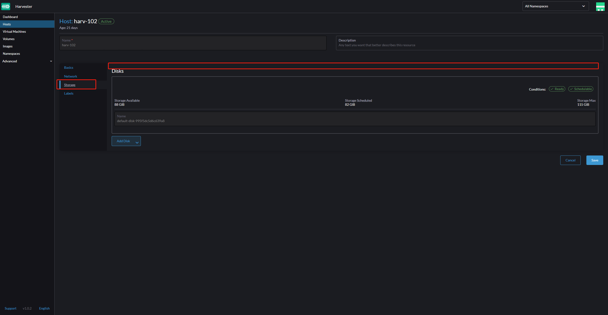
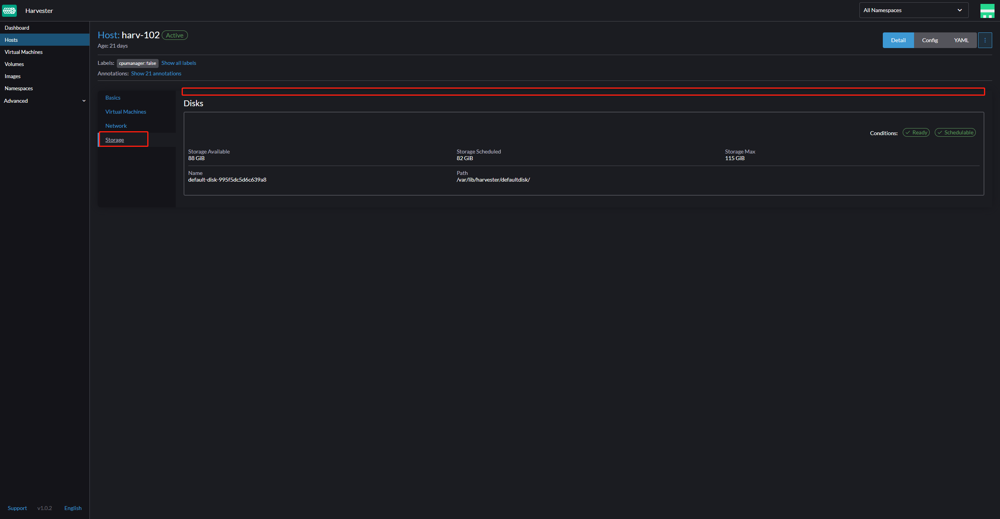
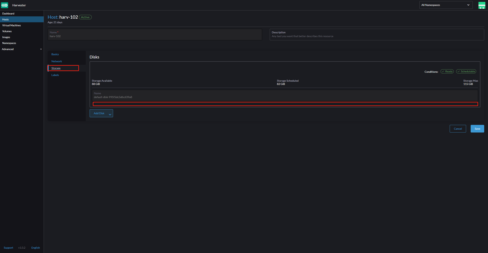
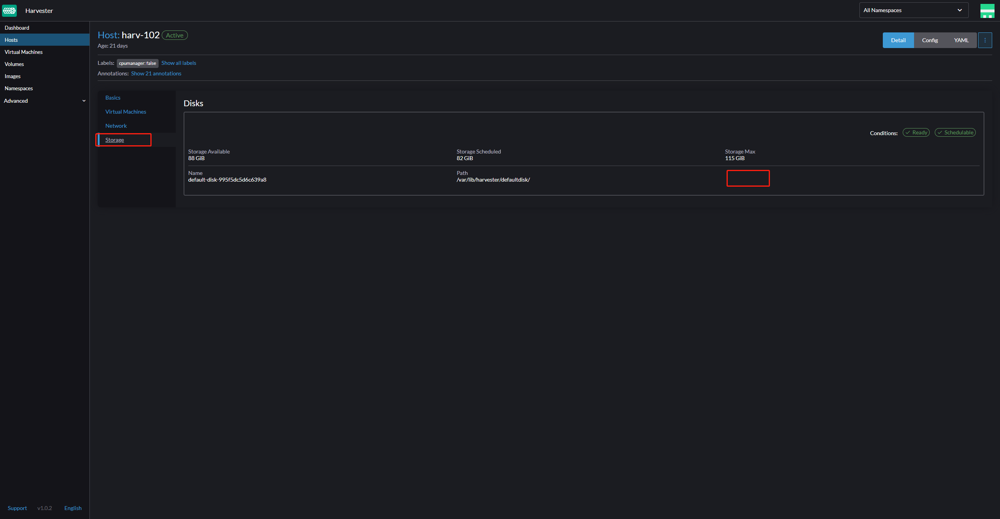
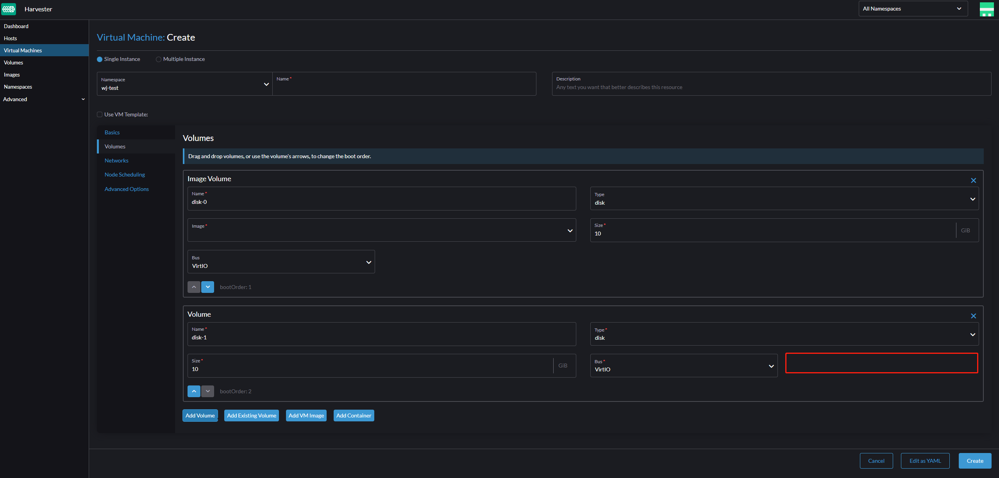
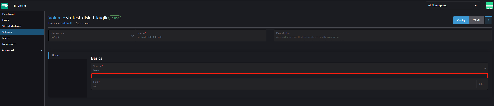
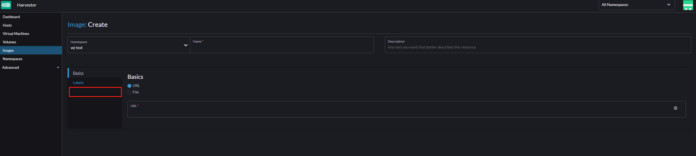
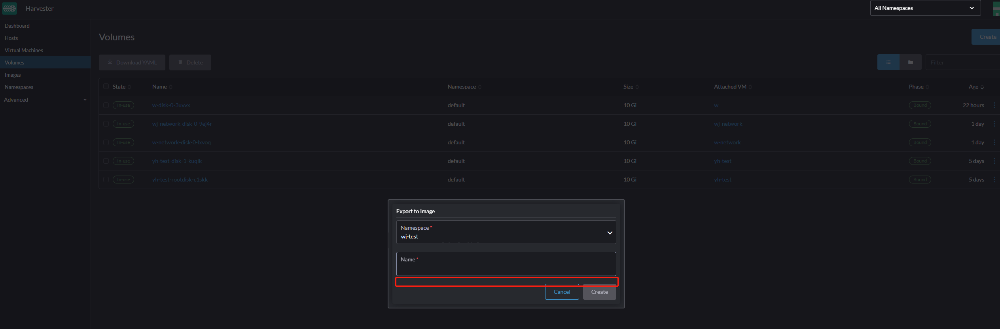
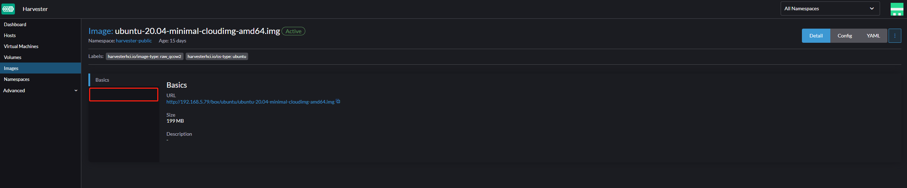
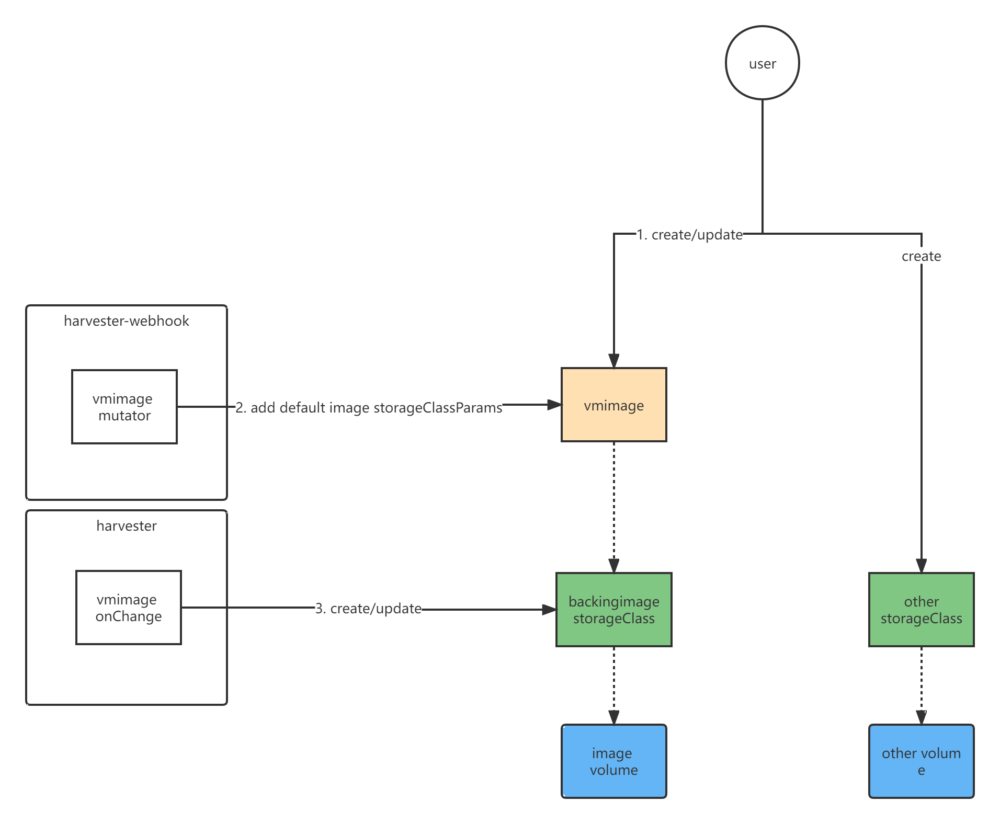

# Storage Tiering

## Summary
Expose storageClass to users. Users can define storage tiers and replicas in storageClass, and then select storageClass to specify storage tiers and replicas when creating a volume or image

### Related Issues
https://github.com/harvester/harvester/issues/2147

## Motivation

### Goals
Allow users to define storage tiers based on:

+ Node tag selectors
+ Disk tag selectors

### Non-goals [optional]

## Proposal

### User Stories

Use a mix of storage hardware at different performance levels to

+ optimize cost
+ provide predictable performance

### User Experience In Detail

#### 1 Node Tag

##### 1.1 Edit Node Tag
`Hosts` > host > `Edit Config` > `Storage`



##### 1.2 Show Node Tag
`Hosts` > host > `Storage`



#### 2 Disk Tag

##### 2.1 Edit Disk Tag
`Hosts` > host > `Edit Config` > `Storage`



##### 2.2 Show Disk Tag
`Hosts` > host > `Storage`



#### 3 Volume
Since there can be various combinations of disk tags and node tags, and the storageClass of pvc must exist before the pvc is created, we need to let the user select the storageClass when creating a volume.

And we need to add a Harvester's `StorageClass` page.

##### 3.1 Create Volume
Select storageClass (default to `longhorn`).

+ `Volumes` > `Create`（source=New), backing image storageClass need to be filtered out.

+ `Virtual Machines` > `Create` > `Volumes` > `Add Volume`, backing image storageClass need to be filtered out.

+ `Snapshots` > snapshot > `Restore`
  - For snapshot of an image volume, if source storageClass is not found, it can not be restored.
  - For snapshot of other volume, only show storageClasses those have the same provisioner of source storageClass and choose source storageClassName by default. If source storageClass is not found, need show a warning message.
  - For the above two points, save source provisioner, storageClassName,ImageID in snapshot's annotations during volume snapshot.

##### 3.2 Show Volume
show storageClassName

+ `Volumes` > volume


#### 4 Image
Since the storageClass of backing image is created dynamically, we can let users select a storageClass as base template when creating images.

##### 4.1 Create Image
Select storageClass (default to `longhorn`)

+ `Images` > `Create`, backing image storageClass need to be filtered out.
  
+ `Volumes` > volume > `Export`, backing image storageClass need to be filtered out.
  

##### 4.2 Show Image
Show parameters of storageClass

+ `Images` > image
  


### API changes

Add a new field: `storageClassParameters`, type `map[string]string`, to `harvesterhci.io.virtualmachineimages.spec`.

If `storageClassParameters` are allowed to be modified, the backend deletion and reconstruction of the storageClass being used may cause unpredictable consequences.
And it is difficult to know from the storageClass information what the parameters were when the PVC was created.
This makes displaying diskSelector and nodeSelector on the UI potentially inaccurate.
Currently, the URL of image is also not allowed to be modified by the user on the UI
So users should not be allowed to modify the `storageClassParameters` contents.
For different scheduling rules for the same image file, users need to create different images.

```yaml
spec:
  checksum: ""
  displayName: ubuntu-20.04-minimal-cloudimg-amd64.img
  storageClassParameters:
    nodeSelector: "large"
    diskSelector: "hdd"
    migratable: "true"
    numberOfReplicas: "3"
    staleReplicaTimeout: "30"
```

## Design

### Implementation Overview

1. Specify storageClassName in `metadata.Annotations["harvesterhci.io/storageClassName"]` when vm image creating.
2. The `vm image mutator` in `harvester-webhook` will autofill storageClassParameters according to the `metadata.Annotations["harvesterhci.io/storageClassName"]`.
3. The `vm image controller` in `harvester` will create a backing image storageClass according to the `spec.storageClassParameters`.

#### Add vm image mutator to harvester-webhook



### Test plan
