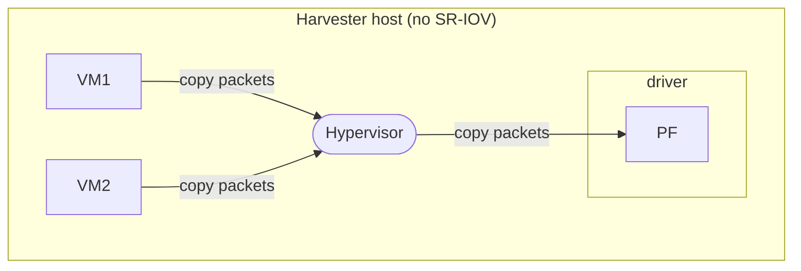
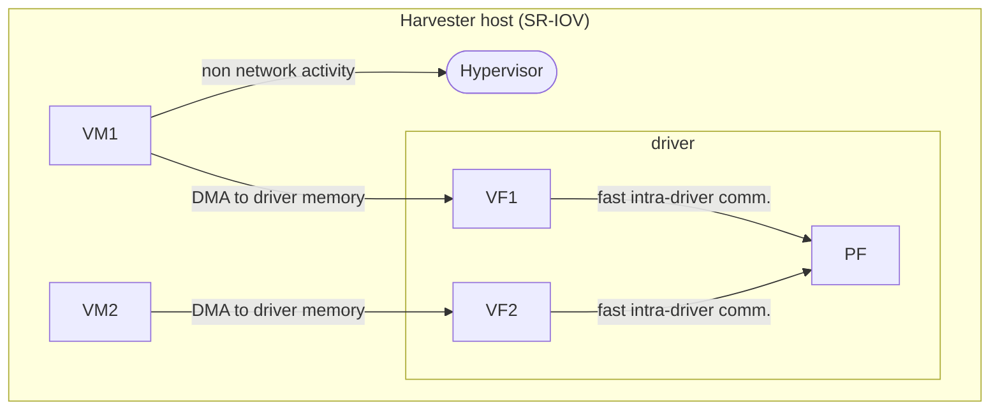
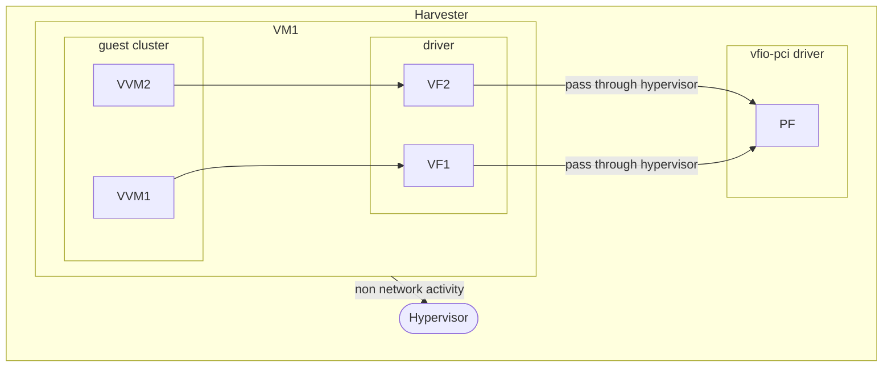
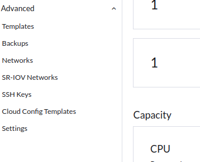

# SR-IOV

Single-Root I/O Virtualization, or SR-IOV, is a hardware feature of some ethernet controllers 
that allows for virtual machines to share a physical NIC.

The SR-IOV-enabled ethernet driver creates "virtual functions" (VFs), which are presented by the OS as multiple ethernet devices.
The physical function (PF) is the real device. For example, if eth0 was the PF and I wanted to create 4 VFs, I could unload the driver with `modprobe -r ethdriver` and then reload it with `max_vfs=4` set. Then the four VFs would be visible when you type `ip link`, they would look like this:

```
% ip link
1: eth0v1 <BROADCAST,MULTICAST...
2: eth0v2 <BROADCAST,MULTICAST...
3: eth0v3 <BROADCAST,MULTICAST...
4: eth0v4 <BROADCAST,MULTICAST...
```

Then four different virtual machines could each use one of the above VFs. 
SR-IOV allows the VM to get direct memory access to the PF. 
This way the VM can copy data directly to the device without going through the hypervisor.

## Summary

Users with SR-IOV-enabled hardware want to use the fast I/O feature with their virtualized workloads.

When a Harvester user creates a VM, the hypervisor creates a virtual ethernet interface. 
The virtual network interface has to copy the data from the guest memory to the host memory where the driver can access it.
This means that without SR-IOV, network throughput on VMs is slowed down.



With SR-IOV enabled, the driver exposes multiple VFs, each of which can be assigned to be exclusively owned by Pods or VMs. Further, SR-IOV gives the VM direct memory access (DMA) to the PF's driver memory for better network performance.



### Related Issue(s)

 - https://github.com/harvester/harvester/issues/992

## Motivation

### Goals

- Empower our customers to make full use of their SR-IOV hardware, speeding up their virtualized workloads
  - For example, [this user](https://github.com/harvester/harvester/issues/992#issue-935351354) who wrote the issue can't get 10Gbps throughput. After we ship SR-IOV, if they can get 10Gbps in their VMs, then this enhancement will be considered a success.

### Non-goals [optional]

- GPU Support (there is a separate [HEP](20220722-gpu-support.md) covering that)
- PCI-Passthrough (there is a separate [HEP](20220722-pci-passthrough.md) covering that)

## Proposal
### User Stories
#### Story 1
SR-IOV in the host cluster, with VMs being assigned host VFs.

Without SR-IOV, Alice's 8 VMs are bottlenecked on network I/O. 
So if all 8 VMs are generating a stream of data, only one stream at a time is being copied into the PF's buffer. 
This leads to sub-optimal streaming performance.

With SR-IOV enabled, Alice's 8 VMs are no longer bottlenecked when streaming, they can take full advantage of the 
network card's true speed. The VMs each believe they have their own NIC, and then the SR-IOV-enabled driver in the host OS 
will optimize the throughput based on it's physical hardware limits, not based on the software limits of the hypervisor.

#### Story 2
SR-IOV in the guest cluster, with [pci-passthrough](20220722-pci-passthrough.md) enabled. 
The cluster running in the VMs will create VFs, using the passed-through PCI device as the PF.




### User Experience in detail
#### Story 1 in detail
[Story 1 summary](#story-1)

Alice has a baremetal Harvester cluster where each node has an Intel E800 
Series Ethernet controller that can support 8 VFs.

Alice enables SR-IOV by changing the value of the `sriov-config` setting to:
```json
{
  "sriov_enabled": true,
  "num_vfs": 8,
}
```
The default value is:
```json
{
  "sriov_enabled": false,
  "num_vfs": 0,
}
```

After changing `sriov-config`, in the background, Harvester unloads the driver for the sriov-capable PCI devices, and then reloads 
the driver with `max_vfs = $sriov-config.num_vfs`. It then installs the `sriov-network-operator` and `cert-manager` to make 
the SR-IOV network operator's admission webhooks work.

After the installation is complete, it then creates an SriovNetworkNodePolicy CR:

```yaml
apiVersion: sriovnetwork.harvesterhci.io/v1alpha1
kind: SriovNetworkNodePolicy
metadata:
  name: sriov-policy-202207221730
  namespace: harvester-sriov-network-operator
spec:
  nodeSelector:
    feature.node.kubernetes.io/network-sriov.capable: "true"
  resourceName: intelnics
  priority: 99
  mtu: 9000
  numVfs: 8
  nicSelector:
    pfNames: ["eth1v#1-8"]
  deviceType: vfio-pci
```

Harvester checks the ``SriovNetworkNodeState`` object (automatically built by the operator) to populate the `nicSelector`.

The choice of `pfNames` with a range of NIC names assumes that all the machines in the cluster have the same hardware.
This sets up a pool of VF resources that can be allocated to VM pods automatically by the `sriov-network-operator`'s CNI plugin.

The `SriovNetworkNodePolicy` is an implementation detail that Alice doesn't have to directly work with. 
She just sets the `sriov-config` object and Harvester instructs the sriov-network-operator what Alice intends to do.
This was an explicit design choice to simplify the user experience.

After the driver is reloaded with the desired number of VFs, and the operator and cert-manager are installed, the operator begins to search the nodes on the network tagged with `feature.node.kubernetes.io/network-sriov.capable: "true"`. The operator then finds all the SR-IOV PFs and VFs for that node, and then builds up the `SriovNetworkNodeState` for that node.

Alice now has to create an `SriovNetwork`. 
The `SriovNetwork` is used to assign VFs to VMs.

To create an `SriovNetwork`, Alice goes to the Advanced menu:

 

After creating the `SriovNetwork` object, the operator will create a corresponding `NetworkAttachmentDefinition` with the same name.
This `NetworkAttachmentDefinition` will be visible from the Advanced Networks UI. When Alice attaches a VM to the `SriovNetwork`, 
the operator's network resources injector will add the `resource` field to the first container of the pod. This will give the VM access to a VF.

#### Story 2 in detail
[Story 2 summary](#story-2). 

TODO

### API changes

## Design

### Implementation overview

##### Changes to [Harvester installer](https://github.com/harvester/harvester-installer) 
- During installation, use `lspci -s PCI_ADDRESS -v | grep SR-IOV` to check if the node has any SR-IOV capable hardware.
   - If so, then label the node with `feature.node.kubernetes.io/network-sriov.capable=true`, this is the default `nodeSelector`, 
     it allows the operator to find the nodes and start building out the `SriovNetworkNodeState`

##### Changes to [Harvester backend](https://github.com/harvester/harvester) 
- Add the `sriov-config` setting with a default value to help users know what to enter. If this config object becomes more complex 
  over time, the default value can help the user manage that complexity.
- The `sriov-network-operator` 
##### Changes to [Harvester frontend](https://github.com/harvester/dashboard) 
- The `sriov-config` setting will need to be allow-listed to appear in the UI.
- There needs to be a new entry in the Advanced Menu for creating `SriovNetwork` objects. The operator will create a 
  corresponding `NetworkAttachmentDefinition` object.

### Test plan

#### Manual test
1. Install latest build on a test box with SR-IOV capabilities. 
2. Run through installer and enable SR-IOV setting, wait for settings controller to finish installing 
    SR-IOV dependencies.
3. Verify that the `sriov-network-operator` is installed and that the `SriovNetworkNodeState`s look right.

```shell
k get -n sriov-network-operator \
  sriovnetworknodestates -o yaml \
  | yq '.items[].status'
```

And check that the SR-IOV devices are in the YAML output.

4. Create an SriovNetwork and a VM, assign the VM to the SriovNetwork's VLAN.
5. Run the DPDK sample application and verify the throughput is correct
TODO build the sample application and measure it's speed both with and without SR-IOV enabled. 
Use that as a baseline to decide if test passed or not.


### Upgrade strategy

TODO 
    
# TODO List for PR
## DONE Per-device SR-IOV device list, like the PCI-PT device list idea: https://github.com/harvester/harvester/pull/2555#discussion_r930913566
## TODO VM usage example https://github.com/harvester/harvester/pull/2555#discussion_r930916119
## DONE ns to us https://github.com/harvester/harvester/pull/2555#discussion_r930886942
## DONE 992 
