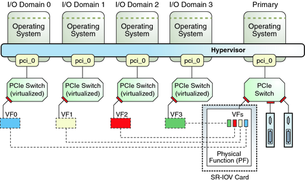
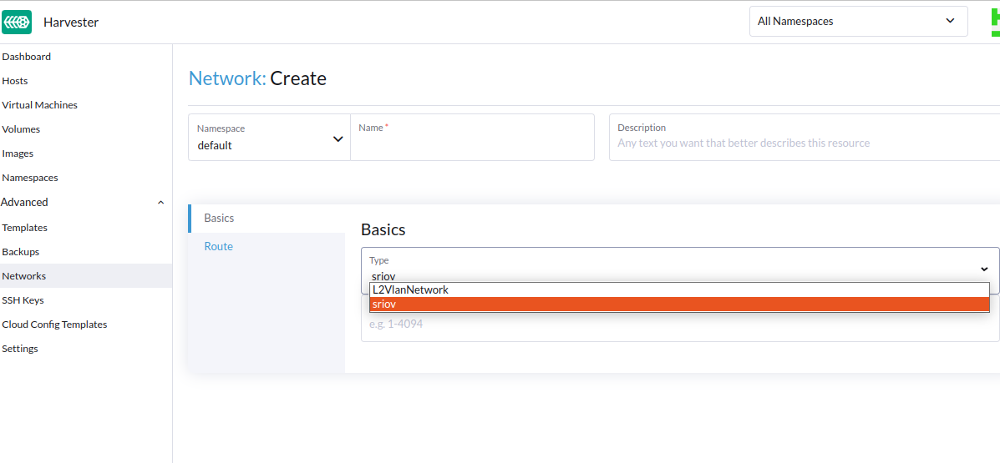
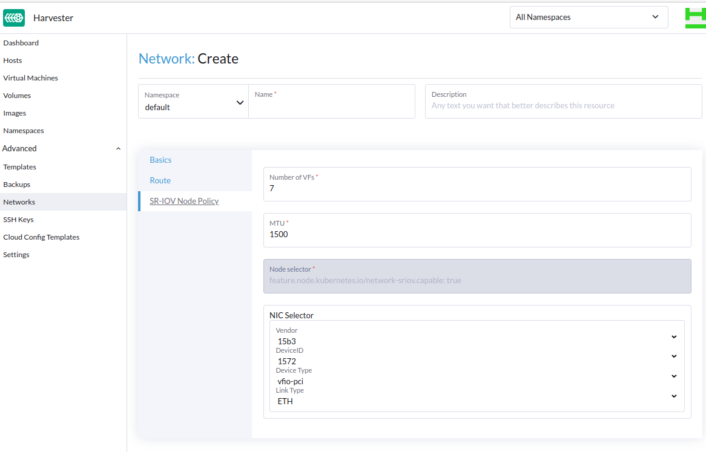

# SR-IOV Configuration

SR-IOV stands for Single-Root I/O Virtualization. It provides a way for virtual machines to directly access and even share physical network interfaces. SR-IOV drivers create multiple VFs (Virtual Functions). 

VFs are exposed by the kernel as a named NIC. For example, `eth1` is a NIC, and there are 4 VFs, so the OS and the VMs both see `eth1v1`, `eth1v2`, `eth1v3` and `eth1v4`. The PF (Physical Function) is represented by `eth1`, and the VFs are the four `eth1vN` interfaces above.

## User Experience

The Harvester cluster admin starts by installing Harvester. By default, the SR-IOV feature is disabled.

If the user wants to enable the feature, they need to set the ui-source

After Harvester has been installed, the `network-sriov.capable` label has been set for each node. Each additional node gets this label attached to it when it goes through installation using the "Join" method.

Admin wants to create an SR-IOV Network. To do so, they navigate to the Harvester Dashboard UI. Admin expands the Advanced menu on the left side and clicks "Networks".

Admin clicks the "Create" button on the right side. The Network Create page has a dropdown for the network type that includes sriov if any node in the cluster is capable.

After they select the sriov option, the Node Policy tab appears:

A note on the NIC Selector, the best way to understand these form values is to look at the type defition for [SriovNetworkNicSelector](https://github.com/openshift/sriov-network-operator/blob/dc0a8bda79f1405d09f2fe3619506f79bfe41f42/api/v1/sriovnetworknodepolicy_types.go#L59-L70). 

After the node policy is created, the networks' `spec.resourceName` is set to the policy's `spec.resource`.

# TODOs
- [ ] Explore local cluster SR-IOV
- [ ] Explore guest cluster SR-IOV with PCI passthrough
