# Title

Network Policy HEP

## Summary

The enhanced Harvester network policy.

### Related Issues

https://github.com/harvester/harvester/issues/2260

## Terminology

For clarity, this HEP defines and lists the following terms:

`Host Harvester Cluster`: A Harvester cluster which provisions VM, connects to the provider network.

`Guest Kubernetes Cluster`: A Kubernetes cluster that is deployed in VMs provisioned by Host Harvester Cluster.

`VM Group`: A group of VM provisioned by Host Harvester Cluster, those VMs can communicate with each other by default. Different VM Groups are isolated by default. Guest Kubernetes Cluster is also kind of VM Group.

`Tenant/Project`: A Tenant/Project is using a VM Group, some advanced features like L3 VxLAN Gateway, NAT may also be included.

`Management Network` / `Default Network`: The default network used by kubernetes management. Both `Host Harvester Cluster` and `Guest Kubernetes Cluster` have such a network.

`Second Network` / `Additional Network`: A dedicated network in `Host Harvester Cluster`, it is provisioned to `Guest Kubernetes Cluster` / `VM Group`. There may be multi `Second Network` in  `Host Harvester Cluster`.

`Service`: A Kubernetes Service that identifies a set of Pods using label selectors. Unless mentioned otherwise, Services are assumed to have virtual IPs only routable within the cluster network.

## Motivation

.

### Goals

  Support network policies for micro-segmentation of workloads [FEATURE] Support network policies for micro-segmentation of workloads https://github.com/harvester/harvester/issues/2260

```
This requirement is related to Harvester provisioned VM
Example:
Given two VMs attached to same VLAN
  User can restrict communication between VM1 and VM2
  User can restrict communication between VM1 and external hosts
  based on native Kubernetes Network Policy framework

It is from customers.
  They are migrating from Openstack where they can define security policies for VM workloads.
  They are deploying applications in those VMs and want to manage network access policies for the VMs/apps
```


### Non-goals [optional]

.

## Proposal
.

### User Stories


#### Story 1

Network policy/Security group/... (a proper name is needed)

##### Network policy in `Guest Kubernetes Cluster`

Per kubernetes document, it is done by `Guest Kubernetes Cluster`, out of scope of this HEP.

https://kubernetes.io/docs/concepts/services-networking/network-policies/

note, cite from previous link:
```
(Kubernetes) NetworkPolicies are an application-centric construct which allow you to specify how a pod is allowed to communicate with various network "entities"
 (we use the word "entity" here to avoid overloading the more common terms such as "endpoints" and "services",
 which have specific Kubernetes connotations) over the network.
 NetworkPolicies apply to a connection with a pod on one or both ends, and are not relevant to other connections.


The entities that a Pod can communicate with are identified through a combination of the following 3 identifiers:

  Other pods that are allowed (exception: a pod cannot block access to itself)
  Namespaces that are allowed
  IP blocks (exception: traffic to and from the node where a Pod is running is always allowed, regardless of the IP address of the Pod or the node)

When defining a pod- or namespace- based NetworkPolicy, you use a selector to specify what traffic is allowed to and from the Pod(s) that match the selector.

Meanwhile, when IP based NetworkPolicies are created, we define policies based on IP blocks (CIDR ranges).

```

###### The two sorts of Pod isolation

```
There are two sorts of isolation for a pod: isolation for egress, and isolation for ingress. They concern what connections may be established.
"Isolation" here is not absolute, rather it means "some restrictions apply".
The alternative, "non-isolated for $direction", means that no restrictions apply in the stated direction.
The two sorts of isolation (or not) are declared independently, and are both relevant for a connection from one pod to another.

By default, a pod is non-isolated for egress.

By default, a pod is non-isolated for ingress.

Network policies do not conflict; they are additive.
```

###### A sample of network policy

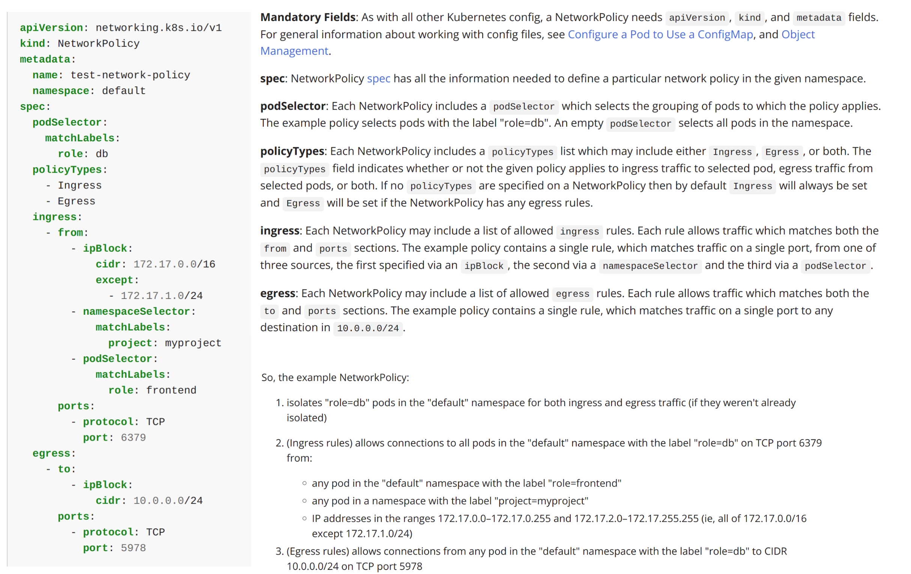

##### Network policy in `Host Kubernetes Cluster`

General speaking, the main task of `Host Kubernetes Cluster` is to provision VM for `Guest Kubernetes Cluster`/`VM Group`. We will try to define kind of concept to control `VM Group` with `VM Group`.


###### Harvester VM Network Policy based on Kubernetes Network Policy framework

Map previous sample into `Harvester VM Network Policy`.

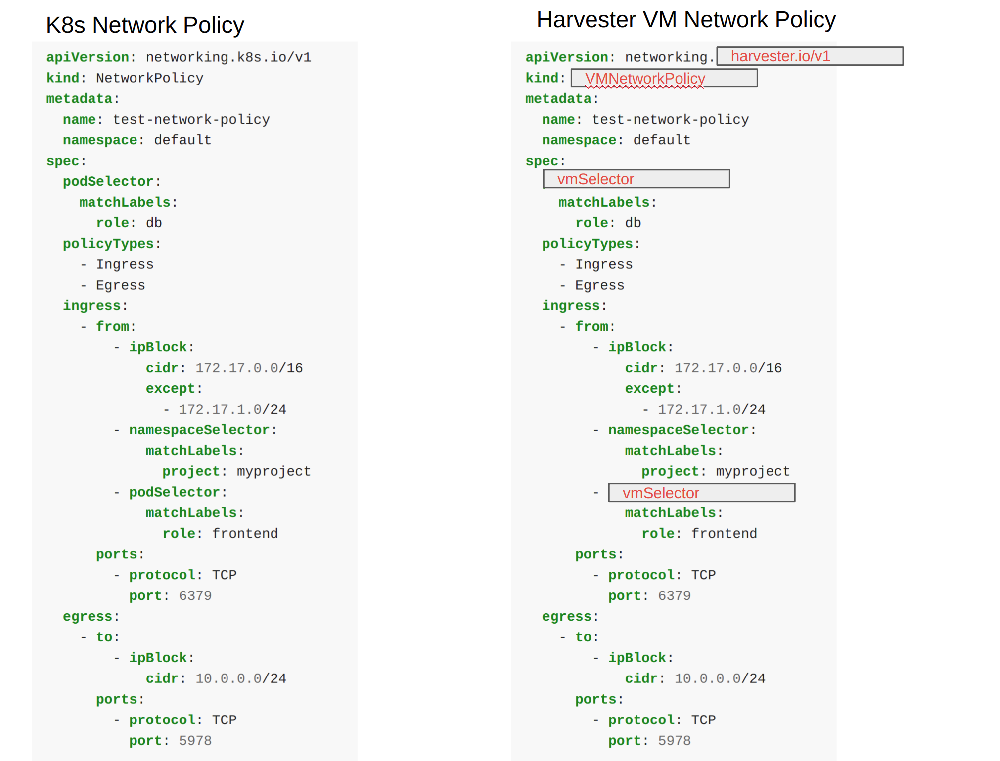


Definition


#### Story 2

##### Harvester VM Network Policy - management network

Harvester utilizes Calico + Falnnel as the default management network.

With Calico, certain kubernetes network policy could be applied from POD perspective.

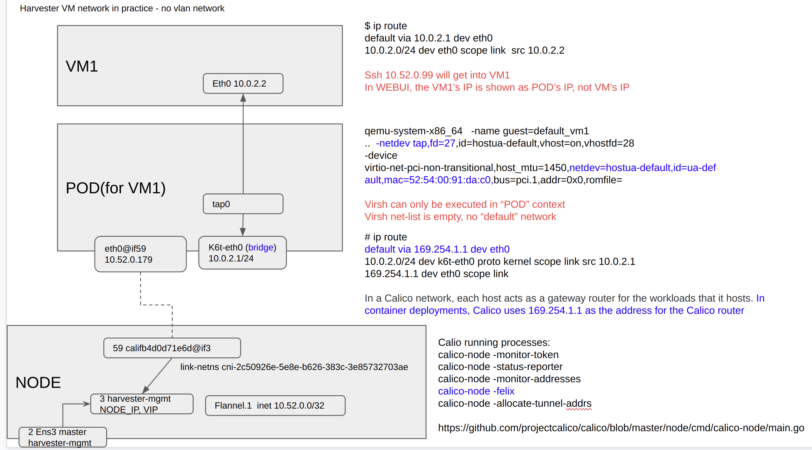


Note: Harvester provisioned VM should use dedicated none-management network.

#### Story 3

##### Harvester VM Network Policy - VLAN network

Suppose Harvester provisioned VM is using VLAN network. The network policy should apply to this network at the view of VM.

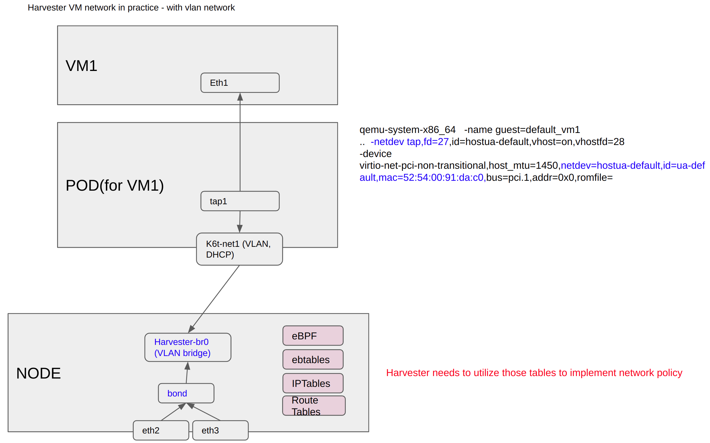

The Harvester VLAN network for VM.

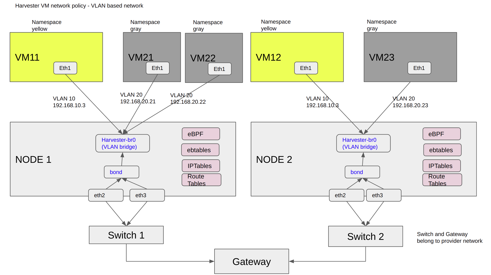

VM network policy sample.

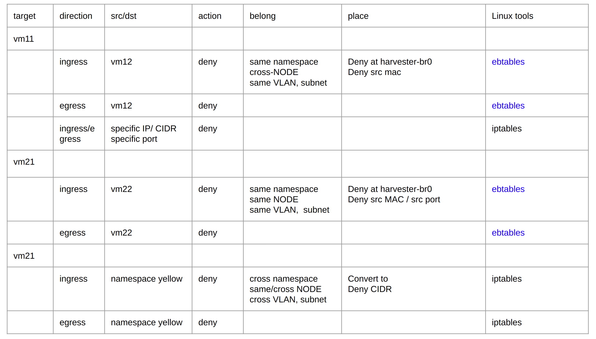

`ebtables` and `iptables` will be the tool for Harvester network policy in VLAN network.

#### Story 4

##### Calico network policy

From the official website, it says "The network policy is a combination of `Calico` and `Istio` " .

Besides supporting kubernetes network policy, Calico supports more.

General architecture:

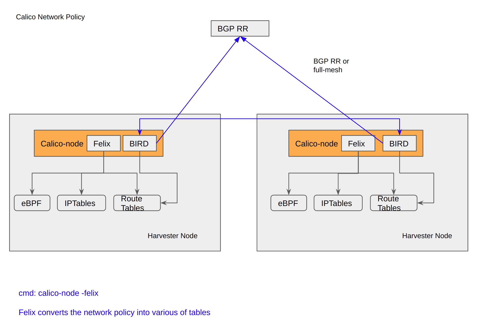


Calico policy features:

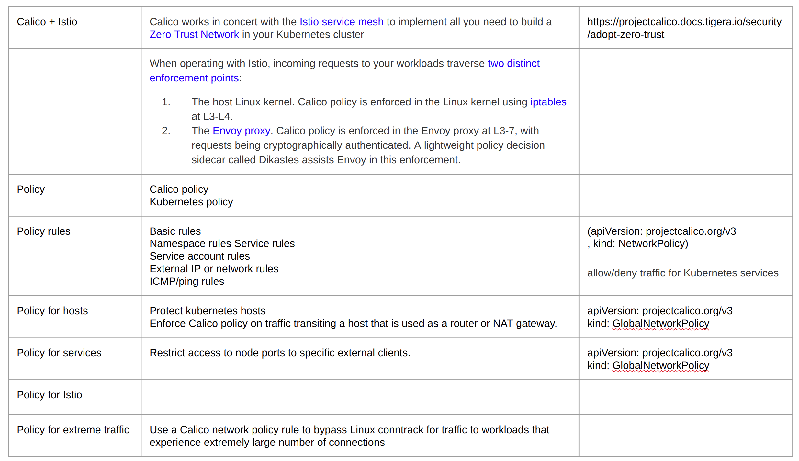

Calico as a kubernetes CNI:

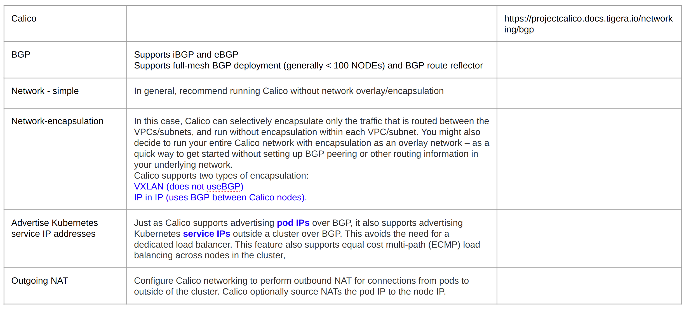


##### Cilium network policy

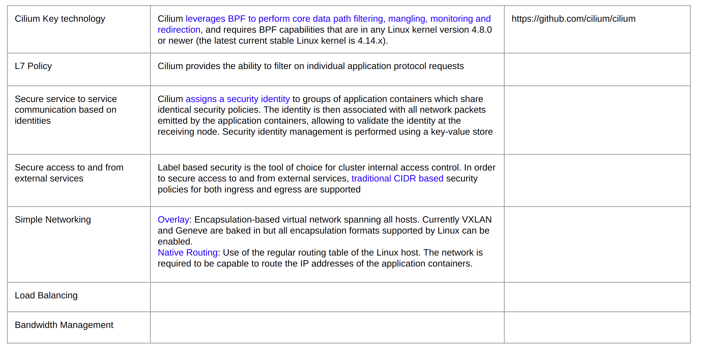

The `Cilium` network policy is based on `eBPF` .

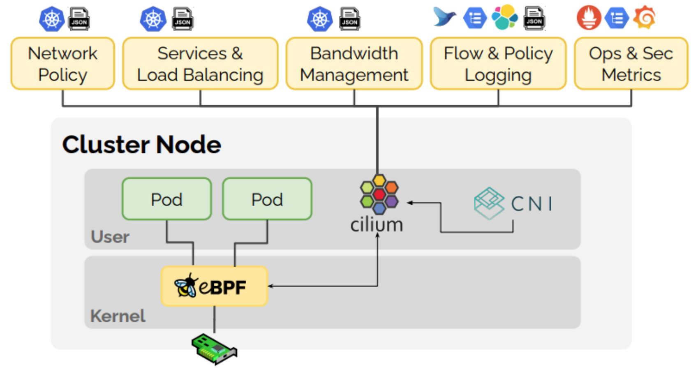

### User Experience In Detail

.


### API changes

## Design

### Implementation Overview

`ebtables` needs to be added into Harvester

```
  tools            Harvester NODE                    Harvester POD (for VM)

  iptables         available, working                iptables v1.8.7 (legacy): can't initialize iptables table `filter': Permission denied (you must be root)
  ebtables         command not found                 Problem getting a socket, you probably don't have the right permissions.


harvester-node:~ # cat /proc/sys/net/bridge/bridge-nf-call-iptables
0


harvester-node:~ # lsmod | grep filter
br_netfilter           28672  0
bridge                225280  1 br_netfilter
```

ebtables/iptables interaction on a Linux-based bridge

http://ebtables.netfilter.org/br_fw_ia/br_fw_ia.html


```
sudo ebtables --list

Bridge table: filter

Bridge chain: INPUT, entries: 0, policy: ACCEPT

Bridge chain: FORWARD, entries: 0, policy: ACCEPT

Bridge chain: OUTPUT, entries: 0, policy: ACCEPT
```


man ebtables

Tables
As stated earlier, there are three ebtables tables in the Linux kernel. The table names are filter, nat and broute. Of these three tables, the filter table is the default table that the command operates on. If you are working with the filter table, then you can drop the '-t filter' argument to the ebtables command. However, you will need to provide the -t argument for the other two tables. Moreover, the -t argument must be the first argument on the ebtables command line, if used.


-p, --protocol [!] protocol
The protocol that was responsible for creating the frame. This can be a hexadecimal number, above 0x0600, a name (e.g. ARP ) or LENGTH. The protocol field of the Ethernet frame can be used to denote the length of the header (802.2/802.3 networks). When the value of that field is below or equals 0x0600, the value equals the size of the header and shouldn't be used as a protocol number. Instead, all frames where the protocol field is used as the length field are assumed to be of the same 'protocol'. The protocol name used in ebtables for these frames is LENGTH.
The file /etc/ethertypes can be used to show readable characters instead of hexadecimal numbers for the protocols. For example, 0x0800 will be represented by IPV4. The use of this file is not case sensitive. See that file for more information. The flag --proto is an alias for this option.

-i, --in-interface [!] name
The interface (bridge port) via which a frame is received (this option is useful in the INPUT, FORWARD, PREROUTING and BROUTING chains). If the interface name ends with '+', then any interface name that begins with this name (disregarding '+') will match. The flag --in-if is an alias for this option.

--logical-in [!] name
The (logical) bridge interface via which a frame is received (this option is useful in the INPUT, FORWARD, PREROUTING and BROUTING chains). If the interface name ends with '+', then any interface name that begins with this name (disregarding '+') will match.

-o, --out-interface [!] name
The interface (bridge port) via which a frame is going to be sent (this option is useful in the OUTPUT, FORWARD and POSTROUTING chains). If the interface name ends with '+', then any interface name that begins with this name (disregarding '+') will match. The flag --out-if is an alias for this option.

--logical-out [!] name
The (logical) bridge interface via which a frame is going to be sent (this option is useful in the OUTPUT, FORWARD and POSTROUTING chains). If the interface name ends with '+', then any interface name that begins with this name (disregarding '+') will match.


-s, --source [!] address[/mask]
The source MAC address. Both mask and address are written as 6 hexadecimal numbers separated by colons. Alternatively one can specify Unicast, Multicast, Broadcast or BGA (Bridge Group Address):
Unicast=00:00:00:00:00:00/01:00:00:00:00:00, Multicast=01:00:00:00:00:00/01:00:00:00:00:00, Broadcast=ff:ff:ff:ff:ff:ff/ff:ff:ff:ff:ff:ff or BGA=01:80:c2:00:00:00/ff:ff:ff:ff:ff:ff. Note that a broadcast address will also match the multicast specification. The flag --src is an alias for this option.
-d, --destination [!] address[/mask]
The destination MAC address. See -s (above) for more details on MAC addresses. The flag --dst is an alias for this option.


vlan
Specify 802.1Q Tag Control Information fields. The protocol must be specified as 802_1Q (0x8100).
--vlan-id [!] id
The VLAN identifier field (VID). Decimal number from 0 to 4095.
--vlan-prio [!] prio
The user priority field, a decimal number from 0 to 7. The VID should be set to 0 ("null VID") or unspecified (in the latter case the VID is deliberately set to 0).
--vlan-encap [!] type
The encapsulated Ethernet frame type/length. Specified as a hexadecimal number from 0x0000 to 0xFFFF or as a symbolic name from /etc/ethertypes.

ip
Specify IPv4 fields. The protocol must be specified as IPv4.
--ip-source [!] address[/mask]
The source IP address. The flag --ip-src is an alias for this option.
--ip-destination [!] address[/mask]
The destination IP address. The flag --ip-dst is an alias for this option.
--ip-tos [!] tos
The IP type of service, in hexadecimal numbers. IPv4.
--ip-protocol [!] protocol
The IP protocol. The flag --ip-proto is an alias for this option.
--ip-source-port [!] port1[:port2]
The source port or port range for the IP protocols 6 (TCP), 17 (UDP), 33 (DCCP) or 132 (SCTP). The --ip-protocol option must be specified as TCP, UDP, DCCP or SCTP. If port1 is omitted, 0:port2 is used; if port2 is omitted but a colon is specified, port1:65535 is used. The flag --ip-sport is an alias for this option.
--ip-destination-port [!] port1[:port2]
The destination port or port range for ip protocols 6 (TCP), 17 (UDP), 33 (DCCP) or 132 (SCTP). The --ip-protocol option must be specified as TCP, UDP, DCCP or SCTP. If port1 is omitted, 0:port2 is used; if port2 is omitted but a colon is specified, port1:65535 is used. The flag --ip-dport is an alias for this option.


### Test plan

Integration test plan.

### Upgrade strategy

Anything that requires if user want to upgrade to this enhancement

## Note [optional]


## reference

.


