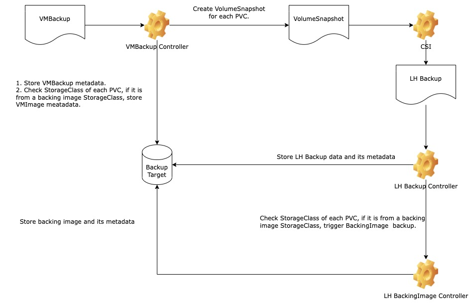
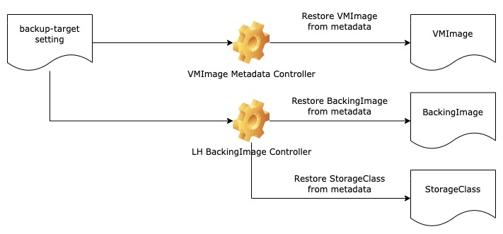

# Backup VM images

## Summary

When users backup a VM, we should give them an option to backup the VMImage, so they don't need to manually create a same VMImage as the StorageClass in a new cluster.

### Related Issues

- https://github.com/harvester/harvester/issues/2237

## Motivation

### Goals

- Users can specify `backup: true` in VMImage to upload images.
- System can automatically download image files from a `backup-target` and restore them as VMImage and StorageClass in a new cluster.
- Store VMImage files in a different folder from VMBackup.

### Non-goals

- Handle VMImage name conflict.

## Proposal

### User Stories

#### Restore a VMBackup from another cluster

Currently, we only have VMBackup in `backup-target`. For restoring a VMBackup, we not only need data in VMBackup, but also VMImage. However, users can't create a new VMImage in a new cluster directly and use it with a existing VMBackup, because a StorageClass name for the VMImage may be different. Users can only do it by [creating a VMImage with the same name and same image content](https://docs.harvesterhci.io/v1.0/vm/backup-restore/#restore-a-new-vm-on-another-harvester-cluster). If we can help users backup and import same VMImages from an old cluster, users can easily create a new VM by restoring a VMBackup.

### User Experience In Detail

#### Harvester Dashboard

Users only need to follow same process to backup VM.

### API changes

No API changes.

## Design

### VMImage backup flow

### VMImage restore flow

### Implementation Overview

1. Update `harvester-vm-backup-controller`.
    - Check whether VMBackup is ready.
        - If VMBackup is not ready, do nothing.
        - If VMBackup is ready, check StorageClass in each PVC.
            - If the StorageClass is not from a Backing Image, do nothing.
            - If the StorageClass is from a Backing Image:
                - Check whether the VMImage metadata file is existent in `harvester/vmimages/<namespace>-<name>/vmimage-metadata.yaml`.
                    - If not, upload the file.
                    - If yes, check whether the content is same.
                        - If not, upload the file to replace it.
                        - If yes, do nothing.

2. Change `harvester-backup-metadata-controller` to `harvester-vmbackup-metadata-controller`.

3. Add `harvester-vmimage-metadata-controller`.
    - This controller is triggered by `backup-target` setting change.
    - Sync VMImage from the new `backup-target`:
        - Go through each folder in `harvester/vmimages`:
            - Check whether the VMImage is existent in the current cluster.
                - If yes, do nothing.
                - If not, create a VMImage.

### Test plan

- Backword compability.
- If there is a VMBackup, the correspond VMImage should be uploaded to backup target.
- If `backup-target` setting is configured and then set as default, users don't lose VMImage data in backup target.
- If data in backup target is not same as the cluster, data in backup target will be replaced.

### Upgrade strategy

No user intervention is required during the upgrade.
