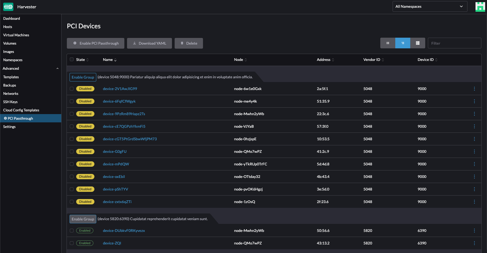
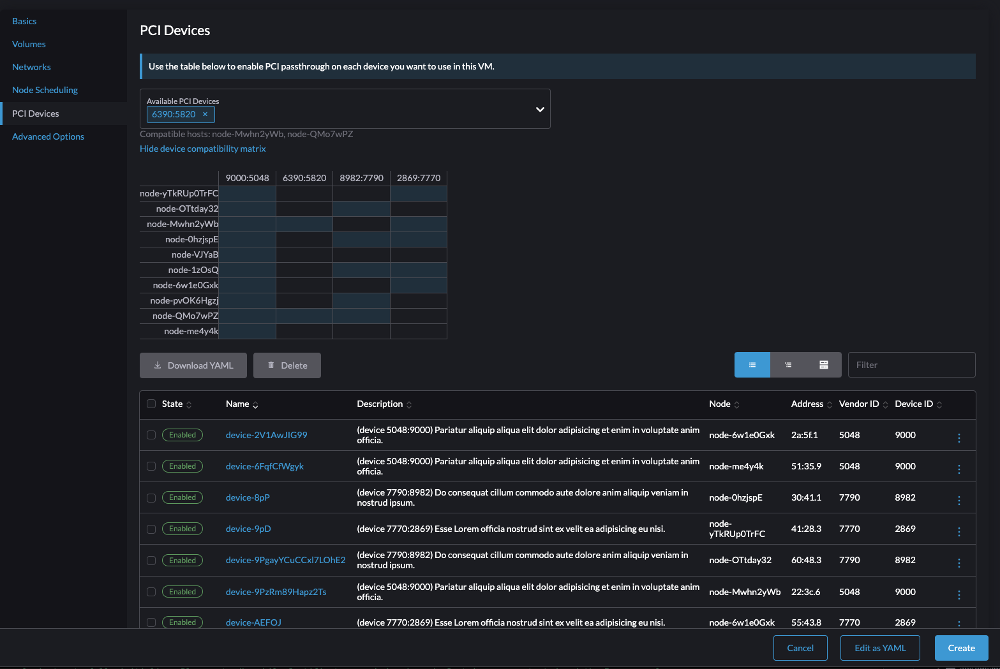

# PCI Passthrough

PCI Passthrough allows Virtual Machines to have direct access to a PCI device, without 
having to copy data through the hypervisor.

## Summary

Users who want to use SR-IOV or GPU support in a virtualized "guest" cluster 
on Harvester must first enable PCI Passthrough, which we can call PCI-PT for short.

### Related Issues

- https://github.com/harvester/harvester/issues/992
- https://github.com/harvester/harvester/issues/1029

## Motivation

### Goals

- Enable SR-IOV in Guest cluster mode
- Enable GPU support (not vGPU mediatated devices)

## Proposal

### User Stories

#### Story 1
Alice wants to run a TensorFlow machine learning application on her cluster. 

She has three nodes in the cluster, with a mix of different GPUs. 

List of nodes:
- node1
  - NVIDIA GeForce GTX 1660
  - AMD Radeon RX 6800
- node2
  - NVIDIA GeForce GTX 2080
  - NVIDIA Tesla V100
- node3 
  - NVIDIA GeForce GTX 1660
  - NVIDIA Tesla V100
  - AMD Radeon RX 6800
  
During installation, the installer set the necessary kernel parameters* to enable PCI-PT.
<details>
  <summary>*PCI-PT kernel parameters</summary>

  ### For Intel users
```
GRUB_CMDLINE_LINUX="intel_iommu=on iommu=pt rd.driver.pre=vfio-pci"
```
  ### For AMD users
```
GRUB_CMDLINE_LINUX="iommu=pt amd_iommu=on rd.driver.pre=vfio-pci"
```

In [installer PR 383](https://github.com/harvester/harvester-installer/pull/383) both of these parameters are introduced to /etc/cos/bootargs.cfg avoid situations where the harv-install script had a failure before the `update_grub_settings()` function and it didn't set the correct parameters.
</details>

In order to expose these devices to the VMs, Alice goes to the Advanced menu and 
selects "PCI-PT", and is presented with a list of devices, and all the nodes 
they belong to:

- NVIDIA GeForce GTX 1660
  - node1
  - node3
- AMD Radeon RX 6800
  - node1
  - node3
- NVIDIA GeForce GTX 2080
  - node2
- NVIDIA Tesla V100
  - node2
  - node3

Here's a screenshot of the PCI Devices UI:

  
Alice's TensorFlow application contains some CUDA-specific code, so she only enables 
the three NVIDIA devices by checking the box next to them. By default, all the nodes 
with that device are selected. Then she presses the "Pass devices through on selected nodes"
button.

Alice goes to create a VM, and in the form to create a VM, there is a "PCI Devices" list.
When she selects a PCI Device, the Node Scheduling section is automatically updated to 
"Run VM on node(s) matching scheduling rules", where the scheduling rule is "node X has 
device D". This will ensure that the VM only runs on nodes with the selected device.

As PCI Devices are selected and assigned, the assignment rule for the VM narrows down to only those nodes with those selected devices.


  

Once the VM is created, it is scheduled to run on the nodes with those devices, and those devices have already been configured for PCI-PT.

Inside the VM, the NVIDIA GPU drivers still need to be installed, but the process will be the same as installing them on the host. Now that Harvester is aware that the PCI device is ready for passthrough, and has been assigned to the VM, the rest can be performed according the the NVIDIA documentation.
    
#### Story 2
Alice wants to run a DPDK Application in her guest cluster and 
make use of SR-IOV, also set up in the guest cluster.

First she has to enable PCI-PT so that the 
guest cluster can directly use the underlying PF* for SR-IOV. 

<details><summary>PF</summary>Physical Function, it's the underlying network device. The VFs, or Virtual Functions, are created by the SR-IOV driver and allow VMs to share a PF.</details>


To set up PCI passthrough on her NIC, she goes to the Advanced menu and selects PCI Passthrough. She sees a list of PCI Devices and the nodes that they are in. She selects the device and clicks a button to enable PCI Passthrough on the device. Once confirmed, she goes to the Virtual Machines menu, and creates the VM that will use the device. There is a PCI Devices tab on the left hand side, where one of the passed-through devices can be assigned to the VM.


After creating the VM and booting it, installing Rancher in the VM, and installing an SR-IOV driver and kubernetes operator, such as [k8snetworkplumbingwg/sriov-network-operator](https://github.com/k8snetworkplumbingwg/sriov-network-operator), Alice can finally assign VFs to Pods or VMs managed by the guest cluster.

### User Experience In Detail

#### Story 1 in detail

First read [Story 1](#story-1) for context.

The list of available PCI Devices is maintained by the [PCI Devices Controller](https://github.com/harvester/pcidevices). The [PCIDevice Custom Resource](https://github.com/harvester/pcidevices#crd) has a status with the PCI address, the vendor id, device id, [iommu group](https://github.com/harvester/pcidevices/pull/30), and kernel module information.

To request a PCI Device be set up for passthrough, the UI will create a `PCIDeviceClaim`. The [PCIDeviceClaim Custom Resource](https://github.com/harvester/pcidevices#crd-1) has a spec that contains the PCI address, node name and user name (reserved for RBAC policies). The status contains the driver that was unbound, this is used when the PCIDeviceClaim is deleted, to return the device back to the host with its original driver.

Then the PCI Devices controller will take the IOMMU Group of the claimed device, and create a PCIDeviceClaim for all the other devices in the IOMMU Group. This is done to preserve the IOMMU rules. More in [pcidevices PR 30](https://github.com/harvester/pcidevices/pull/30).

The preparation for passthrough consists of unbinding the driver, doing a driver override, then binding the 
device to the `vfio-pci` driver:

<details>
<summary>How to manually bind a PCI device to the vfio-pci driver</summary>

**Unbind the device from the driver**

```
echo 0000:02:00.3 > /sys/bus/pci/drivers/igb/unbind
```

**Driver override**
```
echo "vfio-pci" > /sys/bus/pci/devices/0000\:02\:00.3/driver_override
```

**Bind the device to the vfio-pci driver**
```

echo 0000:02:00.3 > /sys/bus/pci/drivers/vfio-pci/bind
```
</details>

Then, once all devices have been prepared for PCI Passthrough, the nodes' status is updated with their 
devices so that kubevirt knows where to schedule VMs that request those devices as resources.

The pcidevices controller will label the node like this:

```
% kubectl get nodes -o yaml | yq '.items[].status.allocatable'

nvidia.com/GP106_GEFORCE_GTX_1060_3GB: "1"
nvidia.com/GP106_HIGH_DEFINITION_AUDIO_CONTROLLER: "1"
```

Which indicates that there is an nvidia GPU ready for a vm on that node. The resourceName key uniquely identifies a type of card, and the value shows the number of those resources on that node.

**NOTE: PCI Passthrough Should Never Be Enabled on the Management NIC**

#### Story 2 in detail

First read [Story 2](#story-2) for context.

The process of creating a `PCIDeviceClaim` here is just like [Story 1 in Detail](#story-1-in-detail).

Now Alice sets up a VM onto which she installs a Rancher cluster. She follows a tutorial 
like [this](https://docs.rke2.io/install/network_options/) and then labels the guest node 

```shell
kubectl label node $NODE-NAME feature.node.kubernetes.io/network-sriov.capable=true
```
Then the `sriov-network-operator` runs in the guest cluster, finding the node labeled `sriov.capable`.

In the guest cluster main node, Alice creates a pod that attaches to the `SriovNetwork` and runs 
her dpdk test application. The throughput is output to standard out, it shows the full 10Gbps now.

### API changes

## Design

### Implementation Overview

The harvester/dashboard UI will have a page under Advanced called PCI Passthrough. There will be a form with devices grouped by `(vendorId, deviceId) => [nodes with that device]`

For each node, processing the `PCIDeviceClaim` involves unbinding the driver from the currently active module, creating a driver override, and then binding to the `vfio-pci` driver. That 
driver will enable VMs to pass through the hypervisor and directly connect to the PCI device.

### Test plan

#### Manual GPU
1. Install Harvester with GPU device plugged into node
2. Create a PCIDeviceClaim for that device 
3. Attach the claimed gpu device(s) to the VM
4. In the VM, install the [NVIDIA GPU Drivers](https://www.nvidia.com/download/index.aspx)
5. In the VM, run `nvidia-smi` to check that the device shows up and is ready to run an example program.
6. Compile this [CUDA Vector Addition](https://github.com/olcf-tutorials/vector_addition_cuda#vector-addition-cuda) example and run it. Check the logs for signs of failure or success.


#### Manual SR-IOV in Guest mode
1. Install Harvester with second NIC device plugged into node (not the management interface)
2. Create a PCIDeviceClaim for that device 
3. Attach the claimed ethernet device to the VM
4. In the VM, run `lspci` to check that the claimed ethernet device shows up
5. In the VM, install the SR-IOV driver for the device, and follow the driver-specific instructions to create VFs for Pods inside that VM.

### Upgrade strategy

In v1.1.0, we use the version of the vfio-pci driver that comes with the 5.3.18-150300.59.93-default kernel. If the release notes of newer vfio-pci driver versions have breaking changes or upgrade requirements, we should incorporate those and any necessary fixes/workarounds into the upgrade path.
