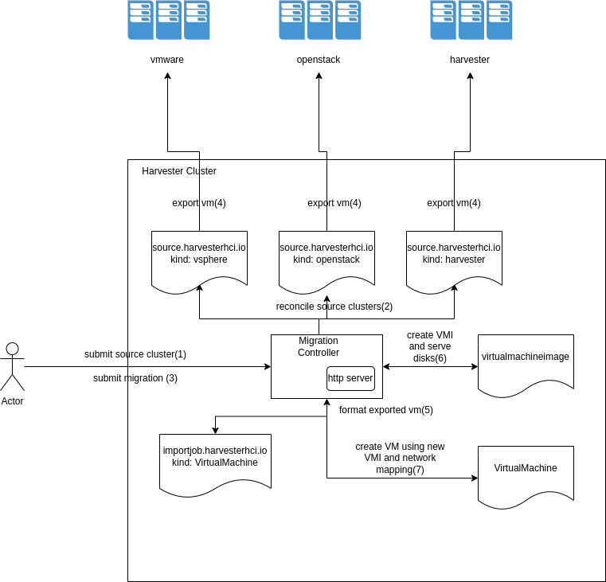

# VM Migration controller

## Summary

To improve adoption we need to provider users an easy way to migrate VM workloads from other cloud providers such as 
* vsphere
* openstack

### Related Issues

https://github.com/harvester/harvester/issues/2274

## Motivation

### Goals
We need a way to allow users to browse their VM workloads running on vmware, openstack or harvester clusters and migrate them to current harvester cluster.

Currently there is no easy way to migrate VM's from other providers to harvester.

### Non-goals [optional]


## Proposal

### User Stories

#### Migrate a VM from Vsphere/Openstack/Harvester cluster
* A user should be able to define a source vsphere/openstack or harvester cluster
* The user should be able to browse the cluster to identify a VM, and configure its network mapping to harvester VLAN definitions.
* After a period of time the user should be able to access the original VM running on Harvester.
* The original VM will be powered off, and it will be up to the end user to get rid of the same.

#### Story 2

### User Experience In Detail

User needs to define the following CRDs. Eventually this can be done via a UI based flow as well.

* Source Cluster definition
```yaml:
apiVersion: source.harvesterhci.io/v1
kind: Vsphere
metadata:
    name: cluster-name
spec:
    endpoint: endpoint
    credentials: secret-reference
```

* VM importjob definition
```yaml:
apiVersion: importjob.harvesterhci.io/v1
kind: VirtualMachine
metadata:
    name: VM-Name
    namespace: Namespace
spec:
    sourceCluster: Reference-to-source-object
    vmName: vmName
    path: folder-if-any
    mapping:
        sourceNetwork: string
        destinationNetwork: NetAttachDefinition-Reference
```
### API changes

No api changes in core harvester. The additional CRD's will be introduced in the VM Migration controller.
The integration with harvester will be managed as ManagedChart.

## Design
The controller will introduce two new Groups:

* source.harvesterhci.io
* importjob.harvesterhci.io

source.harvesterhci.io will support the following kinds based on cluster providers:
* vsphere
* openstack
* harvester (eventually)

importjob.harvesterhci.io will support the kind `VirtualMachine` and will refer to one of the source.harvester.hci kinds to identify the VM on source cluster and perform migration.

### Implementation Overview

At a high level the VM migration controller flow will be as follows:



The workflow implemented by the controller would be:

1. User submits a `source` cluster. 
2. The migration controller performs some basic connectivity checks and reconciles the status of the source object and marks the object ready.
3. User submits a VM `importjob` request.
4. The migration controller refers to the source cluster in the `importjob` request, performs some basic validation such as existing of source VM, and mapping of source to destination networks. Once this is done, the migration controller leverages the associated kind api's to power of the existing VirtualMachine. Once the VirtualMachine is powered off, the VirtualMachine is exported.
5. Each disk in the exported VM is converted to raw disks using qemu-img utils.
6. For each disk in the original VM, a `virtualmachineimage` object is created, and the URL is set to the migration controller k8s svc endpoint. The migration controller watches the virtualmachineimage conversion and cleans the exported disks once the `virtualmachineimage` creation is completed.
7. The migration controller uses the `virtualmachineimages` to create `virtualmachine` with the CPU/Memory/Networking specs from the original VM. In addition the network mapping is performed based on instructions in the `importjob` request and the VM is powered on.

### Test plan

Integration test plan.

### Upgrade strategy

Anything that requires if user want to upgrade to this enhancement

## Note [optional]

Additional nodes.
