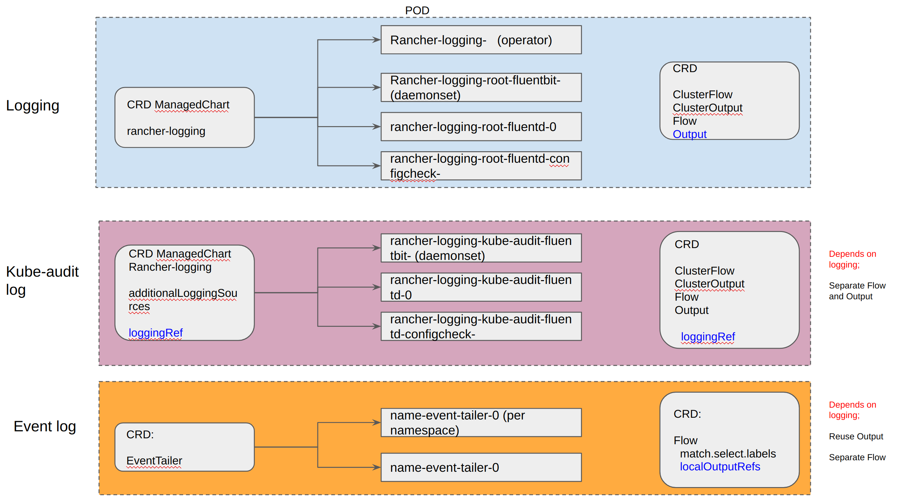
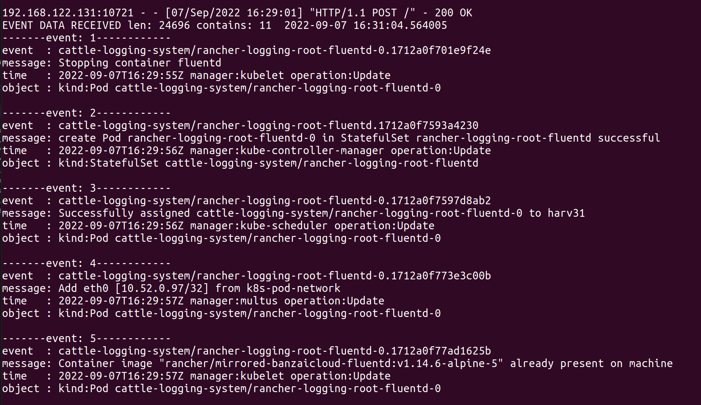
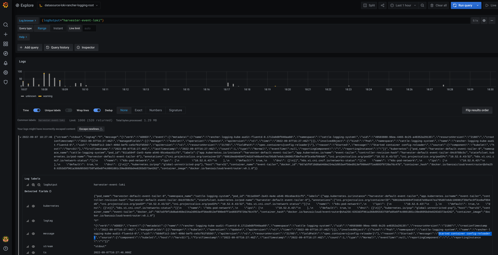

# Event and audit log

## Summary

We need to provide a way for the user, especially the admin user to know what's happened in the system. E.g. who created which VM etc.

As a part of this feature, we should implement an audit log mechanism as well.

### Related Issues

https://github.com/harvester/harvester/issues/578

## Motivation

### audit

In `kubernetes`, the `audit` data is generated from `kube-apiserver`.

https://kubernetes.io/docs/tasks/debug/debug-cluster/audit/

```
...
Audit policy
Audit policy defines rules about what events should be recorded and what data they should include. The audit policy object structure is defined in the audit.k8s.io API group. When an event is processed, it's compared against the list of rules in order. The first matching rule sets the audit level of the event. The defined audit levels are:

None - don't log events that match this rule.
Metadata - log request metadata (requesting user, timestamp, resource, verb, etc.) but not request or response body.
Request - log event metadata and request body but not response body. This does not apply for non-resource requests.
RequestResponse - log event metadata, request and response bodies. This does not apply for non-resource requests.
```

You can pass a file with the policy to `kube-apiserver` using the `--audit-policy-file` flag. If the flag is omitted, no events are logged. Note that the rules field must be provided in the audit policy file. A policy with no (0) rules is treated as illegal.

### event

Kubernetes `events` are objects that show you what is happening inside a cluster, such as what decisions were made by the scheduler or why some pods were evicted from the node. All core components and extensions (operators/controllers) may create events through the API Server.

Events have no direct relationship with log messages generated by the various components, and are not affected with the log verbosity level. When a component creates an event, it often emits a corresponding log message. Events are garbage collected by the API Server after a short time (typically after an hour, 5 minutes in case of EKS), which means that they can be used to understand issues just happening, but you have to collect them to investigate past events.

Events are the first thing to look at for application, as well as infrastructure operations when something is not working as expected. Keeping them for a longer period is essential if the failure is the result of earlier events, or when conducting post-mortem analysis.

### Goals

```
Collect `audit` log by default.
Collect `event` log by default.
Support send `audit` and `event` logs to general log servers.
```

### Non-goals [optional]

```
V1.1.0 does NOT support customized `audit` policy.
V1.1.0 does NOT support disable `audit`.
V1.1.0 does NOT support disable `event`.
V1.1.0 does NOT support send `audit` and `event` log to `loki` by default, which can be queried by embedded `grafana`.
```

## Proposal

### Harvester logging feature

Harvester adds `logging` feature in https://github.com/harvester/harvester/issues/577, this HEP will describe the solution on top of `logging`.


`logging` feature brings following new `POD`s.

```
kubectl get pods -n cattle-logging-system
NAME                                                      READY   STATUS      RESTARTS   AGE

rancher-logging-574448c578-24xlm                          1/1     Running     0          23m
rancher-logging-rke2-journald-aggregator-dtbvd            1/1     Running     0          23m
rancher-logging-root-fluentbit-6xlw8                      1/1     Running     0          22m   // fluent agent to collect logging data
rancher-logging-root-fluentd-0                            2/2     Running     0          22m   // centralized fluentd to store logging data
rancher-logging-root-fluentd-configcheck-6154a995         0/1     Completed   0          6m36s
```

### User Stories

#### Story 1

Enable `audit` log by default.

The `audit` log will be available after Harvester cluster is installed.

#### Story 2

Send `audit` log to centralized log server `fluentd` in `Harvester` by default.

A new dedicated `rancher-logging-kube-audit-fluentd-0` will be deployed to collect `audit` log.


```
kubectl get pods -n cattle-logging-system

NAME                                                      READY   STATUS      RESTARTS   AGE
...
rancher-logging-kube-audit-fluentbit-zppms                1/1     Running     0          22m      // fluent agent to collect audit data
rancher-logging-kube-audit-fluentd-0                      2/2     Running     0          115s     // centralized fluentd to store audit data
rancher-logging-kube-audit-fluentd-configcheck-b3bda920   0/1     Completed   0          23m
```

#### Story 3

(`audit fluentd`) Support send `audit` log to log servers outside of `Harvester`.

By adding `ClusterFlow` `ClusterOutput` or `Flow`, `Output`, `audit` log will be sent to various of log server.

[note] Both of them need to set `spec.loggingRef` as `harvester-kube-audit-log-ref`, it is used to identify the `fluentd` is `rancher-logging-kube-audit-fluentd-0` instead of `rancher-logging-root-fluentd-0`.

#### Story 4

Enable `event` log by default.

The `event` log will be available after Harvester cluster is installed.

A pod `harvester-default-event-tailer-0 ` will be deployed in `cattle-logging-system`, which watches `event` in cluster.

```
kubectl get pods -n cattle-logging-system

NAME                                                      READY   STATUS      RESTARTS   AGE
harvester-default-event-tailer-0                          1/1     Running     0          23m
```

#### Story 5

Send `event` log to centralized log server `fluentd` in `Harvester` by default.

The `event` log will be encapsulated and sent to existing `rancher-logging-root-fluentd-0`.

#### Story 6

(`root fluentd`) Support send `event` log to log servers outside of `Harvester`.

By adding `ClusterFlow` `ClusterOutput` or `Flow`, `Output`, `event` log will be sent to various of log server.


### User Stories exclueded in v1.1.0

Following stories are excluded in v1.1.0

#### Story 1

(V1.1.0 does NOT) Support set `audit` rules for different modules.

In `Harvester`, a default file is added as `harvester-installer/pkg/config/templates/rke2-92-harvester-kube-audit-policy.yaml`.

After change of `rke2-92-harvester-kube-audit-policy.yaml`, it will be applied to `kube-apiserver` when `kube-apiserver` is restarted/rebooted.

An example from offical documents:

https://raw.githubusercontent.com/kubernetes/website/main/content/en/examples/audit/audit-policy.yaml

```
apiVersion: audit.k8s.io/v1 # This is required.
kind: Policy
# Don't generate audit events for all requests in RequestReceived stage.
omitStages:
  - "RequestReceived"
rules:
  # Log pod changes at RequestResponse level
  - level: RequestResponse
    resources:
    - group: ""
      # Resource "pods" doesn't match requests to any subresource of pods,
      # which is consistent with the RBAC policy.
      resources: ["pods"]
  # Log "pods/log", "pods/status" at Metadata level
  - level: Metadata
    resources:
    - group: ""
      resources: ["pods/log", "pods/status"]

  # Don't log requests to a configmap called "controller-leader"
  - level: None
    resources:
    - group: ""
      resources: ["configmaps"]
      resourceNames: ["controller-leader"]

  # Don't log watch requests by the "system:kube-proxy" on endpoints or services
  - level: None
    users: ["system:kube-proxy"]
    verbs: ["watch"]
    resources:
    - group: "" # core API group
      resources: ["endpoints", "services"]

  # Don't log authenticated requests to certain non-resource URL paths.
  - level: None
    userGroups: ["system:authenticated"]
    nonResourceURLs:
    - "/api*" # Wildcard matching.
    - "/version"

...
```

#### Story 2

(V1.1.0 does NOT) Support enable `loki` stack by default.

```
loki-stack-0                                              1/1     Running     0          23m   // a grafana proxy to convert fluentd data into grafana supported format
```

`loki-stack-0` POD receives log from `fluentd` and saves locally, the embedded `grafana` can query `log` from `loki`.

There will be a guide about how to enable `loki` in day2 manually, for developing and testing.

#### Story 3

(V1.1.0 does NOT) (`audit fluentd`) Send `audit` log to `loki` by default. User can manully deploy `loki` to observe logging data.

[note] The `audit` data in `loki` has one dedicated `logOutput` label `harvester-kube-audit-loki`.

#### Story 4

(V1.1.0 does NOT)  (`root fluentd`) Send `event` log to `loki` by default. User can manully deploy `loki` to observe logging data.

[note] The `event` data in `loki` has one dedicated `logOutput` label `harvester-event-loki`.

#### Story 5

(V1.1.0 does NOT) Collect `audit` log generated by `rancher-apiserver`.

https://rancher.com/docs/rancher/v2.5/en/installation/resources/advanced/api-audit-log/

The `rancher-apiserver` has similar `audit-log`, the pre-condition is that all API calls should go through `Racher-apiserver`.

### User Experience In Detail

..

### API changes

## Design

### Implementation Overview

The `Harvester logging` feature is the start point of this HEP. (https://github.com/harvester/harvester/issues/577)

`audit` and `event` can be separately enabled/disabled (not supported in v1.1.0) , but they both depedent on `harvester logging`.



### Implementation of `audit` log

#### Enable `audit` log via RKE2 server

Add an audit-policy file

`harvester/harveter-installer/pkg/config/templates/rke2-92-harvester-kube-audit-policy.yaml`

```
apiVersion: audit.k8s.io/v1
kind: Policy
rules:
  level: Metadata
```

Add `audit-policy-file: /etc/rancher/rke2/config.yaml.d/rke2-92-harvester-kube-audit-policy.yaml` into `harvester/harveter-installer/pkg/config/templates/rke2-90-harvester-server.yaml`

Thus RKE2 server will add `--audit-policy-file` to `kube-apiserver`, which in turn enables the `audit` log.

#### Collect `audit` log to `fluentd`

##### Add additional logging source to `rancher-logging`

Add following values into `pkg/config/templates/rancherd-15-logging.yaml`.

Note: the `auditFilename` and `pathPrefix` are fixed to specific value due to they are encoded in RKE2 code.

```

  values:
    additionalLoggingSources:
      kubeAudit:
        auditFilename: audit.log
        enabled: true
        fluentbit:
          logTag: kube-audit
          tolerations:
          - effect: NoSchedule
            key: node-role.kubernetes.io/controlplane
            value: "true"
          - effect: NoExecute
            key: node-role.kubernetes.io/etcd
            value: "true"
        loggingRef: kube-audit-log-ref
        pathPrefix: /var/lib/rancher/rke2/server/logs/
      rke2:
        enabled: true
    disablePvc: true
  version: 100.1.0+up3.17.3
```


When `kubeAudit` is enabled, the `logging-operator` will create a new `logging` object `rancher-logging-kube-audit`.


```
# kk get logging -A
NAME                         AGE
rancher-logging-kube-audit   3d13h   // for `audit`
rancher-logging-root         3d15h   // for general `rancher-logging`
```


3 new PODs are deployed for `audit`.

```
harv1:~ # kubectl get pods -n cattle-logging-system
NAME                                                      READY   STATUS      RESTARTS         AGE
rancher-logging-7b54b444c8-vrdfg                          1/1     Running     14 (2m29s ago)   2d23h

rancher-logging-kube-audit-fluentbit-b5jhm                1/1     Running     1 (2m28s ago)    3h14m    //  fluent agent to grab log from kube-audit log
rancher-logging-kube-audit-fluentd-0                      2/2     Running     17 (2m28s ago)   2d21h    //  centralized fluentd to store
rancher-logging-kube-audit-fluentd-configcheck-ac2d4553   0/1     Completed   0                2d21h


rancher-logging-rke2-journald-aggregator-q45rk            1/1     Running     8 (2m28s ago)    2d21h
rancher-logging-root-fluentbit-vr47t                      1/1     Running     9 (2m28s ago)    2d23h
rancher-logging-root-fluentd-0                            2/2     Running     18 (2m29s ago)   2d23h
rancher-logging-root-fluentd-configcheck-436ec7ca         0/1     Completed   0                3h38m
harv1:~ # 

```

[note] `fluent-bit` image has no `bash/sh`, it is difficult to debug, replace it with `fluent-bit:latest-debug` image.


`fluent-bit` works with such a config file, it is generated by `rancher-logging-operator`.

The `output` has `HOST  rancher-logging-kube-audit-fluentd.cattle-logging-system.svc.cluster.local`, which guides this `fluentbit` to send log to `rancher-logging-kube-audit-fluentd`.

```
/fluent-bit/etc/fluent-bit.conf
root@rancher-logging-kube-audit-fluentbit-b5jhm:/# cat /fluent-bit/etc/fluent-bit.conf 

[SERVICE]
    Flush        1
    Grace        5
    Daemon       Off
    Log_Level    info
    Parsers_File parsers.conf
    Coro_Stack_Size    24576
    storage.path  /buffers

[INPUT]
    Name         tail
    DB  /tail-db/tail-containers-state.db
    Mem_Buf_Limit  5MB
    Parser  json
    Path  /kube-audit-logs/audit.log
    Refresh_Interval  5
    Skip_Long_Lines  On
    Tag  kube-audit

[OUTPUT]
    Name          forward
    Match         *
    Host          rancher-logging-kube-audit-fluentd.cattle-logging-system.svc.cluster.local
    Port          24240
    
    Retry_Limit  False
```

The `audit-log` is mounted to `rancher-logging-kube-audit-fluentbit-b5jhm `.


```
                    {
                        "mountPath": "/kube-audit-logs",
                        "name": "extravolumemount0",
                        "readOnly": true
                    },
                    

        "volumes": [
...
            {
                "hostPath": {
                    "path": "/var/lib/rancher/rke2/server/logs/",
                    "type": ""
                },
                "name": "extravolumemount0"
            },
```

`Fluentbit` keeps reading the `audit` log.

```
root@rancher-logging-kube-audit-fluentbit-b5jhm:/# ls /kube-audit-logs/audit.log -alt
-rw------- 1 root root 73254847 Aug 22 09:47 /kube-audit-logs/audit.log

root@rancher-logging-kube-audit-fluentbit-b5jhm:/# tail /kube-audit-logs/audit.log     

{"kind":"Event","apiVersion":"audit.k8s.io/v1","level":"Metadata","auditID":"dc61c934-ed7a-4e91-bb55-79e63015a7cd","stage":"ResponseComplete","requestURI":"/version?timeout=32s","verb":"get","user":{"username":"system:serviceaccount:cattle-fleet-local-system:fleet-agent","uid":"fd12df5b-ff86-4d3a-aae9-9d10bf6f664b","groups":["system:serviceaccounts","system:serviceaccounts:cattle-fleet-local-system","system:authenticated"],"extra":{"authentication.kubernetes.io/pod-name":["fleet-agent-57497ff7dc-wnxsd"],"authentication.kubernetes.io/pod-uid":["ad9e0158-477a-4d33-ac25-146736683e0f"]}},"sourceIPs":["10.52.0.230"],"userAgent":"fleetagent/v0.0.0 (linux/amd64) kubernetes/$Format","responseStatus":{"metadata":{},"code":200},"requestReceivedTimestamp":"2022-08-22T09:47:38.179186Z","stageTimestamp":"2022-08-22T09:47:38.179479Z","annotations":{"authorization.k8s.io/decision":"allow","authorization.k8s.io/reason":"RBAC: allowed by ClusterRoleBinding \"system:public-info-viewer\" of ClusterRole \"system:public-info-viewer\" to Group \"system:authenticated\""}}
```

The `audit` log is collected and sent to `fluentd`.

##### Send `audit` log to log servers

To identify diffenrent `fluentd`, there is a special field `loggingRef`.

[note] `loggingRef` is not used for default `logging`, only used for `additional logging sources`.

User can manually add `ClousterOutput` and `ClusterFlow` to send `audit` log to `loki`, when `loki` is enabled manually.


```

- apiVersion: logging.banzaicloud.io/v1beta1
  kind: ClusterOutput
  metadata:
    name: harvester-kube-audit-loki
    namespace: cattle-logging-system
  spec:
    loki:
      url: http://loki-stack.cattle-logging-system.svc:3100
      extra_labels:
        logOutput: harvester-kube-audit-loki
      buffer:
        chunk_limit_size: 3MB
        timekey: 2m
        timekey_wait: 1m
    loggingRef: harvester-kube-audit-log-ref
- apiVersion: logging.banzaicloud.io/v1beta1
  kind: ClusterFlow
  metadata:
    name: harvester-kube-audit-loki
    namespace: cattle-logging-system
  spec:
    globalOutputRefs:
      - harvester-kube-audit-loki
    loggingRef: harvester-kube-audit-log-ref
```


##### Reduced `audit` range

The default `audit` (all operations to api-server, only record `metadata`) logs too much records, Harvester only records `create, update, patch` action.

Like the example in https://kubernetes.io/docs/tasks/debug/debug-cluster/audit/#audit-policy

https://raw.githubusercontent.com/kubernetes/website/main/content/en/examples/audit/audit-policy.yaml

```
harv1:~ # ls /var/lib/rancher/rke2/server/logs/ -alth
total 670M
-rw------- 1 root root  70M Aug 22 09:47 audit.log
drwxr-xr-x 2 root root 4.0K Aug 22 09:36 .
-rw------- 1 root root 100M Aug 22 09:36 audit-2022-08-22T09-36-56.344.log
-rw------- 1 root root 100M Aug 22 09:23 audit-2022-08-22T09-23-29.264.log
-rw------- 1 root root 100M Aug 22 09:18 audit-2022-08-22T09-18-29.095.log
-rw------- 1 root root 100M Aug 22 09:18 audit-2022-08-22T09-18-07.106.log
-rw------- 1 root root 100M Aug 21 21:28 audit-2022-08-21T21-28-34.621.log
-rw------- 1 root root 100M Aug 21 21:23 audit-2022-08-21T21-23-18.739.log
drw------- 8 root root 4.0K Aug 19 18:39 ..
```


### Implementation of `event` log

#### Extension of `logging-extensions.banzaicloud.io` to collect `event`

The `logging-extensions.banzaicloud.io` has an extension `EventTailer` to collect `kubernetes event`.

#### Deploy `EventTailer`

Default value of `EventTailer` is added in `harvester/harveter-installer/pkg/config/templates/rancherd-15-logging.yaml`

```
- apiVersion: logging-extensions.banzaicloud.io/v1alpha1
  kind: EventTailer
  metadata:
    name: harvester-default
    namespace: cattle-logging-system
  spec:
    controlNamespace: cattle-logging-system
```

The `logging-operator` will deploy a POD `harvester-default-event-tailer-0` in `cattle-logging-system` to collect events whole k8s cluster.

```
NAME                                                      READY   STATUS      RESTARTS   AGE
harvester-default-event-tailer-0                          1/1     Running     0          23m
```

#### `event` log format

##### `event` log format in `kubernetes`

A `kubernetes event` is as:

```
        {
            "apiVersion": "v1",
            "count": 1,
            "eventTime": null,
            "firstTimestamp": "2022-08-24T11:17:35Z",
            "involvedObject": {
                "apiVersion": "kubevirt.io/v1",
                "kind": "VirtualMachineInstance",
                "name": "vm-ide-1",
                "namespace": "default",
                "resourceVersion": "604601",
                "uid": "1bd4133f-5aa3-4eda-bd26-3193b255b480"
            },
            "kind": "Event",
            "lastTimestamp": "2022-08-24T11:17:35Z",
            "message": "VirtualMachineInstance defined.",
            "metadata": {
                "creationTimestamp": "2022-08-24T11:17:35Z",
                "name": "vm-ide-1.170e43cbdd833b62",
                "namespace": "default",
                "resourceVersion": "604626",
                "uid": "0114f4e7-1d4a-4201-b0e5-8cc8ede202f4"
            },
            "reason": "Created",
            "reportingComponent": "",
            "reportingInstance": "",
            "source": {
                "component": "virt-handler",
                "host": "harv1"
            },
            "type": "Normal"
        },
```


##### `event` log format in POD `harvester-default-event-tailer-0`

The POD `harvester-default-event-tailer-0` logs all watched events, it's useful for debugging.

One `event` will be formatted as:

`{"vertb":"ADDED","event":{"kubernetes event converted JSON text"}}`


```

# kubectl logs harvester-default-event-tailer-0

I0824 09:50:55.327484       1 interfaces.go:36] Sink is [stdout]
I0824 09:50:55.327552       1 main.go:166] Starting shared Informer(s)
I0824 09:50:55.327758       1 eventrouter.go:130] Starting EventRouter
I0824 09:50:55.327811       1 main.go:152] Starting prometheus metrics.
...

"verb":"ADDED",

"event":{"metadata":{"name":"virt-launcher-vm-ide-1-2p46t.170e43caff1eeda7","namespace":"default","uid":"a0c7e6b2-51b9-414a-8c40-c09defd49335","resourceVersion":"604565","creationTimestamp":"2022-08-24T11:17:31Z","managedFields":[{"manager":"kube-controller-manager","operation":"Update","apiVersion":"v1","time":"2022-08-24T11:17:31Z"}]},"involvedObject":{"kind":"Pod","namespace":"default","name":"virt-launcher-vm-ide-1-2p46t","uid":"8b718be5-8418-4d89-b21c-acd499b98db1","apiVersion":"v1","resourceVersion":"604401"},"reason":"SuccessfulAttachVolume","message":"AttachVolume.Attach succeeded for volume \"pvc-c73afadc-c6e6-46f4-b07f-a704acdbd75f\" ","source":{"component":"attachdetach-controller"},"firstTimestamp":"2022-08-24T11:17:31Z","lastTimestamp":"2022-08-24T11:17:31Z","count":1,"type":"Normal","eventTime":null,"reportingComponent":"","reportingInstance":""}
}


{"verb":"ADDED","event":{"metadata":{"name":"virt-launcher-vm-ide-1-2p46t.170e43cb14ec7ede","namespace":"default","uid":"8aeb5ce9-4cfd-4364-b402-75c8179b7960","resourceVersion":"604569","creationTimestamp":"2022-08-24T11:17:32Z","managedFields":[{"manager":"kubelet","operation":"Update","apiVersion":"v1","time":"2022-08-24T11:17:32Z"}]},"involvedObject":{"kind":"Pod","namespace":"default","name":"virt-launcher-vm-ide-1-2p46t","uid":"8b718be5-8418-4d89-b21c-acd499b98db1","apiVersion":"v1","resourceVersion":"604401"},"reason":"SuccessfulMountVolume","message":"MapVolume.MapPodDevice succeeded for volume \"pvc-c73afadc-c6e6-46f4-b07f-a704acdbd75f\" globalMapPath \"/var/lib/kubelet/plugins/kubernetes.io/csi/volumeDevices/pvc-c73afadc-c6e6-46f4-b07f-a704acdbd75f/dev\"","source":{"component":"kubelet","host":"harv1"},"firstTimestamp":"2022-08-24T11:17:32Z","lastTimestamp":"2022-08-24T11:17:32Z","count":1,"type":"Normal","eventTime":null,"reportingComponent":"","reportingInstance":""}}
...

```

##### `event` log format in `rancher-logging-root-fluentd-0`

First, the `harvester-default-event-tailer-0` itself is a POD, when it puts those `event log` into POD log, then POD log s collected by the local `fluentbit` and sent to general `fluend` `rancher-logging-root-fluentd-0`.

The `fluentd` formats `event` as following, which is kind of general `log`.

Each `event log` has format of: `{"stream":"","logtag":"F","message":"","kubernetes":{""}}`. The previous `(event) log` from `harvester-default-event-tailer-0` is in the field `message`.

```
{
"stream":"stdout",

"logtag":"F",

"message":"{
\\"verb\\":\\"ADDED\\",

\\"event\\":{\\"metadata\\":{\\"name\\":\\"vm-ide-1.170e446c3f890433\\",\\"namespace\\":\\"default\\",\\"uid\\":\\"0b44b6c7-b415-4034-95e5-a476fcec547f\\",\\"resourceVersion\\":\\"612482\\",\\"creationTimestamp\\":\\"2022-08-24T11:29:04Z\\",\\"managedFields\\":[{\\"manager\\":\\"virt-controller\\",\\"operation\\":\\"Update\\",\\"apiVersion\\":\\"v1\\",\\"time\\":\\"2022-08-24T11:29:04Z\\"}]},\\"involvedObject\\":{\\"kind\\":\\"VirtualMachineInstance\\",\\"namespace\\":\\"default\\",\\"name\\":\\"vm-ide-1\\",\\"uid\\":\\"1bd4133f-5aa3-4eda-bd26-3193b255b480\\",\\"apiVersion\\":\\"kubevirt.io/v1\\",\\"resourceVersion\\":\\"612477\\"},\\"reason\\":\\"SuccessfulDelete\\",\\"message\\":\\"Deleted PodDisruptionBudget kubevirt-disruption-budget-hmmgd\\",\\"source\\":{\\"component\\":\\"disruptionbudget-controller\\"},\\"firstTimestamp\\":\\"2022-08-24T11:29:04Z\\",\\"lastTimestamp\\":\\"2022-08-24T11:29:04Z\\",\\"count\\":1,\\"type\\":\\"Normal\\",\\"eventTime\\":null,\\"reportingComponent\\":\\"\\",\\"reportingInstance\\":\\"\\"}
}",

"kubernetes":{"pod_name":"sample-event-tailer-0","namespace_name":"default","pod_id":"d3453153-58c9-456e-b3c3-d91242580df3","labels":{"app.kubernetes.io/instance":"sample-event-tailer","app.kubernetes.io/name":"event-tailer","controller-revision-hash":"sample-event-tailer-747b9d4489","statefulset.kubernetes.io/pod-name":"sample-event-tailer-0"},"annotations":{"cni.projectcalico.org/containerID":"aa72487922ceb4420ebdefb14a81f0d53029b3aec46ed71a8875ef288cde4103","cni.projectcalico.org/podIP":"10.52.0.178/32","cni.projectcalico.org/podIPs":"10.52.0.178/32","k8s.v1.cni.cncf.io/network-status":"[{\\n    \\"name\\": \\"k8s-pod-network\\",\\n    \\"ips\\": [\\n        \\"10.52.0.178\\"\\n    ],\\n    \\"default\\": true,\\n    \\"dns\\": {}\\n}]","k8s.v1.cni.cncf.io/networks-status":"[{\\n    \\"name\\": \\"k8s-pod-network\\",\\n    \\"ips\\": [\\n        \\"10.52.0.178\\"\\n    ],\\n    \\"default\\": true,\\n    \\"dns\\": {}\\n}]","kubernetes.io/psp":"global-unrestricted-psp"},"host":"harv1","container_name":"event-tailer","docker_id":"455064de50cc4f66e3dd46c074a1e4e6cfd9139cb74d40f5ba00b4e3e2a7ab2d","container_hash":"docker.io/banzaicloud/eventrouter@sha256:6353d3f961a368d95583758fa05e8f4c0801881c39ed695bd4e8283d373a4262","container_image":"docker.io/banzaicloud/eventrouter:v0.1.0"}

}

```

#### Separate `event` log from normal `log`

A `ClusterFlow` with `select` labels of `app.kubernetes.io/name: event-tailer`, will filter `event` from others.

##### Send event log to http webhook server

By `kubectl apply -f ` with following 2 files, user can setup log server dynamically.

```
cat > cop1.yaml << 'EOF'
apiVersion: logging.banzaicloud.io/v1beta1
kind: ClusterOutput
metadata:
  name: harvester-event-webhook
  namespace: cattle-logging-system
spec:
  http:
    endpoint: "http://192.168.122.159:8094/"
    open_timeout: 3
    format:
      type: "json"
    buffer:
      chunk_limit_size: 3MB
      timekey: 2m
      timekey_wait: 1m
EOF
```

```
cat > cflow1.yaml << 'EOF'
apiVersion: logging.banzaicloud.io/v1beta1
kind: ClusterFlow
metadata:
  name: harvester-event-webhook
  namespace: cattle-logging-system
spec:
  filters:
  - tag_normaliser: {}
  match:
  - select:
      labels:
        app.kubernetes.io/name: event-tailer
  globalOutputRefs:
    - harvester-event-webhook
EOF
```

[note] One known limitation: the `fluentd` has potential issue in loading config dynamically, the workaround is:

 `kubectl delete pod -n cattle-logging-system rancher-logging-root-fluentd-0`
 
Then the POD will be replaced by a new one, and all receivers are setup at POD startsup.


A simple http webhook server receives and parses event log.




##### Send event log to embedded loki

After `loki` is deployed manually, user can create following `ClusterOutput` and `ClusterFlow` to send log to `loki`, then in embedded `grafana`, user can query `event-log`.

```
- apiVersion: logging.banzaicloud.io/v1beta1
  kind: ClusterOutput
  metadata:
    name: harvester-event-loki
    namespace: cattle-logging-system
  spec:
    loki:
      url: http://loki-stack.cattle-logging-system.svc:3100
      extra_labels:
        logOutput: harvester-event-loki
      buffer:
        chunk_limit_size: 3MB
        timekey: 2m
        timekey_wait: 1m

- apiVersion: logging.banzaicloud.io/v1beta1
  kind: ClusterFlow
  metadata:
    name: harvester-event-loki
    namespace: cattle-logging-system
  spec:
    filters:
    - tag_normaliser: {}
    match:
    - select:
        labels:
          app.kubernetes.io/name: event-tailer
    globalOutputRefs:
      - harvester-event-loki
```


With it, the `event` and other log can be queried from embedded `grafana`.




### Test plan

Integration test plan.


In v1.1.0, test `logging/event/audit` output type of: Graylog, Splunk, they are required by customers;
webhook server is for quick validation.

#### Set output manually :

How to send log to graylog:
https://github.com/w13915984028/harvester-develop-summary/blob/main/integrate-harvester-logging-with-log-servers.md

Test logging, audit, event with webhook server
https://github.com/w13915984028/harvester-develop-summary/blob/main/test-log-event-audit-with-webhook-server.md


#### Set output in UI:

https://github.com/harvester/harvester/issues/2646
[FEATURE] Config logging in Harvester Dashboard

https://github.com/harvester/harvester/issues/2749
[FEATURE] Harvester UI support config (cluster) flow & output for kube-audit log and event log


### Upgrade strategy

Anything that requires if user want to upgrade to this enhancement

`Audit and event log` need to enabled when upgrading to v1.1.0.

https://github.com/harvester/harvester/issues/2750

## Note [optional]

Additional nodes.
