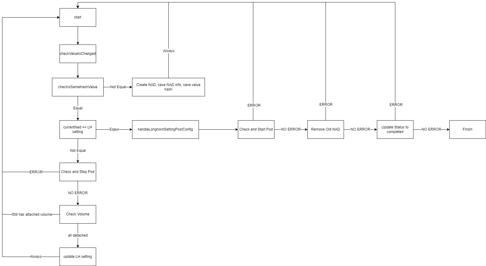

# Storage Network

## Summary

Longhorn storage will need to sync data to every replica engine. The sync traffic will be heavy and occupy too much bandwidth from the management interface. To keep the management interface reliable. Storage Network will help to separate traffic to another interface.

### Related Issues

https://github.com/harvester/harvester/issues/1055
https://github.com/longhorn/longhorn/issues/2285

## Motivation

### Goals

- Longhorn will sync replica from the storage network

### Non-goals [optional]

- Set storage network in the installation stage
- Detect ClusterNetwork is well configured and network connectivity is expected.

## Proposal

### User Stories

Assume Harvester nodes will have 4 network interfaces (eth0, eth1, eth2, eth3).
Users want to have eth0 and eth1 to be management interfaces with HA.
And eth2, and eth3 are for VM and Storage Networks.

VM and Storage Network will have different VLAN ID.

#### Story 1

VM and Storage Network will use the same interfaces but different VLAN IDs.

- VM and Storage want to share eth2 and eth3.
- Create VlanConfig and ClusterNetwork with eth2 and eth3
- Create Network-Attatchment-Definition for VM

#### Story 2

VM and Storage Network will use different interfaces.

- VM uses eth2 and eth3
- Storage uses eth4 and eth5
- Create a new VlanConfig and ClusterNetwork with eth4 and eth5

#### Story 3

Users want to rollback the config back to default

### User Experience In Detail

#### Controller

1. Users have to shutdown all VMs and stop all VMI before setting `storage-network` in Harvester settings
2. Users need to create a VLAN Config with ClusterNetwork name and ensure the cluster network and VLAN config cover all nodes and network connectivity is expected.
3. Users need to assign ClusterNetwork, VLAN ID, IP Range in storage-network settings
4. Controller will shut down management pods attached to Longhorn volumes and check all volumes are detached.
5. Controller will set `storage-network` config to Longhorn settings `storage-network`.
6. Controller will restart management pods.
7. Users need to restart VM manually.

### API changes

- New Settings `storage-network`

## Design

### Implementation Overview

- Re-use VLAN Bridge from VLAN enhancement.
- Introduce IPAM [Whereabouts](https://github.com/k8snetworkplumbingwg/whereabouts) to be a global IPAM for Longhorn Pods.
- Create a Network Attachment Definition with plugin bridge and Whereabouts IPAM.
- According to [Longhorn storage network limitation](https://longhorn.io/docs/1.3.1/advanced-resources/deploy/storage-network/), users should not modify NAD after setting in Longhorn settings.
- Controller will create NAD for storage-network, and remove old NAD.
- Controller will sync storage-network config to Longhorn storage-network setting.

### Controller Flow Chart



### Resource needs to be paused or stopped

- Rancher Monitoring
    - kind: managedchart
    - namespace: fleet-local
    - name: rancher-monitoring
- Grafana
    - kind: deployments
    - namespace: cattle-monitoring-system
    - name: rancher-monitoring-grafana
- Prometheus
    - kind: prometheus
    - namespace: cattle-monitoring-system
    - name: rancher-monitoring-prometheus 
- Alertmanager
    - kind: alertmanager
    - namespace: cattle-monitoring-system
    - name: rancher-monitoring-alertmanager
- Harvester VM Import Controller
    - kind: deployments
    - namespace: harvester-system
    - name: harvester-vm-import-controller

#### Settings config example
```json
{
    "vlan": 100,
    "clusterNetwork": "mgmt",
    "range": "192.168.0.0/24"
}
```

#### NAD config example
```json
{
    "cniVersion":"0.3.1",
    "name":"v1",
    "type":"bridge",
    "bridge":"BRIDGE_NAME",
    "vlan":VLAN_ID,
    "ipam":{
        "type":"whereabouts",
        "range":"192.168.0.0/24"
    }
}
```

### Test plan

#### apply network

1. Shutdown all VMs.
2. Install whereabouts charts https://github.com/harvester/harvester/pull/2716
3. setup VLAN config and ClusterNetwork
4. add Settings named "storage-network" with the VLAN ID, ClusterNetwork, and IP Range in Harvester settings
5. wait and check Longhorn settings "storage-network" is synced.
6. check Longhorn `instance-manager-e-XXXX` has an interface named "lhnet1"
7. check settings named "storage-network" status is completed.

#### Restore to default

1. Shutdown all VMs
2. change Settings named "storage-network" with an empty string in Harvester settings
3. wait and check Longhorn settings "storage-network" is synced.
4. check Longhorn `instance-manager-e-XXXX` has an interface named "lhnet1"
5. check settings named "storage-network" status is completed.

### Upgrade strategy

- Need to upgrade Longhorn v1.3.1

## Note [optional]

Additional nodes.
https://github.com/longhorn/longhorn/issues/2285

- Only provide Day2 configuration
- If there is some new pods that need Longhorn volumes, we should update the controller to stop those pods.
- For manual configuration or troubleshooting about storage-network, please refer [manual configuration guide](https://github.com/harvester/docs/pull/197)
