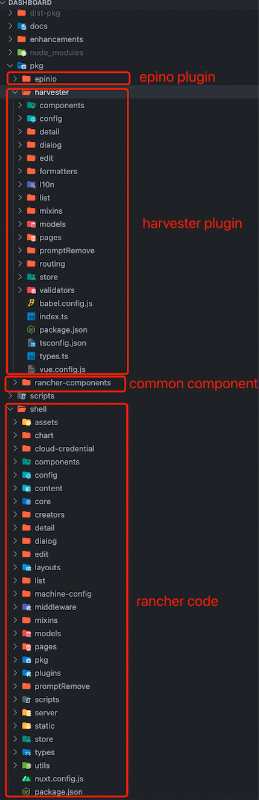
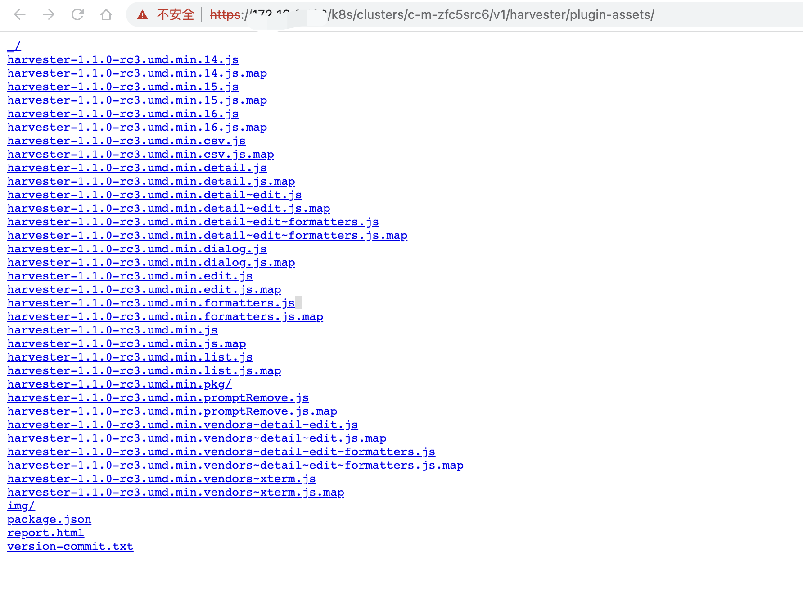
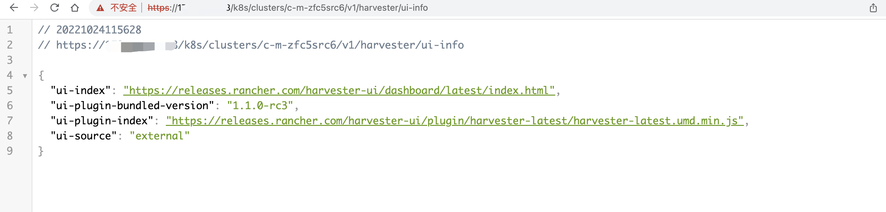
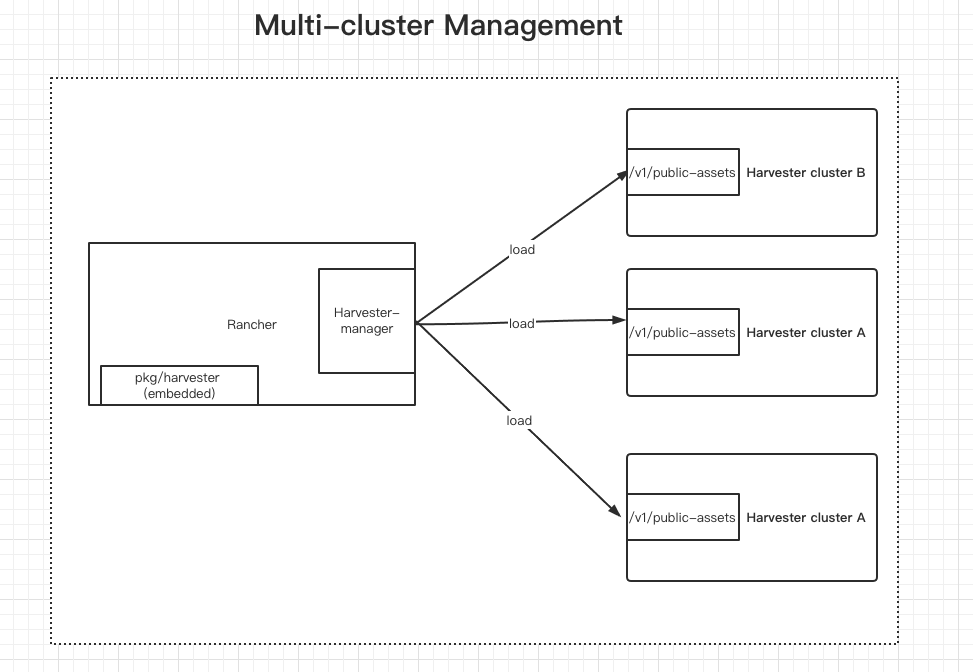

# Harvester Plugin

## Summary
The core code and components of Rancher and Harvester are very similar. Harvester hopes to easily reuse the common components of the Rancher UI and the steve architecture, without the need to push the code to the [Rancher dashboard repo](https://github.com/rancher/dashboard). The purpose is that Harvester can be released independently rather than binding with  Rancher.

### Related Issues

https://github.com/rancher/dashboard/issues/4109

## Motivation
It is hoped that Harvester can utilize the core code and common components of Rancher and build the release versions independently, and the multi-cluster Harvester UI can also be easily integrated with the Rancher.

### Goals

1. Harvester and Rancher can be maintained as two different projects, and thus can be developed and released independently.
2. Harvester can be managed by Rancher.
3. In the Harvester multi-cluster UI, each imported Harvester cluster can configure the version of the plugin and whether the plugin should be accessed online or offline.

### Non-goals [optional]

## Proposal

### User Stories

#### 1. Harvester and Rancher as two different projects and thus can be developed and released independently
The Rancher dashboard will share the Rancher core code through the npm package. Therefore, other projects can generate the core steve and general component frontend architecture through the npm package.
In this way, Harvester can use the npm package here to achieve separation from the Rancher project (the files in this directory will be packaged into one file and provided to multiple clusters). 

Note: The current plan is that Harvester v1.1.0 will also be integrated into the Rancher dashboard.

#### 2. Harvester can be managed by Rancher
Rancher loads the provided module above into the Rancher UI as a plugin.

Here's a known issue:
  Cluster members do not have permission to access offline resources saved to the Harvester container.
  In order to ensure that users with different permissions can access the offline plugin module, Harvester needs to provide different users with the ability to access the resource through an API (`/v1/harvester/public-assets`) (harvester backend).

#### 3. In the Harvester multi-cluster UI, each imported Harvester cluster can configure the version of the plugin and whether the plugin should be accessed online or offline.
1. Because the Harvester plugin is managed by each imported Harvester cluster, we need to add `plugin-index` in the Harvester setting to save the user-configured plugin version (harvester backend).
2. Cluster members do not have access to `ui-source` and `plugin-index`. The values here will be exposed to the frontend by the Harvester cluster through another API (`/v1/harvester/ui-info`) that does not have access control (harvester backend).

### User Experience In Detail
1. Single-Cluster:
    1. Single-cluster users change `ui-source` and `ui-index` on the single-cluster settings page to determine the UI resource address.
2. Multi-Cluster:
    1. Users can import a Harvester cluster in Rancher:
        1. If the imported Harvester supports plugin, when the user clicks on the Harvester cluster, the frontend will decide whether to get the Harvester plugin module from the address configured by `/v1/harvester/public-assets` or `plugin-index` according to the value of `ui-source`.
        2. If the imported Harvester cluster does not support plugins, we will load the Harvester plugin module embedded in Rancher. 

        Note: The built-in Harvester plugin in Rancher is provided by the Harvester repo. In order to be compatible with Harvester v1.0.x, the Harvester UI team will package a Harvester plugin that does not include the new features of v1.1.0.

       
    2. The admin user can configure `ui-source` and `plugin-index` on the settings page of the imported Harvester cluster.

### API changes
1. The backend needs to add an interface without access control to provide an offline version of the plugin resources (`harvester/v1/public-assets`).
2. Add a `plugin-index` configuration item to the Harvester setting page.
3. Users with any privilege can access the values of `ui-index` and `ui-source`.

## Design

### Implementation Overview

### Test plan

### Upgrade strategy

## Note [optional]

