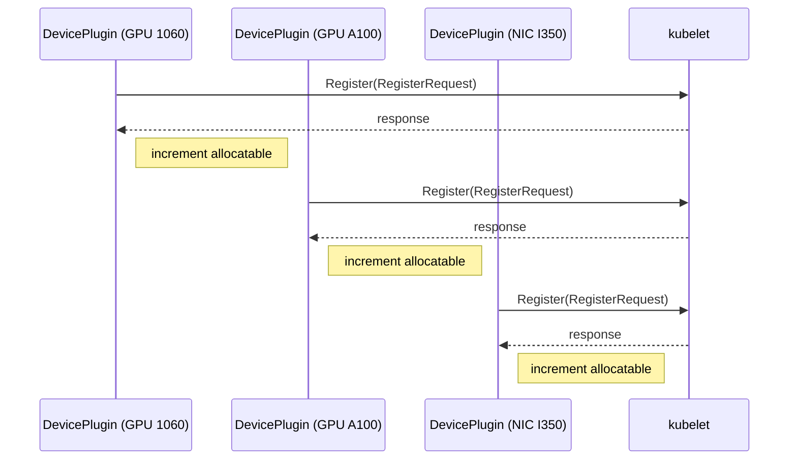
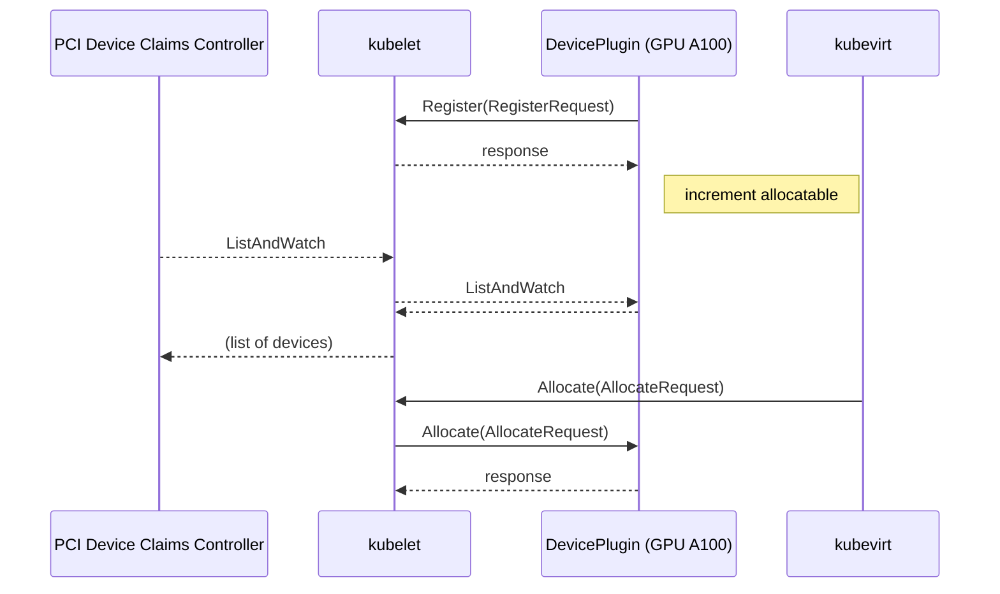

# PCI DevicePlugin

A [DevicePlugin](https://kubernetes.io/docs/concepts/extend-kubernetes/compute-storage-net/device-plugins/) for the [PCI passthrough](/enhancements/20220722-pci-passthrough.md) addon introduced in [Release 1.1.0](https://docs.harvesterhci.io/v1.1/advanced/pcidevices/).

## Summary

In the Harvester 1.1.0 release, when a [PCIDeviceClaim](https://github.com/harvester/pcidevices/blob/v0.2.2/pkg/apis/devices.harvesterhci.io/v1beta1/pcideviceclaim.go#L14-L21) is created, the pcidevices-controller [updates the KubeVirt config](https://github.com/harvester/pcidevices/blob/v0.2.2/pkg/controller/pcideviceclaim/pcideviceclaim_controller.go#L236) to allow-list the device. This triggers the node status update. But since the allow-list looks like this:

```yaml
pciHostDevices:
  - pciVendorSelector: 10de:1c02
    resourceName: nvidia.com/GP106_GEFORCE_GTX_1060_3GB
  - pciVendorSelector: 10de:10f1
    resourceName: nvidia.com/GP106_HIGH_DEFINITION_AUDIO_CONTROLLER
```

If I created a `PCIDeviceClaim` for a second GeForce GTX 1060, the list wouldn't change, and the node status update wouldn't immediately trigger. This would prevent Kubevirt from scheduling a VM requesting that resource on that newly claimed GPU.

By creating a DevicePlugin, we can avoid modifying the KubeVirt config and also gain more fine-grained control of how we allocate the PCI devices to VMs.

### Related Issues

- https://github.com/harvester/harvester/issues/3146
- https://github.com/harvester/harvester/issues/2991
- https://github.com/harvester/pcidevices/issues/19
- https://github.com/harvester/pcidevices/issues/29
- https://github.com/harvester/pcidevices/pull/27

## Motivation

### Goals

The goals of this HEP are:

1. Solve the stale node status [issue](https://github.com/harvester/pcidevices/issues/19)
1. Gain control of which PCI devices get assigned to which VMs (currently it's randomly matched based on `vendorId:deviceId`)
1. Lay the foundation for vGPU and SR-IOV support (those will require their own DevicePlugins)
1. Solve the iommu group violation [issue](https://github.com/harvester/pcidevices/issues/29)

## Proposal

For each `resourceName` (e.g. `nvidia.com/GP106_GEFORCE_GTX_1060_3GB`), we create a DevicePlugin, the DevicePlugin will count the number of allocatable devices with that `resoureceName`. 
 
A DevicePlugin connects to the kubelet socket in `/var/lib/kubelet/device-plugins/kubelet.sock` and issues a `Register` request over the RPC interface on that socket.



The `RegisterRequest` has a socket endpoint and a resourceName:

```go
type RegisterRequest struct {
	// Version of the API the Device Plugin was built against
	Version      string
	// Name of the unix socket the device plugin is listening on
	// PATH = path.Join(DevicePluginPath, endpoint)
	Endpoint     string
	// Schedulable resource name. Expected to be a DNS Label
	ResourceName string
	// Options to be communicated with Device Manager
	Options      *DevicePluginOptions
}
```

The relationship between the `resourceName`s and the `RegisterRequest`s is 1-to-1. So this DevicePlugin will need to create one `RegisterRequest` for every unique `resourceName`.
This means there will be one socket for every `PCIDeviceClaim`, up to `vendorId:deviceId`-equivalence. That means two `PCIDeviceClaim`s on the same node with the same `vendorId:deviceId` pair will share a single socket.


### User Stories
Before this HEP, the `PCIDeviceClaim` would only match on `vendorId:deviceId`, so it couldn't match a particular PCI device by address. 

#### Story 1
Bill has a pair of NVIDIA A-100s and enables both of them for PCI passthrough. He creates one VM.  Before this HEP, Harvester would only allow the assignment of a single type of PCI device to the VM, since both have the same `vendorId:deviceId`.

This HEP proposes the ability to add multiple instances of the same kind of device, allowing Bill to attach both A-100s to his VM.


#### Story 2
Carol has four identical intel X540 NICs with resourceName `intel.com/ETHERNET_CONTROLLER_X540`. They all share the same `vendorId:deviceId` pair too. Carol wants to create two VMs and pass through one NIC to each of the two VMs. Additionally, she wants NIC 3 to go to VM A, and NIC 4 to go to VM B. Using kubevirt's `vendorId:deviceId` matching would not guarantee this association, but the deviceplugin proposed here could implement this.

### User Experience In Detail

#### Story 1 in detail
Bill wants to assign both A-100s to his VM. In the UI for configuring his VM, he can see a button to add a named PCI Device by resourceName, he clicks on it and sees inputbox/dropdown fields for the resourceName and the name. He enters the `nvidia.com/A100` resourceName and then `gpu1` for the name. Then he enters `nvidia.com/A100` for the resourceName and `gpu2` for the name. These named devices will be presented in the YAML as:

```yaml
pciHostDevices:
  - resourceName: nvidia.com/A100
    name: gpu1
    externalResourceProvider: true
  - resourceName: nvidia.com/A100
    name: gpu2
    externalResourceProvider: true
```

We use a deviceplugin based on KubeVirt's [PCIDevicePlugin](https://github.com/kubevirt/kubevirt/blob/v0.58.0/pkg/virt-handler/device-manager/pci_device.go#L58-L72) type to represent a given `resourceName` on that node. 

The pcidevices controller looks at newly created `PCIDeviceClaim`s and then checks if there is a DevicePlugin for that `resourceName` on that node. If not, it creates a DevicePlugin with _all_ of the devices sharing that `resourceName`, but only marks the one claimed as 'healthy'. Otherwise, it looks up the existing devicePlugin and then signals to it that the claimed device is healthy. **One consequence of this implementation is that capacity will always equal the total number of identical devices**. The `node.status.allocatable` value will equal the number of `PCIDeviceClaims` for those identical devices.

In other words, the device plugin advertises the array of devices that are allocatable using `ListAndWatch`, which returns a slice of devices `[]Device{ID, health}`. The IDs will be the PCI address, since this device plugin is specific to the node (kubelet).

If a `PCIDeviceClaim` is deleted, then it's device plugin is signalled that the device is no longer healthy.

The DevicePlugin's gRPC server handles the `Allocate()` request by the kubelet, and prepares the requested device for the virt-launcher container. This `Allocate()` implementation will be called by kubevirt when the `externalResourceProvider` is set to `true`.

The PCIDevicePlugin proposed in this HEP will have an implementation of the `Allocate` RPC request handler that accepts a request for either a number of `resourceName` instances, or a collection of `pciDeviceClaim` names. The deviceplugin will then prepare the devices on that node for the VM.

#### Story 2 in detail
Carol creates VMs A and B after enabling PCI passthrough on NICs 3 and 4.
She goes to the VM config UI and clicks the button to add a PCI Device by node and address.
She clicks on it and sees inputbox/dropdown fields for the PCIDeviceClaim name and an additonal name field. She adds NICs 3 and 4 by setting `pciDeviceClaim` to `janus-000023002` and `name` to `nic3`. Then she saves VM A and then edits the config for VM B, and then adds the device `janus-000023003` as `nic4`.

These devices will be presented in the YAML as:

```yaml
pciHostDevices:
  - pciDeviceClaim: janus-000023002
    name: nic3
    externalResourceProvider: true
  - pciDeviceClaim: janus-000023003
    name: nic4
    externalResourceProvider: true
```

### API & UI changes

Currently, in 1.1.0+, the UI for assigning PCI devices to VMs only allows for attaching a single randomly selected device that matches `vendorId:deviceId`:


Proposed change: allow for particular PCIDeviceClaims (whose names include the node name and the PCI Address) to be assigned directly to a VM. This YAML change would 

Previously the YAML configuration for the VM looked like this:
```yaml
pciHostDevices:
  - pciVendorSelector: 10de:1c02
    resourceName: nvidia.com/GP106_GEFORCE_GTX_1060_3GB
    externalResourceProvider: false
  - pciVendorSelector: 10de:10f1
    resourceName: nvidia.com/GP106_HIGH_DEFINITION_AUDIO_CONTROLLER
    externalResourceProvider: false
```

The `externalResourceProvider` was set to false, meaning that kubevirt would _not_ consult an 
external deviceplugin, and would instead handle the device allocation itself.

The proposed change would look like this:
```yaml
pciHostDevices:
  - resourceName: nvidia.com/A100
    name: gpu1
    externalResourceProvider: true
  - resourceName: nvidia.com/A100
    name: gpu2
    externalResourceProvider: true
  - pciDeviceClaim: janus-000023002
    name: nic3
    externalResourceProvider: true
  - pciDeviceClaim: janus-000023003
    name: nic4
    externalResourceProvider: true
```

There are two ways in the above configuration to assign devices to VMs. The first requests
them by `resourceName`, and allows multiple (named) instances. This allows VMs to have more than one of a given device type.

The other way requests them by `pciDeviceClaim` id, like `janus-000023002`, which names PCI Device `0000:23:00.2` on node `janus`. This 


## Design

The Device plugin will be an instance of [PCIDevicePlugin](https://github.com/kubevirt/kubevirt/blob/v0.58.0/pkg/virt-handler/device-manager/pci_device.go#L58-L72) 



### Implementation Overview

The PCIDevicePlugins will be added to [harvester/pcidevices](https://github.com/harvester/pcidevices). There will be a goroutine that watches for PCIDeviceClaim creation and deletion. When created, a device plugin will be created, or re-created, if one already existed.


### Test plan

- Follow the test plans of all the associated issues, ensure that they are all resolved
- GPU test 
  - Create a cluster with 4 identical GPUs distributed over 2 nodes
  - Verify that there are 2 allocatable gpus per node
  - Create 4 VMs, attach those GPUs
  - Verify that the correct PCI addresses were assigned to the VMs


### Upgrade strategy

Anything that requires if user want to upgrade to this enhancement

## Note 

KubeVirt expects the device plugins to provide an environment variable with the PCI address. So we won't need the pciVendorSelector in the VM config, we can use the resourceName and let the device plugin creation use PCIDeviceClaim's PCI Address to populate that environment variable.
