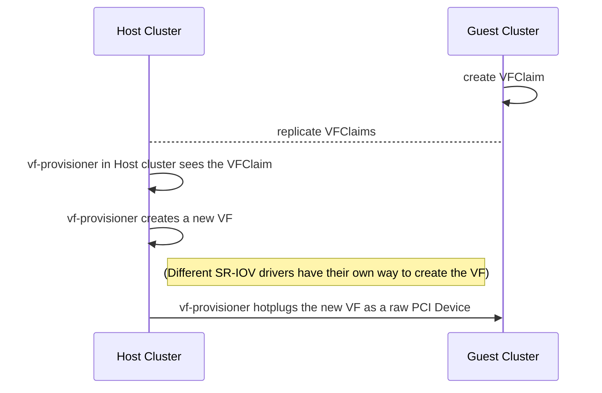

# SR-IOV vf-provisioner hotplugs the new VF as a raw PCI Device

SR-IOV (Single Root IO Virtualization) allows for VMs to share a single physical function (PF) by using virtual functions and a special driver.

The vf-provisioner is modeled after the [csi-provisioner](https://github.com/kubernetes-csi/external-provisioner) and it's goal is to allow VMs in a guest cluster to request VFs from the host cluster.

## Summary

The last step, the hot-plugging into the VM's container is to allow for dynamically adding the device to the virt-launcher container.

### Related Issues

- https://github.com/harvester/harvester/issues/2763

## Motivation

In order to keep track of request for SR-IOV virtual functions (vfs), the vf-provisioner is proposed.
Currently, the pcidevices controller can assign vfs to VMs, but it cannot install the drivers that allow the vfs to be created.
Also the details of how to create the vf are driver-specific, so we need something that has that knowledge baked in.
This design is loosely inspired by the csi-provisioner architecture.

### Goals

- Allow guest cluster to request a VF to be allocated to a pod or a vm
- Modify the host Harvester cluster to install the SR-IOV drivers that expose the ability to create VFs
- Track which created VFs have been allocated
- Allow hot-plugging VFs into running Pods

## Proposal

### User Stories
Detail the things that people will be able to do if this enhancement is implemented. A good practise is including a comparsion of what user cannot do before the enhancement implemented, why user would want an enhancement and what user need to do after, to make it clear why the enhancement beneficial to the user.

The experience details should be in the `User Experience In Detail` later.

#### Story 1
Joe works for a Telco and has a long-running VM with several VFs currently reserved, serving various containers in the guest cluster. There is spare capacity on the VM and a call comes in. He wants the VM to be able to add the VF without having to restart the VM. Using [CNI](https://www.cni.dev/), the virt-launcher's PodSpec would have to be changed, which would require the VM to be rebooted. In order to avoid this, the VF will be hotplugged into the running VM using `qemu`'s [PCI hotplugging capability](https://www.linux-kvm.org/page/Hotadd_pci_devices#Using_PCI_Hotplug_Support).

### API changes

- Adding the VFClaim CRD to the host and guest clusters
- Adding an vf-provisioner with an endpoint to request
    - VFs be created and claimed for a VM
    - VFs to be unclaimed and returned to a pool on the host
    - VFs to be destroyed (decrement the num_vfs value on the host's SR-IOV driver)

## Design

### Implementation Overview

Create a VFClaim that stores:
- Guest node on which the VM is running
- The VM IP 
- The host node on which the VF's PF lives
- The VF's PCI address on the node (when the guest creates this, it will initially be blank, then it is replicated to the host, where it's populated, and then the guest cluster syncs that value eventually. Discuss: Is this necessary?)

Create a controller called vf-provisioner, that will run on the host Harvester cluster.

### Test plan

1. Create a guest cluster
2. Install the SR-IOV drivers for the supported device on the host
3. Have a Pod or a VM on the guest cluster create a VFClaim
4. Observe that the VFClaim is synced to the host cluster
5. Verify that the vf-provisioner sees the VFClaim and creates the VF by performing the driver-specific operations (e.g. Intel's `igb` driver exposes a filesystem path under sysfs that lets you set the numvfs. The driver handles the rest)
6. Verify that the new VF is created, and then automatically prepared for [PCI Passthrough](/enhancements/20220722-pci-passthrough.md).
7. Verify that the VF is prepared for passthrough (bound to vfio-pci drivers)
8. Verify that the vf-provisioner made the qemu `device_add` operation

### Upgrade strategy

Anything that requires if user want to upgrade to this enhancement

## Note [optional]

Additional nodes.
