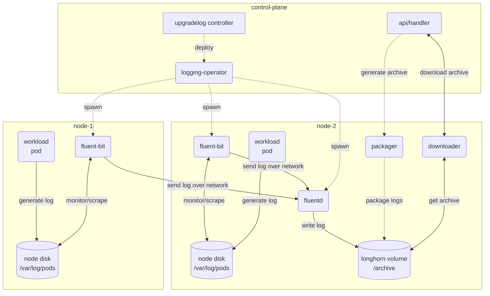
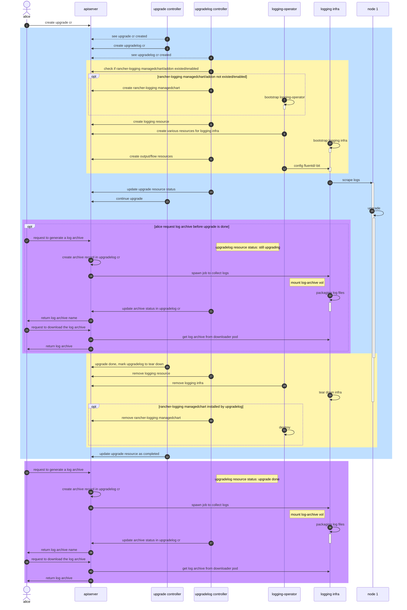
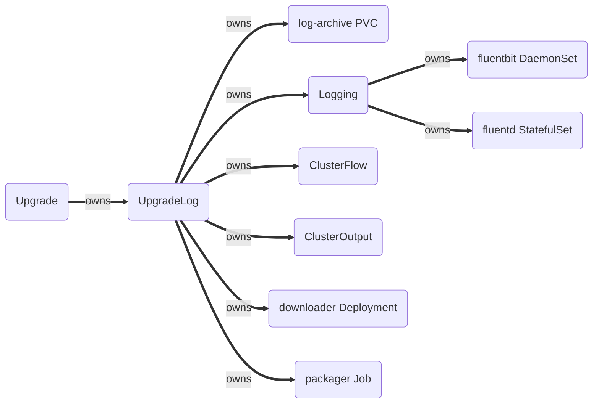

# Upgrade Observability

## Summary

Things might go wrong during a lengthy zero-downtime upgrade against the
cluster. Logs are crucial for users to understand what happened and for
developers to troubleshoot the problems further. Therefore, collecting all the
scattered upgrade-related logs in the cluster during an upgrade is extremely
important regarding observability and manageability.

### Related Issues

- https://github.com/harvester/harvester/issues/1926

## Motivation

For the administrators or anyone who manages Harvester clusters, gathering the
upgrade-related logs is a bit complicated. First, they need to know the big
picture of the overall Harvester's zero-downtime upgrade procedure to determine
what exact phase they're at. Second, they can only know little information about
the upgrade progress from the Harvester UI. It isn't helpful in terms of
troubleshooting and incident reporting. To further investigate, they need to
access the cluster via `kubectl` or get a shell on the nodes directly via `ssh`.
After that, they see many Pods on the cluster with possibly various states. They
wouldn't know what exactly they needed to grab. Although the built-in `kubectl
logs` command is quite handy, it has significant limitations:

- It can only show the logs generated by the currently running container in the
  Pod or the previous instance of the container with the `-p` flag if it exists
- It is hard for tools like `kubectl logs` or `kubetail` to follow the running
  Pods managed by the high-level resources (`Jobs`, `Deployments`, `DaemonSets`,
  etc.) since they will have different suffices every time they get deleted for
  whatever reasons, which is quite common in an upgrade scenario.

Pods come and go during an upgrade. Those missing logs could be key evidence for
solving complex and challenging problems.

### Goals

- Collect all the upgrade-related logs, including Harvester's relevant services
  and the transient ones, like the logs generated by pre/post-drain Pods
- ~~Provide an upgrade dialog on the dashboard with live updating log lines for
  users to know what is going on at the moment~~
- Allow users to access and examine all the logs generated during an upgrade

### Non-goals

- The enhancement will not collect non-ephemeral logs like system logs since
  support-bundle-kit covers that already
- The enhancement does not provide any operation toward its corresponding
  upgrade
- For general health monitoring of a cluster, users could leverage the
  "rancher-monitoring" and "rancher-logging" add-ons with proper `Flow`
  and `Output` CRs configured

## Proposal

Collecting the upgrade-related logs from the beginning of an upgrade. Showing
the logs of the current-running Pod on the UI dialog during an upgrade.
Providing a way for users to access the log archives after initiating an
upgrade.

### User Stories

The upgrade observability enhancement is by default enabled for upgrades. Users
will have a chance to disable it while choosing the upgrade version in the
upgrade dialog. If users disable the upgrade logging enhancement, the upgrade
will work as before.

The following scenarios assume the enhancement to be enabled.

#### An Ongoing Upgrade

~~A user can view the upgrade logs on the UI in real-time to know the progress
of the upgrade.~~ A user can download the logs that relate to the ongoing
upgrade during entire upgrade procedure.

#### An Upgrade Ending in Success/failure

A user can download the logs generated during an upgrade as an archive file for
further usage after it ends, either in success or failure. Especially for failed
upgrade cases, the logs could be valuable for doing a post-mortem to find the
root cause of a failed upgrade.

#### A Hanging Upgrade

Sometimes an upgrade can be stuck in the same spot for a long time, or even
worse, it never ends. This could happen in upgrading an already potentially
problematic cluster, e.g., some volumes are in an unhealthy state. Thus, the
waiting imposed by the safety check will jam the whole upgrade progress. Another
case, like the multi-cordon issue in
[#39167](https://github.com/rancher/rancher/issues/39167), might put the cluster
into a dead-lock situation and hang the upgrade.

In such cases, a user can only perceive the stuck. They know the upgrade is
still "ongoing," but something prevents it from proceeding to the next step.
With the real-time upgrade logs on the UI, the user can gain more information
about the stuck upgrade and undertake further actions. Either troubleshoot the
problem themselves or ask for help from the community, more in-depth
intelligence needs to be gathered. They can achieve this by downloading the log
archive anytime during an ongoing upgrade.

### User Experience In Detail

- ~~A user can easily observe the progress of an upgrade by viewing the
  live-updating logs generated from the currently running upgrade-related pod in
  the upgrade dialog~~
- A user will no longer need to use `kubectl logs` or `ssh` into the nodes to
  gather all the upgrade-related logs
- A user can have a complete picture of an upgrade, even the temporary logs
  generated during image-preloading and pre-draining will be collected in the
  log archive

Users can start an upgrade with a chance to opt-in/out with the logging feature,
by default it will be enabled. If the checkbox is unselected, the following will
not happen.


During an upgrade, users can download the log archive at will by clicking the
"Download Log" button. It will create a log-packaging Job in the background and
help download the archive into the users' disk. The "Download Log" button will
appear on the upgrade dialog once the backend log archive server is ready, and
will exist until users click on the "Dismiss it" button.


The entire UpgradeLog CR and its sub-components (logging infra) including all
the generated log archives will be purged if users click on the "Dismiss it"
button. Please be sure to download the log archive first.


### API changes

#### Kubernetes API

A new `UpgradeLog` CRD is introduced, mapping the desired and actual state of
the logging infrastructure and holding the generated log archives' records for
an upgrade.

```go
var (
	  LoggingOperatorDeployed condition.Cond = "LoggingOperatorReady"
	  InfraReady              condition.Cond = "InfraReady"
	  UpgradeLogReady         condition.Cond = "Started"
	  UpgradeEnded            condition.Cond = "Stopped"
	  DownloadReady           condition.Cond = "DownloadReady"
)

// +genclient
// +k8s:deepcopy-gen:interfaces=k8s.io/apimachinery/pkg/runtime.Object
// +kubebuilder:resource:scope=Namespaced
// +kubebuilder:printcolumn:name="UPGRADE",type="string",JSONPath=`.spec.upgradeName`

type UpgradeLog struct {
	metav1.TypeMeta   `json:",inline"`
	metav1.ObjectMeta `json:"metadata,omitempty"`

	Spec   UpgradeLogSpec   `json:"spec"`
	Status UpgradeLogStatus `json:"status,omitempty"`
}

type UpgradeLogSpec struct {
	// +kubebuilder:validation:Required
	UpgradeName string `json:"upgradeName,omitempty"`
}

type UpgradeLogStatus struct {
	// +optional
	Archives map[string]Archive `json:"archives,omitempty"`
	// +optional
	Conditions []Condition `json:"conditions,omitempty"`
}

type Archive struct {
	// +optional
	Size int64 `json:"size,omitempty"`
	// +optional
	GeneratedTime string `json:"generatedTime,omitempty"`
  // +optional
  Ready bool `json:"ready,omitempty"`
}
```

For conditions,

- `LoggingOperatorReady` indicates whether the logging-operator exists or not
- `InfraReady` indicates whether the fluent-bit DaemonSet and fluentd
  StatefulSet are running normally or not
- `Started` indicates whether the corresponding ClusterFlow and ClusterOutput
  are installed or not. If they are installed, the log collection starts
  immediately.
- `Stopped` indicates whether the upgrade is ended or not. If it ended, the log
  collection stopped immediately.
- `DownloadReady` indicates whether the log downloader Deployment is running
  normally or not

Each `UpgradeLog` CR can hold several archive records. Their statuses will be
recorded under `.status.archives`. It's worth mentioning that the `Ready` field
in each archive status indicates whether the archive was processed or not by the
log packager Job. Once the `Ready` is set to `true`, it can be downloaded via
the API.

On the other hand, the existing `Upgrade` CRD is revised:

```go
var (
    ...
    // LogReady is true when logging infrastructure for is running
    LogReady condition.Cond = "LogReady"
    ...
)

// +genclient
// +k8s:deepcopy-gen:interfaces=k8s.io/apimachinery/pkg/runtime.Object
// +kubebuilder:resource:scope=Namespaced

type UpgradeSpec struct {
    ...
    // +optional
    // +kubebuilder:default:=true
    LogEnabled bool `json:"logEnabled" default:"true"`
}

type UpgradeStatus struct {
    ...
    // +optional
    UpgradeLog string `json:"upgradeLog,omitempty"`
}
```

- A new spec field, `spec.logEnabled`, toggles upgrade observability in each
  upgrade (default: true)
- A new status field, `status.upgradeLog,` represents the counterpart UpgradeLog
  CR
- A new condition, `LogReady`, indicates the readiness of the respective logging
  infrastructure. This will be the new first phase of the entire upgrade
  procedure.

#### Harvester API

##### Generating an Archive

```text
Request:
POST /v1/harvester/harvesterhci.io.upgradelogs/{namespace}}/{upgradeLogName}?action=generate

Response:
<archive-name>

Example (CLI):
$ curl -k -X POST -u token-jdpkd:k56qxnt28h4nmjp7cpqhzzgkflpkqhbhpppzmkk5bdfmr4p5j2gsn8 \
    https://192.168.48.130/v1/harvester/harvesterhci.io.upgradelogs/harvester-system/hvst-upgrade-lz2q7-upgradelog?action=generate
"hvst-upgrade-lz2q7-upgradelog-archive-2023-03-01T07-26-15Z" # this is the output
```

This will instruct Harvester to generate an archive against a certain UpgradeLog
immediately. A log packager Job will be created to process, package, and
compress the log files stored on the persistent volume to an archive file
waiting to be downloaded.

##### Retrieving an Archive

```text
Request:
GET /v1/harvester/harvesterhci.io.upgradelogs/{namespace}/{upgradeLogName}/download?archiveName={archiveName}

Response:
<archive binary output>

Example (CLI):
$ curl -fsSL -k -u token-jdpkd:k56qxnt28h4nmjp7cpqhzzgkflpkqhbhpppzmkk5bdfmr4p5j2gsn8 \
    https://192.168.48.130/v1/harvester/harvesterhci.io.upgradelogs/harvester-system/hvst-upgrade-lz2q7-upgradelog/download?archiveName=hvst-upgrade-lz2q7-upgradelog-archive-2023-03-01T07-26-15Z \
    -o hvst-upgrade-lz2q7-upgradelog-archive-2023-03-01T07-26-15Z.tar.gz
```

This will download the designated archive file from the web server running
inside the log downloader Pod.

## Design

The [wiki
page](https://github.com/harvester/harvester/wiki/Leveraging-rancher-logging-for-Collecting-Upgrade-related-Logs)
inspires the design. We can leverage the [`rancher-logging`
suite](https://github.com/rancher/charts/tree/dev-v2.7/charts/rancher-logging/102.0.0%2Bup3.17.10)
to help us collect the logs. But where the logs go could be a headache because
asking users to set up persistent storage solely to store upgrade-related logs
is not practical. On the other hand, the `rancher-logging` suite brings an
amount of workload to the entire cluster during an already mission-critical
upgrade procedure. We want to make the impact as small as possible. So the plan
is to make use of the existing
[logging-operator](https://github.com/kube-logging/logging-operator) provided by
the `rancher-logging` ManagedChart and at the same time, customize our own
version of the Logging CR to establish the logging infrastructure we need.

Design features:

- A custom controller manages the newly added `UpgradeLog` CR, acting as an
  operator for orchestrating the logging infra specifically for Harvester
  upgrades
- Tailoring the logging infra with logging-operator makes it lighter and more
  suitable for the mission
- The use of the [File Output
  plugin](https://banzaicloud.com/docs/one-eye/logging-operator/plugins/outputs/file/)
  avoids setting up dedicated and centralized storage like Elasticsearch
- Archiving logs on a Longhorn volume helps persist the upgrade logs across the
  entire upgrade procedure
- After the user clicked the "Dismiss it" button on the upgrade dialog, the log
  archive volume will be removed by the controller

### Implementation Overview

Relevant custom resource definitions (CRDs):

- `harvesterhci.io/v1beta1/upgrades`
- `harvesterhci.io/v1beta1/upgradelogs`
- `logging.banzaicloud.io/v1beta1/loggings`
- `logging.banzaicloud.io/v1beta1/clusterflows`
- `logging.banzaicloud.io/v1beta1/clusteroutputs`

Relevant custom controllers:

- The **upgradelog controller**, which manages and operates the `UpgradeLog` CRs
- The **logging-operator** from Banzaicloud

The logging infrastructure includes:

- **Fluent-bit**, which monitors and scrapes pods' logs on each node
- **Fluentd**, which receives and aggregates logs transmitted from fluent-bits

The interactions among the controllers and the logging infrastructure are like
the following:



The sequence diagram is as follows:



The upgrade controller detects whether or not the `rancher-logging`
ManagedChart/Addon is installed/enabled at the beginning of an upgrade. If it is
up and running, the upgrade controller creates a dedicated logging
infrastructure for observing the upgrade progress. If not, the upgrade
controller will deploy one and its relevant CRDs to set up a dedicated logging
infrastructure. After that, the upgrade controller applies a set of
`ClusterFlow` and `ClusterOutput` CRs to collect specified logs to the
designated destinations.

After the upgrade is finished, either in success or failure, the upgrade
controller will collect the scattered logs and put them into an archive for
users to access.

The ownership chain of all the relevant resources:



- UpgradeLog CR tear-down: only the logging infrastructure will be removed, i.e.
  the ClusterFlow/Output, the Logging resource, and the `rancher-logging`
  ManagedChart, others are untouched
- UpgradeLog CR removal: the UpgradeLog CR and its sub-resources correlated by
  the `OwnershipReference` field will all be removed

### Manifests

```yaml
apiVersion: harvesterhci.io/v1beta1
kind: UpgradeLog
metadata:
  name: hvst-upgrade-xxxxx-upgradelog
  namespace: harvester-system
spec:
  upgrade: hvst-upgrade-xxxxx
status:
  conditions:
  - type: LoggingOperatorReady
    status: “True”
  - type: InfraReady
    status: “True”
  - type: Started
    status: “True”
  - type: Stopped
    status: “True”
  - type: DownloadReady
    status: “True”
  archives:
    hvst-upgrade-xxxx-upgradelog-archive-2023-01-12T12-34-56Z:
      size: 123456789
      generatedTime: 2023-01-12T12:34:56Z
    hvst-upgrade-xxxx-upgradelog-archive-2023-01-12T12-35-12Z:
      size: 143847805
      generatedTime: 2023-01-12T12:35:12Z
```

Due to an [issue](https://github.com/banzaicloud/logging-operator/issues/1063)
in logging-operator, we need to manually create the PVC to store the logs. The
log packager/downloader pod will also reference this PVC later for packaging log
files and downloading the log archive.

```yaml
apiVersion: v1
kind: PersistentVolumeClaim
metadata:
  name: log-archive
  namespace: logging
spec:
  storageClassName: longhorn
  accessModes:
  - ReadWriteOnce
  volumeMode: Filesystem
  resources:
    requests:
      storage: 1Gi
```

Instruct logging-operator to establish the logging infrastructure with
customized configurations dedicated to the upgrade observability. Here we
associate the PVC with fluentd to persist the logs even after the logging
infrastructure has been torn down. Note that there is a setting
`flowConfigCheckDisabled: true`, which prevents the config-checking Job from
creating while applying new output/flow rules. This can reduce the scaffolding
time since the rules are fixed and not customizable by users in the context of
upgrade observability.

The rule of thumb here is to set an appropriate buffer for fluent-bit, but no
buffer for fluentd. We want to keep as many logs as possible during the period
fluentd Pod is drained from one node and spawned on the other.

```yaml
apiVersion: logging.banzaicloud.io/v1beta1
kind: Logging
metadata:
  name: upgrade-logging-infra
spec:
  fluentd:
    disablePvc: true
    extraVolumes:
    - volumeName: log-archive
      path: /archive
      containerName: fluentd
      volume:
        pvc:
          source:
            claimName: log-archive
            readOnly: false
    fluentOutLogrotate:
      enabled: true
      path: /fluentd/log/out
      age: "10"
      size: "10485760"
  fluentbit:
    tolerations:
    - key: node-role.kubernetes.io/master
      operator: Exists
      effect: NoSchedule
    bufferStorageVolume:
      hostPath:
          path: ""
  controlNamespace: harvester-system
  flowConfigCheckDisabled: true
```

Configuring the output plugin of fluentd to store the received log entries into
files under the specified path.

```yaml
apiVersion: logging.banzaicloud.io/v1beta1
kind: ClusterOutput
metadata:
  name: file-clusteroutput
  namespace: harvester-system
spec:
  file:
    path: /archive/logs/${tag}
    append: true
    buffer:
      flush_mode: immediate
      timekey: 1d
      timekey_wait: 0m
      timekey_use_utc: true
```

With the logging infrastructure ready, we need to deploy a set of matching rules
to make the logs we're interested in flow into our destination. The pods we care
about are:

- All Pods in the `harvester-system` NS
- The rancher Pods
- All Pods in the `longhorn-system` NS
- The Pods on the Kubernetes control plane
- The upgrade relevant Pods outside of `harvester-system` NS
  - The image-preload Pods

```yaml
apiVersion: logging.banzaicloud.io/v1beta1
kind: ClusterFlow
metadata:
  name: upgrade-related-clusterflow
  namespace: harvester-system
spec:
  filters:
  - tag_normaliser: {}
  # https://github.com/uken/fluent-plugin-elasticsearch/issues/787#issuecomment-706139320
  - dedot:
      de_dot_separator: "-"
      de_dot_nested: true
  match:
  # kube-system pods
  - select:
      labels: {}
      namespaces:
      - kube-system
  # harvester pods
  - select:
      labels: {}
      namespaces:
      - harvester-system
  # longhorn pods
  - select:
      labels: {}
      namespaces:
      - longhorn-system
  # rancher pods
  - select:
      labels:
        app: rancher
      namespaces:
      - cattle-system
  # image preload pods
  - select:
      labels:
        upgrade.cattle.io/controller: system-upgrade-controller
      container_names:
      - upgrade
      namespaces:
      - cattle-system
  globalOutputRefs:
  - file-clusteroutput
```

### Test plan

1. Prepare a Harvester cluster with the version which includes this enhancement
2. Upgrade with the same ISO (by default the `upgrade.spec.logEnabled` is
   `true`)
3. Check if the corresponding UpgradeLog CR created
4. After the `DownloadReady` condition of the UpgradeLog becomes `True`, try to
   generate an archive by executing `curl -k -X POST -u
   "${CATTLE_ACCESS_KEY}:${CATTLE_SECRET_KEY}"
   https://<harvester-vip>/v1/harvester/harvesterhci.io.upgradelogs/harvester-system/<upgradelog-name>?action=generate`.
   Copy the response in stdout (it's the name of the to-be-generated archive)
5. Wait until the archive becomes ready (check this via
   `upgradelog.status.archives.<archiveName>.ready`), and download it by
   executing `curl -kfL -u "${CATTLE_ACCESS_KEY}:${CATTLE_SECRET_KEY}"
   https://<harvester-vip>/v1/harvester/harvesterhci.io.upgradelogs/harvester-system/<upgradelog-name>/download?archiveName=<archiveName>
   -o <archiveName>.zip`. Check the content of the archive.
6. Users can generate several archives per UpgradeLog CR and download each of
   them by doing the step 4 and 5 repeatedly during an upgrade
7. After the upgrade is ended (either in success or failure), users can still
   generate archives and download them. But the content of the archives will be
   the same because the collection has been stopped.
9. Remove the Upgrade CR should purge all the related resources, i.e., the
   UpgradeLog itself, the ManagedChart (if installed), the Logging resource, the
   ClusterFlow/Output resources, the log downloader Deployment, the log packager
   Jobs, and the PVC

Example of commands used to test this PR:

```
# generate an archive
$ curl -k -X POST -u token-jdpkd:k56qxnt28h4nmjp7cpqhzzgkflpkqhbhpppzmkk5bdfmr4p5j2gsn8 \
    https://192.168.48.130/v1/harvester/harvesterhci.io.upgradelogs/harvester-system/hvst-upgrade-lz2q7-upgradelog?action=generate
"hvst-upgrade-lz2q7-upgradelog-archive-2023-03-01T07-26-15Z" # this is the output

# download the archive
$ curl -fsSL -k -u token-jdpkd:k56qxnt28h4nmjp7cpqhzzgkflpkqhbhpppzmkk5bdfmr4p5j2gsn8 \
    https://192.168.48.130/v1/harvester/harvesterhci.io.upgradelogs/harvester-system/hvst-upgrade-lz2q7-upgradelog/download?archiveName=hvst-upgrade-lz2q7-upgradelog-archive-2023-03-01T07-26-15Z \
    -o hvst-upgrade-lz2q7-upgradelog-archive-2023-03-01T07-26-15Z.zip

# check tarball contents
$ tar -tf hvst-upgrade-lz2q7-upgradelog-archive-2023-03-01T07-26-15Z.zip
./
./logs/
./logs/kube-system.harvester-whereabouts-h6wm4.whereabouts.20230228.log
./logs/kube-system.snapshot-controller-6cc58d858f-9zrvl.snapshot-controller.20230228.log
./logs/kube-system.snapshot-controller-6cc58d858f-8mt8m.snapshot-controller.20230228.log
./logs/kube-system.kube-controller-manager-node-0.kube-controller-manager.20230228.log
./logs/longhorn-system.instance-manager-r-299489e1.replica-manager.20230228.log
./logs/kube-system.rke2-ingress-nginx-controller-5cnzf.rke2-ingress-nginx-controller.20230228.log
./logs/kube-system.kube-apiserver-node-0.kube-apiserver.20230228.log
./logs/cattle-system.rancher-5b8d85d4bc-ksfdg.rancher.20230228.log
./logs/longhorn-system.longhorn-manager-kvnlw.longhorn-manager.20230228.log
./logs/kube-system.rke2-canal-d6lqd.calico-node.20230228.log
./logs/kube-system.etcd-node-0.etcd.20230228.log
./logs/harvester-system.harvester-bcd5f8566-99qr9.apiserver.20230228.log
./logs/cattle-system.apply-hvst-upgrade-lz2q7-prepare-on-node-0-with-4a96a36ff-nfxsx.upgrade.20230228.log
./logs/longhorn-system.instance-manager-e-2db66e15.engine-manager.20230228.log
./logs/harvester-system.hvst-upgrade-lz2q7-apply-manifests-gjbgf.apply.20230228.log
```

### Upgrade strategy

The enhancement will start to take effect on the next upgrade after the
controller has been upgraded.

## Note

Scaffolding logging infrastructure will impose a certain degree of workload
pressure on the cluster, so it may make an upgrade unstable in an already
resource-intensive environment. Also, the upgrade time will be longer due to the
waiting for the logging infrastructure to be ready.

### Possible Future Enhancements

Most of the enhancements are surrounding the topic of "how to collect more
logs."

#### Prolong the Log Collection Time

In the current design, the logging infrastructure will be torn down immediately
when the upgrade was done. It's possible to lose some of the logs because the
fluent-bit or fluentd does not have enough time to flush all the logs in the
buffer. This could be resolved by extending the running of the logging
infrastructure a bit longer even after the upgrade was done.

#### Minimize the Amount of Missing Logs with RWX Volume

With RWX volume, the fluentd Pod migration could be much faster, therefore
reduce the chance of missing logs. But it'll introduce additional overhead in
terms of resource consumption (Longhorn share manager).

#### Manual Tear Down Mechanism

In case something bad happens to the upgrade log mechanism, we need to have a
way to manually and safely tear down the logging infrastructure but keep the
log-archive volume untouched.
