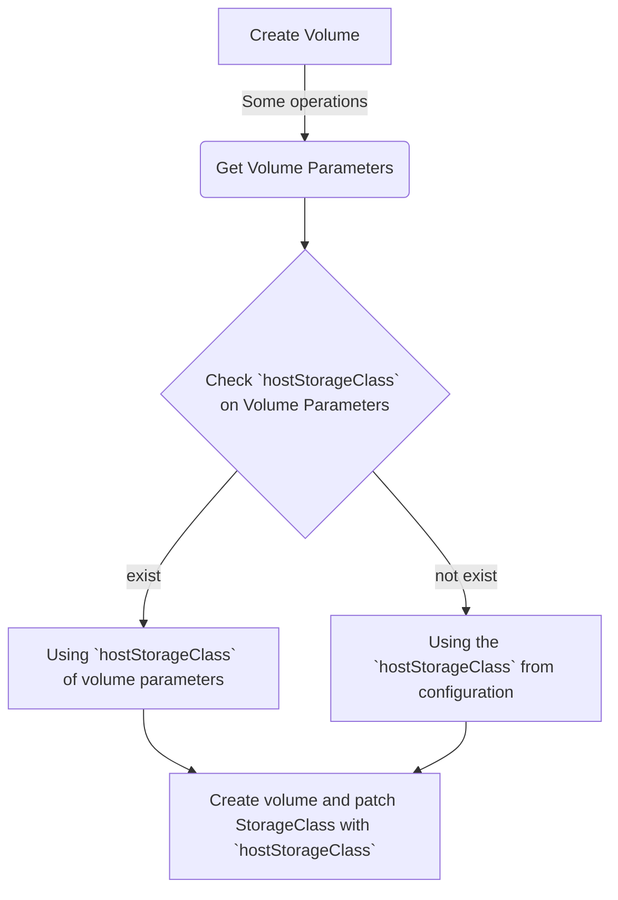

# Various StorageClass support of Harvester CSI Driver

## Summary

Harvester supports the user-defined StorageClass after v1.1.0. Because of that, Harvester CSI Driver should also let users use the custom StorageClass mentioned above.

### Related Issues

https://github.com/harvester/harvester/issues/3052

## Motivation

### Goals

The user using the Rancher integration with a Harvester Cluster (called Guest Cluster) can create the volume with the different StorageClass associated with StorageClass on the Host Harvester Cluster.

## Proposal

We will implement the mechanism to get the StorageClass parameter from the Guest Cluster and try to create it on the Host Harvester Cluster.

### User Stories

#### General use cases

Generally, users use the default StorageClass (`harvester`). The default StorageClass has three replicas, which means higher reliability. Users can create a volume with the default StorageClass (`harvester`) and use it without any additional configuration.

#### More specific goals

Sometimes users will have different purposes for storage volume. Like `data archiving` or `Storage tiering`. For the above requirements, users can change the data locality to HDD. Users can complete it by creating a new StorageClass and configuring its data locality to HDD. For performance purposes, users can reduce the number of replicas (remember, the default replica number is three). Reducing the replica number increases the volume's performance, but results in some lost data reliability. For example, users can create a new StorageClass and configure its replica number from 3 to 2 and make the storage volume with this StorageClass to get better performance. 

### User Experience In Detail

- Harvester CSI Driver no longer hardcodes the `longhorn` StorageClass name when creating volume from the Guest Cluster. Furthermore, The default StorageClass is associated with the `Default` StorageClass on the Host Harvester Cluster.

- Users need to create StorageClass with the parameter `hostStorageClass` on the Guest Cluster. This parameter is associated with the StorageClass on the Host Harvester Cluster.

### API changes

No

## Design

### Implementation Overview

PVC StorageClass will reference the `hostStorageClass`, which is from the StorageClass parameter or controller config hostStorageClass. The priority is StorageClass parameter > controller config. If undefined, the PVC would use the default StorageClass on the host cluster.

We prefer to keep the default StorageClass, `harvester`, of harvester-CSI-driver. That would benefit the general cases because users do not need to change anything if they do not want extra StorageClass. If users need a new StorageClass for different purposes, they can create a new one.

### StorageClass manifest Sample

``` yaml
  allowVolumeExpansion: true
  apiVersion: storage.k8s.io/v1
  kind: StorageClass
  metadata:
    name: <StorageClass Name>
  provisioner: driver.harvesterhci.io
  reclaimPolicy: Delete
  volumeBindingMode: Immediate
  parameters:
    hostStorageClass: <StorageClass Name on the Host Harvester Cluster>
```

### Notible Variable

- **hostStorageClass** - This is associated with the StorageClass Name on the Host Harvester Cluster.

### Flow Chart



### Test plan

#### Verify the Default StorageClass behavior

  1. Create the volume `vol001` with the default StorageClass on the Guest Cluster
  2. Check the `vol001` is created with the Default StorageClass on the Host Harvester Cluster.

#### Verify the user-defined StorageClass behavior

1. Create a new StorageClass `test` on the Host Harvester Cluster.
2. Create a new StorageClass using the following manifest on the Guest Cluster.

    ``` yaml
    allowVolumeExpansion: true
    apiVersion: storage.k8s.io/v1
    kind: StorageClass
    metadata:
      name: harvester-SC-test
    provisioner: driver.harvesterhci.io
    reclaimPolicy: Delete
    volumeBindingMode: Immediate
    parameters:
      hostStorageClass: test
    ```

3. Create the volume `vol002` with the above StorageClass on the Guest Cluster.
4. Check the `vol002` is created with the `test` StorageClass on the Host Harvester Cluster.

### Upgrade strategy

No

## Note [optional]

### Rancher UI enhancement
- The user needs to create a StorageClass from a manifest instead of the UI because the user can not select the provisioner `driver.harvesterhci.io` when creating a StorageClass through the UI.
