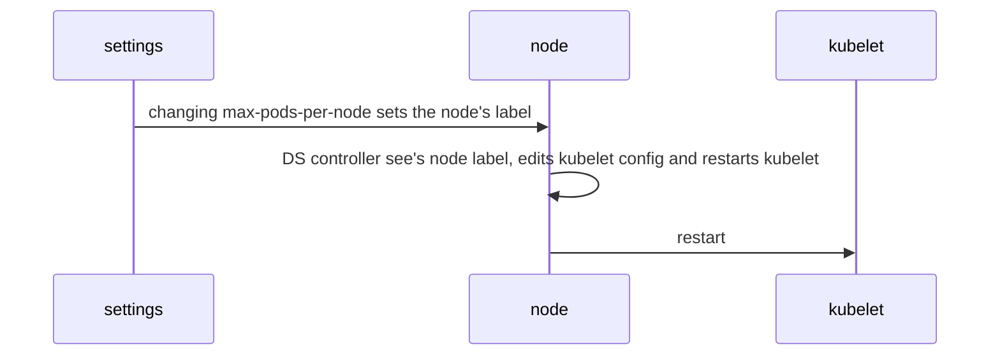

# Max Pods Configuration in Harvester

This is the **H**arvester **E**nhancement **P**roposal for the **T**opmost **A**mount of **Pods** or HEPTAPODS proposal.

## Summary

It started innocently, as a request to increase the per-node pod limit from 110 to 200. Then the issue of CIDR (Classless Inter-Domain Routing) came up, and the potential problem that allowing the number of pods to increase could cause an overlap between non-Pod IPs and the Cluster CIDR-defined range of IPs.

CIDR Defaults as of Harvester 1.1.1:

- The default cluster CIDR: `10.52.0.0/16`
    - Range: (10.52.0.1-10.52.255.254)
    - Length: 65,536 = $2^{32-16} = 2^{16}$
- The default service CIDR: `10.53.0.0/16`
    - Range: (10.53.0.1-10.53.255.254)
    - Length: 65,536 = $2^{32-16} = 2^{16}$

## How to choose a CIDR range to fit your desired max-pod value

Assumptions in this HEP: all nodes will have the same max-pods value. Choose your max-pods value to work with your weakest node.

If you have $n$ nodes and a max-pods value of $m$, then you have to find a minimum subnet that can fit that many distinct IP Addresses. [Azure](https://learn.microsoft.com/en-us/azure/aks/configure-azure-cni) recommends using this formula to size the subnet: 

$$(n+1) + m(n+1) = (n+1)(m+1)$$

So if we wanted to set $m = 900$ and have a max-pods of 900, and we had $n = 20$ nodes, then the subnet size would need to be $901*21=18,921$ (subnet minimum size).

Once we have the subnet size, we can calculate the prefix length: 

$$\text{prefixLength} = 32 - \lceil \log_2(\text{subnetSize}) \rceil $$

So applying this to our example: $32 - \lceil \log_2(18921) \rceil = 17$

Therefore, a max-pods $m = 900$ implies a CIDR range `10.52.0.0/17`, which when we check a [cidr calculator](https://www.ipaddressguide.com/cidr), it shows a total of 32,768 IP addresses in the pool, which is just big enough for our desired 18,921.

## What about collisions?

Our customers may have a custom DNS or NTP server at an IP address like 10.52.123.12 outside of the Harvester cluster. If this is inside the cluster address pool, we can deal with that problem by creating an exception in a [NetworkPolicy](https://kubernetes.io/docs/concepts/services-networking/network-policies/#:~:text=172.17.0.0/16-,except,-%3A).

Here is an example, assume the customer has an NTP server at 10.52.123.12,
then we can apply this NetworkPolicy to add it as an egress exception: 

```yaml
apiVersion: networking.k8s.io/v1
kind: NetworkPolicy
metadata:
  name: block-specific-ip-egress
spec:
  podSelector: {} # This selects all pods in the namespace
  policyTypes:
  - Egress
  egress:
  - to:
    - ipBlock:
        cidr: 10.52.0.0/22 # Allow IPs within the 10.52.0.0/22 range (calculated max-pods: 900)
        except: # The specific IP address you want to exclude
        - 10.52.123.12/32 # NTP server exception to avoid IP address collisions with the Pods
    ports:
    - protocol: UDP
      port: 123
```


### Related Issues

- https://github.com/harvester/harvester/issues/2707 (Increase 110 pods per node limit #2707)

## Motivation

### Goals

The goals are to avoid hitting the default kubernetes 110 pod limit. 

Example (100 pods):
- cattle 13 pods
- kube-system 19 pods
- longhorn 29 pods
- harvester-system 15 pods
- user vm only 24 pods


### Non-goals [optional]

Allowing for multiple max-pod limits per node. We decided that all nodes must have the same max-pod limit to simplify the design of the cluster-wide network.

## Proposal

Create a single Harvester setting that sets the max-pods per node, and have all nodes set their rke2-canal-config to respect that limit.

### User Stories

#### Story 1
Dr. Louise Banks wants to increase the number of pods to the computer to 700. She created a cluster of 91 nodes where most of the worker nodes are processing Heptapod logograms and analyzing visual features.

She visits the Harvester UI and goes to Advanced -> Settings, and sets `max-pods-per-node` to 700, since $(n + 1) + (n + 1)*700 == 65536$ is solved by $n=92.4893$, her subnet is large enough to allow 700 pods per node with 91 nodes.

### User Experience In Detail

#### Story in Detail
The `max-pods-per-node` setting is registered with a syncer in [register.go](https://github.com/harvester/harvester/blob/master/pkg/controller/master/setting/register.go#L60-L73). That syncer will translate the value, in this example, that value is 700. The syncer will translate this value into the appropriate changes in the rke2-canal-config ConfigMap in the kube-system namespace.

```shell
kubectl get configmap -n kube-system rke2-canal-config  -o yaml | yq '.data."net-conf.json"'

```

```json
{
  "Network": "10.52.0.0/16",
  "Backend": {
    "Type": "vxlan"
  }
}

```

After changing the rke2-canal-config, the syncer would also need to change the max-pods setting for all the nodes. Each node as a file /var/lib/rancher/rke2/agent/kubelet.kubeconfig that can set the max-pods.

### API changes

## Design

### Implementation Overview

### Harvester setting (cluster-wide)
There are two parts to the implementation. The first is the new [harvester setting](https://docs.harvesterhci.io/v1.1/advanced/settings/) called `max-pods-per-node`. 

Once the setting is changed, add a new [settings handler](https://github.com/harvester/harvester/tree/master/pkg/controller/master/setting) that takes care of setting the `max-pods` setting label on each node.

### Daemonset-managed controller that reads the node's `max-pods` label, and updates the kubelet



### Test plan

- Set up a 3-node cluster, then 
- set the `max-pods-per-node` to 900, and 
- check that the cluster CIDR is now set to 10.52.0.0/17, then 
- verify it by making 800+ dummy Pods for each Node, then verify that all the Pods are running and healthy.

### Upgrade strategy

Anything that requires if user want to upgrade to this enhancement

## Note

- The settings field will have to validate that the input is a postive integer.

