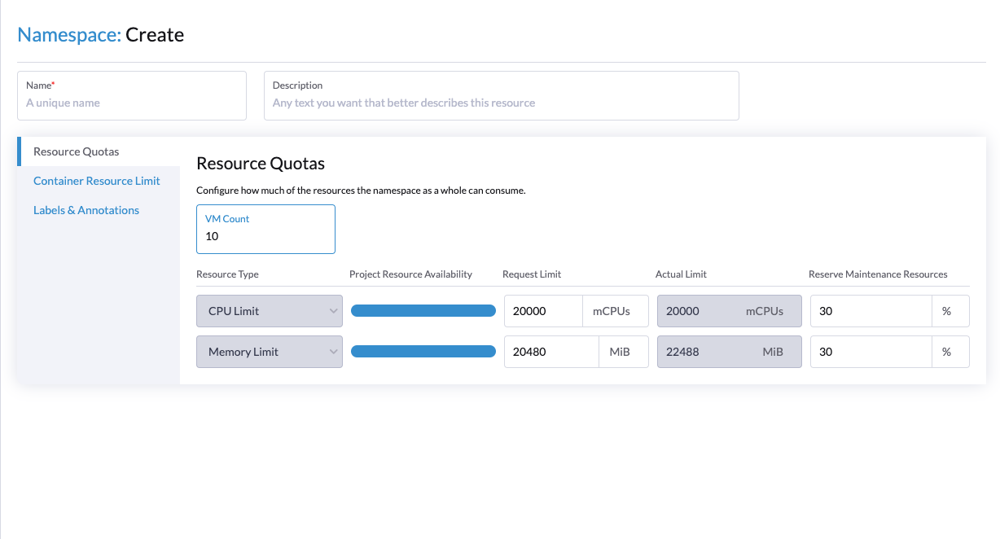
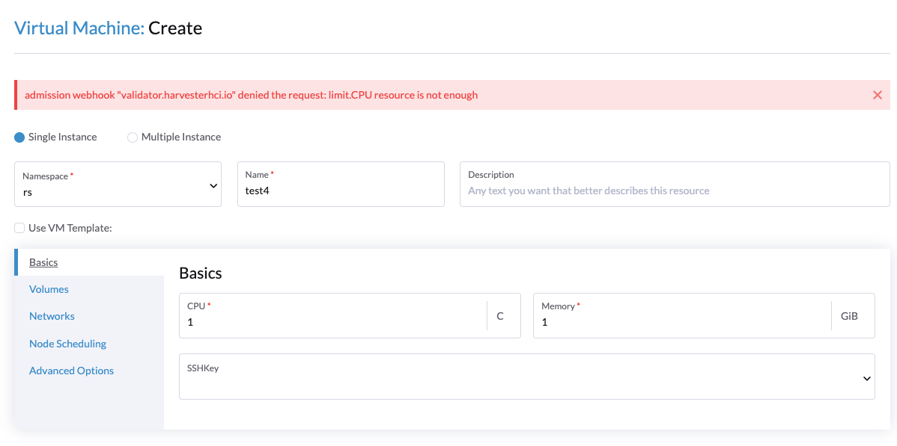

# Resource Quota Enhancement In Namespace

## Summary

VM migration cannot be performed when a user sets ResourceQuota and uses up all the quotas. `ResourceQuota` limits the quota usage of the entire namespace, while migration requires creating a pod equivalent to the VM being migrated. Kubernetes considers that creating a pod beyond the quota will exceed the resources, preventing migration.

It should be noted that the migration logic is controlled by Kubevirt and is not a native behavior of Kubernetes. Also, Kubevirt does not provide any solution between `ResourceQuota`
and migration. To solve this problem, the solution of Rancher configuration quotas can be used by adding a reserved resource field in the namespace. In this way, VM migration can be performed without exceeding `ResourceQuota`.**

### Related Issues

[#3124](https://github.com/harvester/harvester/issues/3124)

## Motivation

### Goals

* VM migration can be performed.
* Expose Kubevirt migration configuration.

## Proposal

`ResourceQuota` only applies to native Kubernetes objects. Due to field limitations and the fact that Rancher can only configure default `ResourceQuota`, we currently place reserved resource information in the annotation of the `Namespace`.

We add maintenance of resource quotas to allow users to configure them and prevent VMs from using up all the quotas. At the same time, we also leverage the ability of `ResourceQuota` to protect resource usage.

### User Stories
**Configure maintenance resource quotas**

The user expects the namespace to limit CPU usage to 10c and wants 50% of that to be reserved for VM migration, using the following yaml：

```yaml
apiVersion: v1
kind: Namespace
metadata:
  annotations:
    field.cattle.io/resourceQuota: '{"limit":{"limitsCpu":"10000m"}}'
    harvesterhci.io/maintenanceQuota: '{"limit":{"limitsCPUPercent":"50"}}'
  name: test
```

Check and view the quota allocated to VM available resources and maintain available resources：

```yaml
apiVersion: v1
kind: Namespace
metadata:
  annotations:
    field.cattle.io/resourceQuota: '{"limit":{"limitsCpu":"10000m"}}'
    harvesterhci.io/maintenanceQuota: '{"limit":{"limitsCPUPercent":50}}'
    harvesterhci.io/maintenanceAvailable: '{"limit":{"limitsCpu":5000}}'
    harvesterhci.io/vmAvailable: '{"limit":{"limitsCpu":5000}}'
  name: test
```

After configuration, the VM can only use **50%** of the quota. When the user performs a migration operation, the maintain available resources will be calculated and used for the migration.

> If the maintain quota is set to **0 or not configured**, it will be treated as disabled and executed according to the system default behavior.

### VM overhead resource

After creating VMs, because the virt-components in the Pod requires a certain memory overhead, resulting in a higher actual quota of Pod memory than expected from the VM configuration, however, there is a risk that the number of VMs created by the user or the number of simultaneous migrations does not meet the expectations.

Calculating the actual memory used by the expected number of VMs, Limit.cpu, Limit.memory, we sort out how Kubevirt calculates the actual memory based on the code on Kubevirt:

* Each virtual machine requires a fixed overhead of 180Mi (branch master: 210Mi).
```go
VirtLauncherMonitorOverhead = "25Mi" // The `ps` RSS for virt-launcher-monitor
VirtLauncherOverhead        = "75Mi" // The `ps` RSS for the virt-launcher process
VirtlogdOverhead            = "17Mi" // The `ps` RSS for virtlogd
LibvirtdOverhead            = "33Mi" // The `ps` RSS for libvirtd
QemuOverhead                = "30Mi" // The `ps` RSS for qemu, minus the RAM of its (stressed) guest, minus the virtual page table

overhead.Add(resource.MustParse(VirtLauncherMonitorOverhead))
overhead.Add(resource.MustParse(VirtLauncherOverhead))
overhead.Add(resource.MustParse(VirtlogdOverhead))
overhead.Add(resource.MustParse(LibvirtdOverhead))
overhead.Add(resource.MustParse(QemuOverhead))
```
* CPU table overhead, 8Mi per vcpu, plus IOTread overhead fixed at 8Mi.
```go
coresMemory := resource.MustParse("8Mi")
...
// if neither CPU topology nor request or limits provided, set vcpus to 1
if vcpus < 1 {
    vcpus = 1
}
value := coresMemory.Value() * vcpus
coresMemory = *resource.NewQuantity(value, coresMemory.Format)
overhead.Add(coresMemory)

// static overhead for IOThread
overhead.Add(resource.MustParse("8Mi"))
```
* Memory pagetables overhead (one bit for every 512b of RAM size), use limit memory instead of request memory, i.e. 1Gi memory requires 2Mi overhead.
```go
pagetableMemory := resource.NewScaledQuantity(vmiMemoryReq.ScaledValue(resource.Kilo), resource.Kilo) 
pagetableMemory.Set(pagetableMemory.Value() / 512)
overhead.Add(*pagetableMemory)
```
* Reserve 100MiB (104857600 Bytes) for QEMU on guest memory overhead.

The final formula: `180Mi * VMs + vcpu * 8Mi + 8Mi + memory / 512 + memory + 100Mi`, the actual value of the final memory limit is calculated according to this formula.

### User Experience In Detail

**UI**

Configuring maintain quota only requires the administrator to go to the Harvester cluster operation in the Rancher UI.
Add VM count field to Namespace UI to separate requested limit parameters from actual limit parameters.

Projects/Namespaces → {Target namespace} → Edit Config → Resource Quotas


When the user exhausts the quota, a prompt of insufficient resources will appear when creating a VM.


### API changes
No. The first implementation is included in the GA release 1.2.0

## Design

### Implementation Overview

**Save configuration**

The configuration will be saved in the `annotations` of the `Namespace`. To be consistent with Rancher's logic, users must first configure maintenance resource quotas through `Namespace`. When the Harvester webhook detects that the annotations contain maintenance resource quota fields, it will automatically calculate the available resources for both VMs and maintenance. The following is the YAML configuration:

namespace.yaml

```yaml
apiVersion: v1
kind: Namespace
metadata:
  annotations:
    field.cattle.io/resourceQuota: '{"limit":{"limitsCpu":"10"}}'
    harvesterhci.io/maintenanceQuota: '{"limit":{"limitsCPUPercent":"50"}}'
    harvesterhci.io/maintenanceAvailable: '{"limit":{"limitsCpu":5000}}'
    harvesterhci.io/vmAvailable: '{"limit":{"limitsCpu":5000}}'
  name: test
```

**Configuration Validator**

Add `Namespace` webhook validator：

- The maintenance quota cannot exceed the namespace resource.
- The resources used by non-Shutdown VMs must be within the `vmAvailable` range.

**VM Operations**

Verify if the following API operations can run VMs by validating the available resources for the VM:

- Create a VM
- Modify a VM
- Start a VM
- Restrore a new VM

Non-shutdown VMs are listed as used VM resources. When performing a restart, they will briefly show a "Stopped" state, which needs to be considered in conjunction with `status.stateChangeRequests`.

For backup and snapshot recovery, the recovery request is first validated by the webhook to ensure that there are enough resources to create a VM. Additionally, during the recovery process, it is possible for other operations to preempt the available resources for the VM. Therefore, in the VM creation strategy during recovery, if there is not enough resources available, the VM will be set to a "Halted" state. This can be checked by `RestoreHandler.createNewVM` (code: [restore.go#L535](https://github.com/harvester/harvester/blob/master/pkg/controller/master/backup/restore.go#L535)), and the startup logic will need to be modified (delete this section of code: [restore.go#L797-L798](https://github.com/harvester/harvester/blob/8ffb7da5773ee766c92f02fe5a3a674ca51f112a/pkg/controller/master/backup/restore.go#L797-L798)).

**Migration**

When a user requests to migrate a VM, the webhook first verifies whether there are enough available VM resources. Due to the slight time gap between migration and VM creation, it is also possible for VM resources to be preempted during this period. However, the logic for creating VMs is handled by upstream and the runtime status of Migration should also be included in the calculation of available maintenance resources.

If the resources used by a VM in a non-Shutdown state exceed the available VM resources, the following behavior will occur:

- Prohibit the creation or modification of VMs.
- Allow deletion or shutdown of VM.
- When unknown issues in insufficient available resources for VMs, the system will add information about the exceeded quota to the annotations of the Namespace.

```yaml
apiVersion: v1
kind: Namespace
metadata:
  annotations:
    field.cattle.io/resourceQuota: '{"limit":{"limitsCpu":"10"}}'
    harvesterhci.io/maintenanceQuota: '{"limit":{"limitsCPUPercent":"50"}}'
    harvesterhci.io/maintenanceAvailable: '{"limit":{"limitsCpu":5000}}'
    harvesterhci.io/vmAvailable: '{"limit":{"limitsCpu":5000}}'
    harvesterhci.io/exceedsQuota: 'true'
  name: test
```

### Test plan

Test based on the following configuration:

1. Create a Project and configure a ResourceQuota with a CPU Limit of 4 cores and Memory Limit of 5Gi.
2. Create a Namespace for the Project and configure resource limits (CPU Limit of 4 cores and Memory Limit of 5GiB) as well as maintenance resources (CPU Limit of 50% and Memory Limit of 50%).
3. Create two VMs named VM1 and VM2, each with 1 CPU and 1GB memory allocated.

Scenario 1：

1. Migration VM1 to another node.
2. Check the status of VM1.

Scenario 2: Operating VM1 while VM2 is successfully migrated

1. Operate (start/stop/restart) VM1.
2. Immediately migrate VM2 during VM1 operation.
3. Check the status of VM2.

Scenario 3: Occupancy of VM available resources

1. Create VM3.
2. Creation fails and returns "VM available resources are insufficient".
3. Suspend VM1.
4. Create VM3.
5. Creation fails and returns "VM available resources are insufficient".
6. Start and stop VM1.
7. Create VM3 during the stopping period, and returns "VM available resources are insufficient".

Scenario 4: Maintenance resource is full

1. Migrate VM1 to another node.
2. Immediately migrate VM2 to another node during VM1 migration, returning "maintenance resource is insufficient" error.

Scenario 5: Backup and Snapshot Recovery

1. Backup/snapshot VM1.
2. Recover new VM4, which fails and returns an error.
3. Stop VM2.
4. Recover new VM4.
5. Check the status of VM4.

Scenario 6: Upgrade

1. Upgrade the Harvester cluster.
2. Observe the status of VM.

### Upgrade strategy

Anything that requires if user want to upgrade to this enhancement

## Note [optional]

Additional nodes.