# Bare-metal Cluster Container and Multi-cluster Management Support

Make the bare-metal Harvester support container workloads and multi-clusters management.

## Summary
This proposal aims to improve Harvester's usability and reduce resource consumption by providing container workload management and multi-cluster management through the bare-metal Harvester cluster.

The current [Rancher integration in Harvester](https://docs.harvesterhci.io/v1.1/rancher/rancher-integration) requires deploying Rancher separately, which can be complicated and resource-intensive. By enabling container workloads and multi-cluster management through Harvester's built-in Rancher will reduce overhead and improve product usability.

### Related Issues
https://github.com/harvester/harvester/issues/2679


## Motivation

### Goals

- Provide support for managing bare-metal container workloads.
- Provide multi-cluster management(MCM) support through the bare-metal Harvester cluster.
- Reduce the footprint/overhead of the existing Harvester-Rancher integration method.
- Support authentication and authorization on the bare-metal Harvester cluster.


### Non-goals
- Support built-in Rancher manual upgrade without Harvester's new release.
- Support importing and managing Harvester with multiple Ranchers.
- Fleet management support for the Harvester cluster(will be considered as a seperated new feature).
- Automatically force shutdown user containers that block upgrades. Instead, we may consider draining the node, leaving the user to resolve blocking issues manually, such as volume or pod eviction.
- User container workloads might block upgrade. We may force shutdown user containers? (or drain the node only, user need to resolve blocking cases manually, e.g, volume or pod can’t be evicted)
- Backup and restore Rancher (see https://ranchermanager.docs.rancher.com/v2.6/pages-for-subheaders/backup-restore-and-disaster-recovery)
- Container GPU pass-through support (moved to v1.3.0)

## Proposal
- Provide support for managing bare-metal container workloads
    - Users can enable or disable container workloads management via the setting page, and the explorer UI will appear in the hamburger menu.
- Provide multi-cluster management(MCM) support through the bare-metal Harvester cluster.
    - Users can enable or disable multi-cluster view through the `container-and-mcm-support` setting, either before or after installation.
    - Once enabled, the `Continuous Delivery`, `Cluster Management`, `Users& Authentication` manu will appear.
    - After enabling multi-cluster feature, users cannot import the current Harvester cluster into another Rancher or MCM-enabled Harvester cluster.
    - The multi-cluster view in Harvester cluster will be slightly different from the native Rancher server. We will disable undesired UI options in those related pages(e.g., hidden disable/enable MCM and Harvester Integration feature flag in the global setting page).
- Reduce the footprint and overhead of the existing Harvester Rancher integration method.
    - Users don't need to deploy additional Rancher, which saves CPU, memory, and disk resources for constrained conditions like edge deployment.
- Support authentication and authorization on the bare-metal Harvester cluster.
    - We can leverage the Rancher's existing authentication and authorization mechanism, but users need to turn on the `multi-cluster` config first.


### User Stories

#### Story 1

As a user, I want to manage my container workloads through the Harvester bare-metal cluster, without having to deploy Rancher separately. This will save me time and resources.


#### Story 2

As a user, I want to use the current bare-metal Harvester cluster for multi-cluster management. Therefore, I can easily spin up a guest rke2 cluster or import any other existing k8s cluster into the Harvester cluster.

#### Story 3

As a user, I want to enable authentication and authorization on the bare-metal Harvester cluster, making it convenient for me to manage resources with proper permissions in an edge case.

### User Experience In Detail

1. Users can enable/disable the container workloads management feature via the setting page, and the explorer UI will be shown in the hamburger menu.

  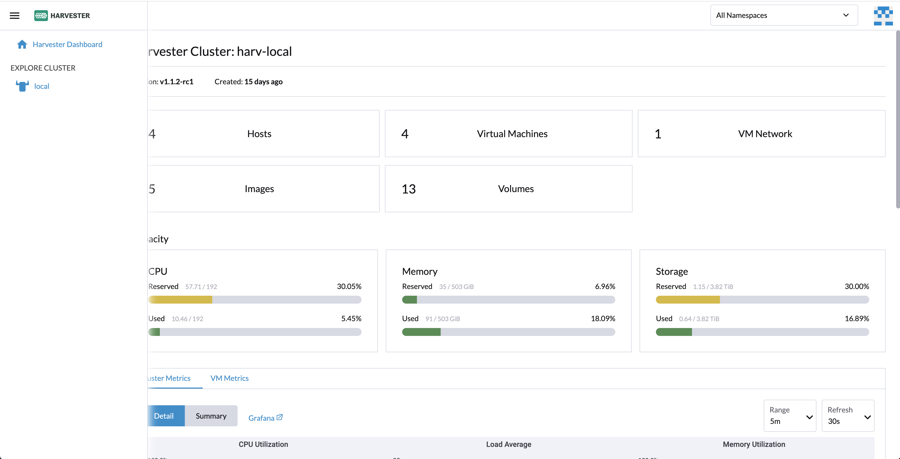

2. Users can enable/disable multi-cluster view through the `container-and-mcm-support` setting, either before or after installation.
  - Once enabled, the `Continuous Delivery`, `Cluster Management`, `Users& Authentication` page will be shown in the menu.
  - `container-management` config will be automatically enabled if the `multi-cluster` feature is enabled.

  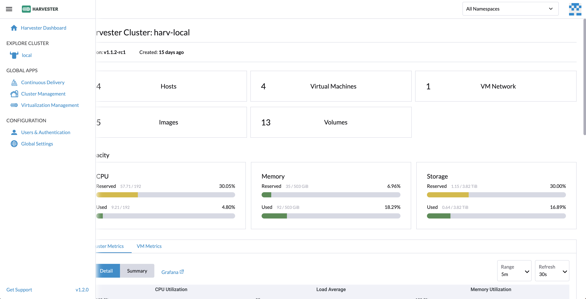

3. Users can enable the local cluster authentication and authorization on the `Users & Authentication` page when the `multi-clsuter` configuration is set to true
   - When the `multi-cluster` configuration is set to false, the `Users & Authentication` page will be hidden and the configured auth provider will be disabled automatically, but users can still login with the local auth(i.e., using username and password).
   - If the cluster is imported into another Rancher server, the users & RBAC will not be migrated and only the local auth will be available.

  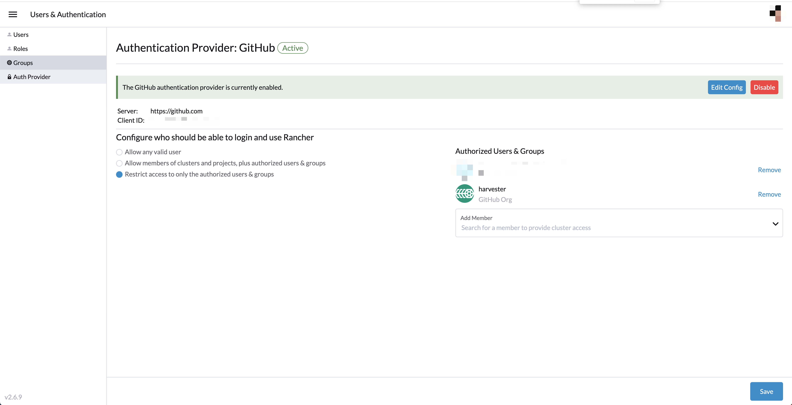

### API changes

1. A new json formatted setting `container-and-mcm-support` will be added to the Harvester setting page and can be configured via the [Harvester configuration file](https://docs.harvesterhci.io/v1.1/install/harvester-configuration):
```json
{
  "container-management": true, # default to false, enable/disable the container management.
  "multi-cluster": true # default to false, enable/disable the multi-cluster view.
}
```
If the `multi-cluster` config is enabled, we will automatically set the `container-management` configuration to true in the UI and webhook.

2. Users can visit the local Harvester cluster via `/v1/harvester` API endpoint, and the remote Harvester cluster via `/v1/management.cattle.io.clusters/<cluster-id>/v1/harvester` API endpoint.
   - the local `/v1/harvester` API endpoint is only available starting from the v1.2 after enabling the multi-cluster-management feature in the Rancher server config.


## Design

### single harvester UI change
1. Supports custom Logo, Favicons, and Private labels.
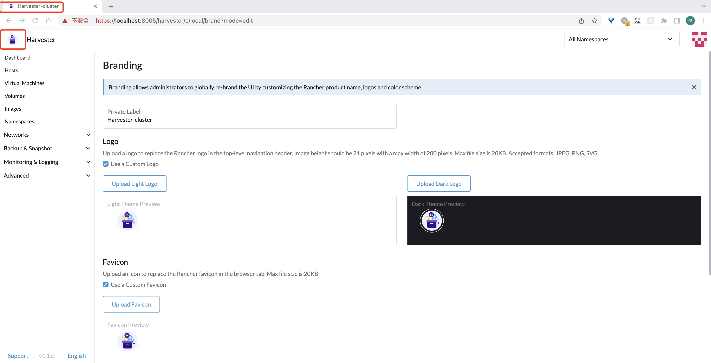

### MCM UI change 
(The local cluster is harvester cluster & setting 'container-and-mcm-support' is true)
```json
{
  "container-management": true, # default to false, enable/disable the container management.
  "multi-cluster": true # default to false, enable/disable the multi-cluster view.
}
```
1. Add the `Harvester Dashboard` menu above the `Home` menu.
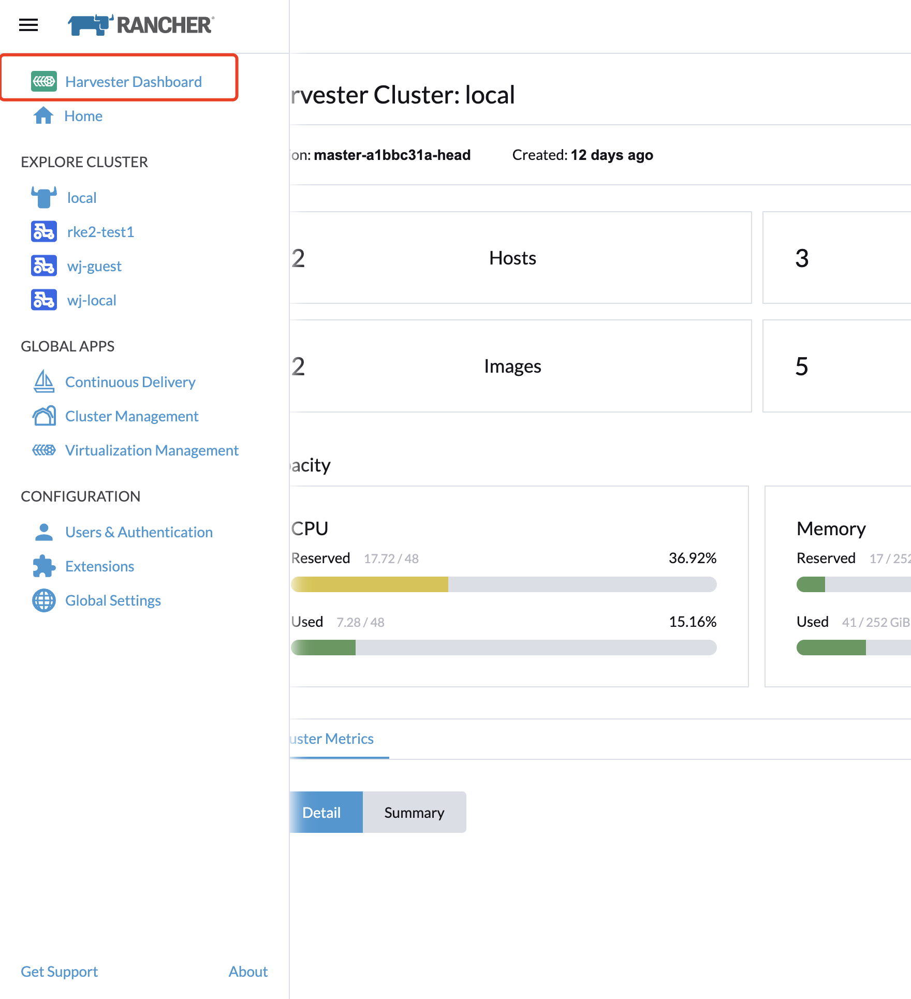
2. Change the `version` column on the `Virtualization Management` page to the harvester version.  (require backend support)
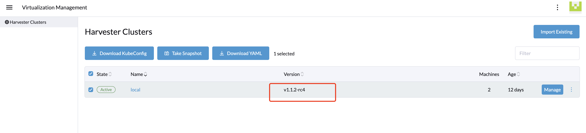
3. Add a `Set as login page` to the header of the harvester dashboard page.
4. Show the harvester clusters in the `cluster management` & `Continuous Delivery` & `Explore cluster` list
   - In the `EXPLORE CLUSTER` list, if it is a harvester cluster, we need to show the harvester icon.
5. global setting:
   - Sorting out global setting and harvester setting, such as some duplicate setting types (require backend research)
   - Lock harvester and multi-cluster-management in the `Feature Flags` list like rke2 (add a lock icon)
6. Home page
   - Allow users to jump from the home page to the harvester dashboard, add a harvester icon to the left of the name, click on the icon to jump to the harvester Dashboard page.
   - `Welcome to harvester` on the home page is changed to `Welcome to rancher`
   - Show all clusters (including harvester) on the home page.
   - The current local cluster's Provider is shown as custom, but should be shown as harvester, including the cluster management table page
   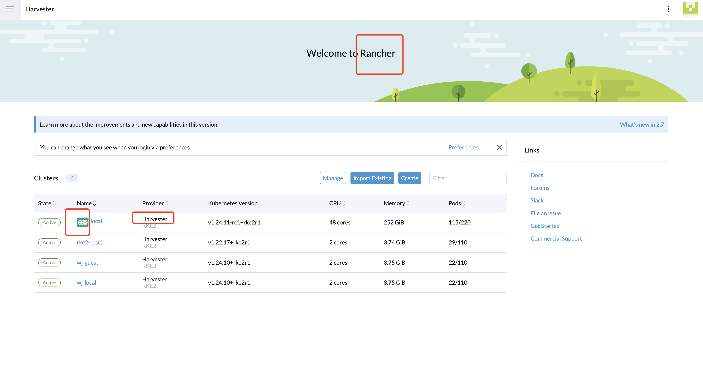
7. Cluster Management page:
   - Add the Explore button to the end of the local cluster
8. local cluster explorer UI (harvester provider)
   - `Install Apps` page to hide rancher upgrade button.
   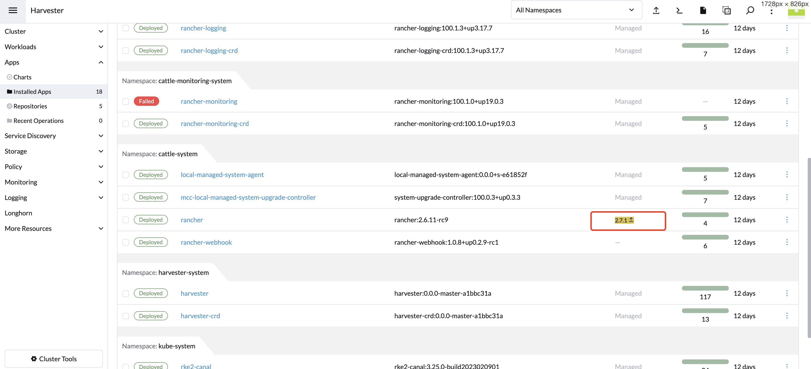
   - Disable edit/upgrade/delete harvester managed system service (such as monitoring, loggin, harvester...)
    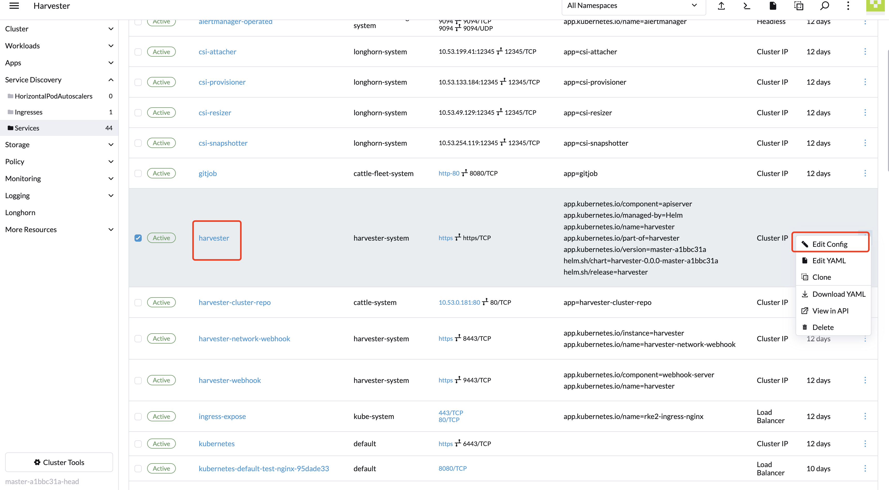
   - `Cluster Tools` page, we should disable operations that affect harvester, such as edit/delete monitor, longhorn, and logging
    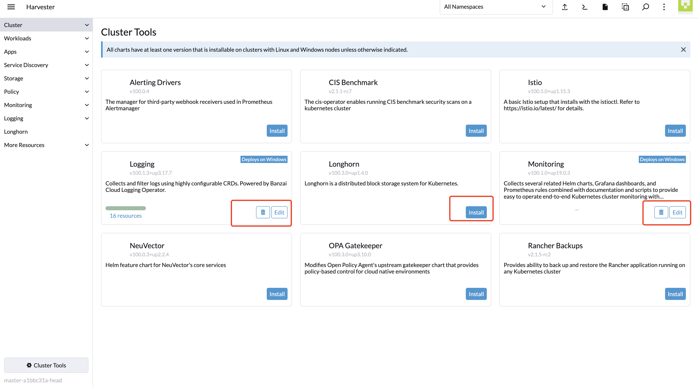
   - If the `local` cluster is a harvester cluster, we need to hide resources prefixed with `harvesterhci.io.*`, and `kubevirt.io.*`
    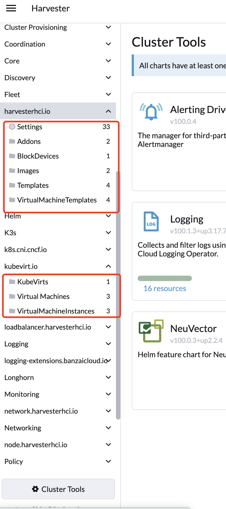

### Implementation Overview
1. Turn on the `multi-cluster-management` feature in the embedded Rancher server config.
3. Add a new setting `container-and-mcm-support` to the Harvester setting page that will allow configuration in both installation and post-installation stage.
4. Customize the Rancher UI to show/hide the explorer UI and the multi-cluster management UI based on the `container-and-mcm-support` setting. 
    - Showing both the local Harvester cluster and imported Harvester clusters on the explorer and continues delivery clusters.
    - Hide overlapped and undesired configurations(e.g., disable Harvester and MCM feature) in both Rancher's global setting page and the local Harvester cluster setting page.
    - Replace the `Home` with `Harvester Dashboard` by default going to the local Harvester Dashboard to provide consistent user experience of single and multi-cluster views.


### Test plan

- Users should be able to enable/disable the container workloads management feature via the setting page, and the explorer UI will be shown in the hamburger menu.
- Users should be able to enable/disable multi-cluster view through the `container-and-mcm-support` setting, either before or after installation, and the related UI will be shown in the hamburger menu.
- Users should be able to visit both the local Harvester cluster and imported Harvester/k8s clusters explorer UI.
- Users should be able to visit both the local Harvester cluster and imported Harvester clusters virtualization management UI.
- Users can spin-up guest k8s clusters in the local bare-metal cluster through Harvester node driver.
- Users can enable authentication and authorization on the bare-metal Harvester cluster, and the [multi-tenancy](https://ranchermanager.docs.rancher.com/v2.6/pages-for-subheaders/authentication-config) feature on the local Harvester cluster should be identical to a seperated upstream Rancher deployment.

### Upgrade strategy

- According to Rancher's [doc](https://ranchermanager.docs.rancher.com/getting-started/installation-and-upgrade/installation-references/feature-flags), the `multi-cluster-management` is used for multi-cluster provisioning and management of Kubernetes clusters. This feature flag can only be set at install time and not changed afterwards. Therefore, we will need to check the upgrade path since this is disabled by default in the Harvester's embedded Rancher.
- For new installed Harvester this is not a problem, since the `multi-cluster-management` is enabled by default.
- For existing Harvester cluster that is already import by another Rancher, you can only enable the `multi-cluster-management` feature by editing the Rancher server config, and then restart the Rancher server pod.