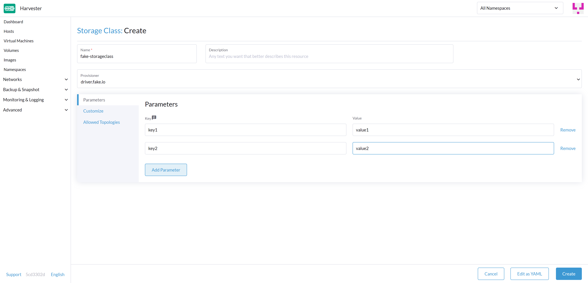
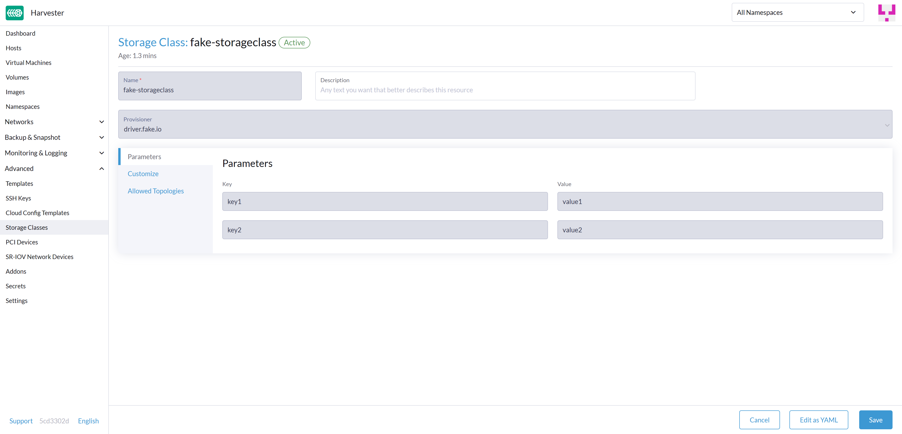
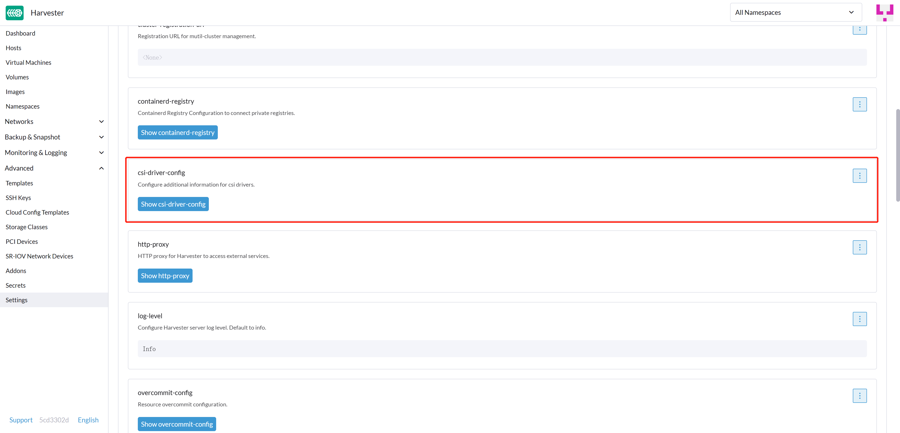
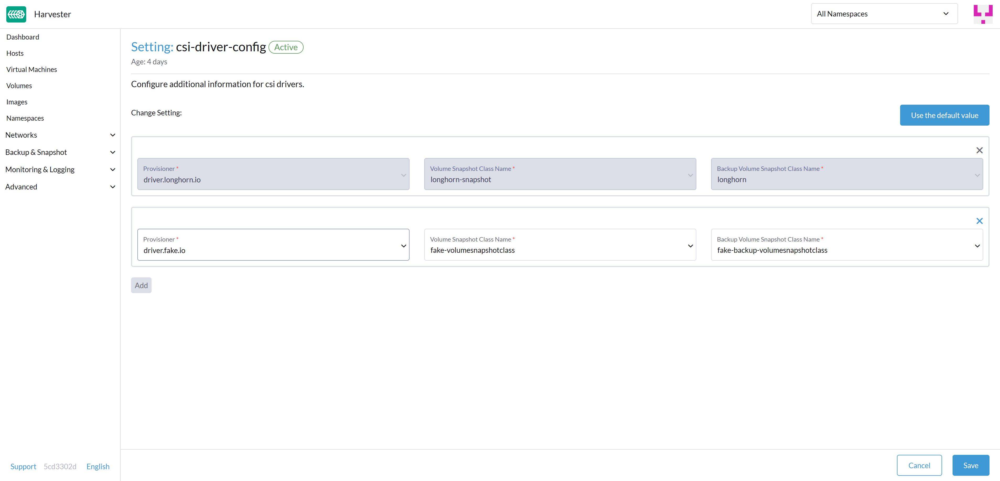

# Multi CSI support

## Summary

[Container Storage Interface](https://github.com/container-storage-interface/spec/blob/master/spec.md) (CSI) defines a standard interface for container orchestration systems (like Kubernetes) to expose arbitrary storage systems to their container workloads.

For more information, please refer to the [CSI design proposal](https://git.k8s.io/design-proposals-archive/storage/container-storage-interface.md).

This proposal aims to add multi-CSI driver support to Harvester as an additional data disk, allowing users to leverage different drivers for specific purposes, e.g., performance optimization and integration with existing internal storage providers.

### Related Issues

harvester/harvester#2405

## Motivation

### Third-party Storage Requirements

- Support expansion
- Support snapshot
- Support clone
- Support block device
- Support Read-Write-Many(RWX)

### Goals

Allows users to use third-party storage as data volume by manually installing the CSI driver and configuring storageclass，volumesnapshotclass, and Harvester settings.

### Non-goals [optional]

- Use other CSI drivers to create `Image Volumes`.
- Installing other CSI drivers from the Harvester UI.
- Create `VolumeSnapshotClasses` from the Harvester UI.

## Proposal

### User Stories

As a user, I want to utilize my existing storage provider (e.g., Dell PowerFlex) to create a data volume in Harvester. This eliminates the need to migrate VM data and allows me to leverage my existing storage maintenance knowledge.

### User Experience In Detail

1. Manually install other CSI drivers and create their `StorageClasses` and `VolumeSnapshotClasses` in Harvester.
1. Edit the `csi-driver-config` setting, adding the provider for the newly added CSI driver and configuring `volumeSnapshotClassName` and `backupVolumeSnapshotClassName`.
  - `VolumeSnapshotClassName` refers to the name of the `VolumeSnapshotClass` used to create volume snapshots or VM snapshots.
  - `BackupVolumeSnapshotClassName` refers to the name of the `VolumeSnapshotClass` used to create VM backups.
1. Select the desired `StorageClass` when creating an empty volume (src=New).
1. Select the desired `StorageClass` when adding a new empty volume to a virtual machine.

### API changes

- Add a new option `os.persistent_state_paths` to the Harvester OS configuration.
- Add a new option `os.after_install_chroot_commands` to the Harvester OS configuration.
- Add a new setting `csi-driver-config` to the Harvester **Settings** page.

## Design

### Implementation Overview

#### Harvester Installer
1. Support configuring a root file system (rootfs) layout (PERSISTENT_STATE_PATHS) through the Harvester configuration file.

Currently, the Harvester OS does not support custom paths for persistent storage or read-write paths. Any changes to files not in default `os.persistent_state_paths` will be lost upon reboot.

We need to add a new option for `os.persistent_state_paths` to the Harvester OS configuration in the Harvester config.

The new `os.persistent_state_paths` option allows users to configure custom paths where modifications made to files will persist across reboots. Any changes made to files in these paths are not lost after a reboot.

Refer to the following example config for installing rook-ceph in Harvester:
```yaml
os:
  persistent_state_paths:
    - /var/lib/rook
  modules:
    - rbd
    - nbd
```
Users can achieve the same effect without this enhancement by modifying `/oem/90_custom.yaml` and rebooting. This enhancement allows users to define the desired OS layout during installation.

2. Enable installation of additional packages via Harvester configuration

Harvester OS currently lacks support for users to add additional software packages. To address this limitation, we propose leveraging the `after-install-chroot` stage provided by [elemental-toolkit](https://rancher.github.io/elemental-toolkit/docs/). This stage allows executing commands not restricted by file system write issues, ensuring the persistence of user-defined commands even after a system reboot. To make this functionality accessible, we will expose it through the Harvester Configuration or `/oem/90_custom.yaml` file.

Refer to the following example config for installing an RPM package in Harvester:

```yaml
os:
  after_install_chroot_commands:
    - rpm -ivh <the url of rpm package>
```

In the `after-install-chroot` stage, DNS resolution is not available.

If users need to access a domain name, users need to create a temporary `/etc/resolv.conf` file first. For example:

```yaml
os:
  after_install_chroot_commands:
    - "rm -f /etc/resolv.conf && echo 'nameserver 8.8.8.8' | sudo tee /etc/resolv.conf"
    - "mkdir /usr/local/bin"
    - "curl -fsSL -o get_helm.sh https://raw.githubusercontent.com/helm/helm/main/scripts/get-helm-3 && chmod 700 get_helm.sh && ./get_helm.sh"
    - "rm -f /etc/resolv.conf && ln -s /var/run/netconfig/resolv.conf /etc/resolv.conf"
```

#### Harvester UI
1. Changes to **StorageClass** page.
- When creating a StorageClass, support selecting other provisioners. UI can get options from K8s's `csidrivers` API. 
- If it is a non-Longhorn provisioner, only show the general parameters.



2. Setting `csi-driver-config` Details Page
- The default content of setting `csi-driver-config`:
```json
{
  "driver.longhorn.io": {
    "volumeSnapshotClassName": "longhorn-snapshot",
    "backupVolumeSnapshotClassName": "longhorn"
  }
}
```
- The first level map key is the name of the CSI driver. The UI can also get options from K8s's `csidrivers` API.




### Test plan

- https://github.com/harvester/harvester/issues/2405#issuecomment-1549634520
- https://github.com/harvester/harvester/issues/3689#issuecomment-1563130124

### Upgrade strategy
N/A

## Note
- Installing OS packages for other CSI drivers will depend on https://github.com/rancher/elemental-toolkit/issues/1739.
- Changes to the OS in the `after-install-chroot` stage will be lost after the Harvester upgrade, so the user must also configure the `after-upgrade-chroot`. Refer to https://rancher.github.io/elemental-toolkit/docs/customizing/runtime_persistent_changes/ before upgrading Harvester.