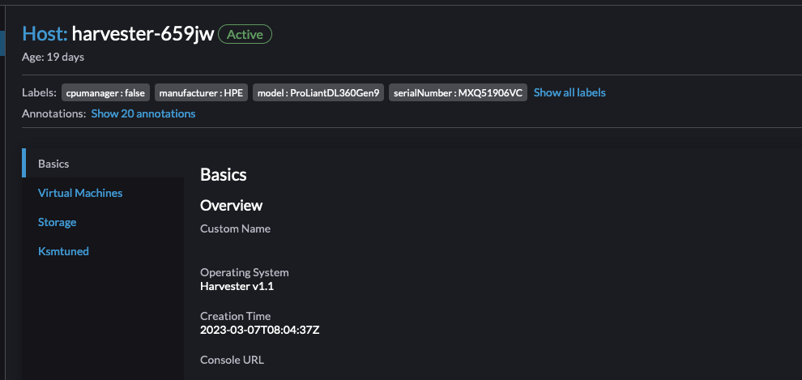
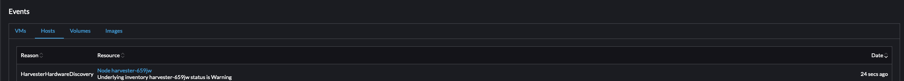

# Harvester Seeder Embedded Mode Integration

## Summary

We have been running and developing [Seeder](https://github.com/harvester/seeder) for provisioning and managing the lifecycle of bare-metal clusters in our internal labs.

With version 1.2.0, we plan to introduce an embedded mode of Seeder, which will allow deployment of Seeder to an existing cluster via **Harvester Addons**.

In embedded mode, the addon will enable end-users to define inventory objects that map the Harvester nodes to the corresponding bare-metal nodes. The bare-metal interaction will be through IPMI and Redfish protocols.

Once defined, Seeder in embedded mode leverages the cluster event controllers to query underlying hardware and propagate that information to the corresponding node objects.

In addition, users will be able to perform underlying hardware power cycle operations via the Harvester UI.


### Related Issues

https://github.com/harvester/harvester/issues/2318

## Motivation

### Goals

- Allow propagation of hardware information into Harvester.

- Allow propagation of hardware events into Harvester events.

- Allow users to power cycle hardware via Harvester.

### Non-goals [optional]

Provisioning of additional hardware.

## Proposal

### User Stories

#### Discover hardware details via Harvester

A Harvester user wants to discover underlying hardware information from Harvester.

Discovering underlying hardware information from Harvester is not currently possible. However, once the seeder addon is enabled, the user can define inventory objects for their Harvester nodes to map individual Harvester nodes to the underlying hardware.

Once the addon is enabled and the inventory object is defined, the end user can see underlying hardware information in the Harvester UI.

This will include information such as (but not limited to):
* Hardware manufacture
* Hardware serial number
* Hardware model
* Hardware events






#### Power cycle nodes via Harvester

A Harvester user wishes to reboot, shutdown, or power-on underlying hardware from Harvester.

Once the Seeder addon is enabled, users can power cycle the underlying nodes by using the additional power action options available in the Harvester UI.

### API changes
Like PCIDeviceClaims, the Harvester UI will allow end users to define a secret for BMC credentials and associated inventory objects.

The two changes explained above can be handled directly by the Harvester UI.

Once an inventory is associated with a node, the associated nodeObject needs to be annotated with additional information:

`harvesterhci.io/inventoryName: inventoryName`

There will be changes to the node API: https://github.com/harvester/harvester/blob/master/pkg/api/node/formatter.go#L40

Changes will involve additional resource actions:

* If the node is in `maintenanceMode`, users can invoke `powerActionPossible` to check if power actions are possible on this node.
* If an API call `powerActionPossible` returns `HTTP status 200`, the user can invoke `powerAction` to trigger the correct `powerAction` on the node.


## Design
The Seeder addon will introduce a few new CRDs. However, only the following are used in embedded mode:

* inventories.metal.harvesterhci.io
* clusters.metal.harvesterhci.io
* jobs.bmc.tinkerbell.org
* machines.bmc.tinkerbell.org
* tasks.bmc.tinkerbell.org

### Implementation Overview

Seeder will run as a deployment in the `harvester-system` namespace in the cluster.

The addon will deploy Seeder with `EMBEDDED_MODE` set to `true`.

In this mode, the provisioning controllers are not bootstrapped. However, the following controllers are bootstrapped:

* local cluster controller
* local node contorller
* rufio machine controller
* rufio job controller
* rufio task controller
* cluster event controller

When booting in embedded mode, Seeder will create a `local` cluster for `cluster.metal` objects pointing to the K8s default service as the cluster endpoint address.

This is a placeholder for `inventory` objects as they are added to the cluster.

```yaml
apiVersion: metal.harvesterhci.io/v1alpha1
kind: Cluster
metadata:
  creationTimestamp: "2023-03-26T22:50:15Z"
  generation: 4
  name: local
  namespace: harvester-system
  resourceVersion: "31519751"
  uid: 44ad4855-65c7-46ba-a321-04c54ab69337
spec:
  clusterConfig: {}
  nodes:
  - addressPoolReference:
      name: ""
      namespace: ""
    inventoryReference:
      name: harvester-659jw
      namespace: harvester-system
  version: local
  vipConfig:
    addressPoolReference:
      name: ""
      namespace: ""
status:
  clusterAddress: 10.53.0.1
  status: clusterRunning
```

The Harvester UI will allow users to create secrets and inventory definition corresponding to existing nodes.

sample secret creation call to endpoint: `${ENDPOINT}/v1/harvester/secrets`
```json
{
  "type": "Opaque",
  "metadata": {
    "namespace": "harvester-system",
    "name": "harvester-659jw"
  },
  "_type": "Opaque",
  "data": {
    "password": "TjBJTE80dSEh",
    "username": "RXRob3M="
  }
}
```

sample inventory creation call to endpoint: `${ENDPOINT}/v1/harvester/metal.harvesterhci.io.inventories`

```json
{
  "kind": "Inventory",
  "metadata": {
    "name": "harvester-659jw",
    "namespace": "harvester-system",
    "annotations": {
      "metal.harvesterhci.io/localInventory": "true",
      "metal.harvesterhci.io/localNodeName": "harvester-659jw"
    }
  },
  "spec": {
    "baseboardSpec": {
      "connection": {
        "authSecretRef": {
          "name": "harvester-659jw",
          "namespace": "harvester-system"
        },
        "host": "172.19.1.172",
        "insecureTLS": true,
        "port": 623
      }
    },
    "events": {
      "enabled": true,
      "pollingInterval": "1h"
    }
  }
}
```

Since no actual provisioning is performed by Seeder, the node name the inventory is associated with is passed via the annotation `metal.harvesterhci.io/localNodeName`. The local cluster controller in Seeder will use this annotation to query the k8s node object and generate the correct inventory status.

```json
{
  "ownerCluster": {
    "name": "local",
    "namespace": "harvester-system"
  },
  "pxeBootConfig": {
    "address": "172.19.109.10",
    "gateway": "",
    "netmask": ""
  },
  "status": "inventoryNodeReady",
  "generatedPassword": "",
  "hardwareID": ""
}

```

Once the inventory object is created, the `local cluster controller`, will add the inventory to the `local` cluster object in the `harvester-system` namespace.

The `cluster event controller` will now regularly reconcile inventory objects, query underlying hardware for hardware details and events, and trigger updates to the Harvester nodes.

The `inventory controller` will also watch nodes for power action requests via updates to the `powerActionStatus` in the status resource for the inventory object.

Once a power action is complete, the associated `powerStatus` field, `LastPowerAction`, will be updated with the associated status.

### Test plan

* Enable Seeder addon integration.
* Define valid inventory and secrets for node.
* Wait for additional node labels to be propagated on the node.
* Wait for additional hardware events to be generated for the node.
* Perform node power actions via Harvester UI.

