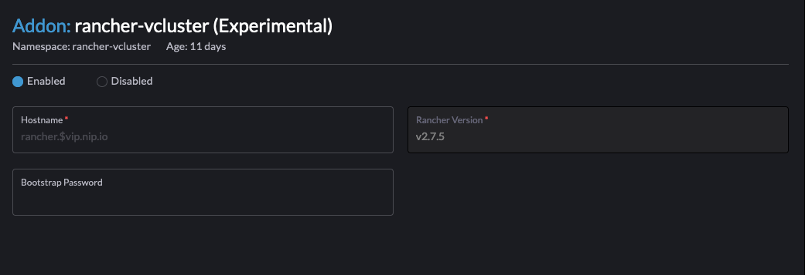

# Rancher vcluster addon

## Summary

The rancher-vcluster addon leverages [vcluster](https://www.vcluster.com/) to create a vcluster named `rancher-vcluster` in the `rancher-vcluster` namespace.

### Related Issues
[GH Issue 2679](https://github.com/harvester/harvester/issues/2679)

### Goals
- Simplify installation and management of an external rancher on an existing harvester cluster.

## Proposal

### User Stories

#### Simplify deployment of rancher for managing harvester

##### User Experience In Detail

Harvester leverages Rancher integration for the following key functionality:
* Fine grained rbac
* Federation with external identity providers
* Provisioning/Management of downstream k8s clusters running on harvester

This requires that a user deploy an external Rancher cluster on a single VM or multiple VM's for HA setup. A lot of users not already having a rancher install end up running these VM's on Harvester to host the Rancher installation. 

This approach as the following limitations:
* Initial work requirement for provisioning of infra and managaging the infra on an ongoing basis
* Even for a single node installations, a user generally ends up reserving 2vCPU and 8GB memory. This may be not be feasible for low compute / development environments.

### API changes
No API changes needed. The rancher-vcluster packaging will be made available as an external addon.

## Design
The `rancher-vcluster` addon leverages [vcluster](https://www.vcluster.com), which as per official docs serves the following purpose:
```
Virtual clusters are fully working Kubernetes clusters that run on top of other Kubernetes clusters. Compared to fully separate "real" clusters, virtual clusters reuse worker nodes and networking of the host cluster. They have their own control plane and schedule all workloads into a single namespace of the host cluster. Like virtual machines, virtual clusters partition a single physical cluster into multiple separate ones.
```

### Implementation Overview
The `rancher-vcluster` addon is hosted in a repository for [experimental-addons](https://github.com/harvester/experimental-addons).

To get started the end user needs to apply the manifest manually to their harvester cluster:

```
kubectl apply -f https://raw.githubusercontent.com/harvester/experimental-addons/main/rancher-vcluster/rancher-vcluster.yaml
```

This can be enable and configured from harvester addons page:



A user needs to provide a valid `hostname` and `bootstrap password` to get started.

**NOTE** vcluster is deployed with ingress to underlying host cluster enabled. As a result of this `hostname` needs to a valid DNS record pointing to the harvester VIP.

When enabled a helm chart for vcluster is deployed in the background. 

We leverage the advanced [init-manifests](https://www.vcluster.com/docs/operator/init-manifests) capability of vcluster to inject the following components into vcluster:
* cert-manager
* rancher

At present the installed `rancher` leverages a self signed certificate, and this can be extended in the future to allow users to brign their own certificates.

Once the addon is deployed, a rancher endpoint is available at the user defined `hostname`.

### Test plan

* Enable `rancher-vcluster` addon.
* In a few minutes a rancher installation should be accessible at the predefined `hostname`
* Import underlying harvester into `rancher-vcluster` and perform MCM tests using this rancher.

### Upgrade strategy

No further action needed. Upgrades will be rolled out by end users manually updating the `rancher-vcluster` mannifest.

## Note [optional]

Additional nodes.
