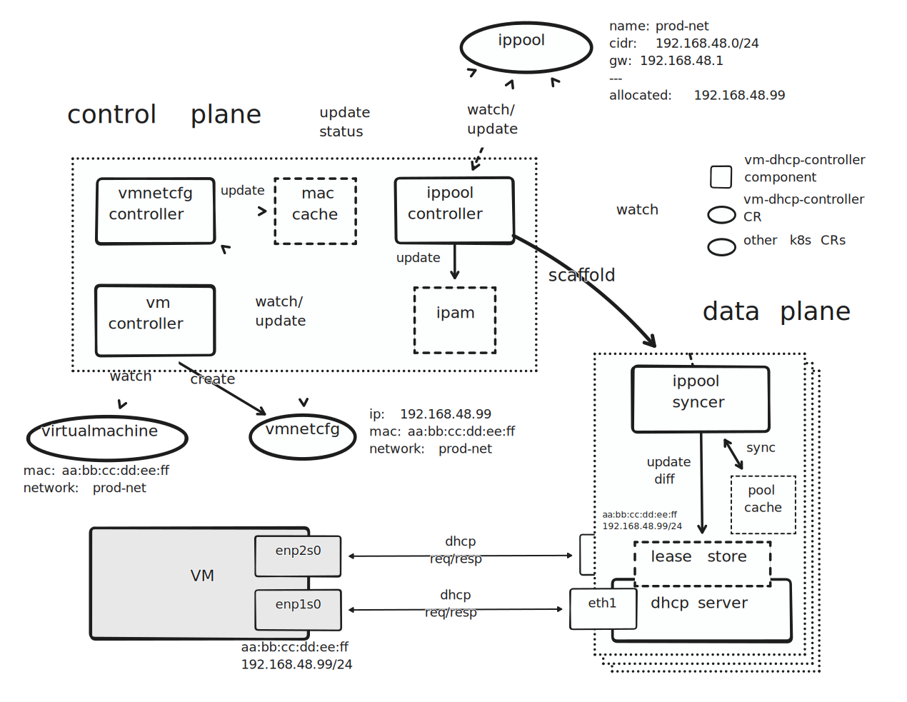

# Managed DHCP

## Summary

We want a mechanism for VMs attached to VM networks to have network connectivity out of the box, and such funtionality is provided by Harvester itself, not external services.

### Related Issues

- https://github.com/harvester/harvester/issues/4428

## Motivation

Currently, the network configuration, such as IP address, subnet mask, default gateway, etc., of the VMs relies on external DHCP servers or the cloud-init configuration associated with the VM itself, which feels cluttered in terms of user experience and has limitations:

- DHCP servers are required, either externally or in the cluster
- The cloud-init network data format for VMs is OS-dependent

### Goals

- Provide network information (subnets, gateways, and IP addresses) to the VMs running on top of Harvester clusters
- Improve the user experience of private networks in Harvester

### Non-goals

- Provide network information as a general DHCP service to machines outside of Harvester premises
- NAT or route the internal traffic to the outside world

## Proposal

### User Stories

#### Kubernetes Guest Clusters (Rancher Integration)

Creating a Kubernetes guest cluster from Rancher using the Harvester node driver has a premise that the VMs consisting of the cluster should have network connectivity without human intervention. That is to say, those VMs need to be configured with valid IP addresses and other network configurations like the default gateway, DNS server, NTP server, etc. Usually, people set up an external DHCP server to provide network information to the VMs. This requires skilled users who are familiar with how to install and configure a DHCP server correctly, needless to say, a good understanding of the network configuration of their premises (how servers and switches are connected, what VLANs are provisioned for the Harvester nodes, etc.)

The managed DHCP feature incorporates DHCP servers into the Harvester cluster and provides a consistent interface (Kubernetes APIs) for users to operate on the desired configuration for target VMs. With that, users can achieve the same on the Harvester dashboard or `kubectl` without the hassle of setting up external DHCP servers.

#### Private VM Networks

Creating fully isolated networks is feasible in the current Harvester implementation (though it requires at least one physical uplink, which is never used in this case.) However, VMs running on these isolated networks are hard to automate as there's no easy way to assign IP addresses to them. An external DHCP server is not an option in this situation, as VMs are not supposed to reach the server outside the isolated network. On the other hand, running a DHCP server in a Pod or VM attached to the network in the cluster also requires human intervention to a certain degree.

The managed DHCP feature incorporates DHCP servers into the Harvester cluster, which means the isolation characteristic imposes no such restriction. The managed DHCP server is in the same L2 network as VMs. And the server is fully configurable in terms of standard DHCP configurations via the Harvester dashboard or with `kubectl`.

### User Experience In Detail

Besides the **Auto (DHCP)** and **Manual** modes in the **Route** tab, users will have a new mode, **Managed DHCP**, to configure the desired managed DHCP service regarding the subnet information, gateway, and available IP ranges associated with the VM network being created. There will be no IP addresses being allocated/issued at the time users create the VM network. It's until the actual VMs associated with the VM network are made. During the VM creation, the IP addresses will be picked from the available IP ranges and allocated for that specific VM's network interface as a static DHCP lease for the managed DHCP server in that VM network. This ensures no surprises will happen to other machines on the same VM network, e.g., devices on the same VLAN network but outside of the Harvester premise got an unexpected IP address from our managed DHCP service.

For users directly operate with the Kubernetes APIs using command line tools like `kubectl`, creating IPPool objects has the same effect as creating VM networks with **Managed DHCP** tab selected and configured. To allocate IP addresses for the VM's network interfaces, a corresponding VirtualMachineNetworkConfig object has to be created, filled with the network interface's MAC address and the associated network name (the name of the NetworkAttachmentDefinition,) plus the desired IP address (non-required.) Behind the scene, the controller continuously reconciles the IPPool and VirtualMachineNetworkConfig objects. When it sees an IPPool object, it spins up a DHCP server with the specified configuration and maintains it until the object is removed. When it sees a VirtualMachineNetworkConfig object, it tries to allocate IP addresses from the target IPPool object.

Removing the VM will cause the associated VirtualMachineNetworkConfig object to be purged. Users can remove it directly without removing the VM. The static DHCP lease for the VM's network interfaces is removed. After the lease time, the VM loses the IP address. The same logic applies to the IPPool objects: removing the VM network (NetworkAttachmentDefinition) will cause the associated IPPool object to be purged. (Note: The IPPool object cannot be removed if there are still VirtualMachineNetworkConfig objects associated with it.) Users can remove it directly without removing the VM network. In that case, the VM network becomes a purely L2 network, just like we used to see.

### API changes

Two CRDs are introduced:

- IPPool (ipl)
- VirtualMachineNetworkConfig (vmnetcfg)

**IPPool** is where users can define every details of the pool that serves the network.

```go
var (
	Registered condition.Cond = "Registered"
	CacheReady condition.Cond = "CacheReady"
	AgentReady condition.Cond = "AgentReady"
	Stopped    condition.Cond = "Stopped"
)

type IPPool struct {
	metav1.TypeMeta   `json:",inline"`
	metav1.ObjectMeta `json:"metadata,omitempty"`
	Spec   IPPoolSpec   `json:"spec,omitempty"`
	Status IPPoolStatus `json:"status,omitempty"`
}

type IPPoolSpec struct {
	IPv4Config  IPv4Config `json:"ipv4Config,omitempty"`
	NetworkName string     `json:"networkName,omitempty"`
}

type IPv4Config struct {
	ServerIP string `json:"serverIP,omitempty"`
	CIDR     string `json:"cidr,omitempty"`
	Pool     Pool   `json:"pool,omitempty"`
	// +optional
	Router string `json:"router,omitempty"`
	// +optional
	DNS []string `json:"dns,omitempty"`
	// +optional
	DomainName *string `json:"domainName,omitempty"`
	// +optional
	DomainSearch []string `json:"domainSearch,omitempty"`
	// +optional
	NTP []string `json:"ntp,omitempty"`
	// +optional
	LeaseTime *int `json:"leaseTime,omitempty"`
}

type Pool struct {
	Start string `json:"start,omitempty"`
	End   string `json:"end,omitempty"`
	// +optional
	Exclude []string `json:"exclude,omitempty"`
}

type IPPoolStatus struct {
	LastUpdate metav1.Time `json:"lastUpdate,omitempty"`
	// +optional
	IPv4 *IPv4Status `json:"ipv4,omitempty"`
	// +optional
	AgentPodRef *PodReference `json:"agentPodRef,omitempty"`
	// // +optional
	Conditions []genericcondition.GenericCondition `json:"conditions,omitempty"`
}

type IPv4Status struct {
	Allocated map[string]string `json:"allocated,omitempty"`
	Used      int               `json:"used"`
	Available int               `json:"available"`
}

type PodReference struct {
	Namespace string `json:"namespace,omitempty"`
	Name      string `json:"name,omitempty"`
}
```

**VirtualMachineNetworkConfig** is the essentially the static lease of a individual VM.

```go
var (
	Allocated condition.Cond = "Allocated"
	Disabled  condition.Cond = "Disabled"
)

type VirtualMachineNetworkConfig struct {
	metav1.TypeMeta   `json:",inline"`
	metav1.ObjectMeta `json:"metadata,omitempty"`
	Spec   VirtualMachineNetworkConfigSpec   `json:"spec,omitempty"`
	Status VirtualMachineNetworkConfigStatus `json:"status,omitempty"`
}

type VirtualMachineNetworkConfigSpec struct {
	VMName        string          `json:"vmName,omitempty"`
	NetworkConfig []NetworkConfig `json:"networkConfig,omitempty"`
}

type NetworkConfig struct {
	NetworkName string `json:"networkName,omitempty"`
	MACAddress  string `json:"macAddress,omitempty"`
	// +optional
	IPAddress *string `json:"ipAddress,omitempty"`
}

type VirtualMachineNetworkConfigStatus struct {
	NetworkConfig []NetworkConfigStatus `json:"networkConfig,omitempty"`
	Conditions []genericcondition.GenericCondition `json:"conditions,omitempty"`
}

type NetworkConfigStatus struct {
	AllocatedIPAddress string `json:"allocatedIPAddress,omitempty"`
	MACAddress         string `json:"macAddress,omitempty"`
	NetworkName        string `json:"networkName,omitempty"`
	Status             string `json:"status,omitempty"`
}
```

## Design

Main components:

- Control plane
  - `vm-dhcp-controller` is majorly responsible for reconciling IPPool and VirtualMachineNetworkConfg objects and maintaining the IPAM cache
  - `vm-dhcp-webhook` guards the incoming requests for creating, updating, and deleting custom resources
- Data plane
  - `vm-dhcp-agent` is scattered in each VM network (defined by NAD), accounting for syncing the pool cache from the IPPool object it monitors and handling the underlying DHCP requests from VMs



### Implementation Overview

#### Control Plane

The controller deploys the agent in the VM network and maintains the life cycle of it according to the IPPool object.

The IPPool and VirtualMachineNetworkConfig objects are persisted in the etcd data store, so they can be used as a **single source of truth** if the controller is dead and restarted. The `.spec` (containing the excluded IP addresses) and `.status` (containing the allocated IP addresses) fields of the IPPool object are used to (re)construct the IPAM cache by the controller. After the IPAM cache is built, the controller updates the `.status` field with the newest snapshot of the cache to reflect the current status of the IPPool object. With that, every component of the control and the data planes could have a trustworthy source of information.

The IPAM cache is where the actual IP address allocation procedure happens: The controller reconciles VirtualMachineNetworkConfig objects and tries to allocate IP addresses according to the objects from the IPAM cache. If a designated IP address is specified, the controller tries to allocate the IP address from the cache; otherwise, it gets a random spare IP address from the cache.

Several validators in the webhook will check the incoming requests when users try to create, update, or remove the objects. They basically ensure the relations between relevant objects are in good shape. For example, an IPPool object cannot be removed if VirtualMachineNetworkConfig objects are referencing it.

#### Data Plane

The controller will deploy agents on the fly in the managing namespace (the same namespace as the controller is in) when IPPool objects are created. Each agent only focuses on the IPPool object, which owns the agent. It listens to the events of IPPool objects and only reacts when the target IPPool object has updates. The reactions include syncing the `.status` field with its internal pool cache and applying the differences to the DHCP lease store. The embedded DHCP server of the agent will handle DHCP requests and reply to them based on the lease store.

### Test plan

#### Private VM Networks

The plan is to create two VM networks that are isolated and separate from the outside. The VM attached to these two networks will be assigned IP addresses for each NIC from the DHCP services and gain network connectivity (within these two networks).

Prepare a Harvester cluster consists of multiple nodes (2+). We'll need to create two cluster networks so each Harvester node should have more than two NICs.

1. Install the `vm-dhcp-controller` chart
1. Create a cluster network called `provider-all` (the cluster network consists of **all the nodes**)
1. Create a network config called `provider-all-nc` for the cluster network `provider-all` with all nodes and one of their NICs as the uplink
1. Create another cluster network called `provider-cp` (the cluster network consists of **only the control plane nodes**)
1. Create a network config called `provider-cp-nc` for the cluster network `provider-cp` with only the control plane nodes and one of their NICs as the uplink
1. Create a VM network called `priv-net-all` with cluster network `provider-all` selected. The VLAN ID should be set with a number which is not in use in the premises, say, `817`.
1. Create another VM network called `priv-net-cp` with cluster network `provider-cp` selected. The VLAN ID should be set with a number which is not in use in the premises and the above VM network, say, `689`.
1. Create a VM called `test-vm` with two NICs attaching to the `priv-net-all` and the `priv-net-cp` networks respectively. Also, the NIC's MAC address for `priv-net-all` is `02:d4:6f:a8:bc:ed` and the other for `priv-net-cp` is `24:ab:56:78:9c:01`.

From now on, the steps will interact with the managed DHCP feature.

1. Create an IPPool object `priv-net-all` with the following YAML content:

    ```yaml
    apiVersion: network.harvesterhci.io/v1alpha1
    kind: IPPool
    metadata:
      name: priv-net-all
      namespace: default
    spec:
      ipv4Config:
        serverIP: 172.19.150.2
        cidr: 172.19.150.0/28
        pool:
        start: 172.19.150.5
        end: 172.19.150.14
        leaseTime: 600
      networkName: default/priv-net-all
    ```

2. Create another IPPool object `priv-net-cp` with the following YAML content:

    ```yaml
    apiVersion: network.harvesterhci.io/v1alpha1
    kind: IPPool
    metadata:
      name: priv-net-cp
      namespace: default
    spec:
      ipv4Config:
        serverIP: 172.19.100.2
        cidr: 172.19.100.0/28
        pool:
        start: 172.19.100.10
        end: 172.19.100.14
        leaseTime: 300
      networkName: default/priv-net-cp
    ```

3. Create a VirtualMachineNetworkConfig object for the VM `test-vm-1`:

    ```yaml
    apiVersion: network.harvesterhci.io/v1alpha1
    kind: VirtualMachineNetworkConfig
    metadata:
      name: test-vm-1
      namespace: default 
    spec:
      vmName: test-vm-1
      networkConfig:
      - macAddress: 02:d4:6f:a8:bc:ed
        networkName: default/priv-net-all
        ipAddress: 172.19.150.9
      - macAddress: 24:ab:56:78:9c:01
        networkName: default/priv-net-cp
    ```

4. Check the following:

    - The `default-priv-net-cp-agent` agent Pod should run on one of the control plane nodes
    - The two IPPool objects' `.status` field should contain the correct allocation records and statistics
    - The VirtualMachineNetworkConfig object's `.status` field should show the two NICs have IP addresses allocated
    - The VM `test-vm-1` should have the correct IP addresses configured automatically via DHCP from the agents respectively

#### Kubernetes Guest Clusters (Rancher Integration)

The plan is to create an RKE2 guest cluster with the Harvester node driver. There's no need to have an external DHCP server set up. If there's one, please make sure to disable it first. The managed DHCP feature will help create the VirtualMachineNetworkConfig objects accordingly. 

Prepare a Harvester cluster consists of multiple nodes (2+). Also, a Rancher Manager is required.

1. Create a cluster network called `provider` (the cluster network consists of **all the nodes**)
2. Create a network config called `provider-nc` for the cluster network `provider` with all nodes and one of their NICs as the uplink
3. Create a VM network called `provider-net` with cluster network `provider` selected. The VLAN ID should be configured with the one that has Internet accessibility, e.g., `1`.
4. Create an IPPool object `provider-net` with the following YAML content (the actual network configs should be adapted to your environment):

    ```yaml
    apiVersion: network.harvesterhci.io/v1alpha1
    kind: IPPool
    metadata:
      name: provider-net
      namespace: default
    spec:
      ipv4Config:
        serverIP: 192.168.48.2
        cidr: 192.168.48.0/24
        pool:
        start: 192.168.48.81
        end: 192.168.48.90
        leaseTime: 600
      networkName: default/provider-net
    ```

5. Create an RKE2 guest cluster with 3 nodes
6. After the provisioning, check if the guest cluster is working correctly:

    - Each node of the guest cluster is configured with the IP address within the IPPool definition
	- Can use the Rancher dashboard to view the guest cluster

### Upgrade strategy

No prerequisites. Harvester clusters with version newer than v1.1.0 are compatible.

## Note

Currently, this is designed for IPv4 only.
