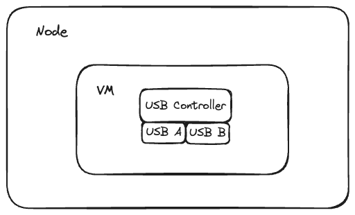
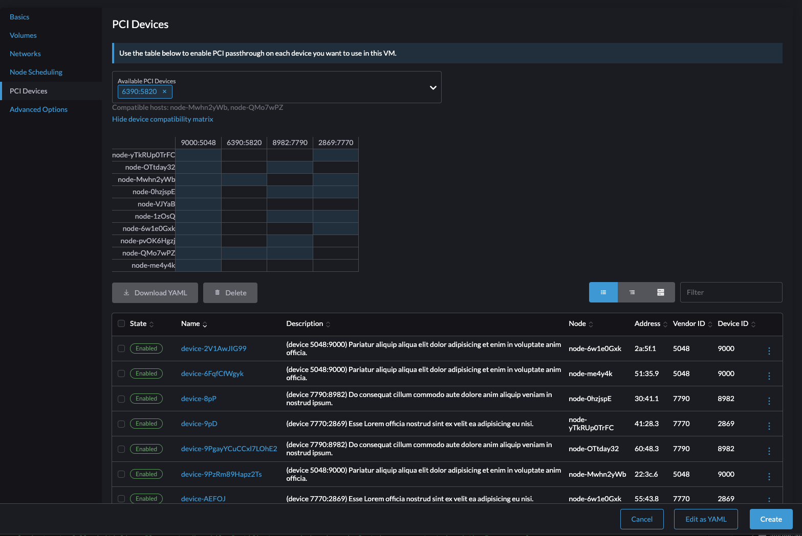

# USB Host Passthrough

USB Host Passthrough allows virtual machine to have access to node's USB devices without PCI Passthrough.

## Summary

Users can pass through USB devices which are attached on the nodes to virtual machine on Harvester instead of passing whole USB controller. It allows nodes and virtual machine be able to use USB devices in same USB controller, except the same one.

In other words, let's say USB controller has two ports called A and B.

- With PCI Passthrough situation (pass USB controller), VM can read A/B, and node can't read one of them.
  
- With USB Host Passthrough situation (only pass B), VM can read B, and node can read A.
  

### Related Issues

https://github.com/harvester/harvester/issues/1710

## Motivation

KubeVirt treats USB devices as resource. That means if there are two identical USB devices, KubeVirt recognize them as **one** resource.

Let's say, we ask KubeVirt for a resource "abc", the KubeVirt said "I have abc, and have two of them." If we end up getting only one, KubeVirt will randomly delegate one of them to us since it's resource concept, such as cpu and memory in our POD spec. For KubeVirt, multiple USB devices with same vendor and product ID are recognized as one resource.

Another reason for creating our own device plugin is we'd like to treat each USB device as a resource. Then, it can fulfill the User Story 2. 


### Goals

- Allow virtual machine to use node's USB device without PCI Passthrough.
- Users can select one USB device from two identical USB device instead of randomly picked by KubeVirt.

## Proposal

### User Stories

#### Story 1 - One USB storage device

Bob wants to use USB Host Passthrough feature to enable virtual machine to read USB storage device which are attached on the node.

After enabling the Addon, there are many USB devices on `USB Devices` page. Bob clicks one of them and enable it. Then, Bob starts to create the new virtual machine, and there is one setting called `USB Devices` in the virtual machine creating page.

Bob chooses one USB device from dropdown menu, and click the `Create` button. After creating virtual machine, Bob uses the vnc to connect virtual machine, and executes the `lsblk` and `lsusb` command in the virtual machine. Bob sees the USB storage device in the virtual machine.

#### Story 2 - Two identical USB storage device

Bob has two same vendor/product ID of USB storage device, Bob already plugged in these two USB storage devices on the node. We call them U1/U2 which `U` represents the same vendor/product ID here.

Bob wants to create two virtual machines, and attaches USB storage device to each one. Here is how Bob wants to assign.
- A virtual machine - U2 USB storage device
- B virtual machine - U1 USB storage device

When Bob sets up the A virtual machine, Bobs could select U2 from dropdown menu in the `USB Devices` tab. Here, Bob will see U1/U2 have a lot of same information, but only name is different. Then Bob does same things when creating B virtual machine.

After creating all machine, Bob can successfully use U2 from A VM, and U1 from B VM.

### User Experience In Detail

We don't mention how many nodes and which node has dedicated USB device. It should be automatically scheduled to suitable node due to good user experience. Let's say Bob selects the U1 which attached on node N1. When bob select the U1 in creating page, the node's scheduling of vm should be set up to node N1 automatically.

On the other hand, If Bob already set up the node scheduling to node N2 which attached U2, it would notify Bob it's not allowed when Bob select U1 from dropdown menu because UI belongs to node N1.

### API changes

Two CRDs are introduced.

- `usbdevice` - represent all USB devices on all nodes
- `usbdeviceclaim` - represent which USB devices the user would like to enable

Two resources will be updated.

- `kubevirt` - add `spec.configuration.permittedHostDevices.usb` to expose to KubeVirt utilize it. ([reference](https://kubevirt.io/user-guide/virtual_machines/host-devices/#exposing-usb-devices))
- `kubevirt.io/v1/virtualmachine` - add USB device information to vm ([reference](https://kubevirt.io/user-guide/virtual_machines/host-devices/#adding-usb-to-your-vm))

#### `usbdevice` 

There will be a Daemon to collect all USB devices on all nodes, it's provided to users know how many USB devices they could use.

Considering the same vendor/product case, we should add bus as suffix to avoid misunderstanding. It's `002/004` in this case.

```yaml
apiVersion: devices.harvesterhci.io/v1beta1
kind: USBDevice
metadata:
  labels:
    nodename: jacknode
  name: jacknode-0951-1666-002004
status:
  description: DataTraveler 100 G3/G4/SE9 G2/50 Kyson (Kingston Technology)
  devicePath: /dev/bus/usb/002/004
  enabled: false
  nodeName: jacknode
  pciAddress: "0000:02:01.0"
  productID: "1666"
  resourceName: kubevirt.io/jacknode-0951-1666-002004
  vendorID: "0951"
```

#### `usbdeviceclaim`

When users decide which USB devices they want to use, users will click `Enable` button to create `usbdeviceclaim`. After `usbdeviceclaim` is created, controller will update `spec.configuration.permittedHostDevices.usb` in `kubevirt` resource.

We use `pciAddress` filed to prevent users from enabling the specified PCI device.

```yaml
apiVersion: devices.harvesterhci.io/v1beta1
kind: USBDeviceClaim
metadata:
  name: jacknode-0951-1666-002004
  ownerReferences:
    - apiVersion: devices.harvesterhci.io/v1beta1
      kind: USBDevice
      name: jacknode-0951-1666-002004
      uid: b584d7d0-0820-445e-bc90-4ffbfe82d63b
spec: {}
status:
  userName: ""
  nodeName: jacknode
  pciAddress: "0000:02:01.0"
```

#### `kubevirt`

In order to fulfill User Story 2, we should use external device plugin. Currently, we can't specifically choose one of two identical USB devices in device plugin of KubeVirt, it will randomly pick one. But, it works when you select all of them. So, we will update with `externalResourceProvider: true` in `kubevirt` resource.

```yaml
spec:
  configuration:
    permittedHostDevices:
      usb:
      - resourceName: kubevirt.io/jacknode-0951-1666-002005
        externalResourceProvider: true
        selectors:
        - product: "1666"
          vendor: "0951"
```

#### `virtualmachine`

In the `virtualmachine` resource, we will add `devices > hostDevices` field to specify which USB device the virtual machine will use.

```yaml
devices:
  hostDevices:
    - deviceName: kubevirt.io/jacknode-0951-1666-002005
      name: jacknode-0951-1666-002005
```


## Design

Overall, we will implement this feature in the harvester/pcidevices. So, the architecture will be similar. 

The main implementation will be device plugin, we'll copy KubeVirt usb device plugin as first version, then improve it. Since the first version device plugin is 1-N mapping structure, which one resource name is mapped to multiple USB devices. But, in our design, one resource name is mapped to on USB device. That's why we could specify designated USB device.

### GUI

It's quite similar with PCI devices, it also needs to show the matrix (node/usb) like below.



Like the PCI device, we'll detect usb devices period and show them on new page.


Regarding the resource and API path in harvester, it should be `usbdevices.devices.harvesterhci.io` and `usbdeviceclaims.devices.harvesterhci.io`.

### Limitation

- Don't support live migration.
- Don't support hot-plug (including re-plug).
- Require re-creating a USBDeviceClaim to enable the USB device if device path changes in following situations:
  - Re-plugging USB device.
  - Rebooting the node.

### Test plan

The general flow will be
- Plugin a USB device in node
- Enable Addon
- Enable one of USB device
- Create virtual machine with previous one
- Check USB device in the vm

Besides, it needs two different cases here.
- Single USB Device
- Two Identical USB Device 
  - Users should have decision to choose one of them.

