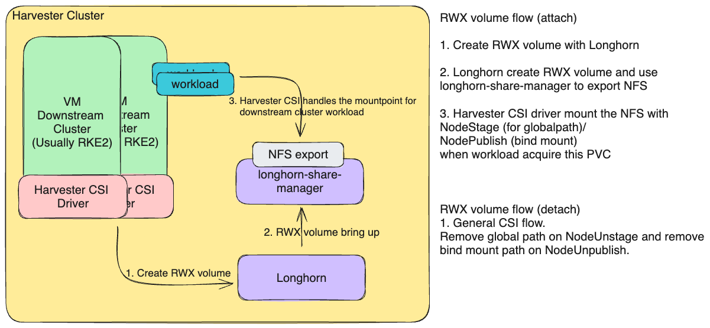
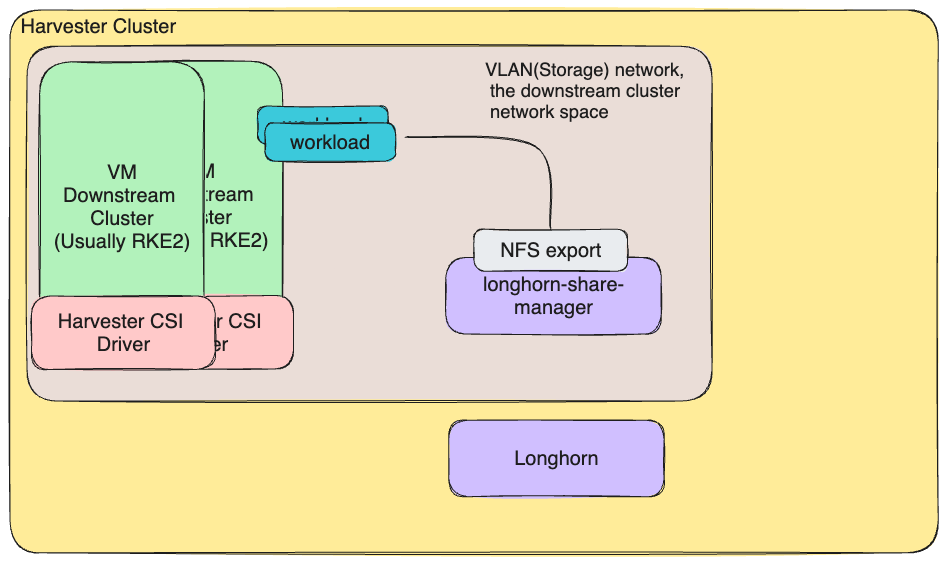
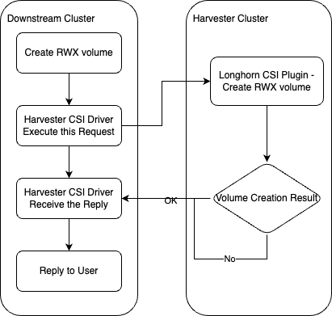
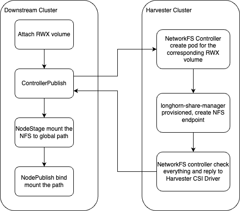

# Support RWX Volume to Downstream Cluster

## Summary

One of the harvester's classical user scenarios is the [downstream cluster](https://docs.harvesterhci.io/v1.3/rancher/rancher-integration). We should support the RWX volume for various applications running on it.

### Related Issues

https://github.com/harvester/harvester/issues/1992

## Motivation

Currently, the downstream cluster only supports the RWO volume. However, several applications need the RWX volume to work. Because Longhorn supports the RWX volume, we could merge the Longhorn RWX volume, and then users can create an RWX volume with their application.

### Goals

Make sure the downstream cluster can create workloads with the RWX volume.

### Non-goals [optional]

Create an endpoint for Harvester VM to use to have the shared filesystem.

## Proposal

The basic idea is to use the Longhorn RWX volume. It provides the NFS endpoint through the Longhorn share manager, so we need to focus on how the downstream cluster interacts with NFS. Once the downstream cluster interacts with this NFS endpoint, we can attach the RWX volume to any workload through the Harvester CSI driver.

### User Stories

#### 1. The Configuration Backup of NeuVector
NeuVector will backup the configuration files (Policies, Rules, user data, integrations, etc) in the controller. The backup needs the RWX volume to store to ensure this configuration is safe. Currently, we only support RWO volume. The user needs to wait for this feature so that they can use NeuVector in the downstream cluster.

Reference: https://open-docs.neuvector.com/deploying/production/#persistent-volume-example

#### 2. The Backup Store of MongoDB
MongoDB could configure the backup store with the Kubernetes Operator. The prerequisite is the RWX volume, which is similar to the NeuVector. The user needs this feature once they want to use K8s Operator to backup MongoDB.

Reference: https://www.mongodb.com/docs/kubernetes-operator/v1.25/tutorial/configure-file-store/

### User Experience In Detail

With this feature, the user could create volumes with two options in the downstream cluster. The first is the RWO volume. The second is the RWX volume. Then user could attach use the RWX volume as previous RWO volume. The Harvester CSI driver would handle the internal work.
The UX did not change too much. The only difference is the user needs to select the RWX volume.

### API changes
TBD

## Design

### Implementation Overview

A quick overview of the design could be checked below:

### Solution 1.

Like the RWO solution, we would like to leverage the libvirt capability to hotplug the filesystem and then use the workload pod as a host mountpoint, but currently, it is not supported. The hotplug filesystem on the kubevirt side is referred to as virtiofs. However, virtiofs does not support live migration, so we could not use this solution.

Related feature request to Kubevirt: https://github.com/kubevirt/kubevirt/issues/11699

### Solution 2.

The second solution is like the Longhorn CSI behavior with RWX volume. The Longhorn share manager will provide the NFS endpoint through ClusterIP. The thing we need to take care of is network space. The downstream cluster uses a different network space from the Harvester/Longhorn cluster. We need to ensure the downstream cluster can interact with the NFS endpoint with the same network space. Like below:

The detailed flowchart is like below:

- RWX volume Create:

- RWX volume Attachment:

### Each component detailed design

#### 1. Longhorn
Longhorn share-manager can provide the NFS endpoint through the storage network.

Related issue: https://github.com/longhorn/longhorn/issues/8184

#### 2. Harvester CSI Driver
Harvester CSI Driver need to add capability to create the RWX volume through Longhorn client. Also, we should add the corresponding handles on NodeStage/NodePublish stage. The NodeStage will mount the NFS endpoint to the host as global path. Then, the NodePublish will bind mount the global path for the workload.

The whole flow might be like that when get the request to create RWX volume, Harvester CSI Driver need to create corresponding RWX volume on Longhorn. Then, the Harvester CSI driver will create a global path on NodeStage. Last, with NodePublish, the Harvester CSI driver will bind mount the global path for the workload.

#### 3. NetworkFS controller on Harvester (New Added)
We need to bring up the Longhorn-share-manager so that the Longhorn-share-manager can create the NFS endpoint.
We would like to introduce the NetworkFS controller to handle(create) the pod. The advantage with this component is that we could control the whole network filesystem on Harvester side. The network filesystem could be NFS. Later, we could add more network filesystem like CIFS(SMB)/CephFS. Also, we can add some network strategies like network policy or service endpoint to limit the access to the network filesystem.

The corresponding CRD with the NetworkFS-manager would helps to enable/disable the Longhorn-share-manager. Also, the CRD would collect the NFS endpoint and perferred parameters for the mount operation.

### Test plan

1. Create 3 node Harvester cluster
2. Create a downstream cluster with 2 nodes
3. Create a RWX volume on downstream cluster
4. Create one workload with the above RWX volume on downstream cluster
5. Create another workload with the above RWX volume on downstream cluster
6. Make sure these two workloads could interactive with the RWX volume and on the different nodes

### Upgrade strategy

Should not affect the upgrade strategy.

## Note [optional]

TBD
