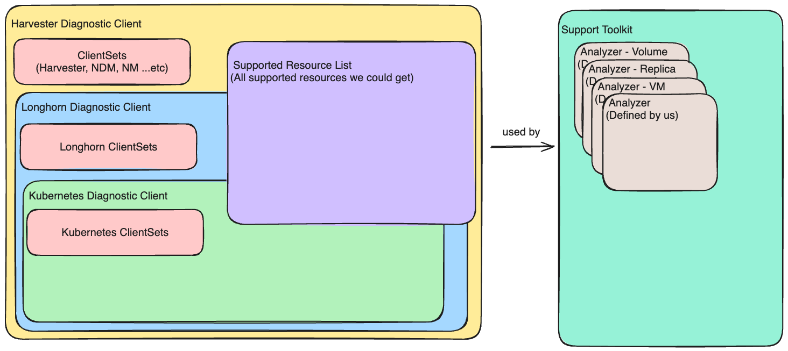

# Support Toolkit

## Summary

When users encounter issues with Harvester, they usually need to collect the support bundle so that we can start investigating. We would like to introduce a support toolkit that could help users quickly get the current cluster status and know what's going on in the cluster. The toolkit could also give some hints (with the ISSUE Number) so that users could try to resolve it themselves.

### Related Issues

https://github.com/harvester/harvester/issues/4935

## Motivation

Currently, we do not have any tools that make it easy to summarize the cluster status and potential risk. That is because most CRDs might be related but also independent. We would like to create a support toolkit to combine all the information and give users a brief summary and suggestions.

### Goals

Create a support toolkit (Command Line Interface) that could help users understand the current cluster status and potential risks in the cluster.

### Non-goals [optional]

This support toolkit could also be used with the Harvester/Longhorn Support bundle, but it is not the first priority. The support bundler is usually investigated by the developer, who is good at analyzing the support bundle.

## Proposal

This toolkit should be a command-line interface that support engineers can easily use. It should provide an easy way to check the cluster's status. We all know the UI could also give us information, but it is not efficient. The CLI tool is simple and could perform more operations (like filtering or sorting).

### User Stories

#### 1. Two longhorn engine case
In the old Longhorn version, we encountered the two-engine case. That was caused by many reasons, but two active engines will cause some trouble when we want to upgrade. The support toolkit could investigate it quickly and give the user the related issue. After that, the user could follow the workaround or suggestion on the issue to resolve it.

#### 2. The VM migrate failed case
Usually, the upgrade involves many VM migrations. If the VM migration fails, the upgrade will be blocked. The support toolkit can give a hint by checking the VM and its volume status. The user can follow the suggestion to resolve the issue.

### User Experience In Detail

Users can use the support toolkit to get the cluster status and potential risk. Each risk will also have the related issue number (if we have one). The user could follow the issue to resolve it.

### API changes

No API changes are needed.

## Design

### Implementation Overview

A overview of the design could be checked below:

### Diagnostic Client

The diagnostic client is an entry point for the support toolkit, which uses this client to get information from the cluster. The Diagnostic client will contain another diagnostic client (optional), supported resource list, and the CRD's clientset.

### Analyzer

The analyzer is the main logic of the support toolkit. Each analyzer is responsible for handling information from multiple CRDs and summarizing the status or potential risk.

### Test plan

1. Use the Support toolkit to check the cluster status.
2. Use the Support toolkit to find the potential risk. (We could use the old support bundle and simulator to check this)

### Upgrade strategy

No related to upgrade.

## Note [optional]

Additional nodes.
