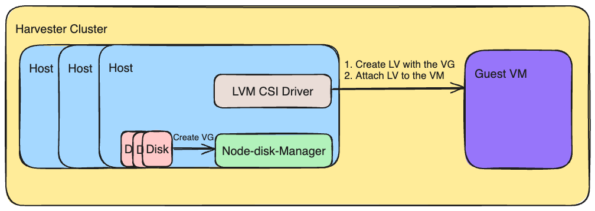

# LVM CSI Driver

## Summary

In some specific scenarios, we need better performance and could use a strict location for the volume. The LVM could be a good choice because it is a thin layer on top of the block devices. Also, it provides useful features like volume expansion and snapshots. We want to introduce the LVM CSI driver to support the LVM volume in Harvester. 

### Related Issues

https://github.com/harvester/harvester/issues/5724

## Motivation

We do not have any current solution to support local volumes, which means directly using the local disk as the volume. The LVM CSI driver could help leverage the local disk as the volume. If the user could use the strict location VM, it would help us improve performance and latency.

### Goals

Introduce the LVM CSI driver to support the LVM volume in Harvester.
And support the following features:
  - Volume expansion
  - Volume snapshot
  - Volume clone
  - Topology support

### Non-goals

- Support downstream cluster to use the LVM volume.

## Proposal

We would like to start with the existing LVM CSI driver and introduce it to the Harvester. We need to make some changes to make it more suitable for the Harvester. After that, we could use the LVM CSI driver to create the LVM volume in Harvester.

### User Stories

#### The use needs high performance and live migration is not required.
Sometimes, the user needs a high-performance PVC, and Live Migration is not required. The user could consider using the LVM volume. The LVM volume could provide higher performance, but it can not be migrated to another node. So, if the user fits the above scenario, the user can get a better performance volume with the LVM volume.

### User Experience In Detail

The user creates a VM and starts with the feature with PCI pass-through. The VM is not migratable because the user uses the PCI pass-through feature. Then, the user can create the PVC with the LVM volume to get better performance. The user attaches the PVC to the VM through hotplug and uses the LVM volume in the VM.

### API changes

There is no API change in this feature because this feature is the new feature.

## Design

### Implementation Overview

A overview of the design could be checked below:


### LVM CSI Driver
At first, we consider two existing solutions: [metal-stack/csi-driver-lvm](https://github.com/metal-stack/csi-driver-lvm) and [topolvm/topolvm](https://github.com/topolvm/topolvm). Both solutions support the CSI topology feature, and other features like volume capability and snapshot are only supported in the topolvm. However, the topolvm is more complex than the csi-driver-lvm. We could try to add the capability and snapshot feature to the csi-driver-lvm and keep it as simple as we want.

So, we chose the [metal-stack/csi-driver-lvm](https://github.com/metal-stack/csi-driver-lvm) as the base LVM CSI driver. This project is lightweight and already has the essential capability for our requirements. We want to introduce it in the first version. Then, we can add more features based on the requirements.

The LVM CSI driver includes the CSI plugin and the LVM provisioner. The CSI plugin handles all CSI requests, while the LVM provisioner manages LVM operations such as creation, deletion, expansion, and snapshotting. This division of responsibilities ensures efficient and effective management of our storage infrastructure.

In the initial version, we propose a significant change that will enhance user flexibility. We plan to allow users to predefine the volume group. The provisioner will then use this predefined volume group and logical volume type (e.g., mirror, stripe) to create the volume. This change will enable users to group similar types of disks together, thereby ensuring optimal performance and capability.

With this change, the StorageClass will now contain two additional parameters: `vgName` and `lvType`. The `vgName` refers to the volume group name, and the `lvType` specifies the logical volume type. These parameters are essential for the LVM provisioner to create the volume according to the user's specifications.

### Supported LV type
We only want to support the `stripe` and `dm-thin` types in this version. The consideration comes from performance and snapshot performance. The `stripe` could provide better performance, but the snapshot will rely on the CoW. The CoW snapshot will have a potential performance risk if we have too many snapshots. The `dm-thin` could have better performance on the snapshot, but only leverages one disk performance in the general case. The `linear` and `mirror` types were not very common for LVM usage, so we would like to not support them in this version.

Here is the comparison between the `stripe` and `dm-thin` types:
| Feature | stripe | dm-thin |
| --- | --- | --- |
| Performance | Better | Normal |
| Snapshot | Normal | Better |
| Space Utilization | Normal | Efficiently |
| Data Protection | No | Better |

According to the above table, there are some recommendations:
- If the user needs better performance, the user could choose the `stripe` type.
- If the user needs better snapshot performance, the user could choose the `dm-thin` type.
- If you have the hardware raid, you can use the `dm-thin` with the hardware raid to get better performance and snapshot performance.

Also, we want to keep the data layout simple on the VG. So, the VG only have one type LV. For example, if the VG already create a `stripe` type LV, user can not create the `dm-thin` type LV on the same VG. Making the data layout simple would reduce the potential risk.


### StorageClass

The LVM CSI driver leverages the `allowedTopologies` field in the StorageClass to ensure the volume is created on the correct node. The `vgName` and `lvType` parameters in the StorageClass are essential for the LVM provisioner to create the volume according to the user's specifications. The `vgName` refers to the volume group name, and the `lvType` specifies the logical volume type.

Here is an example of the StorageClass:
```
allowVolumeExpansion: true
apiVersion: storage.k8s.io/v1
kind: StorageClass
metadata:
  name: lvm-dm-thin
parameters:
  type: dm-thin
  vgName: vg01
provisioner: lvm.driver.harvesterhci.io
reclaimPolicy: Delete
volumeBindingMode: WaitForFirstConsumer
allowedTopologies:
- matchLabelExpressions:
  - key: topology.lvm.csi/node
    values:
    - <target node name>
```

This LVM CSI driver also implement the webhook to validate the StorageClass. To ensure the topology is correct. The vgName is existed. The lvType is supported.

### Node Disk Manager
Although we can create a volume group manually, the node disk manager can help us do so. The node disk manager will create the volume group based on the disks the user chooses. Then, the user can use the volume group name to create StorageClass and PVC. You can refer https://github.com/harvester/harvester/pull/6015 to find more details about the node disk manager how to create the volume group.

### Test plan

1. Create Harvester cluster
2. Install the LVM CSI driver with addon
3. Create Volume Group with the node disk manager
4. Create StorageClass with specific `node`, `vgName` and `lvType`
5. Create PVC with the above StorageClass
6. Create the VM with the PVC as data volume
7. Do the IO test in the VM

### Upgrade strategy

No need. This is the new feature.

## Limitation

There are some limitations in this version:

1. When the volume is created, the volume group cannot be changed even adding the new disk to this volume group. The user need to remove the all volumes in this volume group then adding the disks to this volume group. That because we would like to simplify the management of the VG on the UI.

2. Only one lv type could be used in the one volume group. Because we only support `stripe` and `dm-thin`, it hard to distribute the usage of thin-pool and the stripe type in the one volume group. We would like to block the mixed usage in this version. Means if you want to use both types, you need to create the different volume groups.