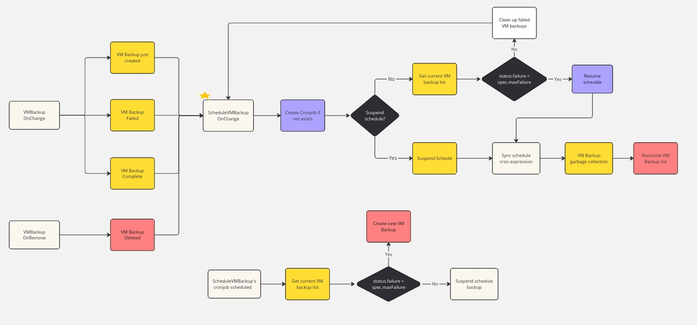

# Support VM Schedule Backup/Snapshot

## Summary

This feature supports scheduled backups/snapshots of the VM periodically.

### Related Issues

- https://github.com/harvester/harvester/issues/2756

## Motivation

### Goals

Harvester supports backup/snapshot of the VM on a scheduled basis with the configuration option to keep a specific number of backups/snashots. Users can proactively suspend, resume, and update the schedule at runtime.

The Harvester controller will keep updating a list of VM backups/snapshots even if the VM is not running. In the meantime, the outdated backups/snapshots along with the Longhorn snapshots will be cleaned up to guarantee space usage efficiency.

The Harvester controller will suspend the schedule when the number of failed backups reaches a pre-defined (configurable) threshold. After making sure the backup target is normal, the user can ask to resume the scheduled backup, then the Harvester controller will check the remote target's health, and resume the scheduled job if certain conditions are met.

## Proposal

### User Stories

Although [Longhorn provides recurring backup](https://longhorn.io/docs/1.6.2/snapshots-and-backups/scheduling-backups-and-snapshots/) that is per volume and not VM-based, so it brings the challenge to restore the VM from these volume backups.

With this feature, the user can have a **list of VM backups/snapshots** which are kept renovated according to the format of a [CRON expression](https://en.wikipedia.org/wiki/Cron#CRON_expression), and the user also can choose anyone from the list to restore the VM.


### API changes

## Design

### Implementation Overview

#### CRD

- Add new resource `ScheduleVMBackup` to control VM schedule backup jobs
```
type ScheduleVMBackupSpec struct {
	// +kubebuilder:validation:Required
	Cron string `json:"cron"`

	// +kubebuilder:validation:Required
	// +kubebuilder:default:=8
	// +kubebuilder:validation:Maximum=250
	// +kubebuilder:validation:Minimum=2
	Retain int `json:"retain"`

	// +kubebuilder:validation:Required
	// +kubebuilder:default:=4
	// +kubebuilder:validation:Minimum=2
	MaxFailure int `json:"maxFailure"`

	// +optional
	// +kubebuilder:default:=false
	Suspend bool `json:"suspend"`

	// +kubebuilder:validation:Required
	VMBackupSpec VirtualMachineBackupSpec `json:"vmbackup"`
}
```

```
type ScheduleVMBackupStatus struct {
	// +optional
	VMBackupInfo []VMBackupInfo `json:"vmbackupInfo,omitempty"`

	// +optional
	Failure int `json:"failure,omitempty"`

	// +optional
	Suspended bool `json:"suspended,omitempty"`

	// +optional
	Conditions []Condition `json:"conditions,omitempty"`
}
```
- `spec.cron` specifies the cron expression for the VM backup schedule
  - The scheduling granularity can't be less than one hour, since frequent backup/snapshot deletion will bring heavy I/O on disks, it even makes LH engine consider the replica is not responsible
  - If two schedules have the same granularity, each iteration's timing offset can't be less than 10mins
  - With annotation `harvesterhci.io/svmbackupSkipCronCheck: "enable"`, Harvester will skip the schedule granularity check
- `spec.retain` specifies the number of up-to-date VM backups to retain
- `spec.maxFailure` specifies the max number of consecutive failed backups that could be tolerated, if the number of consecutive failed backups reaches this setting, the Harvester controller will suspend the schedule
- `spec.suspend` is used to suspend/resume the schedule proactively
- `spec.vmbackup` specifies the source VM to backup/snapshot
- `status.vmbackupInfo` records the current backup/snapshot list, including the status of all the volume backups/snapshots for the VM
- `status.failure` number of consecutive failure backups after the last successful backups
- `status.suspended` presents if the schedule is suspended
- `status.conditions` presents the schedule's status, so far, it's only leveraged to describe the reason why the schedule is suspended

#### ScheduleVMBackup Controller

- ScheduleVMBackup reconcile:
  - Create a cronjob with the name `svmbackup-<ScheduleVMBackup UID>` if it's not presented
  - If `.spec.suspend` is true
    - Suspend the schedule and update `.status.suspended` accordingly
  - If `.spec.suspend` is false  
    - During `status.failure` less than `spec.maxFailure`
      - Resume the schedule and update `.status.suspended` accordingly
    - During `status.failure` equals or more than `spec.maxFailure`
      - Remove all failed backups, and trigger ScheduleVMBackup to reconcile
  - Update schedule according to the cron expression of `spec.cron`
  - If the number of the current VM backups goes beyond `spec.retain`
    - Clean up the oldest VM backup(s)
    - Delete the outdated Longhorn snapshots to trigger the snapshot purge
- On cronjob is scheduled according to the cron expression
  - If `status.failure` equals or more than `spec.maxFailure`
    - As the number of consecutive backups from the last successful backup reaches `spec.maxFailure`, the Harvester controller will suspend the schedule, and no new VM backup is generated in this phase
    - `.spec.suspend` and `.status.suspended` will be updated accordingly
  - If `status.failure` is less than `spec.maxFailure`
    - Create a new VM Backup with the name `svmbackup-<ScheduleVMBackup UID>-<schedule timestamp>`
      - With label points to source `ScheduleVMBackup`
- VMBackup reconcile
  - If the VMBackup is generated from a schedule
    - Trigger ScheduleVMBackup reconcile during:
      - VM Backup is just created (within one minute)
      - VM Backup is confirmed failed
      - VM Backup is confirmed completed
      - VM Backup is confirmed deleted

### Controller Flow Chart



---

### Test plan

1. Schedule VM backup for a running VM
   - Create and start a VM 
   - Create a `ScheduleVMBackup` resource
     - With `spec.vmbackup` points to the running VM
     - With `spec.retain = 3`
     - With `spec.cron = * * * * *`
   - New VM backup keeps being created in every minute
     - The Harvester always maintains at least two VM backups
     - Since the fourth minutes, as the new VM backup is created, the oldest VM backup will be deleted
     - As the out-of-date VM backup is removed, the related Longhorn snapshot should also be purged under the hood

2. Schedule VM backup for a stopped VM
   - Create and stop a VM 
   - Create a `ScheduleVMBackup` resource
     - With `spec.vmbackup` points to the stopped VM
     - With `spec.retain = 3`
     - With `spec.cron = * * * * *`
   - New VM backup keeps being created in every minute
     - The Harvester always maintains at least two VM backups
     - Since the fourth minutes, as the new VM backup is created, the oldest VM backup will be deleted
     - As the out-of-date VM backup is removed, the related Longhorn snapshot should also be purged under the hood

3. Runtime suspend/resume schedule
   - Create and start a VM
   - Create a `ScheduleVMBackup` resource
     - With `spec.vmbackup` points to the running VM
     - With `spec.retain = 3`
     - With `spec.cron = * * * * *`
   - Edit the `ScheduleVMBackup` resource
     - As `spec.suspend = true`
     - No more new VM backups are created
   - Edit the `ScheduleVMBackup` resource
     - As `spec.suspend = false`
     - New VM backup keeps being created in every minute

4. Runtime update schedule cron expression
   - Create and start a VM
   - Create a `ScheduleVMBackup` resource
     - With `spec.vmbackup` points to the running VM
     - With `spec.retain = 3`
     - With `spec.cron = * * * * *`
     - New VM backup keeps being created in every minute
   - Edit the `ScheduleVMBackup` resource
     - As `spec.cron = */2 * * * *`
     - New VM backup keeps being created in every two minutes

5. Failed VM backups reach threshold
   - Create a `ScheduleVMBackup` resource
     - With `spec.maxFailure = 2`
   - Make the backup target unreachable
   - After about three minutes
     - `status.suspended` is set to true
     - `status.conditions` has the message `Reach Max Failure`
     - No more new VM backups are created

6. Resume suspended VM schedule backup
   - Follow the above test plan
   - Make the backup target healthy
   - Set `spec.suspend` as false
   - Find `status.suspended` is set to false
   - `ScheduleVMBackup` continues to have new VM backups and update the list

### Upgrade strategy

None

## Note [optional]

Additional notes.
