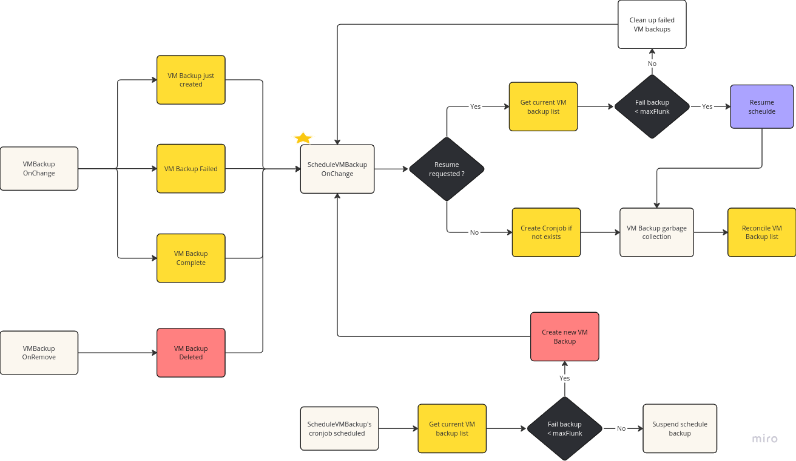

# Support VM Schdule Backup

## Summary

This feature supports scheduled backup of the VM periodically.

### Related Issues

- https://github.com/harvester/harvester/issues/2756

## Motivation

### Goals

Harvester supports backup of the VM on a scheduled basis with the configuration option to keep a specific number of backups. 

The Harvester controller will keep updating a list of VM backups even if the VM is not running, and in the meantime, clean up the outdated backups along with the Longhorn snapshots to guarantee space usage efficiency.

The Harvester controller will suspend the schedule when the number of failed backups reaches a pre-defined (configurable) threshold. After making sure the backup target is normal, the user can ask to resume the scheduled backup, then the Harvester controller will check the remote target's health, and resume the scheduled job if certain conditions are met.

## Proposal

### User Stories

Although [Longhorn provides recurring backup](https://longhorn.io/docs/1.6.2/snapshots-and-backups/scheduling-backups-and-snapshots/) that is per volume and not VM-based, so it brings the challenge to restore the VM from these volume backups.

With this feature, the user can have a **list of VM backups** which are kept renovated according to the format of a [CRON expression](https://en.wikipedia.org/wiki/Cron#CRON_expression), and the user also can choose anyone from the list to restore the VM.


### API changes

## Design

### Implementation Overview

#### CRD

- Add new resource `ScheduleVMBackup` to control VM schedule backup jobs
```
type ScheduleVMBackupSpec struct {
	// +kubebuilder:validation:Required
	Cron string `json:"cron"`

	// +kubebuilder:validation:Required
	Retain int `json:"retain"`

	// +kubebuilder:validation:Required
	MaxFlunk int `json:"maxflunk"`

	// +optional
	ResumeRequest bool `json:"resumeRequest"`

	// +kubebuilder:validation:Required
	VMBackupSpec VirtualMachineBackupSpec `json:"vmbackup"`
}
```

```
type ScheduleVMBackupStatus struct {
	// +optional
	VMBackups []string `json:"vmbackups,omitempty"`

	// +optional
	Suspend bool `json:"suspend,omitempty"`

	// +optional
	Conditions []Condition `json:"conditions,omitempty"`
}
```
- `spec.cron` specifies the cron expression for the VM backup schedule
- `spec.retain` specifies the number of up-to-date VM backups to retain
- `spec.maxflunk` specifies the max number of failed backups in the list that could be tolerated, if the number of failed backups reach this setting, the Harvester controller will suspend the schedule
- As `spec.resumeRequest` is set, Harvester will try to remove all failed backups and resume the scheduled backup
- `spec.vmbackup` specifies the source VM to backup
- `status.vmbackups` records the current backup list
- `status.suspend` presents if the backup schedule is suspended

#### ScheduleVMBackup Controller

- ScheduleVMBackup reconcile:
  - Create a cronjob with the name `svmbackup-<ScheduleVMBackup UID>` if it's not presented
  - If `.spec.resumeRequest` is set, check the backup target's health (by webhook), remove failed backups, and resume the schedule
  - Update the current backup list in `status.vmbackups` at the end of each reconcile iteration
- On cronjob is scheduled according to the cron expression
  - If the number of failed backups reaches `spec.maxflunk`, suspend the schedule, update the related status, and exit
  - Create VM Backup with name `svmbackup-<ScheduleVMBackup UID>-<schedule timestamp>`
    - With label points to source `ScheduleVMBackup`
  - If the number of the current VM backups goes beyond `spec. retain`, clean up the oldest VM backup, and delete the outdated Longhorn snapshots to trigger the Longhorn snapshot purge
  - Requeue `ScheduleVMBackup` reconcile to update the backup list

### Controller Flow Chart



---

### Test plan

1. Schdule VM backup for a running VM
   - Create and start a VM 
   - Create a `ScheduleVMBackup` resource
     - With `spec.vmbackup` points to the running VM
     - With `spec.retain = 2`
     - With `spec.cron = * * * * ?`
   - New VM backup keeps created in every minute
     - The Harvester always maintains at least two VM backups
     - The oldest VM backup will be replaced with the latest one
     - The oldest Longhorn snapshot also be purged under the hood

2. Schdule VM backup for a stopped VM
   - Create and stop a VM 
   - Create a `ScheduleVMBackup` resource
     - With `spec.vmbackup` points to the stopped VM
     - With `spec.retain = 2`
     - With `spec.cron = * * * * ?`
   - New VM backup keeps created in every minute
     - The Harvester always maintains at least two VM backups
     - The oldest VM backup will be replaced with the latest one
     - The oldest Longhorn snapshot also be purged under the hood

3. Failed VM backups reach threshold
   - Create a `ScheduleVMBackup` resource
     - With `spec.maxflunk = 2`
   - Make the backup target unreachable
   - After about three minutes
     - `status.suspend` is set to true
     - `status.conditions` has the message `Reach Max Flunk`
     - no more new VM backups are created

4. Resume suspended VM schedule backup
   - Follow the above test plan
   - Make the backup target health
   - Set `spec.resumeRequest` as true
   - Find `status.suspend` is set to false
   - `ScheduleVMBackup` continues to have new VM backups and update the list

### Upgrade strategy

None

## Note [optional]

Additional notes.
