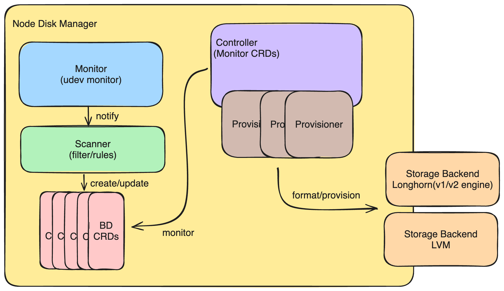

# Node Disk Manager Refactor

## Summary

The Node Disk Manager is responsible for managing the raw device on the node. The current implementation is not flexible enough to support various storage backends. This enhancement is to refactor the Node Disk Manager to make it more flexible and extensible.

### Related Issues

https://github.com/harvester/harvester/issues/6014

## Motivation

Currently, the Node Disk Manager can only provide the Longhorn v1 engine. Most codes of NDM are tight coupling with the Longhorn v1 engine and are hard to do to any extent. If we want to create various provisioners, we need to refactor the Node Disk Manager to make it more flexible and extensible. After that, we could easily create the provisioner for the Longhorn v2 engine or LVM.

### Goals

This refactor will introduce the provisioner concept to define various storage provisioners. We plan to create the following provisioner:
- LonghornV1: The `LonghornV1` provisioner will work like the previous version to provision the longhorn v1 engine backend.
- LonghornV2: The `LonghornV2` provisioner will provision the raw device to the longhorn v2 engine.
- LVM: The `LVM` provisioner will create the volume group then the LVM CSI driver could create the logical volume with the specific volume group.

**NOTE**: To provision LVM volume group with node-disk-manager, you need to enable the experimental addon [harvester-csi-driver-lvm](https://github.com/harvester/experimental-addons/tree/main/harvester-csi-driver-lvm) in the Harvester cluster.

## Proposal

The Node Disk Manager refactor will mainly focus on the provision. It will introduce the provisioner concept to define the specific storage provisioner. The provisioner will format the raw device and then provision it to the corresponding storage backends.

### User Stories

#### The user wants to use the longhornV2 engine
The user wants to try the LonghornV2 engine on the Harvester. The user can use the longhornv2 provisioner to provision the raw device to Longhorn for the v2 engine.

#### The user wants to use LVM as the storage backend
The user wants to use LVM as the storage backend for better performance. The node-disk-manager would help create the volume group, and the LVM CSI driver could depend on it to create the logical volume.

### User Experience In Detail

The user could use a specific provisioner like `longhornv1`, `longhornv2`, or `LVM` to provision the raw device to the corresponding storage backend. After that, we could easily create PVC from the specific storage backend. The detailed steps on the UI would look like below:
1. GoTo the `Host` page
2. Click the `Edit Config` button on the specific node
3. Select the `Storage` tab.
4. Select the target disk on drop-down menu `Add Disk`.
5. Config the provisioner and corresponding information on the related disk panel.

### API changes

We deprecated the field `Spec.Filesystem.Provisioned` and the new field `Spec.Provision` be used to trigger the provision. Also, the `Spec.Filesystem.Provisioner` will be used to define the specific provisioner.

Here is an example of the new provisioner (e.g. Longhorn):
```go
Spec:
    ...
    Provision: true
    Provisioner:
      longhorn:
        engineVersion: LonghornV1
    ...
```

Another example of the LVM provisioner:
```go
Spec:
    ...
    Provision: true
    Provisioner:
      lvm:
        vgName: vg01
    ...
```

## Design

### Implementation Overview

A overview of the design could be checked below:


### Provisioner

The refactor will try to decompose the provisioner from the controller. Each provisioner will be responsible for the specific storage backend. For example, the longhornv1 provisioner will handle the filesystem formatting on the Format stage and provision this raw device to `nodes.longhorn.io`. That longhorn could create volume on the provisioned raw device. The LVM provisioner only handles the provision stage to create the volume group.

### Unit test
We could create the fake provisioner to verify the whole interface of provisioner.

### Test plan
1. Create Harvester cluster
2. Create supported storage provisioner (e.g. longhornv1, longhornv2, and LVM)
3. Create PVC from the above provisioner
4. Check the PVC status and make sure it works as expected

### Upgrade strategy

We add new webhook to mutate the provisioner field. The old field `Spec.Filesystem.Provisioned` will be deprecated and the new field `Spec.Provision` will be used to trigger the provision.

So we did not do any upgrade strategy for this enhancement.