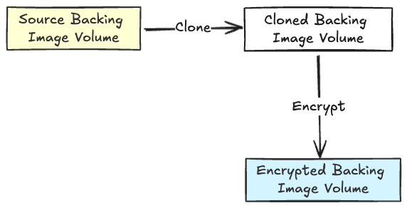
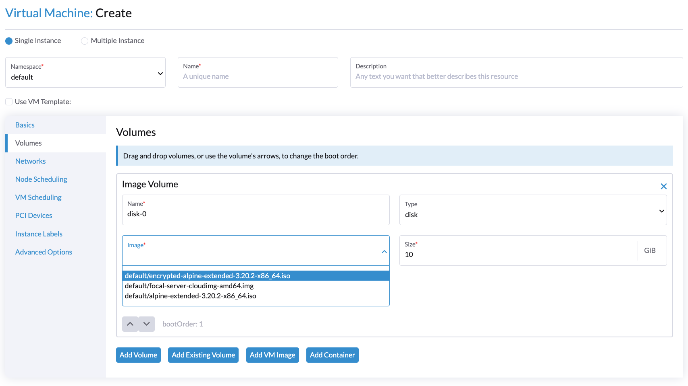
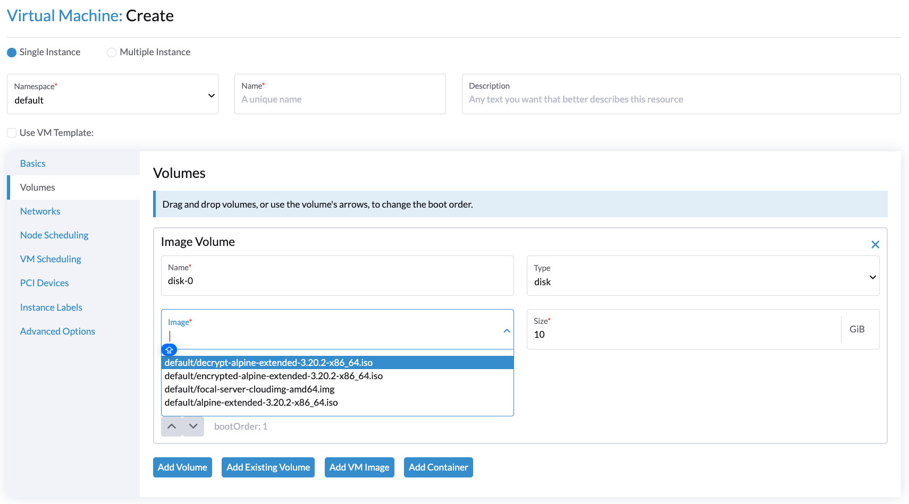
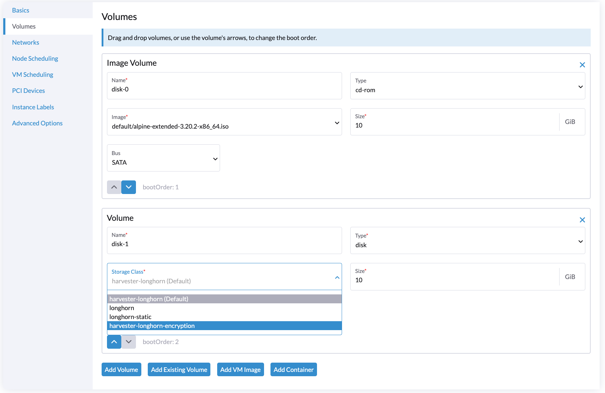
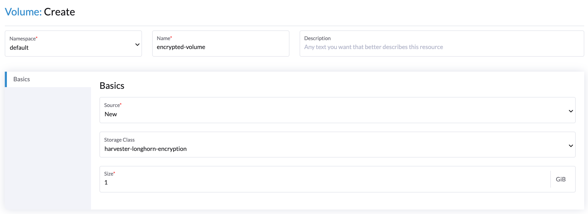
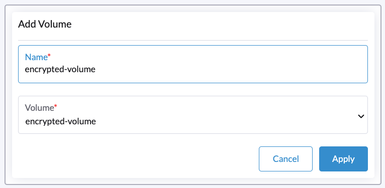

# Support Block Volume Encryption/Decryption

This enhancement focuses on the encryption and decryption of block volumes, particularly involving boot volumes and data volumes. 


## Summary

This enhancement introduces encryption and decryption capabilities for block volumes, specifically targeting boot volumes (virtual machine images) and data volumes. This functionality will enhance security by ensuring that data stored in these volumes is encrypted and can be decrypted when attached. 

## Related Issues

https://github.com/harvester/harvester/issues/3129

## Motivation


### Goals

- Implement encryption for boot volumes and data volumes (support hot plug). 
- Provide a clear and detailed setup process for users to enable encryption/decryption. 

### Non-goals

- This enhancement will not cover GUI-related changes. That particularly means we won't provide more convenient way to enable encryption/decryption with GUI in this enhancement. This will be addressed in next enhancement.


## Proposal

Since Longhorn uses clone mechanism to encrypt/decrypt Boot volume, so Harvester will follow that. This means that there would be two virtual machine image after encryption. One is encrypted, and the other is source virtual machine image. 



Data volumes are different from Boot volume. Because Longhorn supports block encryption/decryption, so Harvester could encrypt/decrypt data volume directly. 

Regardless of volumes used, Longhorn will decrypt volume when it's attached to virtual machine. So, we'll be able to read the boot volumes and data volumes in the virtual machine. 

### User Stories

#### Story 1 - Use encrypted boot volume to start virtual machine

Alice wants to encrypt the current boot volume for security, so Alice follows up the guideline:

1. Prepare a virtual machine image, which you could upload or use URL to download.
2. Create a secret and template storage class for encryption/decryption.
3. Create a new virtual machine image with encryption enabled.

After that, Alice gets an encrypted virtual machine image as boot volume. Then, Alice can start the virtual machine with selecting encrypted boot volume in GUI. For security, Alice decides to delete that original virtual machine image. For this moment, Alice only has this encrypted virtual machine image and Alice can reuse this boot volume.

Over time, Alice wants to decrypt the encrypted virtual machine image. Alice follows up the guideline:

1. Prepare an encrypted virtual machine image.
2. Create a new virtual machine image with decryption enabled.

After that, Alice will have an encrypted virtual machine image and an unencrypted virtual machine image. Alice could select one of them to start the virtual machine in GUI.


#### Story 2 - Use encrypted data volume in virtual machine

Bob wants to encrypt a data volume for security, so Bob follows up the guideline:

1. Create a secret and template storage class for encryption/decryption.
2. Select previous storage class when creating a new data volume.

Now, Bob can read the data in the VM. Besides, Bob could attach this encrypted volume to any virtual machine, even as hot plug volume.


### User Experience In Detail


#### Encrypt a Virtual Machine Image


1. Prepare a image

2. Create a Secret
    ```yaml
    apiVersion: v1
    kind: Secret
    metadata:
        name: longhorn-crypto
        namespace: longhorn-system
    stringData:
        CRYPTO_KEY_VALUE: "Some secret value here"
        CRYPTO_KEY_PROVIDER: "secret"
        CRYPTO_KEY_CIPHER: "aes-xts-plain64"
        CRYPTO_KEY_HASH: "sha256"
        CRYPTO_KEY_SIZE: "256"
        CRYPTO_PBKDF: "argon2i"
    ```

3. Create Storage Class
    ```yaml
    kind: StorageClass
    apiVersion: storage.k8s.io/v1
    metadata:
      name: harvester-longhorn-encryption
    provisioner: driver.longhorn.io
    allowVolumeExpansion: true
    parameters:
        numberOfReplicas: "2"
        staleReplicaTimeout: "2880" # 48 hours in minutes
        fromBackup: ""
        migratable: "true"
        encrypted: "true"
        csi.storage.k8s.io/provisioner-secret-name: "longhorn-crypto"
        csi.storage.k8s.io/provisioner-secret-namespace: "longhorn-system"
        csi.storage.k8s.io/node-publish-secret-name: "longhorn-crypto"
        csi.storage.k8s.io/node-publish-secret-namespace: "longhorn-system"
        csi.storage.k8s.io/node-stage-secret-name: "longhorn-crypto"
        csi.storage.k8s.io/node-stage-secret-namespace: "longhorn-system"
        Create Encrypted Virtual Machine Image:
    ```

4. Create Encrypted Virtual Machine Image
    ```yaml
    apiVersion: harvesterhci.io/v1beta1
    kind: VirtualMachineImage
    metadata:
        name: encrypted-alpine-extended
        namespace: default
    spec:
        displayName: encrypted-alpine-extended-3.20.2-x86_64.iso
        retry: 3
        sourceType: clone
        storageClassParameters:
            migratable: "true"
            numberOfReplicas: "1"
            staleReplicaTimeout: "30"
        sourceParameters:
            secretName: "longhorn-crypto"
            secretNamespace: "longhorn-system"
            encryption: "encrypt"
            sourceVirtualMachineImageName: "image-fnw6n" # not display name
            sourceVirtualMachineImageNamespace: "default"
    ```

5. Now, it's just like a normal image you could choose in GUI.
    

#### Decrypt a Virtual Machine Image


1. Prepare an encrypted virtual machine image.

2. Create an unencrypted virtual machine image
    ```yaml
    apiVersion: harvesterhci.io/v1beta1
    kind: VirtualMachineImage
    metadata:
        name: decrypt-alpine-extended
        namespace: default
    spec:
        displayName: decrypt-alpine-extended-3.20.2-x86_64.iso
        retry: 3
        sourceType: clone
        storageClassParameters:
            migratable: "true"
            numberOfReplicas: "3"
            staleReplicaTimeout: "30"
        sourceParameters:
            secretName: "longhorn-crypto"
            secretNamespace: "longhorn-system"
            encryption: "decrypt"
            sourceVirtualMachineImageName: "encrypted-alpine-extended" # not display name
            sourceVirtualMachineImageNamespace: "default"
    ```

3. You could select this decrypted image in GUI.
    


#### Encrypt a Data Volume


1. Create a Secret:
    ```yaml
    apiVersion: v1
    kind: Secret
    metadata:
        name: longhorn-crypto
        namespace: longhorn-system
    stringData:
        CRYPTO_KEY_VALUE: "Some secret value here"
        CRYPTO_KEY_PROVIDER: "secret"
        CRYPTO_KEY_CIPHER: "aes-xts-plain64"
        CRYPTO_KEY_HASH: "sha256"
        CRYPTO_KEY_SIZE: "256"
        CRYPTO_PBKDF: "argon2i"
    ```

2. Create Storage Class
    ```yaml
    kind: StorageClass
    apiVersion: storage.k8s.io/v1
    metadata:
      name: harvester-longhorn-encryption
    provisioner: driver.longhorn.io
    allowVolumeExpansion: true
    parameters:
        numberOfReplicas: "2"
        staleReplicaTimeout: "2880" # 48 hours in minutes
        fromBackup: ""
        migratable: "true"
        encrypted: "true"
        csi.storage.k8s.io/provisioner-secret-name: "longhorn-crypto"
        csi.storage.k8s.io/provisioner-secret-namespace: "longhorn-system"
        csi.storage.k8s.io/node-publish-secret-name: "longhorn-crypto"
        csi.storage.k8s.io/node-publish-secret-namespace: "longhorn-system"
        csi.storage.k8s.io/node-stage-secret-name: "longhorn-crypto"
        csi.storage.k8s.io/node-stage-secret-namespace: "longhorn-system"
    ```

3. Select previous storage class when creating the volume
    
    
    Besides, you could attach this encrypted volume as hot plug volume.
    
    


### API changes


```diff
type VirtualMachineImageSpec struct {
-	// +kubebuilder:validation:Enum=download;upload;export-from-volume
+	// +kubebuilder:validation:Enum=download;upload;export-from-volume;clone
	SourceType VirtualMachineImageSourceType `json:"sourceType"`
+   // +optional
+	SourceParameters VirtualMachineImageSourceParameters `json:"sourceParameters"`
}

+type VirtualMachineImageSourceParameters struct {
+	// +optional
+	SecretName string `json:"secretName"`
+
+	// +optional
+	SecretNamespace string `json:"secretNamespace"`

+	// +optional
+	// +kubebuilder:validation:Enum=encrypt;decrypt
+	Encryption VirtualMachineImageEncryptionType `json:"encryption"`

+	// +optional
+	SourceVirtualMachineImageName string `json:"sourceVirtualMachineImageName"`

+	// +optional
+	SourceVirtualMachineImageNamespace string `json:"sourceVirtualMachineImageNamespace"`
+}
```

### Design


### Implementation Overview

Harvester uses similar parameters in Longhorn, so we just need to sync those parameters to backing image in Longhorn to activate the encryption/decryption feature.

For example:

Let's say we have this:

```yaml
apiVersion: harvesterhci.io/v1beta1
kind: VirtualMachineImage
metadata:
    name: encrypted-alpine-extended
    namespace: default
spec:
    displayName: encrypted-alpine-extended-3.20.2-x86_64.iso
    retry: 3
    sourceType: clone
    storageClassParameters:
        migratable: "true"
        numberOfReplicas: "1"
        staleReplicaTimeout: "30"
    sourceParameters:
        secretName: "longhorn-crypto"
        secretNamespace: "longhorn-system"
        encryption: "encrypt"
        sourceVirtualMachineImageName: "alpine-extended" # not display name
        sourceVirtualMachineImageNamespace: "default"
```

The `sourceVirtualMachineImageName` is from here:

```yaml
apiVersion: harvesterhci.io/v1beta1
kind: VirtualMachineImage
metadata:
  name: alpine-extended
  namespace: default
spec:
  displayName: alpine-extended-3.20.2-x86_64.iso
  retry: 3
  sourceType: download
  storageClassParameters:
    migratable: "true"
    numberOfReplicas: "3"
    staleReplicaTimeout: "30"
  url: https://dl-cdn.alpinelinux.org/alpine/v3.20/releases/x86_64/alpine-extended-3.20.2-x86_64.iso
```


We'll sync those parameters to backing image in Longhorn.

```yaml
apiVersion: longhorn.io/v1beta2
kind: BackingImage
metadata:
   name: default-encrypted-alpine-extended
   namespace: longhorn-system
spec:
   minNumberOfCopies: 3
   sourceParameters:
     backing-image: "{this is the backing image name, will get it via VirtualMachineImage}"
     encryption: "encrypt"
     secret: "longhorn-crypto"
     secret-namespace: "longhorn-system"
   sourceType: clone
```

Then, we could get the encrypted backing image in Longhorn, and use it as boot volume in Harvester.


### Test plan

- Verify that volumes can be encrypted and decrypted as specified. 
- Verify that encrypted boot volume and data volume can be attached to virtual machines.
- Verify that the encrypted data volume, when used as a hot plug volume, can be attached to virtual machines.
- Ensure that encrypted volumes are not accessible without the correct decryption keys. 

### Upgrade strategy

None
